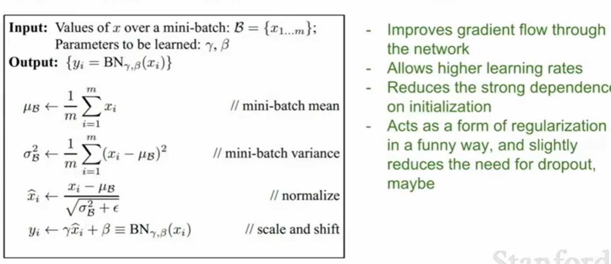

# CS231n学习手记

## 问题记录

## P5

1. L1距离与L2距离区别，什么时候用哪个？（重听课程并总结）

+ L1距离取决于坐标系统。如果转动坐标轴，将会改变点之间的L1距离。

  > 如在$e1 = (1, 0), e2 = (0, 1)$坐标系下，$a = (1, 1)$与$b = (1, 2)$之间的L1距离为1。
  >
  > 而在$e1' = (\frac{\sqrt{2}}{2}, \frac{\sqrt{2}}{2}), e2' = (\frac{\sqrt{2}}{2}, -\frac{\sqrt{2}}{2})$坐标系下（逆时针旋转45°），$a' = (\sqrt{2}, 0)$与$ b' = (\frac{3\sqrt{2}}{2}, \frac{\sqrt{2}}{2})$之间的L1距离为$\sqrt{2}$。
  >
  > （随后可补充图片）

+ L2不受坐标系变化的影响（描述两点的直线距离）。

+ 对于选择哪一种：

  1. 如果输入的特征向量中的某些值对于任务有**重要意义**，使用L1距离。

  > 比如对公司某员工进行考察，员工向量的不同元素有固定**实际含义**，如薪资、工作年限等，L1可能会更合适。

  2. 如果只是某个空间中的一个通用向量，不知道其中不同元素的实际含义，L2距离更加自然。
  3. 但对于这种**超参数**，建议都尝试下，看哪个效果更好。

## P7

### 一、为什么scores[j] - correct_class_score + 1要加1？

用来确保correct_class_score在一定程度上大于其他分数（scores[j]），否则如果两个分数相近也没有loss来更新参数，这样**可以“激励”往更好的方向更新参数**。

> 我们并不关心损失函数中分数的绝对值，我们只关心不同分数（如这里的scores[j]与correct_class_score ）的相对差值，我们只需要正确分类的分数要远远大于不正确分类的分数。（如果将整个W的参数放大或缩小，所有的得分也将会缩放，此时这个free parameter（最后加的1）的重要性也会随之变化，可能就得相应的取5或者0.2，主要是看两个分数的差值是否是我们想要的）
>
> 关于这个细节的详细解释，可以深入查看课程讲义。

### 二、不同损失函数有什么不同？

如果我们将原来差值之和变为差值的平方和，与原来有什么不同？

损失函数是用来衡量分类器的效果好坏，

**平方和损失函数：**对于一个很坏的分类器，会将其loss翻倍，很大程度加深优化器对这个分类器的判断，从而使其在后续过程中能够迅速优化。

**合页损失函数（hinge loss funtion）：**对微小的错误并不在意，如果分类出现很多错误，那么loss会相应加深。（？没听懂）

总之，不容损失函数都有其用武之地，使用时需要选择合适的。

### 三、矢量化处理技巧

先进行全部的矢量计算，然后再将需要为0的手动清零

### 四、正则项

在训练过程中，我们并不关心训练集的表现，而是关心分类器的测试数据。

过拟合会导致模型过于复杂，在测试集的表现不好，因此引入正则项，适当降低模型复杂度。（奥卡姆剃刀原理）

比较常用的正则项：

L2正则偏向每个参数对模型都起一定作用，maybe更鲁棒。

而L1正则会偏向更稀疏的W，即W中的0越多，maybe L1正则项会更小一些，相应的loss也会更低。

### 五、Gradient 梯度

梯度是一个偏导数的向量，它指向了函数增加最快的方向。相应的负梯度就指向了函数下降最快的方向（在优化中表现为loss下降最快的方向）。

> 一个”地形“任意方向的斜率 = 该点的梯度和该点单位方向向量的点积。

数值差分法：依次将W的一个参数增加一个很小的数值（0.00001），保持其他不变重新计算loss，用Δloss / 0.00001就可以得到该参数的梯度。

这样做很耗时，但是在测试时有时还是需要数值计算：

> 确定学习率（步长）是第一个需要确定的超参数，很重要。

## P13

### 一、不同激活函数的优缺点

#### 1. sigmoid函数（缺点）

sigmoid函数的其中一个缺点是“sigmoid函数的输出不是以0”为中心的：

这样有什么坏处？

视频中提到，对于一个函数如$f(x) = W * X + b$，这样我们计算W梯度$\frac{df}{dw} = X$可以看到W的梯度就是上游梯度dot X，这样会有什么隐患？

那就是如果**X是一个全为正数的矩阵**当我们**更新W时，只能朝右上或者左下方向更新**（比如W有两个维度w1和w2，W只能落在一三象限中），如果合理的W梯度方向为右下，则更新起来效率会很低。

但是这样看来，梯度只与X有关系，与sigmoid有什么关系呢？

当然有关系，因为后面一层会接受前一层的“输出—激活”，**如果是sigmoid函数，那激活后的X将全部为正值**，也就会出现上述情况。

**一个好的X尽量要让均值为0，这样梯度更新时才能很好地优化。（也就是说激活函数最好是zero-centered）**

#### 2. ReLU

相比较sigmoid、tanh而言，ReLU函数更符合生物学特征且收敛速度更快：

但是仍然可以看到当x < 0时，其grad仍为0。并且这也不是一个zero-centered函数。

假设在一个二维空间中，对于不同的W，ReLU的效果也不尽相同：

+ 对于一个合理的W（数据大部分被映射到正数上），ReLU函数可以表现地很正常，即active ReLU。
+ 而对于一个可能不是很理想的W（数据几乎全被映射在负数上），ReLU函数的梯度全为0，这样在back propagation中后续的梯度也都为0，这样后续的参数也完全不会更新，就成了一个dead ReLU。

所以ReLU函数也存在一定缺陷，虽然很多时候也能够使用。

> Leaky ReLU总体上解决了这些问题。

### 二、数据预处理

normalize：将所有特征值约束在同一尺度下，使得这些特征的贡献相同。

> 对于图像数据一般会zero-center处理，但不会过多地normalize，因为图像的像素值等本来就有统一的尺度。
>
> 一般机器学习问题会有差别很大的特征，而且这些特征的范围差别也很大。

机器学习中，还有许多处理方式，比如PCA或者白化（whitening）：

但是图像领域一般只做零均值化，而不做归一化等复杂的预处理，原因在于：

+ 对于图像，我们不太想将所有输入（如像素值）投影到一个更低维的空间（虽然这些空间有一些新的特征）。我们只需要在原空间上应用卷积操作，并得到原图像的空间结构。

可以将整张图片减去均值，也可以在每个通道上计算均值然后subtract（VGGNet），这样更容易传送和处理：

**需要注意的是：**在训练过程中，我们会计算决定我们的均值（mean），在test时我们会将一样的均值应用到测试数据中去。

### 三、权重初始化

合理初始化初始化权重，能够使数据更好地传播，并且减少在反向传播时出现梯度消失等问题。

**下面列出不同初始化时可能会遇到的问题：**

#### 1. 过小的权重

如果我们使用一个过小的权重：

在正向传播时，由于下一层数据是上一层的W * X，因此下一层的输入数值会越来越小：

这就使得在反向传播时，由于W的grad是X：$\frac{dy}{dW} = X$，则会出现梯度消失的情况。

#### 2. 过大的权重

如果权重比较大，计算得到的X也会比较大，sigmoid或者tanh等激活函数会饱和从而梯度消失。

#### 3. 合理的权重

Xavier提出方法在一定程度上解决了这个问题，基本上的做法是：**指定输入的方差 = 输出的方差**。

如果推导出权重应该是多少，则会得到图片中的公式。

> 直觉上，我们将其理解为：
>
> + **如果有少量的输入**，我们将W除以一个较小的数（fan_in），从而得到较大的权重。（因为当输入较少时，每一个输入乘较大的权重，才能得到相同的输出方差）
>
> > 当输入数据较少时，每个输入对最终输出的影响会变得相对更大，因此我们需要使用较大的权重来补偿这种影响。
>
> + 相反，如果有大量输入，我们则需要更小的权重（除一个较大的数fan_in），以便让数据在输出中得到相同的传播。

**but，在ReLU激活函数下，Xavier的方法会失效：**

因为ReLU会将一半的数值“砍掉”（x < 0），相当于将方差减半，因此方差会越来越小（神经元也会不断失活），而我们想要的是方差相等：

也会有一些方法提出，来解决这个问题，比如将fan_in除以2，来获得跟其他激活函数等效的输入：

**Anyway，重视权重值这些小东西对于训练会起到关键作用。**

## P14

### 1. Batch Normalization

注意这里的Normalization是在全连接层（FC）之后的，从而使数据符合均值为0，方差为1，而更好地传播。

> 与P13的预处理不同，我们输入时仍然只做了zero-center，因而我们的数据特征是完整输入进来的。

但是，有时候全部进行归一化处理不见得完全是一个好事，因此加入了两个参数，来限制归一化的程度：

> γ和β是两个可以学习的参数，他们控制了归一化的程度，通过训练他们会调节至一个合适的数值。（右边方框是一个极端情况，表示可以学习成为均值和方差的大小，表示模型认为不进行归一化才是最好的）

完整过程如下：

### 2. 调参

在寻找超参数的最优值时，可以采用下列方式：

**值得注意的是：**

如上图所示，通常采用对数来优化效果会更好。比起采用在e的-0.01和100次方之间的均匀采样，**更推荐在一些区间用10的幂次进行采样**（形如$10^x$）。

因为学习率lr是用来乘梯度更新，因此它具有**乘法效应**，因此考虑学习率是通常使用乘或者除的值，而不是均匀采样，这样更合理。

所以，这里想要处理的是某个量级问题。

**有种情况是我们应该警惕的，**

当我们选择一个区间时，比如lr的取值为1e-3 ~ 1e-4时，虽然acc看起来还不错，但是好的结果都集中在1e-4这个层级，这时我们需要警惕，是不是应该扩大搜索范围能得到更好的结果：

> 视频中的意思应该是这样，但是数据给的不是很明显，理解这个acc陷阱的思路即可。

通常random search 会比网格搜索（grid search）更有效：（也更符合搜索的特质）

**调参 be like ：**

如果loss在很长一段时间没有下降，然后突然开始下降，大概率是初始化没有做好：

将训练结果可视化是一个不错的观察方式，善用：

另外，我们要知道当更新幅度在多少是一个合理区间：（更新规模 / 参数规模）

> + np.linalg.norm：计算向量或矩阵范数，默认是欧几里得范数（L2 范数）。
> + ravel() ：将数组展平为一维数组，即将多维数组转换成一维数组，保持数据的顺序。

## 作业

### assignment 1

#### 1. svm.ipynb

对于svm的grad计算：

> grad如何计算：**要列公式再看！！！**
>
> 1. 首先看有几个参数对Li产生影响，这里就是有两个$w_j$和$w_{yi}$
> 2. 分别用这些参数对Li求导
> 3. 在这一次loss计算中，要同时更新这两个参数的梯度

