# P1 摄像机几何
## 1. 针孔模型 & 透镜
### 1.1 几种坐标系关系及其转换

#### 1.1 摄像机坐标系与像平面坐标系

**针孔摄像机**

下面是取 j-O-k 平面上的映射关系：

在 i-O-k 平面也类似：

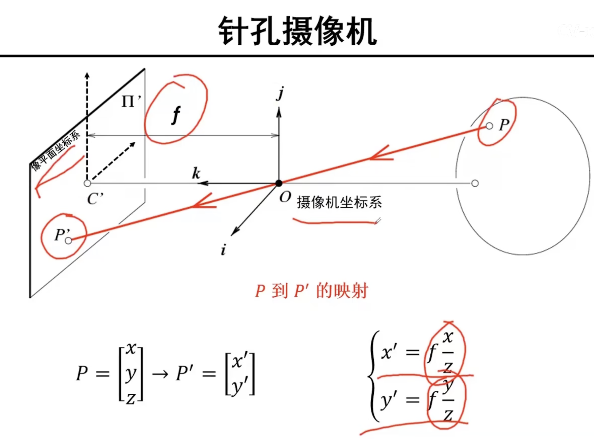

**带有透镜的摄像机**

相机的焦距z‘ = 透镜的焦距f + z0。

由蓝色线可以看到过光心的直线仍符合小孔成像的映射关系，只是焦距不再是 f 而是 z‘ 。

因此，用不用镜头对小孔成像模型来说影响不大，仍然可以用小孔成像模型来分析三维世界到二维平面的映射。

> 但是使用镜头可能有别的问题：虚焦、径向畸变（枕形、桶形）等。

#### 1.2 像平面与像素（图像）平面

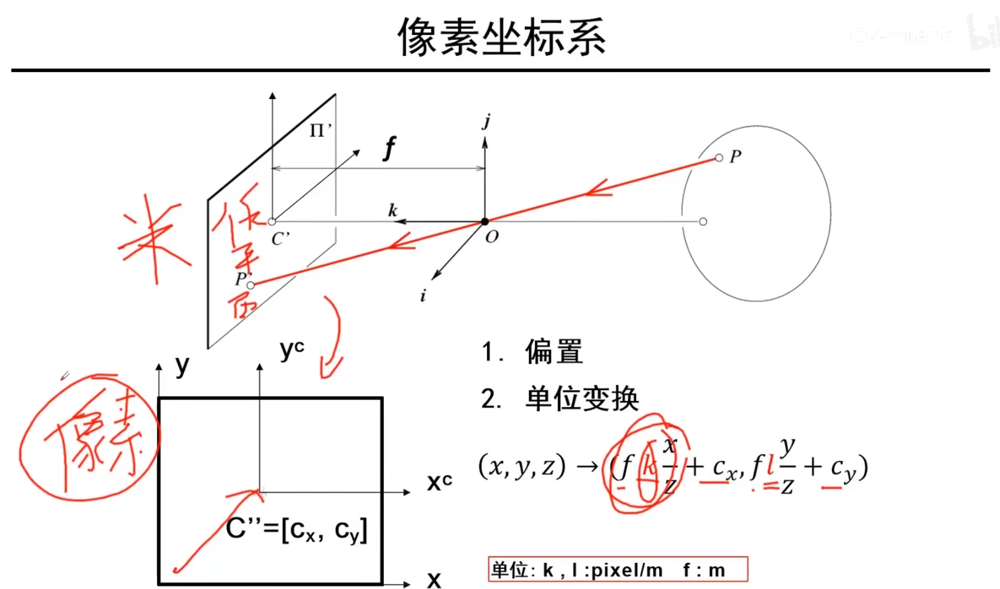

> k、l是像平面到像素平面的转换关系，其大小与相机成像元器件的性质有关。
>
> 如果成像元器件质量越高：比如真实世界1mm就转换为1pixel；质量比较低：真实世界1cm转换为1pixel；

其中像平面到图像平面转换时区分了k和l，原因在于相机可能因为工艺问题引起X和Y方向上的清晰程度不同（比如，X方向是1mm对应1pixel，Y方向0.5mm对应1pixel），为了映射时画面一致而区分转换系数。

因为 fk 和 fl 都是相机内部的参数，因此通常直接将其记为 $\alpha$ 和  $\beta$ ：

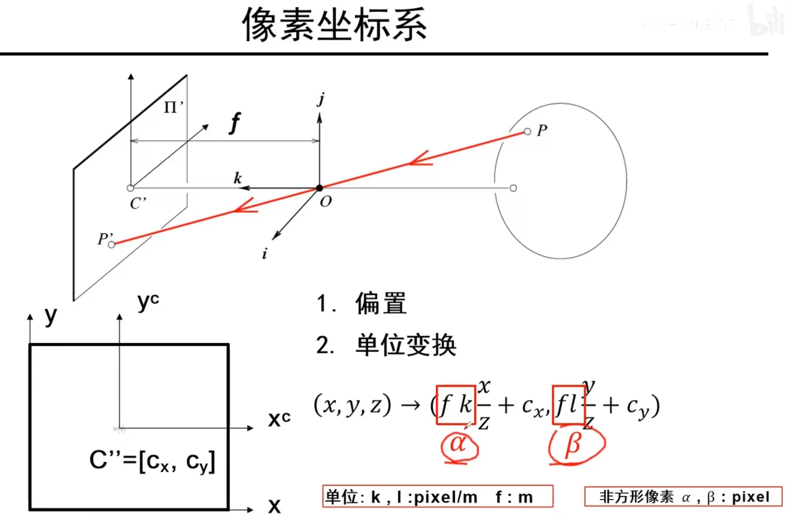

## 2. 摄像机几何
### 2.2. 齐次坐标

#### 2.2.1 为什么要用齐次坐标

通常真实平面到像素平面的映射并**不是线性的**，因为通常 x 一变 z 也会跟着变（因为真实世界物体是在空间中移动，而不是只沿着一个坐标轴移动）：

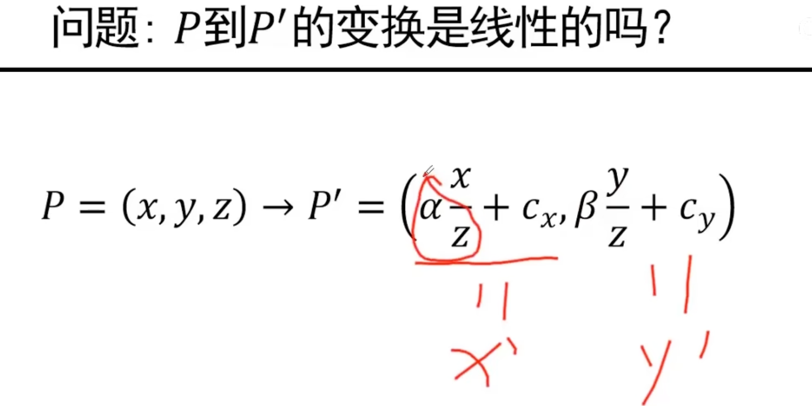

而**齐次坐标**就是**将非线性映射转换为线性映射（也就是x能线性映射到x’）**，这对之后的很多操作提供了便利。

#### 2.2.2 齐次坐标定义

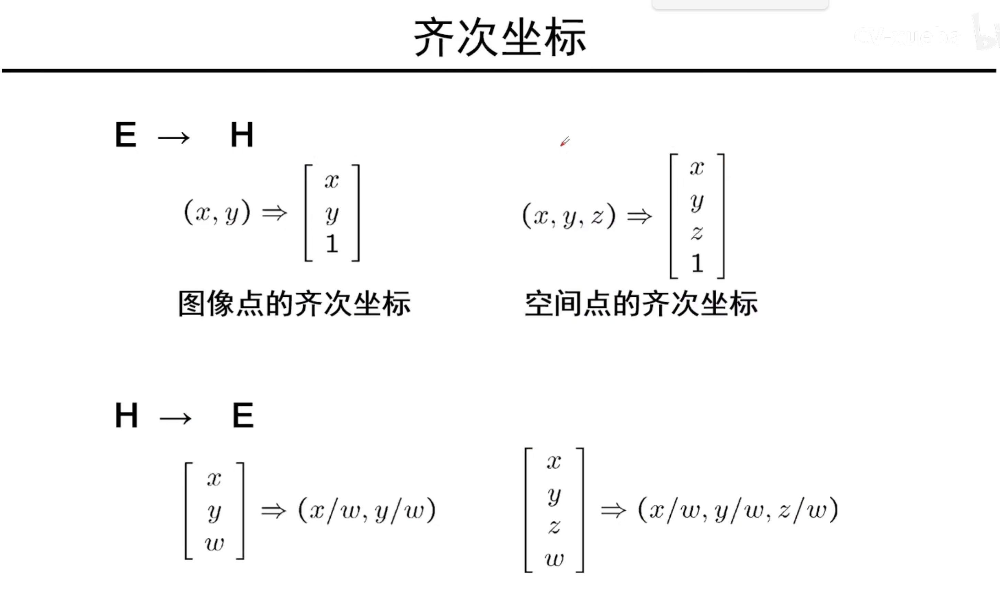

>  欧式空间：二维空间；齐次空间：三维空间

二维空间升到三维：在最后一维加1；三维降到二维：将前面维度除掉最后一维。

注意，

从欧式空间升到齐次空间是一一对应的，因为只是在扩1在第3维度上。  

但是从齐次空间转到欧式空间不是一一对应， 比如$[1, 1, 1]$和$[2, 2, 2]$转到欧式空间都是$[1, 1]$，两者是同一个欧式坐标相差一个系数。

#### 2.2.3 齐次坐标系中的投影变换

这个投影变换就是解决如何将三维空间中的点 线性映射 到二维平面。

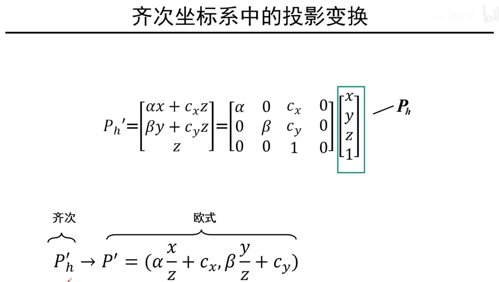

$P'_{h}$中的h 表示齐次坐标，将它转换为欧式坐标即像素空间中的坐标。

二维世界点的齐次坐标$P'_{h}$到三维世界点的齐次坐标$P_{h}$的映射是一个不变的矩阵（线性映射关系）。

> 对比一下齐次和欧式两种形式，发现欧式对于每个一维坐标都由两个值决定（x/z或y/z），但是在齐次空间却变为了线性映射（左边带有 $\alpha$ 和 $\beta$ 的矩阵只跟相机参数有关）。

> 在看课程时有一个疑问，**为什么$P_{h}$要加一维？**
>
> 猜测应该是为了保持都是在齐次空间下的变换？因为$P'_{h}$运算结果本来就是齐次坐标，因此对应运算也应该在齐次空间下。

#### 2.2.4 摄像机的投影矩阵

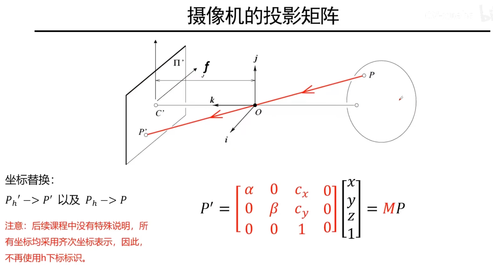

因为在齐次空间中三维点到二维是线性映射，因此我们不再使用欧式坐标，转而只使用齐次坐标。

为了方便表示，也就不再加齐次坐标的表示符h，**除非特殊强调否则都表示是齐次空间中的点**。

因此只需要一个映射矩阵M，就可以将三维点映射为二维像素。

#### 2.2.5 摄像机偏斜

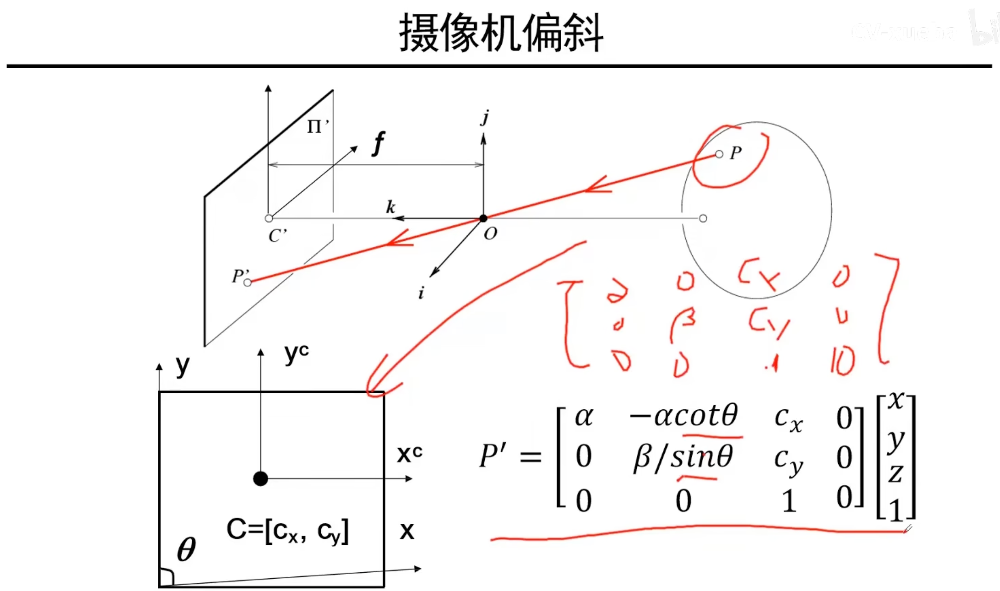

由于相机制作工艺问题，像素可能不是正方形而是平行四边形，这时做映射时需要引入一个参数 $\theta$ 来表示夹角。

有了参数 $\theta$ 就可以建模从真实平面到不太好的像素平面到映射。

> 当像素平面XY轴垂直时，cot为0，sin为1，会退化成之前的参数矩阵。 

#### 2.2.6 摄像机坐标系下的摄像机模型 

摄像机内参数矩阵：顾名思义，只跟摄像机内部参数相关的矩阵。

> 内参数矩阵K有五个自由度： $\alpha$ 、 $\beta$ 、cx、cy、 $\theta$ 。
>
> 只有估计出这五个参数才能知道摄像机的信息。

**规范化摄像机**

这是理想状态下的摄像机，不是真实存在的摄像机，这只是中间的一种状态，我们**需要利用这个状态去推导一些性质**。

该状态下$\alpha$ 和 $\beta$ 都是1， $\theta$ 为90度（像素是方的），cx、cy = 0（像平面与像素平面的中心一致）。

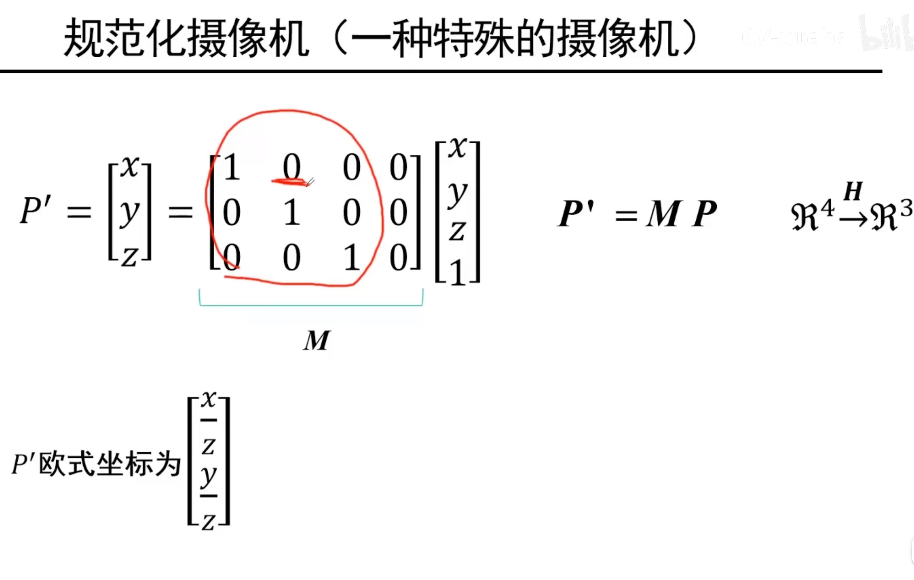

规范化相机的一些性质：世界坐标系下的点的三维坐标就是图像点的齐次坐标，反过来**如果知道了二维点的齐次坐标就能知道三维点的坐标**。

接下来推极几何的时候会用到这个性质，极几何知道二维点的齐次坐标，很容易就能推出这个点在三维世界中的齐次坐标。

### 2.3 世界坐标系

假设有同一个物体在房间里，而房间中各个位置摆有摄像机，物体在不同摄像机下的坐标是不同的，想要定位这个物体，沟通交流起来很不方便。

但是如果以房间的东南角为原点建立一个坐标系，定位这个物体就很清晰了，这就是**世界坐标系**。

> 我们不太适应在摄像机坐标系下描述物体，因此引入更常规的坐标系——世界坐标系。

这样分析问题很简单，但是模型却不太适用，模型只能描述摄像机坐标系下三维世界的点到像素平面到映射，不能描述世界坐标系中的点到像素的映射。

因此需要对模型进行进一步扩展。

#### 2.3.1 世界坐标系到摄像机坐标系的转换

通过旋转和平移可以将世界坐标系下的点转换到摄像机坐标系下：

> 旋转矩阵大小3 x 3，平移矩阵大小3 x 1（XYZ三个方向），因此整个转换矩阵大小为4 x 4。

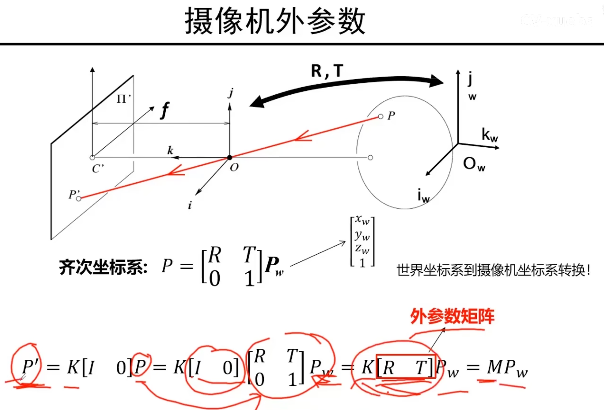

**旋转矩阵R和平移矩阵T由摄像机摆放位置决定。**

将P带到之前的公式，就得到了世界坐标系下的点到像素平面的映射函数。

> M为投影矩阵，它由两方面决定，一是相机的内参数矩阵K（只由相机内部参数决定），还有就是新加的“外参数”矩阵（由相机摆放位置决定，所以叫外参数）。

**各个符号的含义和维度**

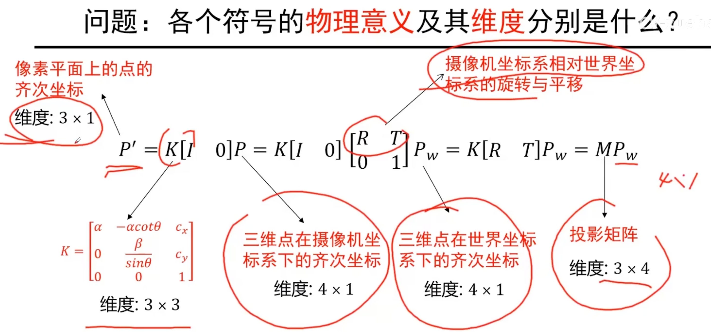

**投影矩阵的自由度**

外参数分别是XYZ三个坐标系的平移3自由度 + 旋转3自由度。

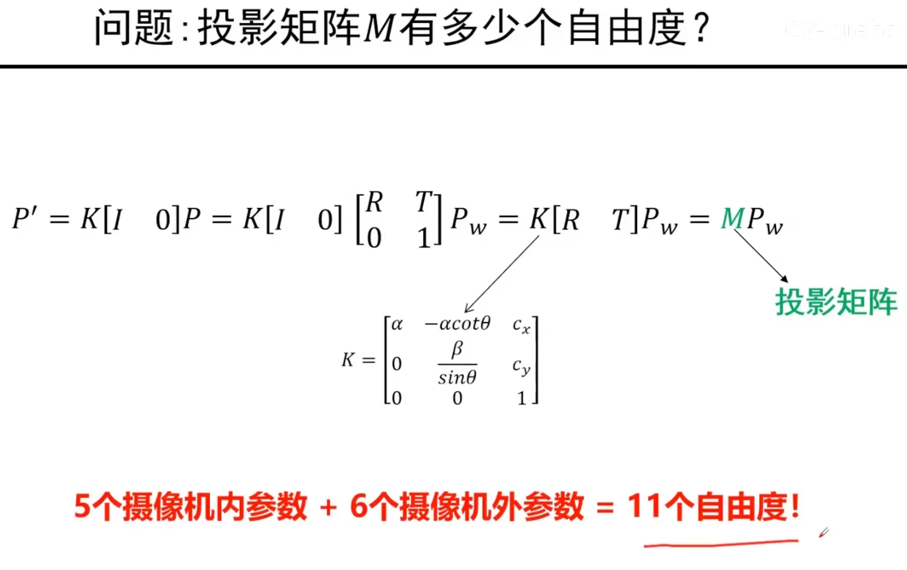

**像素平面上的欧式坐标表示**

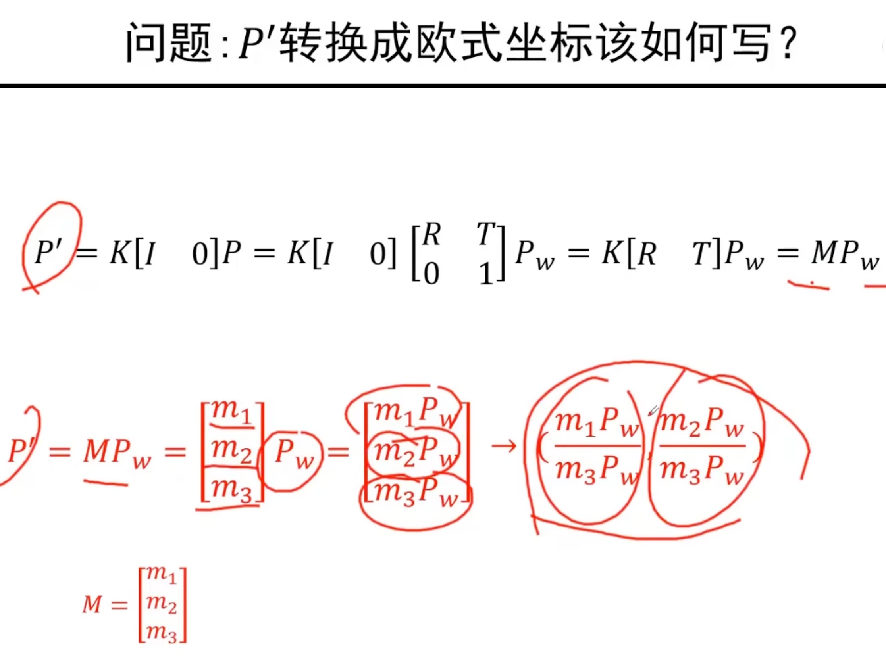

### 2.4 定理

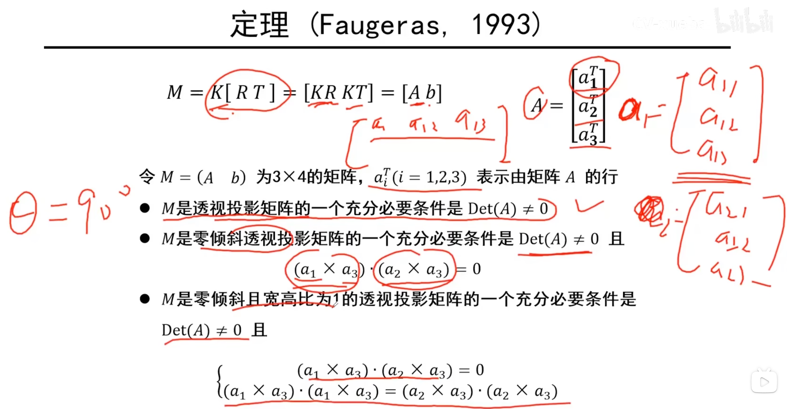

> A中给a加转置是为了将a写做列向量（A本身是3 x 3，a为1 x 3，aT为3 x 1），**表达成列向量是为了计算方便，几乎或有运算都在列向量上进行**。

真正决定一个矩阵是否为投影矩阵由A决定：

- 如果A是满秩矩阵则一定有一个摄像机与之对应，如果A不满秩这一定不是一个投影矩阵。

- 如果 $(a_1 \times a_3)\cdot(a_2 \times a_3) = 0$ 则说明 $\theta=90^{\circ}$ 。

  > 向量叉乘的结果是一个垂直两个向量平面的新向量。
  >
  > 两个向量点乘 = 0，表示两条向量垂直。

- 如果前两者都能满足的情况下，还能满足第三个公式，则说明$\alpha$ 和 $\beta$ 是等比例的。

通过分析M矩阵，可以得到相机的一些参数性质；反之，如果知道参数也可以反推M。

### 2.5 投影变换的性质

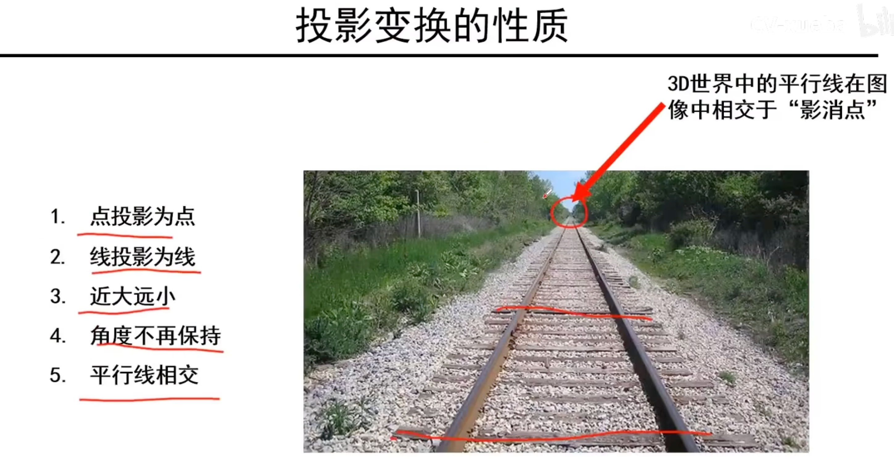

1. 现实中的点投影在二维还是点。
2. 线投影也是线。
3. 但是2. 投影到像平面遵从“近大远小”（like 远处枕木在二维上比近处短）。
4. 三维中的夹角并不会保持在二维平面（铁轨不会平行）。
5. 平行线相交于“影消点”。

## 3. 其他摄像机模型

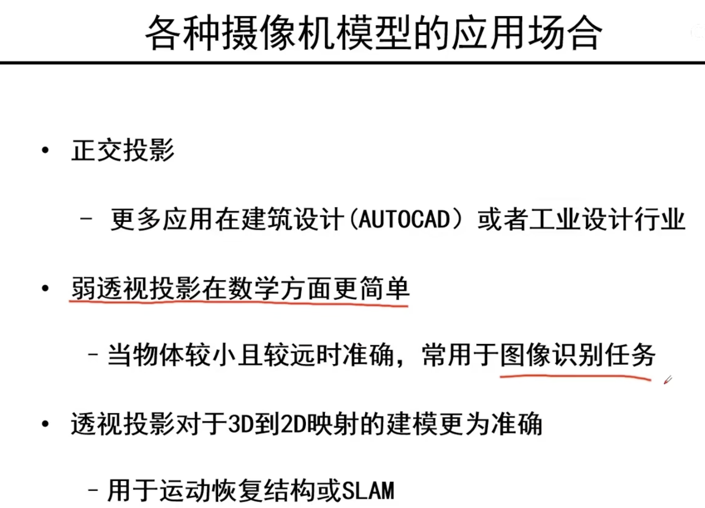

### 3.1 弱透视投影摄像机

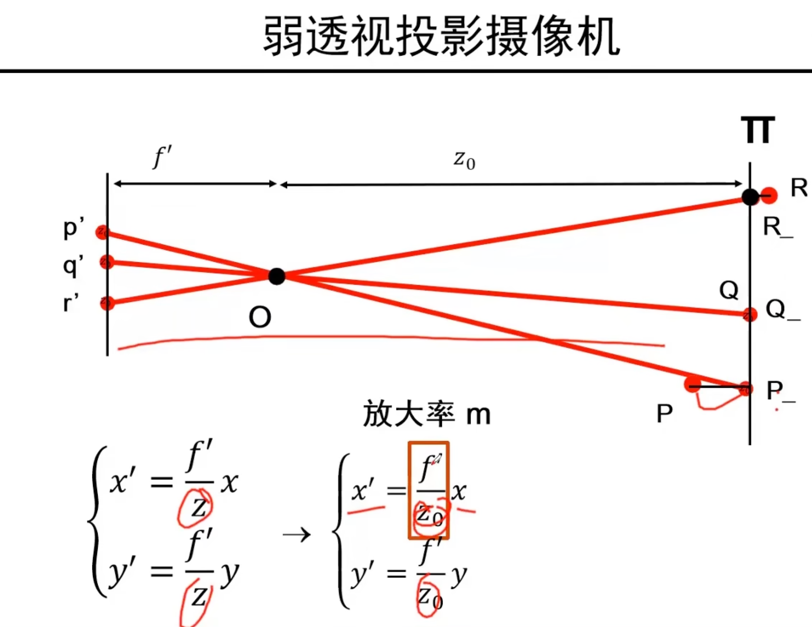

当被摄物体距离相机足够远时，有一些轻微的远近差距（比如人五官的凹凸不平）可以近似在一个平面上。

好处：这样不会有一些因为远近差距产生的非线性关系。

将投影矩阵M分解开来，原本的3x3矩阵A分解成矩阵$A_{2\times3}$和向量$v_{1\times2}$，而之前的b分解成了b2x1和1。

在弱透视投影摄像机下，投影矩阵中的v的值是0。

**弱透视与透视投影摄像机**

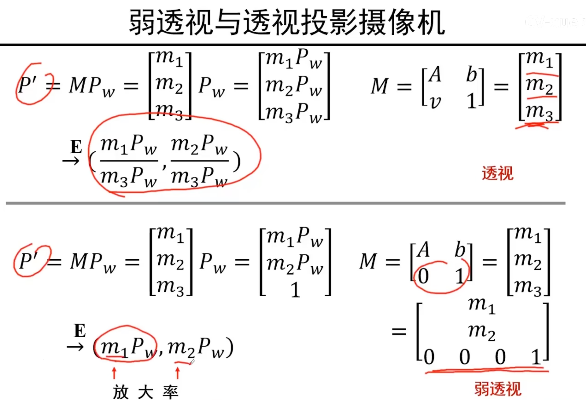

可以看到，与透视相比，世界坐标系下坐标到弱透视投影摄像机的映射只由放大率决定，比透视投影摄像机少了很多计算。

而且与之前3x4个参数相比少了4个参数（m3），参数更好估算。

### 3.2 正交投影摄像机

当摄像机小孔/透镜到像平面无限远时，会出现该情况。

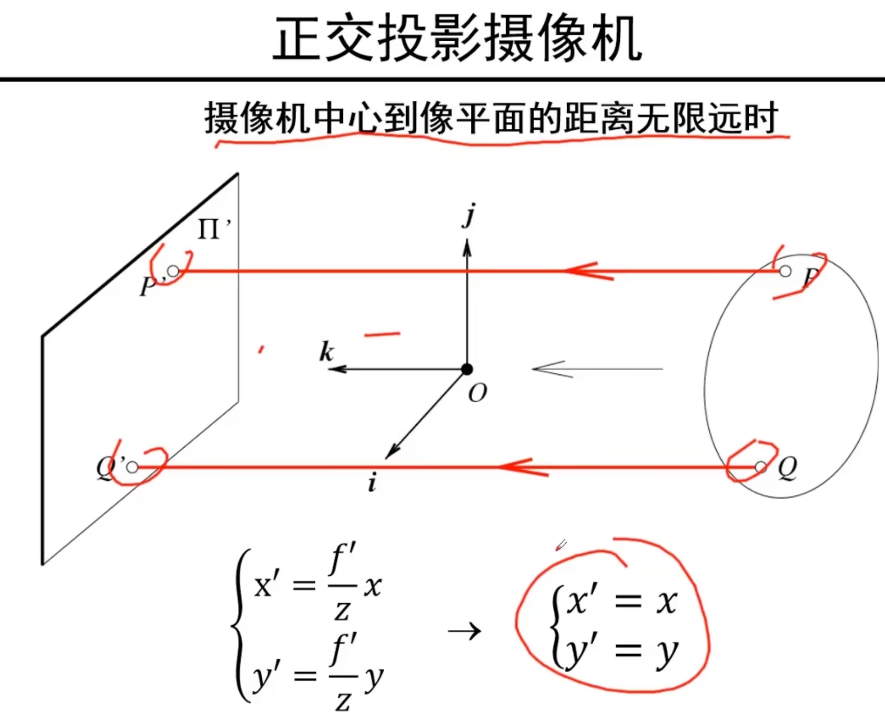

这种情况出现不多，在AutoCAD软件中，构建三视图时，可能会用到。

## 4. 补充知识

**最小二乘法会经常用到，**因为遇到的情况大多数都是p > q，因为如果p = q只要表达式中有一行是噪声，导致那一行结果是错误的，这样算出的结果就不对。（最小二乘法可以引入更多数据，能够容忍更多噪声？）

### 4.1 线性方程组的最小二乘解

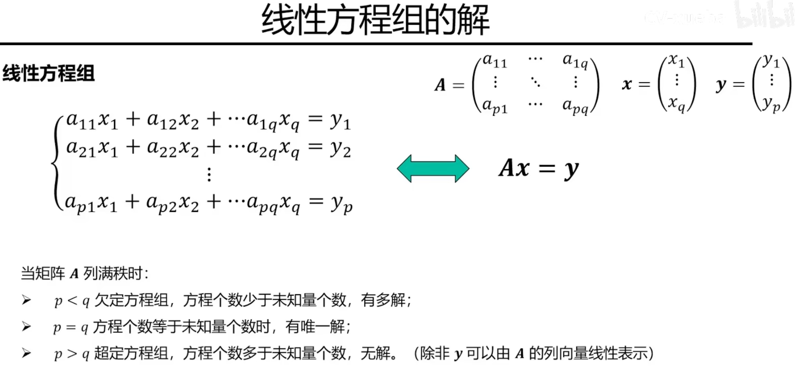

最小二乘解就是在最后一种情况下又需要一个近似解，就会用到最小二乘。

> 直观上理解，我们需要得到的参数数量应该是q个，然后p代表数据量，每一行方程代表一条数据的计算过程与结果。
>
> 如果方程个数=参数数量，且矩阵满秩时，就会有唯一解（如果数据有噪声就会得到错误解，不鲁棒）；如果方程个数>参数数量，也就是有大量数据时，这种情况是我们经常遇到的，因此我们就可以使用大量数据来估计参数值，也就是最小二乘法。

其核心思想在于：我们的目标是获得Ax=y的解，即Ax-y=0的解；当无法得到真实解时，就得到最逼近Ax-y=0的解，即Min Ax-y（也可理解为估计值Ax与真实值y的总误差最小）。

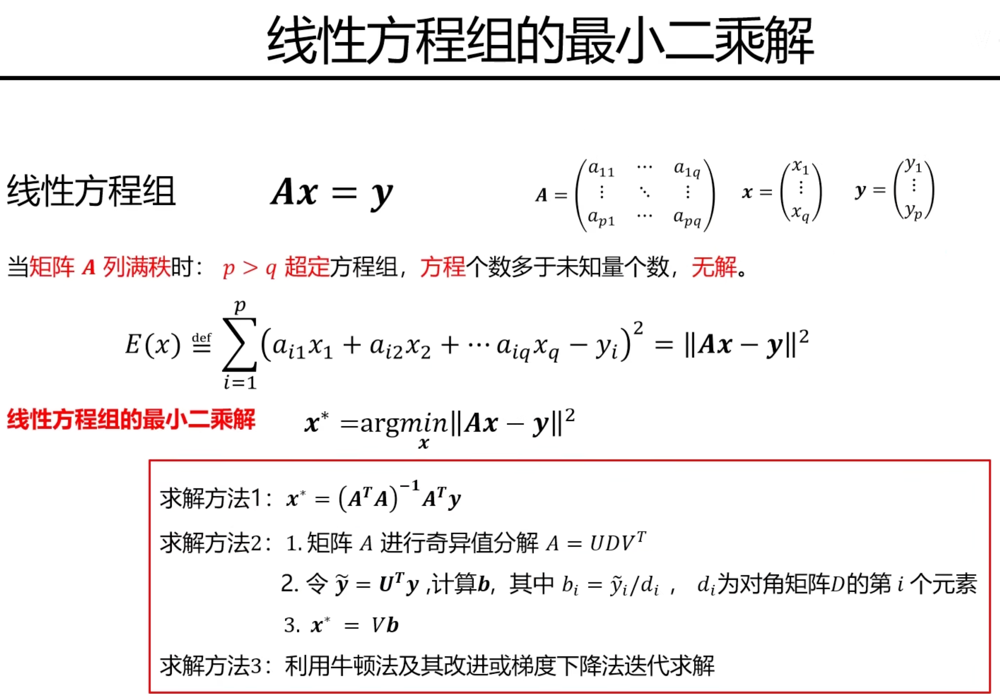

$arg$表示取最小的那个$x$赋给$x^*$，$\mathop{\arg\min}\limits_{x}$中min下x表示需要变化x使之达到最小。

几种求解方式：

方法一：直接求解，最大问题在于需要求$(A^TA)^{-1}$，矩阵逆运算计算度可能比较复杂。

**方法二：奇异值分解，不需要求矩阵逆运算，计算度不高。（通常使用方法二）**

方法三：优点在于不需要求大矩阵、内存消耗不高，也不需要求奇异值分解。缺点是需要迭代求解。

### 4.2 齐次线性方程组的最小二乘解

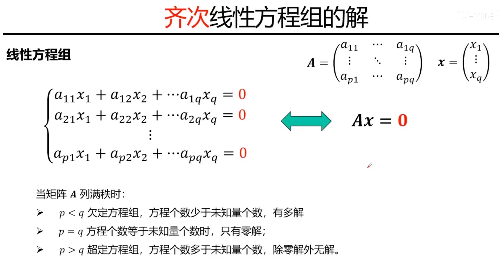

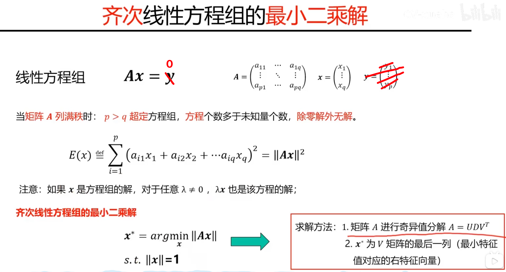

齐次线性方程组的最小二乘解如果不做约束，则永远得不到最小值，因为就算解出了x，因为$\lambda x$也是方程的解，则x可以无限小。因此我们对x做约束：$s.t. ||x||=1$，这样解出的x只会与真实值差一个常数。

> 直接根据求解方法做就可以得到解，推导过程不再讲解。
>
> （使用拉格朗日将有约束变为无约束，再用迭代法，也可以求解）

### 4.3 非线性方程组的最小二乘解

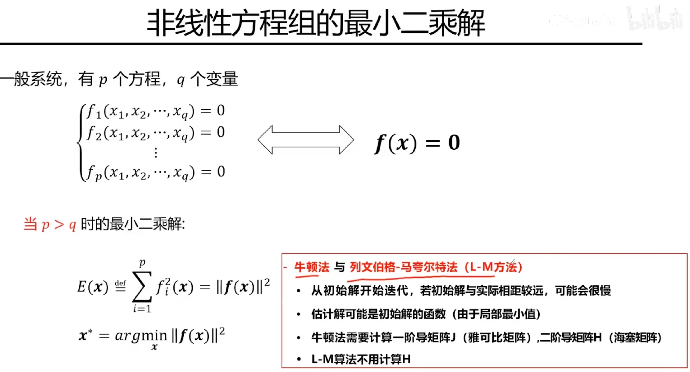

f(·)可以指代线性函数（比如之前4.1式子右边y移到左边，也可以表达成一个f(·)），也可以指代任意非线性函数。

之前的几种求解方法只适用线性方程组，对于非线性方程组只能用牛顿法或L-M方法（牛顿法的改进，不用计算二阶导）。（这些方法包括SVD都有现成的包可以调用，只知道如何求解即可，具体计算直接调包）

# P2 摄像机标定

## 0. 回顾 & 补充

### 0.1 摄像机加透镜的作用

 

如果光圈很大，则透过的光线比较多，成像会很模糊。

增加透镜，可以将同一个点的多条光线映射到一个点上，因此P‘点的亮度就足够了。

 

## 1. 针孔模型 & 透镜摄像机标定问题

### 1.1 什么是摄像机标定？

拿到相机时，可能获取不到相机内参数的具体数值，也不可能真的放在一个空间来精确度量相机世界坐标系下的位置。

因此我们更希望从一些对应关系中自动求解出相机的内外参数，通过拍照，和照片中三个物体之间的关系自动求解。（标定，即求解相机内、外参数矩阵）

**为什么知道相机内外参数矩阵重要？**

只有知道了相机内外参数矩阵，才能知道二维空间和三维空间的映射关系，也才能够有可能将二维点映射到三维（该三维重建的目的就是从二维获取三维场景的结构信息）。

### 1.2 标定目标

 

标定时默认的坐标系就是世界坐标系 $P$，小写 $p$ 就是像素平面。

而目标就是得出 K、R、T 三个矩阵。

### 1.3 标定问题

 

标定时需要使用一个标定装置，原点在一个角上，装置壁上画有等分的格子，其边长可以量出来，对于每个位置就能够得到准确的世界坐标。

使用相机对这个装置拍照，得到的图像上对应装置上的每个位置，也可以得到其对应的像素坐标。

这样就得到了像素平面坐标 $p$，和世界坐标 $P$。

 

进而就可以得到世界坐标系下的点 $P$ 和 $[u_i, v_i]$ 之间的关系。

**整理过后可以看到，一个点可以得到两个方程，11个未知量至少需要6对点对应：**

 

 取的点越多，噪声的影响越小，因此大多数面临的都是超定问题（指的是方程的数量多于未知数的数量，即大量标定数据）。

**整理成齐次线性方程组的形式：**

 

**按齐次线性方程组最小二乘解的方法计算：**

 

注意，这里得到m时 人为限制了 ||m||=1，因此**计算得到的m与真实的m还差一个常数比例关系** 。

### 1.4 提取摄像机参数

由齐次线性方程组求解，我们只是得出了投影矩阵M，而我们想要知道的是内外参数矩阵K和R、T。

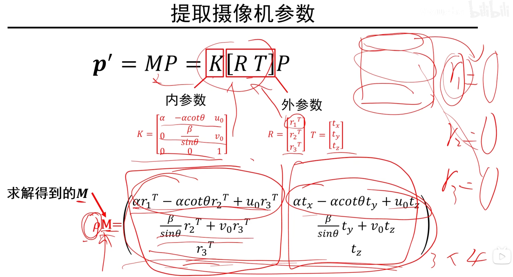

为了严格规范化，$r_1$ 等都需要表示成列向量，因此需要加一个转置T。

> 旋转矩阵的三个向量 $r_1,r_2,r_3$ 之间关系：1. 不相关，即任意两个向量点乘为0；2. 每个向量模长为1；3. 叉乘为垂直向量，如 $r_1 \cdot r_2=r_3$ 。

右边M是计算机求解出来的，右边是由真实参数得出，因此M与真实值之间相差一个常数 $\rho$ 。

#### 1.4.1 提取摄像机内参数 $u_0$ 与 $v_0$

 

将M矩阵分解为 $[A, b]$，则 $\rho A = KR$ ，$\rho b = KT$ 。

 

首先，看第三行 $\rho a_3^{T} = r_3^{T}$，能够解出 $\rho$ 。

然后计算第三行（点）乘第一行 $\rho^{2}(a_1^{T} \cdot a_3^{T}) = u_0$，注意这里由于R矩阵三个向量相互垂直，因此 $\alpha r_1^{T} \cdot r_3^{T} = 0$、$\alpha cot \theta r_2^T \cdot r_3^T = 0$ 。同理，也可以计算第三行点乘第二行。

如此一来，就可以用 a 表示出 u0 和 v0 。

#### 1.4.2 提取摄像机内参数 $\theta$

> 注意，1.4中的公式中有的转置操作可能有些出入，主要理解求解的方式，字符上不做过多解释。

 

将第三行分别与一二行做叉乘，然后取模。

注意cot = cos / sin，且向量取模可以转换：$|a| = \sqrt{a^T \cdot a}$ ，根据这个性质可以将“一三行相乘取模”进行化简（如方框内所示）。

 

将上图两个式子的等号左右两边，上下点乘，
$$
(a_1 \times a_3) \cdot (a_2 \times a_3) = -\alpha\beta\frac{cos\theta}{sin^2\theta}
$$

$$
|a_1 \times a_3| \cdot |a_2 \times a_3| = \frac{|\alpha| \cdot |\beta|}{sin^2\theta}
$$

然后将两个等式相比，就可以得到下列方框中的内容：（ $\alpha$ 和 $\beta$ 都是常数，所以绝对值没什么影响）

 

注意如果像素平面坐标轴垂直时，$cos\theta = 0$ 也就是 $(a_1 \times a_3) \cdot (a_2 \times a_3) = 0$，这与第一节课讲的定理推导一致：
 

#### 1.4.3 提取摄像机内参数 $\alpha$ 和 $\beta$

其它所有参数都已经得到了，只需带入就能得到 $\alpha$ 和 $\beta$ 。

 

由方框内方程可知，如果$|a_1 \times a_3| = |a_2 \times a_3|$则 $\alpha = \beta$ ，这也对应着之前的定理内容：

 

#### 1.4.4 提取摄像机外参数$r_1$、$r_2$ 与 $r_3$

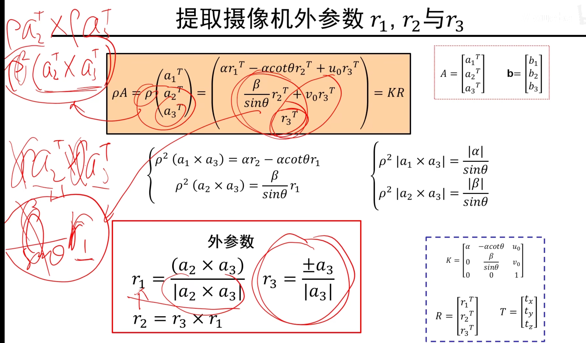

将第三行等式两端叉乘第二行得到：
$$
\rho^2(a_2^T \times a_3^T) = \frac{\beta}{sin\theta}r_1
$$
由于 $\rho^2$ 和 $\frac{\beta}{sin\theta}$ 都是常数，因此 $r_1$ 与 $(a_2^T \times a_3^T)$ 的方向是一致的，而 $r_1$ 是单位向量，因此只需要将 $(a_2^T \times a_3^T)$ 除以它的模即可得到 $r_1$ 。

因为 $r_3$ 和 $r_1$ 都已经得到，因此 $r_2$ 只需要将 $r_3 \times r_1$ 即可得到。

#### 1.4.5 提取摄像机外参数 $T$

 

将等式两边同时乘 $K^{-1}$ 可以得到 $T = \rho K^{-1}b$ ，而K中参数都已经得出，就可以将T中的三个参数 $t_x, t_y, t_z$ 与 $\rho K^{-1}b$ 的三个元素一一对应即可。

#### 1.4.6 所有参数计算汇总

 

### 1.5 退化示例

在对标定模型中取点时，不能都在同一平面，都在一个平面就会有相关性：三个点就可以决定一个平面，第四个点就可以用这三个点表示。

  

## 2. 径向畸变的摄像机标定

 

### 2.1 径向畸变相机建模

现在世界坐标系下的点，需要经过一个有畸变的相机（畸变可看作一个独立的过程），才能得到像素平面上的 $[u_i, v_i]$ 。

 

这里 $S_\lambda$ 矩阵中的 $\frac{1}{\lambda}$ 表示对理想情况下的 $[u_i^{'}, v_i^{'}]$ 进行等比例缩放。

d为理想像素点距离摄像机（原点）的距离，当理想像素点距离相机越远，形变越严重。

当 $\lambda$ 公式中 $\pm$ 符号为 + 时，理想点会被拉近，即桶形畸变；符号为 - 时，理想点被拉远，即枕形畸变。

> 至于 $\lambda$ 多项式为什么要用一个三次项，是因为在建模时模拟一个非线性过程，这只是一种摄像机模型。
>
> （为什么用这个多项式进行建模不需要搞明白，但是要知道是用该形式建模的畸变相机）

在畸变相机模型下，我们不但要求出投影矩阵M，还要求出畸变系数 $K_p, \space p = 1,2,3$ （畸变系数有 3 个）。

**因此，在畸变相机模型中，需要求出的未知量有 11 + 3 = 14 个。**

### 2.2 径向畸变的标定

 

与理想情况下的相机标定不同（下图），理想情况下相机投影矩阵只有相机内外参数组成（与P没有关系），因此可以构成齐次线性方程组；但是畸变相机模型中，$Q$ 矩阵中的变量 $d$ 与像素坐标 $[u_i, v_i]$ 有关，因此构成的方程并不是线性方程组。

 

#### 2.2.1 标定的一般问题

 

非线性方程组只能通过（类梯度下降）牛顿法或L-M方法来求解，但是该类方法很依赖初始点的位置，如果初始点与真实位置相差很远，可能很难收敛。

因此可以通过先求解线性部分得到近似解的方式，来优化非线性方程组的求解，线性的都求完了再用牛顿法计算非线性的部分。

#### 2.2.2 求解线性部分

 

用 $u_i$ 除以 $v_i$ 可以将 $\lambda$ 消去，然后就可以转成一个齐次线性方程组的形式：

> 这个方法利用了径向畸变的性质：一个理想点畸变时不会乱缩，而是沿着该点与原点的连线等比例的缩。
>
>  

 

然后又可以通过SVD求解超定齐次线性方程组（该方程组可以解出m1和m2，即解出8个参数）。

 

这样只剩下了m3（3个参数）+ k1、k2、k3 这6个参数，可以大大缩短收敛所需要的时间。

求出了这些参数，就可以做畸变相机的校正（将上图的 $\frac{1}{\lambda}$ 乘到左边去即可）。

## 3. 补充知识

### 3.1 2D平面上的变换

#### 3.1.1 2D平面上的欧式变换

 

二维点（x，y）经过变换，再加一个平移量（x0，y0），就得到了新的点（x‘，y’）。

当 $\sigma$ 取1时，xyz之间的相对方向不变（保向变换：即旋转变换），即旋转平移变换。

当 $\sigma$ 取-1时，xyz之间的相对方向发生变换，可以理解成发生一次镜像变换：

 

> 一个点进行旋转平移变换（ $\sigma=1$） ，称为欧式变换。

#### 3.1.2 2D平面上的相似变换

 

均匀伸缩变换就类似于径向畸变的畸变矩阵，$s$ 跟 $\lambda$ 的作用是一样的。

缩放变换与欧式变换组合成相似变换：
$$
\begin{pmatrix} x' \\ y' \\ 1 \end{pmatrix} = 
\begin{pmatrix} scos\theta & -ssin\theta & x_0 \\ ssin\theta & scos\theta & y_0 \\ 0 & 0 & 1 \end{pmatrix} 
\begin{pmatrix} s & 0 & 0 \\ 0 & s & 0 \\ 0 & 0 & 1\end{pmatrix}
\begin{pmatrix} x \\ y \\ 1 \end{pmatrix}
$$

#### 3.1.3 2D平面上的仿射变换

在相似变换中，旋转-平移-放缩 并不会改变图形的相对关系，比如正方形的边相互垂直，经过变换后依然是垂直的。

旋转矩阵如果放宽格式，将其定义为A：

> 仿射变换不会改变平行关系，但是会改变角度。

 

其自由度增加到6个（A中包含abcd四个自由度），而之前的sR矩阵只有两个自由度 $s$ 和 $\theta$ 。

#### 3.1.4 2D平面上的透视变换

 

在透视变换中，平行关系也不再保留。

三维到二维中的映射也是一种变换，通过理解这几种变换，能够更好理解映射关系。

### 3.2 3D空间中的变换

#### 3.2.1 3D空间中的欧式变换

 

与2D平面上的变换不同，3D平面上的旋转矩阵有三个轴，对应三个矩阵。s还是缩放因子，t还是表示平移量。

其不变量也与2D平面上的变换一致。

#### 3.2.2 3D空间中的仿射变换

与2D基本一致，把sR矩阵的限制拓宽一下：

 

与此同时，变换时夹角垂直的性质不再保持。还多了一个性质：无穷远点保持不变，即无穷远的地方经过变换还是无穷远。

#### 3.2.3 3D空间中的透视变换

 

在透视变换中，平行线保持不变的性质也不再保持。

三维空间到二维的映射与透视变换有着相同的性质。但不完全相同。

# P3 单视图几何（单视测量）

 

以下面标定模型为例，只要保持 $p_i$ 在图像上的位置不变，映射得到的M矩阵就相同：

 

## 1. 无穷远点、无穷远线与无穷远平面

> 无穷远点、无穷远线和无穷远平面都是三维空间中的概念。

### 1.1 无穷远概念

 

$l$ 为这条直线的参数，之后的内容里直接叫这条直线为 $l$ ，因为 $l$  决定了这条直线。

>  注意这里的 $l$ 和 $l'$ 都是齐次表示，x的坐标也是，因此采用三个参数决定这条直线。

 

$l \times l'$  得到的是一个 $[1 \times 3]$ 的向量，这个向量是交点x的其次表示，想要得到二维坐标需要转为欧式。

 

无穷远点在齐次坐标下很好表示，但是在欧式空间中找不到对应点（∞是无法表示的）。

> 如果 $-a/b = -a'/b'$，则两直线平行（斜率相等）。

齐次空间中，求两条平行线的交点（叉乘）就可以得到无穷远点的“交点”坐标。

简单来说，一条直线的法向量的齐次表示，就是在**直线方向**后面（注意是“方向”，不包括平移量）加0即可，如 $l = ax + by + c$ 的法向量为 $[a, b, 0]$。（注意，法向量是由原点指向点 $[a, b, 0]$ 的向量）

 

### 1.2 3D空间中的无穷远

 

 3D空间中的直线比较难表示，一般如果要用这条直线，一般定义为两个平面的交线。

用之前的方式，写不出很好的数学方程，因此我们一般不写方程，只记录直线的方向。

> 因此，如果3D空间中有两条平行线（方向都是 $[a,b,c]^T$），则3D空间中的无穷远点为 $[a,b,c,0]^T$。

 

#### 1.2.1 3D空间中的无穷远点

无穷远点只有在齐次坐标系下才能表示，有一个特点即第四维为0.

 

#### 1.2.2 3D空间中的无穷远线

在3D空间的一个平面上任意取两组（n组也可）平行线，这两组平行线各自有汇聚的无穷远点，那么这两个无穷远点的连线即无穷远线。

 

#### 1.2.3 3D空间中的无穷远平面

每一个平面都有一条对应的无穷远线，那么由两个/多个平面的两条/多条无穷远线就可以确定一个无穷远平面。

> 注意，无穷远线也可以定义为两个平面的交线。
>
> 即两个平行平面的无穷远线是同一条线，这条线也可以看作是这两个平行平面在无穷远处的交线。

 

## 2. 影消点和影消线

> 影消点和影消线是三维空间中的点投影到二维像素平面中，所对应的东西。（是二维空间中的概念）
>
> 由这个关系可以进行三维重构。

## 3. 单视重构

