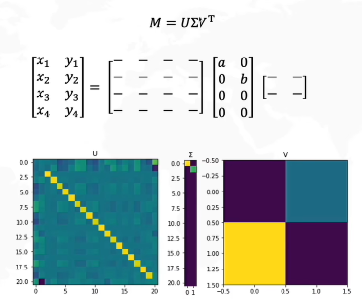
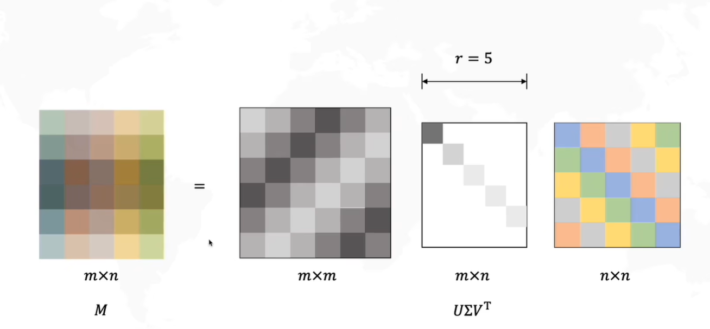

# 2.1.1奇异值分解(SVD)的原理详解及推导

本文在原文基础上进行了注释理解，仅作自己学习参考。

共有两节，Chapter1为较为基础的公式推导，比较繁琐且较难理解。（笔者实在看不下去，找了其他解读，故有了Chapter2）

Chapter2结合其几何意义分析SVD，通俗易懂，**建议直接参考Chapter2**。

---

## Chapter1

原博客地址：http://t.csdnimg.cn/CXShC

### 1. 写在前面

最近整理[推荐系统](https://so.csdn.net/so/search?q=推荐系统&spm=1001.2101.3001.7020)模型的时候，第二个模型打算整理一下隐语义模型，这里面绕不开一种思想就是矩阵分解， 而作为矩阵分解的经典方法SVD感觉这次有必要学学了，SVD不仅是一个数学问题，在工程应用中的很多地方都有它的身影，比如我之前在[【白话机器学习篇】](https://blog.csdn.net/wuzhongqiang/article/details/104607832)说到了PCA， 那是一种经典的降维方式，而SVD同样的也可以用于降维， 并且掌握了SVD原理后再去看PCA那是相当简单的，在推荐系统方面，SVD更是名声大噪，在2006年，Koren将它应用于推荐系统并获得了Netflix大奖，因此在推荐系统中也就出来了隐语义模型(Latent Factor Model)或者叫矩阵分解模型(Matrix Fatcorization)，它们的核心思想是通过寻找隐含特征来联系用户兴趣和商品，说白了其实就是把协同过滤里面的共现矩阵分解成了两个矩阵相乘的方式。 这个在具体整理的时候再谈，总之，这里面绕不开的一个名词就是SVD，尽管数学上的这种SVD矩阵分解由于它对矩阵稠密的要求和计算复杂度大不太直接用于协同过滤里面的共现矩阵，但是源思想没变，所以在这里先整理一下SVD的原理，防止在整理矩阵分解模型的时候遇到SVD，RSVD，ASVD，SVD++等各种名词的时候一脸懵逼哈哈。

这篇文章是基本看着一篇博客整理过来的， 只是对里面的错别字和公式进行了改版， 对里面说的不太清晰的地方简单的补充了一下， 所以并不是完全原创文章， 注明一下原文章出处：https://blog.csdn.net/zhongkejingwang/article/details/43053513， 下面就是这个链接的原文了。

用SVD可以很容易得到任意矩阵的满秩分解，用满秩分解可以对数据做压缩。可以用SVD来证明对任意M × N M\times NM×N的矩阵均存在如下分解：

这个可以应用在数据降维压缩上！在数据相关性特别大的情况下存储X和Y矩阵比存储A矩阵占用空间更小！在开始讲解SVD之前，先补充一点矩阵代数的相关知识。

### 2. 正交矩阵

正交矩阵是在欧几里得空间里的叫法，在酉空间里叫酉矩阵，一个正交矩阵对应的变换叫正交变换，**这个变换的特点是不改变向量的尺寸和向量间的夹角**，那么它到底是个什么样的变换呢？看下面这张图

假设二维空间中的一个向量OA，它在标准坐标系也即e1、e2表示的坐标是中表示为(a,b)’（用’表示转置），现在把它用另一组坐标e1’、e2’表示为(a’,b’)’，存在矩阵U使得(a’,b’)’=U(a,b)’，则U即为正交矩阵。

从图中可以看到，**正交变换只是将变换向量用另一组正交基表示，在这个过程中并没有对向量做拉伸，也不改变向量的空间位置，假如对两个向量同时做正交变换，那么变换前后这两个向量的夹角显然不会改变**。上面的例子只是正交变换的一个方面，即旋转变换，可以把e1’、e2’坐标系看做是e1、e2坐标系经过旋转某个θ角度得到，怎么样得到该旋转矩阵U呢？假如$x = \begin{bmatrix} &a&\\ &b&\end{bmatrix}$， 则：
$$
\begin{aligned}
a^′= x⋅e1^′ = e1^{′^T} x \\
b^′= x⋅e2^′ = e2^{′^T} x
\end{aligned}
$$
$a^′$和$b^′$实际上是$x$在$e1^′$ 和$e2^′$轴上的投影大小，所以直接做内积可得，then
$$
\begin{align}
\begin{bmatrix}&a^′& \\ &b^′&\end{bmatrix} = \begin{bmatrix}&e1^{′^T}& \\ &e2^{′^T}&\end{bmatrix}x
\end{align}
$$
从图中可以看到，$e1$和$e2$是一组基， 坐标是(1,0), (0,1)， 把$e1$和$e2$投影到新的轴上（乘一个变换矩阵）得到$e1^′$和$e2^′$， 其实
$$
\begin{align}
e1^′ =|e1| \begin{bmatrix}&cosθ& \\ &sinθ&\end{bmatrix} && e2^′ = |e2|\begin{bmatrix}&cosθ& \\ &sinθ&\end{bmatrix}
\end{align}
$$
> 把$e1$和$e2$看作标准正交基会好理解很多，直接看夹角$θ$就能得到新的基的坐标。

即
$$
\begin{align}
e1^′ = \begin{bmatrix}&|e1|cosθ& \\ &|e1|sinθ&\end{bmatrix} && e2^′ = \begin{bmatrix}&|e2|cosθ& \\ &|e2|sinθ&\end{bmatrix}
\end{align}
$$
所以
$$
\begin{align}
U = \begin{bmatrix}&cosθ& &sinθ& \\ &-sinθ& &cosθ&\end{bmatrix}
\end{align}
$$

### 3. 特征值分解—EVD

在讨论SVD之前先讨论矩阵的特征值分解（EVD），在这里，选择一种特殊的矩阵——对称阵（酉空间中叫hermite矩阵即厄米阵）。对称阵有一个很优美的性质：它总能相似对角化，对称阵不同特征值对应的特征向量两两正交。一个矩阵能相似对角化即说明其特征子空间即为其列空间，若不能对角化则其特征子空间为列空间的子空间。

> 特征值分解是一种将矩阵分解为**特征向量**和特征值的方法。对称阵是一种特殊的矩阵，它在代数和几何上有一些很有用的性质。
>
> 对称阵，我们可以找到一组特征向量，每个特征向量对应一个特征值。这些特征向量之间是正交的，也就是说它们的方向互相垂直。而且，**特征值告诉我们特征向量在变换过程中的重要程度。**
>
> 相似对角化的概念是说，我们可以通过一个相似变换，将对称阵变换成一个对角矩阵。这个相似变换不会改变特征值，只是改变了特征向量的表示方式。通过相似对角化，我们可以更方便地理解和分析对称阵的性质。
>
> + 给定一个方阵 A，非零向量 v 被称为矩阵 A 的特征向量，如果满足以下条件：
>
>   A * v = λ * v
>
>   其中，A 是方阵，v 是非零向量，λ 是标量，称为特征值。

现在假设存在mxm的满秩对称矩阵A，它有m个不同的特征值，设特征值为$\lambda_i$, 对应的特征向量$x_i$， 则有

进而

所以可得到A的特征值分解（由于对称阵特征向量两两正交，所以U为正交阵，**正交阵的逆矩阵等于其转置**）

这里假设A有m个不同的特征值，实际上，只要A是对称阵其均有如上分解。

矩阵A分解了，相应的，其对应的映射也分解为三个映射。现在假设有x向量，用Ａ将其变换到Ａ的列空间中，那么首先由U’先对x做变换：

$$
\begin{align}
\mathrm{Ax}=U \Lambda U^{T} \mathrm{x}
\end{align}
$$
$U$**是正交阵$U \Lambda U^T$也是正交阵，所以$U \Lambda U^T$对$x$的变换是正交变换**，它将$x$用新的坐标系来表示，这个坐标系就是A的所有正交的特征向量构成的坐标系。假如将x用A的所有特征向量表示为：
$$
\begin{align}
x = a_1 x_1 + a_2 x_2 + ⋯ + a_m x_m
\end{align}
$$

这个假设是向量$x$原来的坐标， 那么， 经过第一个变换之后， 就可以把向量$x$变成$[a_1, a_2, …,a_m]’$。

紧接着，在新的坐标系表示下，由中间那个对角矩阵对新的向量坐标换，其结果就是将向量往各个轴方向拉伸或压缩：

从上图可以看到，如果A不是满秩的话，**那么就是说对角阵的对角线上元素存在0，这时候就会导致维度退化， 这样就可以降维了看没看到**，这样就会使映射后的向量落入m维空间的子空间中。

最后一个变换就是U对拉伸或压缩后的向量做变换，由于U和U’是互为逆矩阵，所以U变换是U’变换的逆变换。

因此，从对称阵的分解对应的映射分解来分析一个矩阵的变换特点是非常直观的。假设对称阵特征值全为1那么显然它就是单位阵，如果对称阵的特征值有个别是0其他全是1，那么它就是一个正交投影矩阵，它将m维向量投影到它的列空间中。

根据对称阵A的特征向量，如果A是2*2的，那么就可以在二维平面中找到这样一个矩形，是的这个矩形经过A变换后还是矩形：

这个矩形的选择就是**让其边都落在A的特征向量方向上**，如果选择其他矩形的话变换后的图形就不是矩形了！

### 4. 奇异值分解—SVD

上面的特征值分解的A矩阵是对称阵，根据EVD可以找到一个（超）矩形使得变换后还是（超）矩形，也即**A可以将一组正交基映射到另一组正交基**！这个意思其实就是上面向量x的那三次变换， 开始的正交基假设的是A的m个特征向量。 而经过A变换之后， 又变回到了那组正交基上， 只不过是长度上发生了拉伸或者压缩， 方向没变。可以看那两个矩形。

> 如果开始假设的a不在A的特征向量的正交基上，则相当于将a映射到A特征向量的正交基中！
>
> （因此可以理解”这个矩形的选择就是**让其边都落在A的特征向量方向上**，如果选择其他矩形的话变换后的图形就不是矩形了！“这句话了吧！

## Chapter2

参考视频：【【学长小课堂】什么是奇异值分解SVD--SVD如何分解时空矩阵】 https://www.bilibili.com/video/BV16A411T7zX/?share_source=copy_web&vd_source=01d44ca12928de4e09572201ce260e54

> 十分建议先看原视频，再来过一遍思路整理。

### 1. 什么是奇异值分解Singular ValueDecomposition（SVD）

SVD即将任意矩阵$M=m*n$（不一定为方阵）分解为三个矩阵相乘，其中U和V为方阵，Σ只有对角线有值（即奇异值）。

在了解SVD为什么能够以及为什么这样分解之前，我们需要先了解一些基础的线性代数知识。

### 2. 线代知识

#### 线性变换

线性变换描述了一种将一个向量空间中的向量映射到另一个向量空间中的操作。

在几何空间中，它往往表现为：平移、旋转、缩放等几何变换。

**拉伸**

只有对角线不为0的矩阵（S-stretch），通常实现拉伸操作。

> 可以看到D矩阵X轴上被拉伸为2倍，而Y轴不变。（右图所示）

**旋转**

当为R（rotation）矩阵形式时，表示进行旋转操作。（R矩阵可以看作将坐标轴逆时针旋转θ，详细推导参考Chapter1第二部分）

> 在D左乘S后进行拉伸后，再左乘R，即为右图效果。

### 3. SVD原理

有了以上知识，以二维空间为例。

一个任意二维矩阵M，可以理解为做一次线性变换，但这个线性变换通常是旋转、缩放等几何变换同时进行。

根据第一节示意图可知，U和V都是方阵（并不一定是正交阵），那如果U和V是正交阵则会是旋转效果，而Σ可以”理解成是对角阵“（注意它并不是严格意义的对角），则是拉伸效果。

> 补充说明：对于一个正交阵 Q，满足 Q^T * Q = I，其中 I 是单位矩阵。
>
> 然而，并非所有的方阵都满足这个条件。只有满足 Q^T * Q = I 的方阵才能被称为正交阵。

而SVD就是将这个复杂的线性变换拆解为”旋转—拉伸—再旋转“的操作。

> 至于为什么要把线性变换矩阵M进行分解，后面会进行分析。

### 4. SVD的物理意义

如果我们能够找到一组正交基$v1,v2$（也就是V），经过M线性变换之后变为右边$\sigma1u1,\sigma2u2$这组基后，还会是一组正交基。

> 这里就对应着上一节提到的$VM$（将一组正交基进行线性变换）=$U\Sigma$（将标准正交基旋转并拉伸）

将其图像化表示，即为：

由于$\Sigma$最后一行全0，因此可以转换为以下形式：

$\Sigma$中的奇异值的含义为“基”（也就是轴）的重要性。如果我们想要降维（只想看重要的几个因素），可以减少$\Sigma$的维数：

> 这里只需理解各个矩阵的意义即可，后续会列出推导过程。

### 5. SVD的现实意义

将$U\Sigma V^{T}$展开来看：

可以理解为$U$和$V^t$做矩阵乘法后，分别乘一个常数（奇异值），然后再相加的结果：

如果将$U$和$V^t$矩阵理解成代表时间和空间的矩阵，那我们就可以得到在这种模式下，时间和空间的分布情况。

此时，我们就在一个复杂的变换中，找到了三种（也可以是多种）模式的叠加，而每个模式我们又可以看到其分布情况：

### 6. SVD的求解

求解过程如下：

以下对上图做详细讲解：

1. 对$M^TM$做变换后，可以得到：$M^T MV=VL$。结合右图可知，该形式与$M^TM$对特征值分解相同，即$V$为特征向量，$L$为特征值。
2. 同理也可得到$MM^T U=UL$。
3. 这样$L=\begin{bmatrix} &\sigma_{1}^2& 0& \\ &0& \sigma_{2}^2&\end{bmatrix}=\begin{bmatrix} &\lambda_1& 0& \\ &0& \lambda_{2}& \end{bmatrix}$，$\Sigma$即为$M^T M$和$MM^T$的特征值开方构成的对角阵。

完整求解过程如下所示：

由此，整个奇异值分解的任务就完成了。

> 总的来看，SVD就是将一个负责任务分解为几个不同模式，方便在更细粒度且清晰的层面分析、统计和观察。

