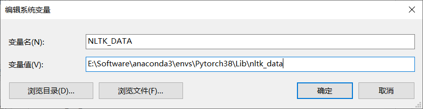

# 2.1.2nltk下载数据到指定文件夹

## 问题

用`python -m nltk.downloader popular`命令下载nltk数据集，默认下载到了C盘的'C:\\Users\\47563/nltk_data'这个路径下。

```
[nltk_data] Downloading collection 'popular'
[nltk_data]    |
[nltk_data]    | Downloading package cmudict to
[nltk_data]    |     C:\Users\47563\AppData\Roaming\nltk_data...
[nltk_data]    |   Unzipping corpora\cmudict.zip.
[nltk_data]    | Downloading package gazetteers to
[nltk_data]    |     C:\Users\47563\AppData\Roaming\nltk_data...
[nltk_data]    | Error downloading 'gazetteers' from
[nltk_data]    |     <https://raw.githubusercontent.com/nltk/nltk_data
[nltk_data]    |     /gh-pages/packages/corpora/gazetteers.zip>:
[nltk_data]    |     <urlopen error TLS/SSL connection has been closed
[nltk_data]    |     (EOF) (_ssl.c:1135)>
```

而为了节省C盘空间且方便整理数据，我们想将其下载到指定文件目录下。


## 解决方法

打开Python，通过以下命令能够看到nltk可用文件夹：

```python
import nltk
print(nltk.data.path)
```

可以得到以下输出：

```
['C:\\Users\\47563/nltk_data', 'E:\\Software\\anaconda3\\envs\\Pytorch38\\nltk_data', 'E:\\Software\\anaconda3\\envs\\Pytorch38\\share\\nltk_data', 'E:\\Software\\anaconda3\\envs\\Pytorch38\\lib\\nltk_data', 'C:\\Users\\47563\\AppData\\Roaming\\nltk_data', 'C:\\nltk_data', 'D:\\nltk_data', 'E:\\nltk_data']
```

在该状态下，系统会依次遍历这些路径，并下载到可用路径下（也就是'C:\\Users\\47563/nltk_data'）。

我们将通过以下方法来指定一个自己的目录。


**修改系统变量**

通过以下路径，将自己的文件目录添加到系统变量中：

> 1. 打开控制面板（Control Panel）。
> 2. 进入"系统与安全"（System and Security）。
> 3. 点击"系统"（System）。
> 4. 在左侧导航栏中选择"高级系统设置"（Advanced system settings）。
> 5. 在弹出的对话框中，点击"环境变量"（Environment Variables）按钮。
> 6. 在"系统变量"（System variables）部分，点击"新建"（New）。
> 7. 输入变量名为 `NLTK_DATA`，然后输入自定义的数据目录路径作为变量值。
> 8. 点击"确定"保存设置。

**注意：这里之前print的文件目录不一定存在，需要打开文件夹确认想要添加的文件目录是否存在，如果不存在需要手动创建。**


这里我在该目录下创建了nltk_data文件夹，并添加到了系统变量中。



重新运行代码`python -m nltk.downloader popular`，可以看到文件下载到了指定的文件夹中：

```
(Pytorch38) C:\Users\47563>python -m nltk.downloader popular
E:\Software\anaconda3\envs\Pytorch38\lib\runpy.py:127: RuntimeWarning: 'nltk.downloader' found in sys.modules after import of package 'nltk', but prior to execution of 'nltk.downloader'; this may result in unpredictable behaviour
  warn(RuntimeWarning(msg))
[nltk_data] Downloading collection 'popular'
[nltk_data]    |
[nltk_data]    | Downloading package cmudict to
[nltk_data]    |     E:\Software\anaconda3\envs\Pytorch38\lib\nltk_dat
[nltk_data]    |     a...
[nltk_data]    |   Unzipping corpora\cmudict.zip.
[nltk_data]    | Downloading package gazetteers to
[nltk_data]    |     E:\Software\anaconda3\envs\Pytorch38\lib\nltk_dat
[nltk_data]    |     a...
[nltk_data]    |   Unzipping corpora\gazetteers.zip.
[nltk_data]    | Downloading package genesis to
[nltk_data]    |     E:\Software\anaconda3\envs\Pytorch38\lib\nltk_dat
[nltk_data]    |     a...
```

