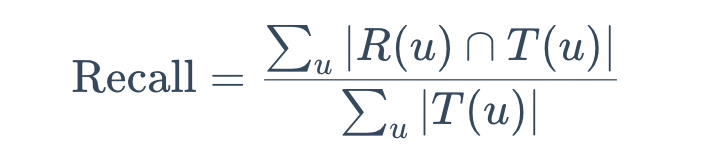

# FunRec

## 1.3 推荐系统技术栈
### 1. 学习深度与广度

+ 对于入门的推荐算法工程师而言，实际上深度和广度的要求取决于你要去的组，有些组有很深的推荐技术沉淀，有很强的工程师团队，这样的组就会希望候选者能够在某个方面有比较深入的研究，这个方面既包含工程方面也包含研究方面。但是如果是比较新的组、或者技术沉淀不深、推荐不是主要任务的组，对深度要求就不会很高。
+ 总而言之，我认为对于应届生/实习生来说，在推荐最重要的工程技术/研究方向，至**少在召回和排序模块，需要选一个作为方向，是需要较深钻研**。对于其他技术/研究方向需要有一定了解，比如可以没用过强化学习，但是要知道强化学习能够在推荐中解决什么问题，剩下的可以等到真实**遇到需要后再去学习**。

## 2.1.1 基于协同过滤的召回——UserCF

### 1. 算法评估（召回率、精确率、覆盖率）

**召回率**

对用户 u 推荐 N 个物品记为 R(u), 令用户 u 在测试集上喜欢的物品集合为 T(u)， 那么召回率定义为：

含义：在模型召回预测的物品中，预测准确的物品占用户实际喜欢的物品的比例。

**精确率**

精确率定义为：

含义：推荐的物品中，对用户准确推荐的物品占总物品的比例。

- 如要确保召回率高，一般是推荐更多的物品，期望推荐的物品中会涵盖用户喜爱的物品。而实际中，推荐的物品中用户实际喜爱的物品占少数，推荐的精确率就会很低。故同时要确保高召回率和精确率往往是矛盾的，所以实际中需要在二者之间进行权衡。

**覆盖率**

覆盖率反映了推荐算法发掘长尾的能力， 覆盖率越高， 说明推荐算法越能将长尾中的物品推荐给用户。

- 含义：推荐系统能够推荐出来的物品占总物品集合的比例。

  - 其中 ∣I∣ 表示所有物品的个数；

  - 系统的用户集合为U;

  - 推荐系统给每个用户推荐一个长度为 N 的物品列表 R(u).

- 覆盖率表示最终的推荐列表中包含多大比例的物品。如果所有物品都被给推荐给至少一个用户， 那么覆盖率是100%。

