# 高等数学
> 关键词：导数/积分/微分，梯度，泰勒展开公式

## 导数和微分
> **导数的意义：fx相对于x的瞬时变化率（函数的倾斜程度）。**

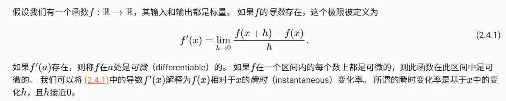
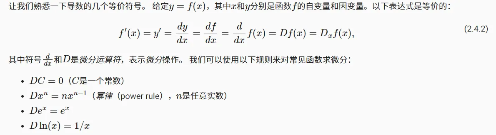

### 微分常用计算法则
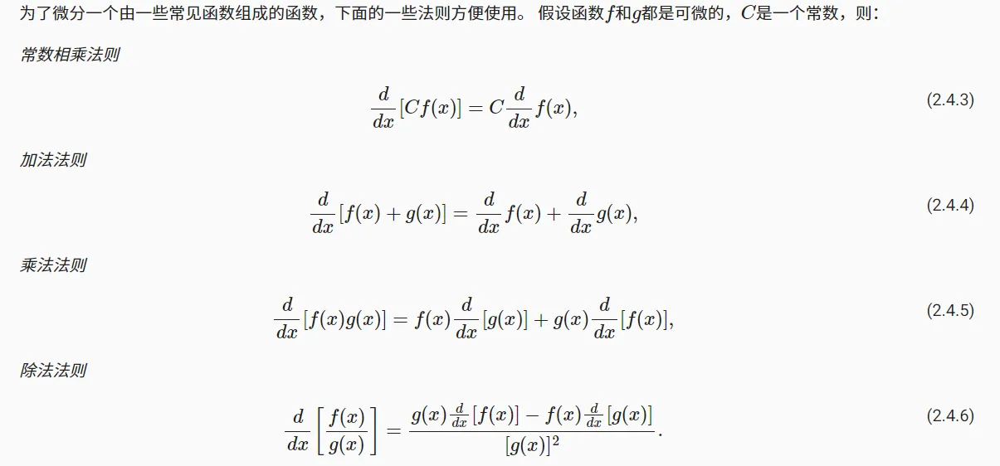
### 偏导数
> 偏导数意义：f对于不同变量，在变量某个数值处的瞬时变化率。

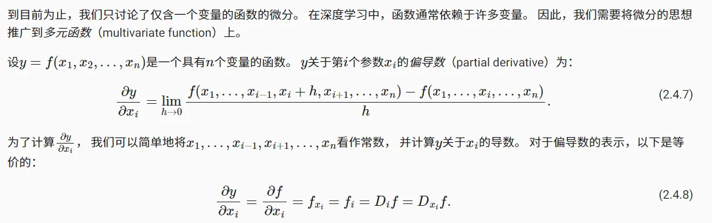
### 求导的链式法则
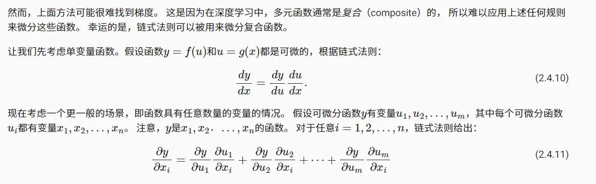
## 梯度
> **函数f对于x（n个变量组成的n为向量）的梯度，是一个包含n个偏导数的向量。**

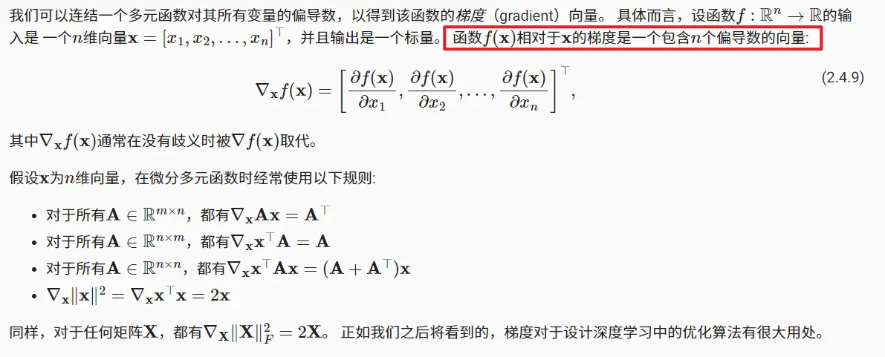
## 积分

### 定积分
> **定积分，相当于求曲线下a~b的面积，是求一个固定值。**

其中：

- a，b为上下限
- dx表示一个极小的x
- 定积分的操作，相当于把a~b的面积切分成无数小矩形。

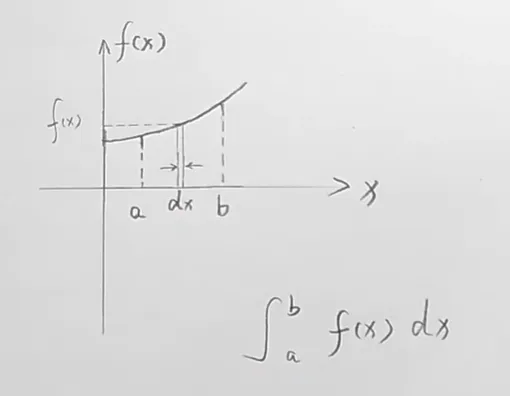

### 不定积分
> **不定积分，不求一个固定值，而是得到一个（面积）函数。（与定积分的最大不同）**
> （同样也是得到由坐标轴、曲线和**某个数值x**围成的面积F（x），这是一个函数。

### 积分与微分的关系
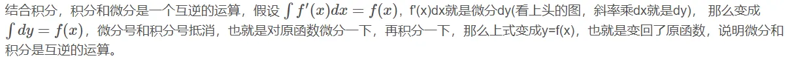
如：
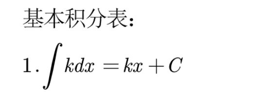

- kx + c的导数（微分）为k
- k的积分是kx + c
## 泰勒展开公式
### 为什么要用泰勒展开
很多函数对于积分和微分运算并不友好，如ln(x)或1/(x + 1)。
但是幂函数X^n对于积分和微分运算是很友好的。
**泰勒展开的意义就在于用多个幂函数（多项式）来拟合某个函数，如ln(x)，以便后续完成积分 / 微分等运算。**
### 泰勒公式
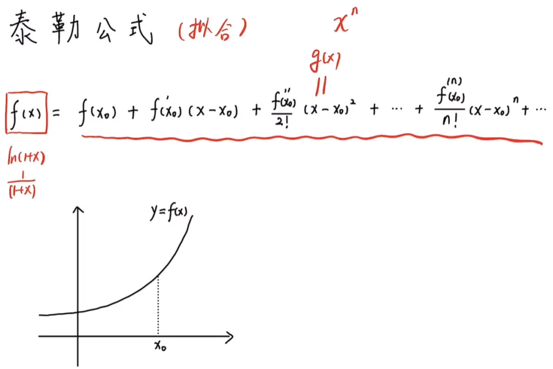
下面对多项式进行解释：

1. **如果只看第一项，即y = f(x0)**

f(x0)不能用于拟合原函数f(x)，但是在x0这一点处可以拟合，只有一丝拟合效果。
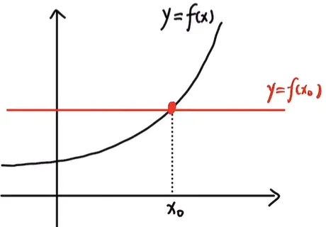

2. **如果看前两项，即y = f(x0) + f'(x0)(x - x0)**

这个方程，即f(x)在x0处的**切线方程**。
虽然切线方程仍然不足以拟合f(x)，但是它已经可以在一个x0的一个邻域内拟合f(x)，拟合效果大大提升。
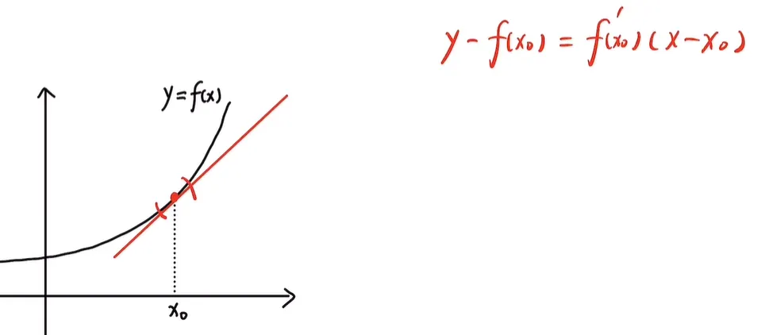

3. **如果再看前三项，即y = f(x0) + f'(x0)(x - x0) + (f''(x0) / 2!) * (x - x0)^2**
- 当x取x0时，y = f(x0)，说明该函数也经过x0处
- 当y对x求一阶导数，得到：

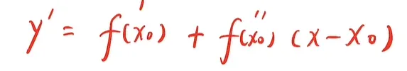
y'在x0处，仍然等于f'(x0)，说明该函数与f(x)在x0处的**斜率相同**：

- 当y对x求二阶导数，得到：

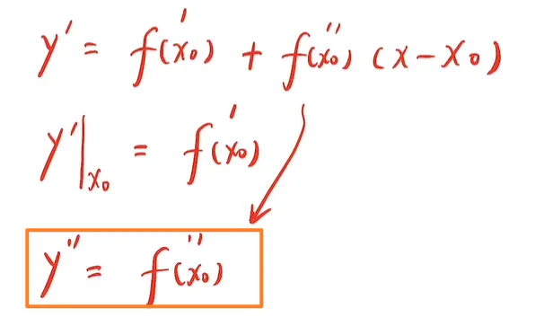
二阶导数代表凹凸性，说明函数在x0处与f(x)的**凹凸性也一致**，曲线大致如下：
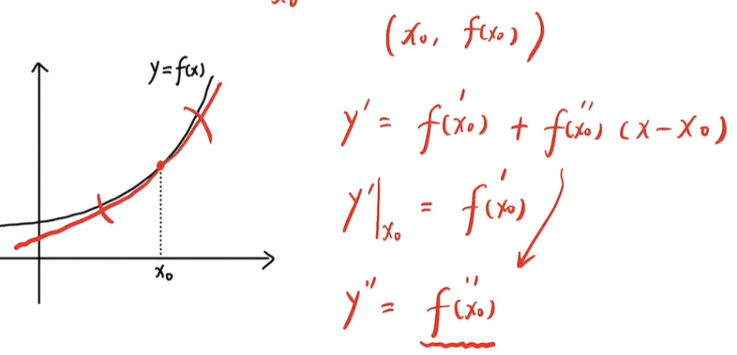
**该函数的拟合效果比之前更好了，不但在x0处变化率相同，x0的凹凸性也相同，可以拟合的邻域范围更大了。**
**综上，后面项数越多，说明展开式对原函数的拟合能力越来越强！**