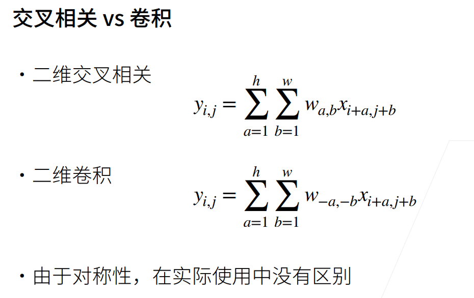

## 12 权重衰减（weight decay）

噪声越大，w学到的值越大？（需要验证）

## 13 丢弃法（Dropout）

实现代码中，一般用mask * x / （1- dropout_rate），而非x[mask] = 0，原因在于gpu对乘法相率远高于选择置0.

trick：假设隐藏层大小为64效果还不错，可以尝试翻倍为128然后dropout = 0.5，因为直觉上是等效的，但实际效果可能比64要好。

## 16 PyTorch 神经网络基础

**1. self._modules相当于一个有序的字典，可以用于存每一层。**

**2. nn.Sqquential相当于list，**

可以使用类似list的用法：

 

也可以直接访问weight或者bias：

 

> 直接访问net[2].bias得到的是tensor，他其中包含了data和grad

**3.nn.init.normal_() **

这个下划线表示这是一个替换函数，函数没有返回值，而是直接修改m.weight的值：

 

**4. 参数绑定**

先定义层，然后将其放在模型中：

 

可以看到weight是相等的，他们指向同一个实例：

 

**5. MLP每一层单元数如何设置**

“随机抓药“：假设需要的input：128，output：2

① 如果直接映射：128—2

② 如果单隐藏层：128—(16/32/64/128依次试一下)—2

③ 如果单隐藏层的16和128效果一般（一个太简单一个太复杂），双隐藏层

128—(32/64)—(8/16)—2，多试几次

一般都是由宽到窄的规律，也可以随机搜参看结果。。

**6. 如何找到真正合适的参数**

开始搜参时可以使用随机搜参，**一旦找到一个还不错的超参值，可以观察一下这个点附近一定区间内效果如何：**

- 如果效果还不错，说明这个点是一个不错的参数；
- 相反如果都不太好，说明这个参数点周围不那么平滑，可能碰到一个噪音点，那这个超参的泛化性可能就不那么好。

> 在竞赛中可能调参效果比较明显，因为数据集固定。
>
> 在实际应用中，因为数据在不断变化，可能之前调的参数，在数据更新后的效果反而没那么好了。

## 19 卷积层

**1. 从全连接到卷积——解释“为什么说卷积是特殊的全连接”**

首先提出在图片上做深度学习至关重要的两点：① 平移不变性、② 局部性。

① 平移不变性：拿分割举例，如在饮料柜上准确识别出“雪碧”，那么我们希望不论“雪碧”出现在哪个位置，都能根据它的特征识别出来。

② 局部性：因为我们识别一个物体，只需要知道它的一些特征，而非整张图片的信息，因此识别具有局部性。

 

对于可以理解为，通过一个4-D矩阵，将一个宽高为(k, l)的图片，映射到大小为(i, j)的图片上。

此时我们用V做W的重新索引，此时可以看作是在X(i, j)的一个范围内区域即(a, b)，映射到一个点h(i, j)上，**但是这样不符合“平移不变性”：因为对于X不同的位置，v中会对应不同部分的权重。**

> 比如，对于X(i + a, j + b)的区域，对应v(i, j, a, b)区域，对于X(i' + a, j' + b)对应v(i', j', a, b)区域，在不同区域可能会得到不同结果。
>
> 而我们希望的是如果X(i + a, j + b)和X(i' + a, j' + b)出现了相同物体，我们可以映射到v的同一片区域从而可以准确识别出来。

于是提出了下面的改动，使得v不依赖于(i, j)：

 

对于局部性，我们也有如下操作：

 

如此看，v是不是就与卷积中的卷积核很相似了呢。

> 严格来讲，我们做的操作叫做交叉相关，而非卷积。
>
>  

## 21 卷积层里的多输入多输出通道

**1. 多输出通道/核到底在做什么**

  

假设一个卷积核大小为$(c_{out}, c_{in}, k_w, k_h)$，则$c_{out}$就是输出通道，$c_{in}$就是输入通道。

输出通道：每个通道识别一种特定的模式，如图第一个通道的输出就是识别绿色通道的某钟点形的模式。

输入通道：当前卷积层的输出通道到了下一层就是作为输入通道，那就相当于将这些模式识别出来后，进行一次（加权）组合（因为多输入通道是元素乘之后sum），就得到了一个组合的模式识别。

> 对于一张猫图片放进网络，可能下层识别的是一些胡须等纹理，到上层理想的情况可能是识别猫的一个局部特征，比如爪子、头、身子之类，然后在最上层可以识别出是一只猫。。

**2. 1 x 1卷积层在做什么**

**用于融合不同通道信息**，因为视域只有1，因此它识别不到任何空间信息。

可以理解一下，就相当于把3个通道flatten之后输入到(3, 2)的全连接中。

 

**3. 卷积操作可以获取到位置信息？**

可以，卷积输出的位置对应了上一层在该位置周围的信息融合。

另，pooling操作可以让模型不过多关注于位置信息。

**4. 为什么现在池化层pooling越来越少了?**

pooling的目的：① 让模型对位置不那么敏感。② stride = polling size压缩图片。

然而有一些方法可以代替pooling操作，比如

① 卷积操作中加入stride，效果跟pooling是很相似的。

② 现在会在训练前做大量的数据增强，比如对图片进行移动、放缩、旋转等等，通过对数据本身做扰动操作使得卷积层不会过拟合到识别某个位置。

but，最后通常还是会用一个大池化层处理。

## 23 经典卷积神经网络 LeNet

**1. 通常图片卷积中高宽减半时，通道数翻倍**

因为卷积操作会使像素信息有所丢失（因为像素变少了），可以通过增加通道数来弥补这一点。

通道数相当于识别的模式数量，虽然像素信息少了，但是可以通过识别不同模式来补齐。

**2. view和reshape的区别**

view相当于对数据创建了一个视图，假设数据在内存中占了一片区域，view不会对这片区域做任何改动。

> 内存中的离散数据不可以使用view，比如将数据的第1、3、5列拿出来，可能view就做不了了。

reshape可以对存储空间中的数据进行改动，比如之前数据在内存中是横着存储，转置后可能会变成竖着存储。

> reshape理论上比view的功能更高，但view可能会更快一点。

