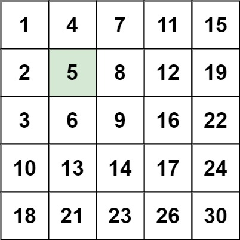
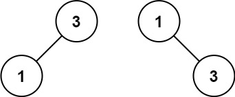
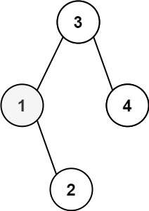

# LeetCode Hot100

## 哈希

### [1. 两数之和](https://leetcode.cn/problems/two-sum/)

#### **题目描述**

给定一个整数数组 `nums` 和一个整数目标值 `target`，请你在该数组中找出 **和为目标值** *`target`* 的那 **两个** 整数，并返回它们的数组下标。

你可以假设每种输入只会对应一个答案，并且你不能使用两次相同的元素。

你可以按任意顺序返回答案。

**示例 1：**

```
输入：nums = [2,7,11,15], target = 9
输出：[0,1]
解释：因为 nums[0] + nums[1] == 9 ，返回 [0, 1] 。
```

**示例 2：**

```
输入：nums = [3,2,4], target = 6
输出：[1,2]
```

**示例 3：**

```
输入：nums = [3,3], target = 6
输出：[0,1]
```

**提示：**

- `2 <= nums.length <= 104`
- `-109 <= nums[i] <= 109`
- `-109 <= target <= 109`
- **只会存在一个有效答案**

**进阶：**你可以想出一个时间复杂度小于 `O(n2)` 的算法吗？

#### 题解

1. 用unordered_map来保存遍历过的数字和下标；

2. 每遍历一个数，就在unordered_map中find(target - cur_num)：

   a. 如果find到，就return；

   b. 如果没遍历到，就将cur的数字和下标加入到unordered_map；

```C++
class Solution {
public:
    vector<int> twoSum(vector<int>& nums, int target) {
        unordered_map<int, int> umap;
        for (int i = 0; i < nums.size(); i ++ ) {
            int cur = nums[i];
            int need = target - cur;
            auto f = umap.find(need);
            if (f != umap.end()) {
                return {f->second, i};
            } else {
                // nums[i]必须在第一维作为key，因为umap的find是寻找key中是否满足条件
                umap.insert({nums[i], i});
            }
        }
        return {};
    }
};
```

### [49. 字母异位词分组](https://leetcode.cn/problems/group-anagrams/)

#### 题目描述

给你一个字符串数组，请你将 **字母异位词** 组合在一起。可以按任意顺序返回结果列表。

**字母异位词** 是由重新排列源单词的所有字母得到的一个新单词。

**示例 1:**

```
输入: strs = ["eat", "tea", "tan", "ate", "nat", "bat"]
输出: [["bat"],["nat","tan"],["ate","eat","tea"]]
```

**示例 2:**

```
输入: strs = [""]
输出: [[""]]
```

**示例 3:**

```
输入: strs = ["a"]
输出: [["a"]]
```

**提示：**

- `1 <= strs.length <= 104`
- `0 <= strs[i].length <= 100`
- `strs[i]` 仅包含小写字母

#### 题解

由于互为字母异位词的两个字符串包含的字母相同，因此对两个字符串分别进行排序之后得到的字符串一定是相同的，故可以将排序之后的字符串作为哈希表的键。
时间复杂度：O(nklogk)，其中 n 是 strs 中的字符串的数量，k 是 strs 中的字符串的的最大长度。
空间复杂度：O(nk)，其中 n 是 strs 中的字符串的数量，k 是 strs 中的字符串的的最大长度。

```c++
class Solution {
public:
    vector<vector<string>> groupAnagrams(vector<string>& strs) {
        unordered_map<string, vector<string>> umap;
        for (string str: strs) {
            string k = str;
            sort(k.begin(), k.end());
            umap[k].push_back(str);
        }

        vector<vector<string>> ans;
        for (auto it: umap) {
            ans.push_back(it.second);
        }
        return ans;
    }
};
```

### [128. 最长连续序列](https://leetcode.cn/problems/longest-consecutive-sequence/)

#### 题目描述

给定一个未排序的整数数组 `nums` ，找出数字连续的最长序列（不要求序列元素在原数组中连续）的长度。

请你设计并实现时间复杂度为 `O(n)` 的算法解决此问题。

**示例 1：**

```
输入：nums = [100,4,200,1,3,2]
输出：4
解释：最长数字连续序列是 [1, 2, 3, 4]。它的长度为 4。
```

**示例 2：**

```
输入：nums = [0,3,7,2,5,8,4,6,0,1]
输出：9
```

**示例 3：**

```
输入：nums = [1,0,1,2]
输出：3
```

**提示：**

- `0 <= nums.length <= 105`
- `-109 <= nums[i] <= 109`

#### 题解

先用unordered_set存储所有元素，建立哈希表，然后遍历哈希表中元素：

- 如果num - 1在哈希表中存在，就跳过：比如序列为123 567，则会以1和5开始遍历最长连续序列，否则会重复遍历导致超时；
- 如果num - 1在哈希表中不存在，说明num是**连续序列**的**开始**，则从这个序列开始遍历并统计长度；最终返回最长连续序列即可。

```c++
class Solution {
public:
    int longestConsecutive(vector<int>& nums) {
        // 特殊情况判断
        if (!nums.size()) return 0;
        unordered_set<int> uset;  // 创建哈希表
        for (const int& num : nums) {
            uset.insert(num);
        }

        int result = 1;
        for (auto& num : uset) {  // 这里一定是遍历uset，否则会超时‼️
            cout << num << " ";
            // 如果num - 1不存在于数组中时，才进行统计长度；
            // （因为当num - 1在数组中，在上一轮遍历时就会统计到，这里再算就重复统计了，
            // 也就是说当遍历中断时才会重新遍历）
            if (!uset.count(num - 1)) {
                int cur = num;
                int temp_len = 1;

                // 以cur为起点找当前连续序列的长度
                while (uset.count(cur + 1)) {
                    cur = cur + 1;
                    temp_len += 1;
                }
                result = max(result, temp_len);
            }
        }

        return result;
    }
};
```


## 双指针

### [283. 移动零](https://leetcode.cn/problems/move-zeroes/)

#### 题目描述

给定一个数组 `nums`，编写一个函数将所有 `0` 移动到数组的末尾，同时保持非零元素的相对顺序。

**请注意** ，必须在不复制数组的情况下原地对数组进行操作。 

**示例 1:**

```
输入: nums = [0,1,0,3,12]
输出: [1,3,12,0,0]
```

**示例 2:**

```
输入: nums = [0]
输出: [0]
```

**提示**:

- `1 <= nums.length <= 104`
- `-231 <= nums[i] <= 231 - 1`

**进阶：**你能尽量减少完成的操作次数吗？

#### 题解

一个while即可，

- 当num[right] == 0，就只right++；

- 当num[left] != 0，就交换left和right上的数字，然后都++；

```c++
class Solution {
public:
    void moveZeroes(vector<int>& nums) {
        int n = nums.size();
        int left = 0, right = 0;
        while (right < n) {
            if (nums[right]) {
                swap(nums[left], nums[right]);
                left++;
            }
            right++;
        }
    }
};
```

### [11. 盛最多水的容器](https://leetcode.cn/problems/container-with-most-water/)

#### 题目描述

给定一个长度为 `n` 的整数数组 `height` 。有 `n` 条垂线，第 `i` 条线的两个端点是 `(i, 0)` 和 `(i, height[i])` 。

找出其中的两条线，使得它们与 `x` 轴共同构成的容器可以容纳最多的水。

返回容器可以储存的最大水量。

**说明：**你不能倾斜容器。 

**示例 1：**

 

```
输入：[1,8,6,2,5,4,8,3,7]
输出：49 
解释：图中垂直线代表输入数组 [1,8,6,2,5,4,8,3,7]。在此情况下，容器能够容纳水（表示为蓝色部分）的最大值为 49。
```

**示例 2：**

```
输入：height = [1,1]
输出：1
```

**提示：**

- `n == height.length`
- `2 <= n <= 105`
- `0 <= height[i] <= 104`

#### 题解

> 其实有一些贪心的思想在，result为当前状态和下一个状态的最大值，然后每一次的“内缩”也是得到当前状态和下一个状态的最大值，因此最终的result就是全局的最大值。

设两指针 i , j ，指向的水槽板高度分别为 h[i] , h[j] ，此状态下水槽面积为 S(i,j) 。由于可容纳水的高度由两板中的 短板 决定，因此可得如下 面积公式 ：

$$
S(i,j)=min(h[i],h[j])×(j−i)
$$


在每个状态下，无论长板或短板向中间收窄一格，都会导致水槽 底边宽度 −1 变短：

> 该题要注意一个核心问题，就是**水的高度由短板确定**，因此才有了下面的讨论。

若向内 移动短板 ，水槽的短板 $min(h[i],h[j])$ 可能变大，因此下个水槽的面积 可能增大 。
若向内 移动长板 ，水槽的短板 $min(h[i],h[j])$ 不变或变小，因此下个水槽的面积 一定变小 。

因此，初始化双指针分列水槽左右两端，循环每轮将短板向内移动一格，并更新面积最大值，直到两指针相遇时跳出；即可获得最大面积。

```c++
class Solution {
public:
    int maxArea(vector<int>& height) {
        int i = 0, j = height.size() - 1, res = 0;
        while(i < j) {
            res = height[i] < height[j] ? 
                max(res, (j - i) * height[i++]): 
                max(res, (j - i) * height[j--]); 
        }
        return res;
    }
};
```


### [15. 三数之和](https://leetcode.cn/problems/3sum/)

#### 题目描述

给你一个整数数组 `nums` ，判断是否存在三元组 `[nums[i], nums[j], nums[k]]` 满足 `i != j`、`i != k` 且 `j != k` ，同时还满足 `nums[i] + nums[j] + nums[k] == 0` 。请你返回所有和为 `0` 且不重复的三元组。

**注意：**答案中不可以包含重复的三元组。 

**示例 1：**

```
输入：nums = [-1,0,1,2,-1,-4]
输出：[[-1,-1,2],[-1,0,1]]
解释：
nums[0] + nums[1] + nums[2] = (-1) + 0 + 1 = 0 。
nums[1] + nums[2] + nums[4] = 0 + 1 + (-1) = 0 。
nums[0] + nums[3] + nums[4] = (-1) + 2 + (-1) = 0 。
不同的三元组是 [-1,0,1] 和 [-1,-1,2] 。
注意，输出的顺序和三元组的顺序并不重要。
```

**示例 2：**

```
输入：nums = [0,1,1]
输出：[]
解释：唯一可能的三元组和不为 0 。
```

**示例 3：**

```
输入：nums = [0,0,0]
输出：[[0,0,0]]
解释：唯一可能的三元组和为 0 。 
```

**提示：**

- `3 <= nums.length <= 3000`
- `-105 <= nums[i] <= 105`

#### 题解

使用双指针，先对数组排序，i遍历数组，left=i+1，right=nums.size()-1，如果当前数相加>0则right--，如果<0则left++。注意：
1. 由于不可以包含重复的三元组，因此要对i、left、right去重（如果当前数==之前的数就直接跳过）

2. 在等于0时，随想录的代码逻辑好像有问题？应该将right--left++放在while去重前面？（答：都一样，放while前面表示“只使用重复序列的第一个”，放while后面表示“只使用重复序列的最后一个”，都可以达到去重的效果）

3. 🌟在对a的去重中，要注意去重的方式：

   ```c++
   // 错误去重a方法，将会认为这样也该跳过：[-1,-1,2]，但其实这是一个有效ans
   /*
   if (nums[i] == nums[i + 1]) {
       continue;
   }
   */
   // 正确去重a方法
   if (i > 0 && nums[i] == nums[i - 1]) {
       continue;
   }
   ```

完整代码：

```c++
class Solution {
public:
    vector<vector<int>> threeSum(vector<int>& nums) {
        vector<vector<int>> result;
        sort(nums.begin(), nums.end());
        // 找出a + b + c = 0
        // a = nums[i], b = nums[left], c = nums[right]
        for (int i = 0; i < nums.size(); i++) {
            // 排序之后如果第一个元素已经大于零，那么无论如何组合都不可能凑成三元组，直接返回结果就可以了
            if (nums[i] > 0) {
                return result;
            }
            // 错误去重a方法，将会漏掉-1,-1,2 这种情况
            /*
            if (nums[i] == nums[i + 1]) {
                continue;
            }
            */
            // 正确去重a方法
            if (i > 0 && nums[i] == nums[i - 1]) {
                continue;
            }
            int left = i + 1;
            int right = nums.size() - 1;
            while (right > left) {
                // 去重复逻辑如果放在这里，0，0，0 的情况，可能直接导致 right<=left 了，从而漏掉了 0,0,0 这种三元组
                /*
                while (right > left && nums[right] == nums[right - 1]) right--;
                while (right > left && nums[left] == nums[left + 1]) left++;
                */
                if (nums[i] + nums[left] + nums[right] > 0) right--;
                else if (nums[i] + nums[left] + nums[right] < 0) left++;
                else {
                    result.push_back(vector<int>{nums[i], nums[left], nums[right]});
                    // 去重逻辑应该放在找到一个三元组之后，对b 和 c去重
                    while (right > left && nums[right] == nums[right - 1]) right--;
                    while (right > left && nums[left] == nums[left + 1]) left++;

                    // 找到答案时，双指针同时收缩
                    right--;
                    left++;
                }
            }

        }
        return result;
    }
};
```

> 需要注意的细节：（主要在于几种去重的判断条件）
>
> 1. a去重中的 `i > 0`
>    if (i > 0 && nums[i] == nums[i - 1]) 
>
> 2. bc去重中的 `right > left`
>    while (right > left && nums[right] == nums[right - 1]) 

### [42. 接雨水](https://leetcode.cn/problems/trapping-rain-water/)

#### 题目描述

给定 `n` 个非负整数表示每个宽度为 `1` 的柱子的高度图，计算按此排列的柱子，下雨之后能接多少雨水。 

**示例 1：**


```
输入：height = [0,1,0,2,1,0,1,3,2,1,2,1]
输出：6
解释：上面是由数组 [0,1,0,2,1,0,1,3,2,1,2,1] 表示的高度图，在这种情况下，可以接 6 个单位的雨水（蓝色部分表示雨水）。 
```

**示例 2：**

```
输入：height = [4,2,0,3,2,5]
输出：9
```

**提示：**

- `n == height.length`
- `1 <= n <= 2 * 104`
- `0 <= height[i] <= 105`

#### 题解（双指针）

> 双指针比单调栈思路更清晰，速度也快。

在暴力解法中，我们可以看到只要记录左边柱子的最高高度 和 右边柱子的最高高度，就可以计算当前位置的雨水面积，这就是通过列来计算。

当前列雨水面积：min(左边柱子的最高高度，记录右边柱子的最高高度) - 当前柱子高度。

为了得到两边的最高高度，使用了双指针来遍历，每到一个柱子都向两边遍历一遍，这其实是有重复计算的。我们把每一个位置的左边最高高度记录在一个数组上（maxLeft），右边最高高度记录在一个数组上（maxRight），这样就避免了重复计算。

当前位置，左边的最高高度是前一个位置的左边最高高度和本高度的最大值。

即从左向右遍历：maxLeft[i] = max(height[i], maxLeft[i - 1]);

从右向左遍历：maxRight[i] = max(height[i], maxRight[i + 1]);

代码如下：

```c++
class Solution {
public:
    int trap(vector<int>& height) {
        if (height.size() <= 2) return 0;
        vector<int> maxLeft(height.size(), 0);
        vector<int> maxRight(height.size(), 0);
        int size = maxRight.size();

        // 记录每个柱子左边柱子最大高度
        maxLeft[0] = height[0];
        for (int i = 1; i < size; i++) {
            maxLeft[i] = max(height[i], maxLeft[i - 1]);
        }
        // 记录每个柱子右边柱子最大高度
        maxRight[size - 1] = height[size - 1];
        for (int i = size - 2; i >= 0; i--) {
            maxRight[i] = max(height[i], maxRight[i + 1]);
        }
        // 求和
        int sum = 0;
        for (int i = 0; i < size; i++) {
            int count = min(maxLeft[i], maxRight[i]) - height[i];
            if (count > 0) sum += count;
        }
        return sum;
    }
};
```


## 滑动窗口

### [3. 无重复字符的最长子串](https://leetcode.cn/problems/longest-substring-without-repeating-characters/)

#### 题目描述

给定一个字符串 `s` ，请你找出其中不含有重复字符的 **最长 子串** 的长度。

**示例 1:**

```
输入: s = "abcabcbb"
输出: 3 
解释: 因为无重复字符的最长子串是 "abc"，所以其长度为 3。
```

**示例 2:**

```
输入: s = "bbbbb"
输出: 1
解释: 因为无重复字符的最长子串是 "b"，所以其长度为 1。
```

**示例 3:**

```
输入: s = "pwwkew"
输出: 3
解释: 因为无重复字符的最长子串是 "wke"，所以其长度为 3。
     请注意，你的答案必须是 子串 的长度，"pwke" 是一个子序列，不是子串。
```

**提示：**

- `0 <= s.length <= 5 * 104`
- `s` 由英文字母、数字、符号和空格组成

#### 题解

**写法一：哈希表（unordered_map）**

核心思想：滑动窗口，用哈希表来检查是否有重复字母；

1. 右指针从index0~len - 1遍历，然后将遍历到的char放入哈希表；
2. 如果哈希表的字符（假设a）数量大于1，停止遍历，然后left++直至这个字符a的数量减为1（直到子串合法），再继续遍历right；
3. 过程中result取max(ans, right - left + 1)；

```c++
class Solution {
public:
    int lengthOfLongestSubstring(string s) {
        int n = s.length(), ans = 0, left = 0;
        unordered_map<char, int> cnt; // 维护从下标 left 到下标 right 的字符
        for (int right = 0; right < n; right++) {
            char c = s[right];
            cnt[c]++;
            while (cnt[c] > 1) { // 窗口内有重复字母
                cnt[s[left]]--; // 移除窗口左端点字母
                left++; // 缩小窗口
            }
            ans = max(ans, right - left + 1); // 更新窗口长度最大值
        }
        return ans;
    }
};
```

### [438. 找到字符串中所有字母异位词](https://leetcode.cn/problems/find-all-anagrams-in-a-string/)

#### 题目描述

给定两个字符串 `s` 和 `p`，找到 `s` 中所有 `p` 的 **异位词** 的子串，返回这些子串的起始索引。不考虑答案输出的顺序。 

**示例 1:**

```
输入: s = "cbaebabacd", p = "abc"
输出: [0,6]
解释:
起始索引等于 0 的子串是 "cba", 它是 "abc" 的异位词。
起始索引等于 6 的子串是 "bac", 它是 "abc" 的异位词。
```

 **示例 2:**

```
输入: s = "abab", p = "ab"
输出: [0,1,2]
解释:
起始索引等于 0 的子串是 "ab", 它是 "ab" 的异位词。
起始索引等于 1 的子串是 "ba", 它是 "ab" 的异位词。
起始索引等于 2 的子串是 "ab", 它是 "ab" 的异位词。
```

**提示:**

- `1 <= s.length, p.length <= 3 * 104`
- `s` 和 `p` 仅包含小写字母

#### 题解

**方法一：定长滑窗（非最佳，但容易理解）**

本题维护长为 n 的子串 s′  的每种字母的出现次数。如果 s′  的每种字母的出现次数，和 p 的每种字母的出现次数都相同，那么 s′  是 p 的异位词，把 s′  左端点下标加入答案。

```c++
class Solution {
public:
    vector<int> findAnagrams(string s, string p) {
        vector<int> ans;
        vector<int> cnt_p(26, 0); // 统计 p 的每种字母的出现次数
        vector<int> cnt_s(26, 0); // 统计 s 的长为 p.length() 的子串 s' 的每种字母的出现次数
        for (char c : p) {
            cnt_p[c - 'a']++;
        }
        for (int right = 0; right < s.length(); right++) {
            cnt_s[s[right] - 'a']++; // 右端点字母进入窗口
            int left = right - p.length() + 1;
            if (left < 0) { // 窗口长度不足 p.length()
                continue;
            }
            if (cnt_s == cnt_p) { // s' 和 p 的每种字母的出现次数都相同
                ans.push_back(left); // s' 左端点下标加入答案
            }
            cnt_s[s[left] - 'a']--; // 左端点字母离开窗口
        }
        return ans;
    }
};
```

> - 时间复杂度：O(∣Σ∣*m*+*n*)，其中 *m* 是 *s* 的长度，*n* 是 *p* 的长度，∣Σ∣=26 是字符集合的大小。
> - 空间复杂度：O(∣Σ∣)。返回值不计入。

**方法二：不定长滑窗**

枚举子串 s ′ 的右端点，如果发现 s ′ 其中一种字母的出现次数大于 p 的这种字母的出现次数，则右移 s ′ 的左端点。如果发现 s ′ 的长度等于 p 的长度，则说明 s ′ 的每种字母的出现次数，和 p 的每种字母的出现次数都相同，那么 s ′ 是 p 的异位词。

> 个人理解：由于在初始化时就讲p中的单词记入cnt，因此在遍历右指针时，会出现以下几种情况：
>
> 1. 如果右指针指向的字符c在p中，且cnt[c]>0，则属于正常情况，继续；
> 2. 如果右指针指向的字符c在p中，但cnt[c]<0，则移动left来补全p需要的字符；
> 3. 如果右指针指向的字符不在p中，则cnt[c] = -1，left指针会移动到与right重合；
>
> 可以发现，无论哪种情况，cnt始终会维持在 使p中出现的字符的cnt数量>=0，且不超过p中字符数量 的状态；也就是说当p中出现的字符的cnt数量全部=0时，其实就是字母异位词，只不过题解中是每个循环都要判断一次。

```c++
class Solution {
public:
    vector<int> findAnagrams(string s, string p) {
        vector<int> ans;
        int cnt[26]{}; // 统计 p 的每种字母的出现次数
        for (char c : p) {
            cnt[c - 'a']++;
        }
        int left = 0;
        for (int right = 0; right < s.size(); right++) {
            int c = s[right] - 'a';
            cnt[c]--; // 右端点字母进入窗口
            while (cnt[c] < 0) { // 字母 c 太多了
                cnt[s[left] - 'a']++; // 左端点字母离开窗口
                left++; 
            }
            if (right - left + 1 == p.length()) { // s' 和 p 的每种字母的出现次数都相同
                ans.push_back(left); // s' 左端点下标加入答案
            }
        }
        return ans;
    }
};
```


## 子串

### [560. 和为 K 的子数组](https://leetcode.cn/problems/subarray-sum-equals-k/)🌟🌟

#### 题目描述

给你一个整数数组 `nums` 和一个整数 `k` ，请你统计并返回 *该数组中和为 `k` 的子数组的个数* 。

子数组是数组中元素的连续非空序列。

**示例 1：**

```
输入：nums = [1,1,1], k = 2
输出：2
```

**示例 2：**

```
输入：nums = [1,2,3], k = 3
输出：2
```

**提示：**

- `1 <= nums.length <= 2 * 104`
- `-1000 <= nums[i] <= 1000`
- `-107 <= k <= 107`

#### 题解

**前缀和+哈希表（两次遍历）**

> 还可以把前缀和在第二次遍历的一开始就计算（只不过要在cnt中额外添加前缀和为0时计数为1），这样就可以进一步简化为一次遍历。

核心思想为：原本是找s[j] - s[i] == k可能的i的数量，这里变为寻找s[j] - k == s[i]成立的i的数量，也就是为什么要用ans += cnt[sj - k] 而非 ans++；

> 以nums=[1, -1, 0]，k=0为例，前缀和为[0, 1, 0, 0]，则s[2] - k = s[i] = 0成立的i有1个，而s[3] - k = s[i] = 0成立的i一共有2个，总和为3；

```c++
class Solution {
public:
    int subarraySum(vector<int>& nums, int k) {
        int len = nums.size();
        // 求前缀和
        vector<int> s(len + 1, 0);
        for (int i = 0; i < nums.size(); i ++ ) {
            s[i + 1] = s[i] + nums[i];
        }

        // 
        int ans = 0;
        unordered_map<int, int> cnt;  // 记录每个前缀和出现的数量
        for (int sj : s) {
            // 原本是找s[j] - s[i - 1] == k可能的i的数量，
            // 这里变为寻找s[j] - k == s[i - 1]成立的i的数量，
            // 也就是为什么要用ans += cnt[sj - k] 而非 ans++，
            // 以nums=[1, -1, 0]，k=0为例，前缀和为[0, 1, 0, 0]，则s[2] - k = s[i - 1]成立的i有1个，
            // 而s[3] - k = s[i - 1]成立的i一共有2个，总和为3；
            if (cnt.find(sj - k) != cnt.end()) {
                printf("sj:%d, cnt[sj - k]:%d\n", sj, cnt[sj - k]);
                ans += cnt[sj - k];
            }
            cnt[sj]++;  // 每次记录前缀和的数量
        }
        return ans;
    }
};
```

### [239. 滑动窗口最大值](https://leetcode.cn/problems/sliding-window-maximum/)🌟

#### 题目描述

给你一个整数数组 `nums`，有一个大小为 `k` 的滑动窗口从数组的最左侧移动到数组的最右侧。你只可以看到在滑动窗口内的 `k` 个数字。滑动窗口每次只向右移动一位。

返回 *滑动窗口中的最大值* 。

**示例 1：**

```
输入：nums = [1,3,-1,-3,5,3,6,7], k = 3
输出：[3,3,5,5,6,7]
解释：
滑动窗口的位置                最大值
---------------               -----
[1  3  -1] -3  5  3  6  7       3
 1 [3  -1  -3] 5  3  6  7       3
 1  3 [-1  -3  5] 3  6  7       5
 1  3  -1 [-3  5  3] 6  7       5
 1  3  -1  -3 [5  3  6] 7       6
 1  3  -1  -3  5 [3  6  7]      7
```

**示例 2：**

```
输入：nums = [1], k = 1
输出：[1]
```

**提示：**

- `1 <= nums.length <= 105`
- `-104 <= nums[i] <= 104`
- `1 <= k <= nums.length`

#### 题解

使用deque（双端队列）实现单调队列。

**此队列没有必要维护窗口里的所有元素，只需要维护有可能成为窗口里最大值的元素就可以了，同时保证队列里的元素数值是由大到小的。**

设计单调队列的时候，pop，和push操作要保持如下规则：🌟

1. pop(value)：如果窗口移除的元素value等于单调队列的出口元素，那么队列弹出元素，否则不用任何操作
2. push(value)：如果push的元素value大于入口元素的数值，那么就将队列入口的元素弹出，直到push元素的数值小于等于队列入口元素的数值为止

保持如上规则，每次窗口移动的时候，只要问que.front()就可以返回当前窗口的最大值。

为了更直观的感受到单调队列的工作过程，以题目示例为例，输入: nums = [1,3,-1,-3,5,3,6,7], 和 k = 3，动画如下：

 

```c++
class Solution {
private:
    class MyQueue { //单调队列（从大到小）
    public:
        deque<int> que; // 使用deque来实现单调队列
        // 每次弹出的时候，比较当前要弹出的数值是否等于队列出口元素的数值，如果相等则弹出。
        // 同时pop之前判断队列当前是否为空。
        void pop(int value) {
            if (!que.empty() && value == que.front()) {
                que.pop_front();
            }
        }
        // 如果push的数值大于入口元素的数值，那么就将队列后端的数值弹出，直到push的数值小于等于队列入口元素的数值为止。
        // 这样就保持了队列里的数值是单调从大到小的了。
        void push(int value) {
            while (!que.empty() && value > que.back()) {
                que.pop_back();
            }
            que.push_back(value);

        }
        // 查询当前队列里的最大值 直接返回队列前端也就是front就可以了。
        int front() {
            return que.front();
        }
    };
public:
    vector<int> maxSlidingWindow(vector<int>& nums, int k) {
        MyQueue que;
        vector<int> result;
        for (int i = 0; i < k; i++) { // 先将前k的元素放进队列
            que.push(nums[i]);
        }
        result.push_back(que.front()); // result 记录前k的元素的最大值
        for (int i = k; i < nums.size(); i++) {
            que.pop(nums[i - k]); // 滑动窗口移除最前面元素
            que.push(nums[i]); // 滑动窗口前加入最后面的元素
            result.push_back(que.front()); // 记录对应的最大值
        }
        return result;
    }
};
```

### [76. 最小覆盖子串](https://leetcode.cn/problems/minimum-window-substring/)

#### 题目描述

给你一个字符串 `s` 、一个字符串 `t` 。返回 `s` 中涵盖 `t` 所有字符的最小子串。如果 `s` 中不存在涵盖 `t` 所有字符的子串，则返回空字符串 `""` 。

**注意：**

- 对于 `t` 中重复字符，我们寻找的子字符串中该字符数量必须不少于 `t` 中该字符数量。
- 如果 `s` 中存在这样的子串，我们保证它是唯一的答案。

**示例 1：**

```
输入：s = "ADOBECODEBANC", t = "ABC"
输出："BANC"
解释：最小覆盖子串 "BANC" 包含来自字符串 t 的 'A'、'B' 和 'C'。
```

**示例 2：**

```
输入：s = "a", t = "a"
输出："a"
解释：整个字符串 s 是最小覆盖子串。
```

**示例 3:**

```
输入: s = "a", t = "aa"
输出: ""
解释: t 中两个字符 'a' 均应包含在 s 的子串中，
因此没有符合条件的子字符串，返回空字符串。
```

**提示：**

- `m == s.length`
- `n == t.length`
- `1 <= m, n <= 105`
- `s` 和 `t` 由英文字母组成

**进阶：**你能设计一个在 `o(m+n)` 时间内解决此问题的算法吗？

#### 题解

**方法一：滑动窗口**

核心思想：**我们在 s 上滑动窗口，通过移动 r 指针不断扩张窗口。当窗口包含 t 全部所需的字符后，如果能收缩，我们就收缩窗口直到得到最小窗口。**


```c++
class Solution {
private:
    bool is_covered(int cnt_s[], int cnt_t[]) {
        for (int i = 'A'; i <= 'Z'; i ++ ) {
            // cnt_s[i] < cnt_t[i]说明窗口内的字符没有涵盖t
            if (cnt_s[i] < cnt_t[i]) return false;
        }
        for (int i = 'a'; i <= 'z'; i ++ ) {
            if (cnt_s[i] < cnt_t[i]) return false;
        }
        return true;
    }
public:
    string minWindow(string s, string t) {
        int len = s.size();
        int cnt_s[128]{};
        int cnt_t[128]{};
        for (char c : t) {
            cnt_t[c]++;  // 由于大小写都有，因此这里要直接存储ascII码，而不是c - 'a'。
        }

        int left = 0;
        int ans_left = -1, ans_right = len;  // 表示结果子串所对应的左右端点
        for (int right = 0; right < len; right++) {
            cnt_s[s[right]]++;
            // 如果窗口右边增长到：涵盖了所有字符，就缩减左边窗口，直到不再涵盖；
            // 此时就再扩张右边，直到右端点到达s末尾。
            while (is_covered(cnt_s, cnt_t)) {
                if (right - left < ans_right - ans_left) {
                    ans_left = left;
                    ans_right = right;
                }
                cnt_s[s[left]]--;
                left++;
            }
        }

        return ans_left < 0 ? "" : s.substr(ans_left, ans_right - ans_left + 1);
    }
};
```

> **复杂度分析**
>
> 时间复杂度：O(∣Σ∣m+n)，其中 m 为 s 的长度，n 为 t 的长度，∣Σ∣ 为字符集合的大小，本题字符均为英文字母，所以 ∣Σ∣=52。注意 left 只会增加不会减少，left 每增加一次，我们就花费 O(∣Σ∣) 的时间。因为 left 至多增加 m 次，所以二重循环的时间复杂度为 O(∣Σ∣m)，再算上统计 t 字母出现次数的时间 O(n)，总的时间复杂度为 O(∣Σ∣m+n)。
> 空间复杂度：O(∣Σ∣)。如果创建了大小为 128 的数组，则 ∣Σ∣=128。

**方法二：优化**

上面的代码每次都要花费 O(∣Σ∣) 的时间去判断是否涵盖，能不能优化到 O(1) 呢？

可以。

用一个type_char统计t中一共有几种字符，如果type_char。

```c++
class Solution {
public:
    string minWindow(string s, string t) {
        int cnt[128]{};  // ascII码大小
        int type_char = 0;  // 记录t中一共有几种字符
        for (char c : t) {
            if (cnt[c] == 0) {
                type_char++;
            }
            cnt[c]++;
        }

        int left = 0;
        int ans_left = -1, ans_right = s.size();
        for (int right = 0; right < s.size(); right++) {
            char c = s[right];  // 记录右端字符
            cnt[c]--;  // 右端点字母移入子串
            // cnt[c] == 0表示子串和t的c字符已经相同，此时type_char减去一种字符
            if (cnt[c] == 0) type_char--;
            while (type_char == 0) {  // type_char == 0表示子串已经涵盖t所有字符，此时记录并移动left
                if (right - left < ans_right - ans_left) {
                    ans_left = left;
                    ans_right = right;
                }
                char l = s[left];
                // 在left还未移动时，只有t中统计过的cnt位置为0，其他应该都是负数，
                // 这里的意思就是将left移动，只要子串不再涵盖t，就再次移动right扩大子串
                if (cnt[l] == 0) {
                    type_char++;
                }
                cnt[l]++;
                left++;
            }
        }

        return ans_left == -1 ? "" : s.substr(ans_left, ans_right - ans_left + 1);
    }
};
```

## 普通数组

### [53. 最大子数组和](https://leetcode.cn/problems/maximum-subarray/)

#### 题目描述

给你一个整数数组 `nums` ，请你找出一个具有最大和的连续子数组（子数组最少包含一个元素），返回其最大和。

**子数组**是数组中的一个连续部分。

**示例 1：**

```
输入：nums = [-2,1,-3,4,-1,2,1,-5,4]
输出：6
解释：连续子数组 [4,-1,2,1] 的和最大，为 6 。
```

**示例 2：**

```
输入：nums = [1]
输出：1
```

**示例 3：**

```
输入：nums = [5,4,-1,7,8]
输出：23
```

**提示：**

- `1 <= nums.length <= 105`
- `-104 <= nums[i] <= 104`

**进阶：**如果你已经实现复杂度为 `O(n)` 的解法，尝试使用更为精妙的 **分治法** 求解。

#### 题解

**方法一：动态规划**

核心思想：num[i]加上一个小于0的数，其结果一定是小于num[i]的，因此就不能组成一个连续子数组；而是dp[i] = num[i]表示从头开始统计连续子数组；

```c++
class Solution {
public:
    int maxSubArray(vector<int>& nums) {
        // 定义dp数组
        vector<int> dp(nums.size(), 0);

        // 初始化
        dp[0] = nums[0];

        int ans = nums[0];
        for (int i = 1; i < nums.size(); i ++ ) {
            dp[i] = max(dp[i - 1] + nums[i], nums[i]);
            if (ans < dp[i]) ans = dp[i];
        }

        return ans;
    }
};
```

> 时间复杂度：O(n)，只需要遍历一遍数组；
>
> 空间复杂度：O(n)，需要定义dp数组；

**方法二：贪心（核心思想与上面类似）**

```c++
class Solution {
public:
    int maxSubArray(vector<int>& nums) {
        int result = INT_MIN;
        int cur = 0;
        for (int i = 0; i < nums.size(); i ++ ) {
            cur += nums[i];
            // 取区间累计的最大值（相当于不断确定最大子序终止位置）
            if (cur > result) result = cur;
            // 相当于重置最大子序起始位置，因为遇到负数一定是拉低总和
            if (cur <= 0) cur = 0;
        }
        return result;
    }
};
```

> 时间复杂度：O(n)，只需要遍历一遍数组；
>
> 空间复杂度：O(1)，只需要常数个

### [56. 合并区间](https://leetcode.cn/problems/merge-intervals/)

#### 题目描述

以数组 `intervals` 表示若干个区间的集合，其中单个区间为 `intervals[i] = [starti, endi]` 。请你合并所有重叠的区间，并返回 *一个不重叠的区间数组，该数组需恰好覆盖输入中的所有区间* 。

**示例 1：**

```
输入：intervals = [[1,3],[2,6],[8,10],[15,18]]
输出：[[1,6],[8,10],[15,18]]
解释：区间 [1,3] 和 [2,6] 重叠, 将它们合并为 [1,6].
```

**示例 2：**

```
输入：intervals = [[1,4],[4,5]]
输出：[[1,5]]
解释：区间 [1,4] 和 [4,5] 可被视为重叠区间。
```

**提示：**

- `1 <= intervals.length <= 104`
- `intervals[i].length == 2`
- `0 <= starti <= endi <= 104`

#### 题解

1. 先按第一个数字进行排序🌟；
2. 然后遍历ans，如果ans.back()[1] >= intervals\[i][0]则将ans.back()[1]扩大为max(ans.back()[1], intervals\[i][1])；
3. 否则就把 intervals[i] push_back到ans中；

```c++
class Solution {
public:
    vector<vector<int>> merge(vector<vector<int>>& intervals) {
        vector<vector<int>> ans;
        sort(intervals.begin(), intervals.end(), [](vector<int> &a, vector<int> &b){return a[0] < b[0];});
        
        ans.push_back(intervals[0]);
        for (int i = 1; i < intervals.size(); i ++ ) {
            if (ans.back()[1] >= intervals[i][0]) {
                ans.back()[1] = max(ans.back()[1], intervals[i][1]);
            } else {
                ans.push_back(intervals[i]);
            }
        }

        return ans;
    }
};
```

### [189. 轮转数组](https://leetcode.cn/problems/rotate-array/)

#### 题目描述

给定一个整数数组 `nums`，将数组中的元素向右轮转 `k` 个位置，其中 `k` 是非负数。

**示例 1:**

```
输入: nums = [1,2,3,4,5,6,7], k = 3
输出: [5,6,7,1,2,3,4]
解释:
向右轮转 1 步: [7,1,2,3,4,5,6]
向右轮转 2 步: [6,7,1,2,3,4,5]
向右轮转 3 步: [5,6,7,1,2,3,4]
```

**示例 2:**

```
输入：nums = [-1,-100,3,99], k = 2
输出：[3,99,-1,-100]
解释: 
向右轮转 1 步: [99,-1,-100,3]
向右轮转 2 步: [3,99,-1,-100]
```

**提示：**

- `1 <= nums.length <= 105`
- `-231 <= nums[i] <= 231 - 1`
- `0 <= k <= 105`

**进阶：**

- 尽可能想出更多的解决方案，至少有 **三种** 不同的方法可以解决这个问题。
- 你可以使用空间复杂度为 `O(1)` 的 **原地** 算法解决这个问题吗？

#### 题解

**方法一：反转数组（空间复杂度O(1) + 原地）**

核心思想：

 

🌟**关键步骤：** k %= nums.size(); // 轮转 k 次等于轮转 k % n 次，否则对于k > nums.size()的情况会溢出。

```c++
class Solution {
private:
    void reverse(vector<int>& nums, int start, int end) {
        int temp;
        while (start < end) {
            temp = nums[start];
            nums[start] = nums[end];
            nums[end] = temp;
            start++;
            end--;
        }
    }
public:
    void rotate(vector<int>& nums, int k) {
        k %= nums.size(); // 轮转 k 次等于轮转 k % n 次！！！！这一步很重要
        reverse(nums, 0, nums.size() - 1);  // 整个反转
        reverse(nums, 0, k - 1);  // 反转前k个数字
        reverse(nums, k, nums.size() - 1);  // 反转第k + 1 ～ end这部分数字
    }
};
```

### [238. 除自身以外数组的乘积](https://leetcode.cn/problems/product-of-array-except-self/)

#### 题目描述

给你一个整数数组 `nums`，返回 数组 `answer` ，其中 `answer[i]` 等于 `nums` 中除 `nums[i]` 之外其余各元素的乘积 。

题目数据 **保证** 数组 `nums`之中任意元素的全部前缀元素和后缀的乘积都在 **32 位** 整数范围内。

请 **不要使用除法，**且在 `O(n)` 时间复杂度内完成此题。

**示例 1:**

```
输入: nums = [1,2,3,4]
输出: [24,12,8,6]
```

**示例 2:**

```
输入: nums = [-1,1,0,-3,3]
输出: [0,0,9,0,0]
```

**提示：**

- `2 <= nums.length <= 105`
- `-30 <= nums[i] <= 30`
- 输入 **保证** 数组 `answer[i]` 在 **32 位** 整数范围内

**进阶：**你可以在 `O(1)` 的额外空间复杂度内完成这个题目吗？（ 出于对空间复杂度分析的目的，输出数组 **不被视为** 额外空间。）

#### 题解

**方法一：前后缀分解**

与一般前缀和概念不太一样，这里用：

前缀“积”forward[i]:表示从 nums[0] 到 nums[i−1] 的乘积（不同：不是到nums[i]）。

后缀“积”backward[i]:表示从 nums[i+1] 到 nums[n−1] 的乘积。

- 因为前缀“积”的forward[i]为i之前的元素累积值，backward[i]为i之后的元素累积值，

  因此前缀和后缀乘积刚好为，除i之外的元素累积值。

```c++
class Solution {
public:
    vector<int> productExceptSelf(vector<int>& nums) {
        int len = nums.size();
        vector<int> forward(len, 1);  // 前缀“积”:表示从 nums[0] 到 nums[i−1] 的乘积。
        vector<int> backward(len, 1);  // 后缀“积”:表示从 nums[i+1] 到 nums[n−1] 的乘积。

        // 计算前缀
        for (int i = 1; i < len; i ++ ) {
            forward[i] = forward[i - 1] * nums[i - 1];
        }

        // 计算后缀
        for (int i = len - 2; i >= 0; i -- ) {
            backward[i] = backward[i + 1] * nums[i + 1];
        }

        // 因为前缀“积”的forward[i]为i之前的元素累积值，backward[i]为i之后的元素累积值，
        // 因此前缀和后缀乘积刚好为，除i之外的元素累积值。
        vector<int> ans(len, 0);
        for (int i = 0; i < len; i ++ ) {
            ans[i] = forward[i] * backward[i];
        }

        return ans;
    }
};
```

**方法二：优化空间复杂度为O(1)**

在 方法一 的基础上进行改进：

- 不再用forward表，而是先计算backward；
- 因为在`方法一`中计算ans时也是从前往后，所以将计算前缀的过程合并到了计算ans中，而ans也可以直接在backward上做计算。
- 注意：在计算ans的过程中，要先合并backward[i] *= pre，再计算前缀pre *= nums[i]；

```c++
class Solution {
public:
    vector<int> productExceptSelf(vector<int>& nums) {
        int len = nums.size();
        // vector<int> forward(len, 1);  // 前缀“积”:表示从 nums[0] 到 nums[i−1] 的乘积。
        vector<int> backward(len, 1);  // 后缀“积”:表示从 nums[i+1] 到 nums[n−1] 的乘积。

        // // 计算前缀
        // for (int i = 1; i < len; i ++ ) {
        //     forward[i] = forward[i - 1] * nums[i - 1];
        // }

        // 计算后缀
        for (int i = len - 2; i >= 0; i -- ) {
            backward[i] = backward[i + 1] * nums[i + 1];
        }

        // 因为前缀“积”的forward[i]为i之前的元素累积值，backward[i]为i之后的元素累积值，
        // 因此前缀和后缀乘积刚好为，除i之外的元素累积值。
        // vector<int> ans(len, 0);
        int pre = 1;
        for (int i = 0; i < len; i ++ ) {
            // ans[i] = forward[i] * backward[i];
            backward[i] *= pre;
            pre *= nums[i];
        }

        return backward;
    }
};
```

### [41. 缺失的第一个正数](https://leetcode.cn/problems/first-missing-positive/)

#### 题目描述

给你一个未排序的整数数组 `nums` ，请你找出其中没有出现的最小的正整数。

请你实现时间复杂度为 `O(n)` 并且只使用常数级别额外空间的解决方案。

**示例 1：**

```
输入：nums = [1,2,0]
输出：3
解释：范围 [1,2] 中的数字都在数组中。
```

**示例 2：**

```
输入：nums = [3,4,-1,1]
输出：2
解释：1 在数组中，但 2 没有。
```

**示例 3：**

```
输入：nums = [7,8,9,11,12]
输出：1
解释：最小的正数 1 没有出现。
```

**提示：**

- `1 <= nums.length <= 105`
- `-231 <= nums[i] <= 231 - 1`

#### 题解

**方法一：原地哈希表（时间复杂度O(n) + 常数额外空间）**

核心思想：让第i个位置（下标为i-1）放i ；使用这种方式处理数组后，依次遍历下标为0到n-1（数组长度）的位置，如果不对应就返回i+1，反之，返回n+1

**关于上述遍历方式的解释：**

> 对于大小为n的数组，返回值一定是[1,n+1] ，如果1~n中有一个数没有出现在数组中，就返回这个数，反之，返回n+1 ，所以遍历下标0~n-1就是遍历数值1~n ，不对应就返回下标+1 ，都对应就返回n+1

**关于处理方式的解释：**

> 处理的目标是：nums[i] = i+1 ，核心手段是**交换** 遍历每一个位置i，循环交换至位置i的值为i+1，在交换过程中，是把nums[i]换到指定的位置

```c++
class Solution {
public:
    int firstMissingPositive(vector<int>& nums) {
        int len = nums.size();
        for (int i = 0; i < len; i ++ ) {
            // 如果nums[i]不在其对应位置(i + 1)上，则会进行下列两种处理：
            // 1. 如果该数字为“不合规数字”或“重复数字且对应位置上已有相同数字”，则将其留在原地；
            // 2. 如果该数字为合规数字，则将其移动到对应位置上。
            while (nums[i] != i + 1) {
                // 如果该数字为“不合规数字”或“重复数字且对应位置上已有相同数字”
                if (nums[i] <= 0 || nums[i] > len || nums[i] == nums[nums[i] - 1]) {
                    break;
                }

                // 如果该数字为合规数字，则将其移动到对应位置上
                int idx = nums[i] - 1;
                swap(nums[i], nums[idx]);
            }
        }

        for (int i = 0; i < len; i ++ ) {
            if (nums[i] != i + 1) {
                return i + 1;
            }
        }

        return len + 1;
    }
};
```


## 矩阵

### [73. 矩阵置零](https://leetcode.cn/problems/set-matrix-zeroes/)

#### 题目描述

给定一个 `*m* x *n*` 的矩阵，如果一个元素为 **0** ，则将其所在行和列的所有元素都设为 **0** 。请使用 **[原地](http://baike.baidu.com/item/原地算法)** 算法**。**

**示例 1：**

 

```
输入：matrix = [[1,1,1],[1,0,1],[1,1,1]]
输出：[[1,0,1],[0,0,0],[1,0,1]]
```

**示例 2：**

 

```
输入：matrix = [[0,1,2,0],[3,4,5,2],[1,3,1,5]]
输出：[[0,0,0,0],[0,4,5,0],[0,3,1,0]]
```

**提示：**

- `m == matrix.length`
- `n == matrix[0].length`
- `1 <= m, n <= 200`
- `-231 <= matrix[i][j] <= 231 - 1`

**进阶：**

- 一个直观的解决方案是使用  `O(*m**n*)` 的额外空间，但这并不是一个好的解决方案。
- 一个简单的改进方案是使用 `O(*m* + *n*)` 的额外空间，但这仍然不是最好的解决方案。
- 你能想出一个仅使用常量空间的解决方案吗？

#### 题解

注意：三个题解只是逐步展示思路，是递进关系方便理解，真正最优化题解看方法三就可以；

**方法一：暴力法**

空间复杂度O（m*n），用了一个布尔类型的辅助矩阵b。

```c++
class Solution {
public:
    void setZeroes(vector<vector<int>>& matrix) {
        int m=matrix.size();
        int n=matrix[0].size();
        vector<vector<bool>> b(m,vector<bool>(n,1));
        for(int i=0;i<m;i++){
            for(int j=0;j<n;j++){
                if(matrix[i][j]==0) b[i][j]=0;
            }
        }
        for(int i=0;i<m;i++){
            for(int j=0;j<n;j++){
                if(matrix[i][j]==0&&b[i][j]==0){
                    for(int k=0;k<m;k++) matrix[k][j]=0;//本行置0
                    for(int k=0;k<n;k++) matrix[i][k]=0;//本列置0                   
                }
            }
        }
    }
};
```

**方法二：用两个一维数组代替暴力矩阵**

我们发现一行里有1个0和多个0效果一样，一列里有1个0和多个0效果一样，故可以用两个一维数组辅助，空间复杂度降到O（m+n）

如果matrix某个元素为0，就把所在行、列对应的标记数组记为0。和方法一相比，此法在修改matrix矩阵时也更方便。

```c++
class Solution {
public:
    void setZeroes(vector<vector<int>>& matrix) {
        int m=matrix.size();
        int n=matrix[0].size();
        vector<bool>row(m,1),col(n,1);
        for(int i=0;i<m;i++){
            for(int j=0;j<n;j++){
                if(matrix[i][j]==0) row[i]=col[j]=0;
            }
        }
        for(int i=0;i<m;i++){
            for(int j=0;j<n;j++){
                if(row[i]==0||col[j]==0){
                    matrix[i][j]=0;                 
                }
            }
        }
    }
};
```

**方法三：原地记录**

还是利用上述特性，只需使用一个行数组+一个列数组作辅助，但我们不再申请新空间，而是直接用原matrix数组的第一行和第一列记录该行/该列是否需置0。

（1）要先统计第一行和第一列有没有0，这样在利用完他们记录的信息后，可以正确的处理他们。

（2）为什么第一行、第一列的普通数字不会因为记录而丢失：如果第i行有0，matrix[i][0]就要置0，matrix[i][0]原来的数字会被0覆盖，但是说明这一行本来也要要被置0，所以这个方法正确。

> 需要注意的是row0_signal和col0_signal的使用🌟；

```c++
class Solution {
public:
    void setZeroes(vector<vector<int>>& matrix) {
        int row_size = matrix.size();  // 行数量
        int col_size = matrix[0].size();  // 列数量
        // 如果不记录4.就会不知道需不需要把第一行和第一列也转换为0，所以这一步是必须的
        int row0_signal = 0;  // 记录第一行是否有0
        int col0_signal = 0;  // 记录第一列是否有0

        // 1. 查看第一行和第一列是否有0
        for (int i = 0; i < row_size; i ++ ) if (matrix[i][0] == 0) col0_signal = 1;
        for (int j = 0; j < col_size; j ++ ) if (matrix[0][j] == 0) row0_signal = 1;

        // 2. 遍历matrix[1][1] ~ matrix[row_size][col_size]元素，并用第一行和第一列做记录
        for (int i = 1; i < row_size; i ++ ) {
            for (int j = 1; j < col_size; j ++ ) {
                if (matrix[i][j] == 0) {
                    matrix[i][0] = 0;
                    matrix[0][j] = 0;
                }
            }
        }

        // 3. 根据第一行和第一列，将matrix[1][1] ~ matrix[row_size][col_size]转换为0
        for (int i = 1; i < row_size; i ++ ) {
            for (int j = 1; j < col_size; j ++ ) {
                if (matrix[i][0] == 0 || matrix[0][j] == 0) {
                    matrix[i][j] = 0;
                }
            }
        }

        cout << row0_signal << col0_signal << endl;

        // 4. 根据row0_signal和col0_signal将第一列和第一行转换为0
        if (row0_signal == 1) {
            for (int i = 0; i < col_size; i ++ ) matrix[0][i] = 0;
        }
        if (col0_signal == 1) {
            for (int i = 0; i < row_size; i ++ ) matrix[i][0] = 0;
        }
    }
};
```

### [54. 螺旋矩阵](https://leetcode.cn/problems/spiral-matrix/)

#### 题目描述

给你一个 `m` 行 `n` 列的矩阵 `matrix` ，请按照 **顺时针螺旋顺序** ，返回矩阵中的所有元素。

**示例 1：**

 

```
输入：matrix = [[1,2,3],[4,5,6],[7,8,9]]
输出：[1,2,3,6,9,8,7,4,5]
```

**示例 2：**

 

```
输入：matrix = [[1,2,3,4],[5,6,7,8],[9,10,11,12]]
输出：[1,2,3,4,8,12,11,10,9,5,6,7]
```

**提示：**

- `m == matrix.length`
- `n == matrix[i].length`
- `1 <= m, n <= 10`
- `-100 <= matrix[i][j] <= 100`

#### 题解

**方法一：模拟**

根据题目示例 matrix = [[1,2,3],[4,5,6],[7,8,9]] 的对应输出 [1,2,3,6,9,8,7,4,5] 可以发现，顺时针打印矩阵的顺序是 “从左向右、从上向下、从右向左、从下向上” 循环。

因此，考虑设定矩阵的 “左、上、右、下” 四个边界，模拟以上矩阵遍历顺序。

```c++
class Solution {
public:
    vector<int> spiralOrder(vector<vector<int>>& matrix) {
        if (matrix.empty()) return {};
        int left = 0, right = matrix[0].size() - 1, top = 0, bottom = matrix.size() - 1;

        vector<int> ans;
        while (true) {
            // 从左到右
            for (int i = left; i <= right; i ++ ) ans.push_back(matrix[top][i]);
            if (++top > bottom) break;
            // 从上到下
            for (int i = top; i <= bottom; i ++ ) ans.push_back(matrix[i][right]);
            if (--right < left) break;
            // 从右到左
            for (int i = right; i >= left; i -- ) ans.push_back(matrix[bottom][i]);
            if (--bottom < top) break;
            // 从下到上
            for (int i = bottom; i >= top; i -- ) ans.push_back(matrix[i][left]);
            if (++left > right) break;
        }

        return ans;
    }
};
```

### [48. 旋转图像](https://leetcode.cn/problems/rotate-image/)

#### 题目描述

给定一个 *n* × *n* 的二维矩阵 `matrix` 表示一个图像。请你将图像顺时针旋转 90 度。

你必须在**[ 原地](https://baike.baidu.com/item/原地算法)** 旋转图像，这意味着你需要直接修改输入的二维矩阵。**请不要** 使用另一个矩阵来旋转图像。

**示例 1：**

 

```
输入：matrix = [[1,2,3],[4,5,6],[7,8,9]]
输出：[[7,4,1],[8,5,2],[9,6,3]]
```

**示例 2：**

 

```
输入：matrix = [[5,1,9,11],[2,4,8,10],[13,3,6,7],[15,14,12,16]]
输出：[[15,13,2,5],[14,3,4,1],[12,6,8,9],[16,7,10,11]]
```

**提示：**

- `n == matrix.length == matrix[i].length`
- `1 <= n <= 20`
- `-1000 <= matrix[i][j] <= 1000`

#### 题解

考虑不借助辅助矩阵，通过在原矩阵中直接「原地修改」，实现空间复杂度 O(1) 的解法。

以位于矩阵四个角点的元素为例，设矩阵左上角元素 A 、右上角元素 B 、右下角元素 C 、左下角元素 D 。矩阵旋转 90º 后，相当于依次先后执行 D→A , C→D , B→C , A→B 修改元素，即如下「首尾相接」的元素旋转操作：
$$
A←D←C←B←A
$$


如上图所示，由于第 1 步 D→A 已经将 A 覆盖（导致 A 丢失），此丢失导致最后第 4 步 A→B 无法赋值。为解决此问题，考虑借助一个「辅助变量 tmp 」预先存储 A ，此时的旋转操作变为： 
$$
暂存 tmp=A
$$

$$
A←D←C←B←tmp
$$


如上图所示，一轮可以完成矩阵 4 个元素的旋转。因而，只要分别以矩阵左上角 1/4 的各元素为起始点执行以上旋转操作，即可完整实现矩阵旋转。

具体来看，当矩阵大小 n 为偶数时，取前 n/2  行、前 n/2  列的元素为起始点；当矩阵大小 n 为奇数时，取前 n/2  行、前 (n+1)/2  列的元素为起始点。 

令 matrix[i][j]=A ，根据文章开头的元素旋转公式，可推导得适用于任意起始点的元素旋转操作：
$$
暂存tmp=matrix[i][j]
$$

$$
matrix[i][j]←matrix[n−1−j][i]←matrix[n−1−i][n−1−j]←matrix[j][n−1−i]←tmp
$$

> 如何快速判断A与B之间的位置关系？
>
> 
>
> 同理，其他位置也可以根据A是如何变化的来写出，
>
> 等号前面就顺应之前的点，等号后面根据上述方法判断即可。

```c++
class Solution {
public:
    void rotate(vector<vector<int>>& matrix) {
        int tmp;
        int n = matrix.size();  // matrix为 方阵；
        for (int i = 0; i < (n / 2); i ++ ) {
            for (int j = 0; j < (n + 1) / 2; j ++ ) {
                tmp = matrix[i][j];
                matrix[i][j] = matrix[n - 1 - j][i];
                matrix[n - 1 - j][i] = matrix[n - 1 - i][n - 1 - j];
                matrix[n - 1 - i][n - 1 - j] = matrix[j][n - 1 - i];
                matrix[j][n - 1 - i] = tmp;
            }
        }
    }
};
```

### [240. 搜索二维矩阵 II](https://leetcode.cn/problems/search-a-2d-matrix-ii/)

#### 题目描述

编写一个高效的算法来搜索 `*m* x *n*` 矩阵 `matrix` 中的一个目标值 `target` 。该矩阵具有以下特性：

- 每行的元素从左到右升序排列。
- 每列的元素从上到下升序排列。 

**示例 1：**

 

```
输入：matrix = [[1,4,7,11,15],[2,5,8,12,19],[3,6,9,16,22],[10,13,14,17,24],[18,21,23,26,30]], target = 5
输出：true
```

**示例 2：**

 

```
输入：matrix = [[1,4,7,11,15],[2,5,8,12,19],[3,6,9,16,22],[10,13,14,17,24],[18,21,23,26,30]], target = 20
输出：false
```

**提示：**

- `m == matrix.length`
- `n == matrix[i].length`
- `1 <= n, m <= 300`
- `-109 <= matrix[i][j] <= 109`
- 每行的所有元素从左到右升序排列
- 每列的所有元素从上到下升序排列
- `-109 <= target <= 109`

#### 题解

**方法一：贪心**

若使用暴力法遍历矩阵 matrix ，则时间复杂度为 O(NM) 。暴力法未利用矩阵 “从上到下递增、从左到右递增” 的特点，显然不是最优解法。

如下图所示，我们将矩阵逆时针旋转 45° ，并将其转化为图形式，发现其类似于 二叉搜索树 ，即对于每个元素，其左分支元素更小、右分支元素更大。因此，通过从 “根节点” 开始搜索，遇到比 target 大的元素就向左，反之向右，即可找到目标值 target 。

 

“根节点” 对应的是矩阵的 “左下角” 和 “右上角” 元素，本文称之为 标志数 ，以 matrix 中的 左下角元素 为标志数 flag ，则有:

若 flag > target ，则 target 一定在 flag 所在 行的上方 ，即 flag 所在行可被消去。
若 flag < target ，则 target 一定在 flag 所在 列的右方 ，即 flag 所在列可被消去。
算法流程：
从矩阵 matrix 左下角元素（索引设为 (i, j) ）开始遍历，并与目标值对比：
当 matrix\[i][j] > target 时，执行 i-- ，即消去第 i 行元素。
当 matrix\[i][j] < target 时，执行 j++ ，即消去第 j 列元素。
当 matrix\[i][j] = target 时，返回 true ，代表找到目标值。
若行索引或列索引越界，则代表矩阵中无目标值，返回 false 。
每轮 i 或 j 移动后，相当于生成了“消去一行（列）的新矩阵”， 索引(i,j) 指向新矩阵的左下角元素（标志数），因此可重复使用以上性质消去行（列）。

```c++
class Solution {
public:
    bool searchMatrix(vector<vector<int>>& matrix, int target) {
        int i = matrix.size() - 1, j = 0;
        while (i >= 0 && j < matrix[0].size()) {
            if (matrix[i][j] > target) i--;
            else if (matrix[i][j] < target) j++;
            else return true;
        }
        return false;
    }
};
```

时间复杂度 O(M+N) ：其中，N 和 M 分别为矩阵行数和列数，此算法最多循环 M+N 次。
空间复杂度 O(1) : i, j 指针使用常数大小额外空间。


## 链表

### 经验总结

#### 1. 什么时候要用dummyHead？

当head指向的节点会被改变，比如头节点**不再是head指向的节点**、head指向节点**可能会被删除**等情况时，就需要dummyHead来指向提交时的第一个节点。

### [160. 相交链表](https://leetcode.cn/problems/intersection-of-two-linked-lists/)

#### 题目描述

给你两个单链表的头节点 `headA` 和 `headB` ，请你找出并返回两个单链表相交的起始节点。如果两个链表不存在相交节点，返回 `null` 。

图示两个链表在节点 `c1` 开始相交**：**

[](https://assets.leetcode-cn.com/aliyun-lc-upload/uploads/2018/12/14/160_statement.png)

题目数据 **保证** 整个链式结构中不存在环。

**注意**，函数返回结果后，链表必须 **保持其原始结构** 。

**自定义评测：**

**评测系统** 的输入如下（你设计的程序 **不适用** 此输入）：

- `intersectVal` - 相交的起始节点的值。如果不存在相交节点，这一值为 `0`
- `listA` - 第一个链表
- `listB` - 第二个链表
- `skipA` - 在 `listA` 中（从头节点开始）跳到交叉节点的节点数
- `skipB` - 在 `listB` 中（从头节点开始）跳到交叉节点的节点数

评测系统将根据这些输入创建链式数据结构，并将两个头节点 `headA` 和 `headB` 传递给你的程序。如果程序能够正确返回相交节点，那么你的解决方案将被 **视作正确答案** 。

**示例 1：**

[](https://assets.leetcode.com/uploads/2018/12/13/160_example_1.png)

```
输入：intersectVal = 8, listA = [4,1,8,4,5], listB = [5,6,1,8,4,5], skipA = 2, skipB = 3
输出：Intersected at '8'
解释：相交节点的值为 8 （注意，如果两个链表相交则不能为 0）。
从各自的表头开始算起，链表 A 为 [4,1,8,4,5]，链表 B 为 [5,6,1,8,4,5]。
在 A 中，相交节点前有 2 个节点；在 B 中，相交节点前有 3 个节点。
— 请注意相交节点的值不为 1，因为在链表 A 和链表 B 之中值为 1 的节点 (A 中第二个节点和 B 中第三个节点) 是不同的节点。换句话说，它们在内存中指向两个不同的位置，而链表 A 和链表 B 中值为 8 的节点 (A 中第三个节点，B 中第四个节点) 在内存中指向相同的位置。
```

**示例 2：**

[](https://assets.leetcode.com/uploads/2018/12/13/160_example_2.png)

```
输入：intersectVal = 2, listA = [1,9,1,2,4], listB = [3,2,4], skipA = 3, skipB = 1
输出：Intersected at '2'
解释：相交节点的值为 2 （注意，如果两个链表相交则不能为 0）。
从各自的表头开始算起，链表 A 为 [1,9,1,2,4]，链表 B 为 [3,2,4]。
在 A 中，相交节点前有 3 个节点；在 B 中，相交节点前有 1 个节点。
```

**示例 3：**

[](https://assets.leetcode.com/uploads/2018/12/13/160_example_3.png)

```
输入：intersectVal = 0, listA = [2,6,4], listB = [1,5], skipA = 3, skipB = 2
输出：No intersection
解释：从各自的表头开始算起，链表 A 为 [2,6,4]，链表 B 为 [1,5]。
由于这两个链表不相交，所以 intersectVal 必须为 0，而 skipA 和 skipB 可以是任意值。
这两个链表不相交，因此返回 null 。
```

**提示：**

- `listA` 中节点数目为 `m`
- `listB` 中节点数目为 `n`
- `1 <= m, n <= 3 * 104`
- `1 <= Node.val <= 105`
- `0 <= skipA <= m`
- `0 <= skipB <= n`
- 如果 `listA` 和 `listB` 没有交点，`intersectVal` 为 `0`
- 如果 `listA` 和 `listB` 有交点，`intersectVal == listA[skipA] == listB[skipB]`

**进阶：**你能否设计一个时间复杂度 `O(m + n)` 、仅用 `O(1)` 内存的解决方案？

#### 题解

1. 先分别遍历A、B两个链表，得到两个链表的长度；
2. 两个指针分别指向各自链表的第一个节点，让长度更长的链表指针先走abs(lenA - lenB)个节点；
3. 两个链表同时前进：

- 如果有相交，则返回相交节点；
- 若始终没有相交，则最后返回NULL；

```c++
/**
 * Definition for singly-linked list.
 * struct ListNode {
 *     int val;
 *     ListNode *next;
 *     ListNode(int x) : val(x), next(NULL) {}
 * };
 */
class Solution {
public:
    ListNode *getIntersectionNode(ListNode *headA, ListNode *headB) {
        // 先遍历A，得到A的长度
        int lenA = 0;
        ListNode* Apoint = headA;
        while (Apoint != NULL) {
            Apoint = Apoint->next;
            lenA++;
        }
        // 得到B的长度
        int lenB = 0;
        ListNode* Bpoint = headB;
        while (Bpoint != NULL) {
            Bpoint = Bpoint->next;
            lenB++;
        }

        Apoint = headA;
        Bpoint = headB;
        int diff = abs(lenA - lenB);
        if (lenA > lenB) {
            while (diff--) Apoint = Apoint->next;
        } else {
            while (diff--) Bpoint = Bpoint->next;
        }

        while (Apoint != NULL && Bpoint != NULL) {
            if (Apoint == Bpoint) return Apoint;
            Apoint = Apoint->next;
            Bpoint = Bpoint->next;
        }

        return NULL;
    }
};
```

### [206. 反转链表](https://leetcode.cn/problems/reverse-linked-list/)

#### 题目描述

给你单链表的头节点 `head` ，请你反转链表，并返回反转后的链表。

**示例 1：**

 

```
输入：head = [1,2,3,4,5]
输出：[5,4,3,2,1]
```

**示例 2：**

 

```
输入：head = [1,2]
输出：[2,1]
```

**示例 3：**

```
输入：head = []
输出：[]
```

**提示：**

- 链表中节点的数目范围是 `[0, 5000]`
- `-5000 <= Node.val <= 5000`

 

**进阶：**链表可以选用迭代或递归方式完成反转。你能否用两种方法解决这道题？

#### 题解

**方法一：双指针**

双指针逐个反转next朝向，注意：

1. 可以借助temp，让fast向前走一个节点，避免反转next朝向后无法继续向后遍历；
2. 注意需要改变第一个节点的next指向，可以在while中特殊判断，也可以在最后直接用head指定，然后返回slow作为新的"head"节点；

```c++
class Solution {
public:
    ListNode* reverseList(ListNode* head) {
        // 特殊情况判断
        if (head == nullptr) return nullptr;
        if (head->next == nullptr) return head;

        ListNode* slow = head;
        ListNode* fast = head->next;
        ListNode* temp;
        while (fast != nullptr) {
            temp = fast;
            fast = fast->next;
            temp->next = slow;
            slow = temp;
        }
        head->next = nullptr;  // 要改变head指向的节点的next指向，否则就会point1和point2互指造成循环；
        return slow;
    }
};
```

**方法二：递归**

1. 使用递归函数，一直递归到链表的最后一个结点，该结点就是反转后的头结点，记作 ret .
2. 此后，每次函数在返回的过程中，让当前结点的下一个结点的 next 指针指向当前节点。
3. 同时让当前结点的 next 指针指向 NULL ，从而实现从链表尾部开始的局部反转
4. 当递归函数全部出栈后，链表反转完成。

 

```c++
class Solution {
public:
    ListNode* reverseList(ListNode* head) {
        if (head == nullptr || head->next == nullptr) {
            return head;
        }
        ListNode* ret = reverseList(head->next);
        head->next->next = head;
        head->next = nullptr;
        return ret;
    }
};
```

### [234. 回文链表](https://leetcode.cn/problems/palindrome-linked-list/)

#### 题目描述

给你一个单链表的头节点 `head` ，请你判断该链表是否为回文链表。如果是，返回 `true` ；否则，返回 `false` 。

**示例 1：**

 

```
输入：head = [1,2,2,1]
输出：true
```

**示例 2：**

 

```
输入：head = [1,2]
输出：false
```

**提示：**

- 链表中节点数目在范围`[1, 105]` 内
- `0 <= Node.val <= 9`

**进阶：**你能否用 `O(n)` 时间复杂度和 `O(1)` 空间复杂度解决此题？

#### 题解

参考题解：[O(1) 空间做法：寻找中间节点+反转链表](https://leetcode.cn/problems/palindrome-linked-list/solutions/2952645/o1-kong-jian-zuo-fa-xun-zhao-zhong-jian-rv0f3)

O(n)时间复杂度、O(1)空间复杂度解法：

1. 先遍历一次链表得到链表长度len（目的是找到链表的中间位置）；
2. 反转链表，从0到mid节点部分的链表，推导一下就能知道需要反转(len - 1) / 2次：

- 如果有奇数个节点，slow会刚好指向mid节点，需要单独next一次才能与fast对齐；
- 如果有偶数个节点，反转后的状态就是对齐的；

3. 同时让fast和slow前进，比较链表是否对称；

```c++
/**
 * Definition for singly-linked list.
 * struct ListNode {
 *     int val;
 *     ListNode *next;
 *     ListNode() : val(0), next(nullptr) {}
 *     ListNode(int x) : val(x), next(nullptr) {}
 *     ListNode(int x, ListNode *next) : val(x), next(next) {}
 * };
 */
class Solution {
public:
    bool isPalindrome(ListNode* head) {
        // 1 遍历一次链表，得到链表长度
        int num = 0;
        ListNode* fast = head;
        while (fast != nullptr) {
            num++;
            fast = fast->next;
        }

        // 2 特殊情况判断
        ListNode* slow = head;
        fast = head->next;
        if (num == 1) {
            return true;
        } else if (num == 2) {
            if (slow->val == fast->val) return true;
            else return false;
        }

        // 3 反转链表(反转0～mid部分)
        ListNode* temp;
        for (int i = 1; i <= (num - 1) / 2; i ++ ) {
            temp = fast;
            fast = fast->next;
            temp->next = slow;
            if (slow == head) {
                slow->next = nullptr;
            }
            slow = temp;
        }
        if (num % 2 == 1) {  // 如果是奇数，反转后slow指向mid，需要next一次才能与fast对齐；
            slow = slow->next;
        }

        // 4 fast和slow同时前进，看是否一致
        while (fast != nullptr) {
            if (fast->val != slow->val) {
                return false;
            }
            fast = fast->next;
            slow = slow->next;
        }

        return true;
    }
};
```

### [141. 环形链表](https://leetcode.cn/problems/linked-list-cycle/)

#### 题目描述

给你一个链表的头节点 `head` ，判断链表中是否有环。

如果链表中有某个节点，可以通过连续跟踪 `next` 指针再次到达，则链表中存在环。 为了表示给定链表中的环，评测系统内部使用整数 `pos` 来表示链表尾连接到链表中的位置（索引从 0 开始）。**注意：`pos` 不作为参数进行传递** 。仅仅是为了标识链表的实际情况。

*如果链表中存在环* ，则返回 `true` 。 否则，返回 `false` 。

**示例 1：**

 

```
输入：head = [3,2,0,-4], pos = 1
输出：true
解释：链表中有一个环，其尾部连接到第二个节点。
```

**示例 2：**

 

```
输入：head = [1,2], pos = 0
输出：true
解释：链表中有一个环，其尾部连接到第一个节点。
```

**示例 3：**

 

```
输入：head = [1], pos = -1
输出：false
解释：链表中没有环。
```

**提示：**

- 链表中节点的数目范围是 `[0, 104]`
- `-105 <= Node.val <= 105`
- `pos` 为 `-1` 或者链表中的一个 **有效索引** 。

**进阶：**你能用 `O(1)`（即，常量）内存解决此问题吗？

#### 题解

O(1)内存方法：快慢指针

1. 开始fast和slow都指向head；
2. fast指针每次走两步，slow每次走一步；
3. 如果fast与slow相遇，则说明有环，return true；
4. 如果fast走到了NULL，说明无环，return false；

```c++
/**
 * Definition for singly-linked list.
 * struct ListNode {
 *     int val;
 *     ListNode *next;
 *     ListNode(int x) : val(x), next(NULL) {}
 * };
 */
class Solution {
public:
    bool hasCycle(ListNode *head) {
        if (head == NULL || head->next == NULL) return false;
        ListNode* slow = head;
        ListNode* fast = head;
        while (fast != NULL && fast->next != NULL) {
            fast = fast->next->next;
            slow = slow->next;
            if (fast == slow) return true;
        }
        return false;
    }
};
```

### [142. 环形链表 II](https://leetcode.cn/problems/linked-list-cycle-ii/)

#### 题目描述

给定一个链表的头节点  `head` ，返回链表开始入环的第一个节点。 *如果链表无环，则返回 `null`。*

如果链表中有某个节点，可以通过连续跟踪 `next` 指针再次到达，则链表中存在环。 为了表示给定链表中的环，评测系统内部使用整数 `pos` 来表示链表尾连接到链表中的位置（**索引从 0 开始**）。如果 `pos` 是 `-1`，则在该链表中没有环。**注意：`pos` 不作为参数进行传递**，仅仅是为了标识链表的实际情况。

**不允许修改** 链表。

**示例 1：**

 

```
输入：head = [3,2,0,-4], pos = 1
输出：返回索引为 1 的链表节点
解释：链表中有一个环，其尾部连接到第二个节点。
```

**示例 2：**

 

```
输入：head = [1,2], pos = 0
输出：返回索引为 0 的链表节点
解释：链表中有一个环，其尾部连接到第一个节点。
```

**示例 3：**

 

```
输入：head = [1], pos = -1
输出：返回 null
解释：链表中没有环。
```

**提示：**

- 链表中节点的数目范围在范围 `[0, 104]` 内
- `-105 <= Node.val <= 105`
- `pos` 的值为 `-1` 或者链表中的一个有效索引

**进阶：**你是否可以使用 `O(1)` 空间解决此题？

#### 题解

O(1)空间解法：

1. 先使用 **快慢指针** 找到环内的一个节点；
2. 遍历环，查看环内节点个数；
3. 将fast指向head向前num个节点，slow指向head，然后同时遍历，此时fast与slow相遇的节点就是 入环的第一个节点。

```c++
/**
 * Definition for singly-linked list.
 * struct ListNode {
 *     int val;
 *     ListNode *next;
 *     ListNode(int x) : val(x), next(NULL) {}
 * };
 */
class Solution {
public:
    ListNode *detectCycle(ListNode *head) {
        if (head == NULL || head->next == NULL) return NULL;
        // 1 找到环内的一个节点
        ListNode* slow = head;
        ListNode* fast = head;
        while (true) {
            // 如果遍历到了NULL，说明无环
            if (fast == NULL || fast->next == NULL) return NULL;

            fast = fast->next->next;
            slow = slow->next;
            if (fast == slow) break;  // 此时有环，且fast和slow指向的是同一环内节点
        }

        // 2 遍历环，查看环内节点个数
        int num = 1;
        fast = fast->next;
        while (fast != slow) {
            fast = fast->next;
            num++;
        }

        // 3 将fast指向head向前num个节点，slow指向head，然后同时遍历，
        // 此时fast与slow相遇的节点就是 入环的第一个节点。
        fast = head;
        while (num--) fast = fast->next;
        slow = head;
        while (fast != slow) {
            fast = fast->next;
            slow = slow->next;
        }

        return slow;
    }
};
```

### [21. 合并两个有序链表](https://leetcode.cn/problems/merge-two-sorted-lists/)

#### 题目描述

将两个升序链表合并为一个新的 **升序** 链表并返回。新链表是通过拼接给定的两个链表的所有节点组成的。 

**示例 1：**

 

```
输入：l1 = [1,2,4], l2 = [1,3,4]
输出：[1,1,2,3,4,4]
```

**示例 2：**

```
输入：l1 = [], l2 = []
输出：[]
```

**示例 3：**

```
输入：l1 = [], l2 = [0]
输出：[0]
```

**提示：**

- 两个链表的节点数目范围是 `[0, 50]`
- `-100 <= Node.val <= 100`
- `l1` 和 `l2` 均按 **非递减顺序** 排列

#### 题解

核心思想：dummyhead！！！🌟

1. 只需要额外添加一个dummyhead，表示融合后的生序链表的头指针，然后指定一个指针teal指向该链表的末尾；

2. while (l1 != nullptr && l2 != nullptr)遍历list1和list2:

- 如果(l1->val <= l2->val)就将l1添加到末尾；
- 如果(l1->val >= l2->val)就将l2添加到末尾；

3. 最后如果链表还有剩余节点，直接加到teal后面；

> dummyhead是精髓，不要想着把哪个添加到另一个上面，用dummyhead只需要O(1)的额外空间就能轻松解决。

```c++
/**
 * Definition for singly-linked list.
 * struct ListNode {
 *     int val;
 *     ListNode *next;
 *     ListNode() : val(0), next(nullptr) {}
 *     ListNode(int x) : val(x), next(nullptr) {}
 *     ListNode(int x, ListNode *next) : val(x), next(next) {}
 * };
 */
class Solution {
public:
    ListNode* mergeTwoLists(ListNode* list1, ListNode* list2) {
        ListNode* l1 = list1;
        ListNode* l2 = list2;
        
        ListNode dummyHead(-1);  // 哑节点
        ListNode* teal = &dummyHead;

        while (l1 != nullptr && l2 != nullptr) {
            if (l1->val <= l2->val) {
                teal->next = l1;
                l1 = l1->next;
                teal = teal->next;
            } else {
                teal->next = l2;
                l2 = l2->next;
                teal = teal->next;
            }
        }

        if (l1 != nullptr) teal->next = l1;
        if (l2 != nullptr) teal->next = l2;

        return dummyHead.next;
    }
};
```

### [2. 两数相加](https://leetcode.cn/problems/add-two-numbers/)

#### 题目描述

给你两个 **非空** 的链表，表示两个非负的整数。它们每位数字都是按照 **逆序** 的方式存储的，并且每个节点只能存储 **一位** 数字。

请你将两个数相加，并以相同形式返回一个表示和的链表。

你可以假设除了数字 0 之外，这两个数都不会以 0 开头。

**示例 1：**

 

```
输入：l1 = [2,4,3], l2 = [5,6,4]
输出：[7,0,8]
解释：342 + 465 = 807.
```

**示例 2：**

```
输入：l1 = [0], l2 = [0]
输出：[0]
```

**示例 3：**

```
输入：l1 = [9,9,9,9,9,9,9], l2 = [9,9,9,9]
输出：[8,9,9,9,0,0,0,1]
```

**提示：**

- 每个链表中的节点数在范围 `[1, 100]` 内
- `0 <= Node.val <= 9`
- 题目数据保证列表表示的数字不含前导零

#### 题解

> 该题目不用考虑空间问题，可以完全新建一个链表，模拟进位求和即可。

模拟进位求和，关键在于 想清楚每一步的做法：

1. 从list1和list2中各取一个节点（如果已经遍历到了结尾nullptr就取0）；
2. 计算当前节点的和（注意累加进位）；
3. 追加节点：

- 如果求和链表为空，则需要将head和teal都指向新节点；
- 如果求和链表不为空，则追加新节点到teal末尾；

4. 计算当前是否有进位，l1和l2两个链表指针递进；

5. 注意，循环累加结束后，还需要判断是否还带有进位，如果有进位则需要追加到teal末尾；

```c++
/**
 * Definition for singly-linked list.
 * struct ListNode {
 *     int val;
 *     ListNode *next;
 *     ListNode() : val(0), next(nullptr) {}
 *     ListNode(int x) : val(x), next(nullptr) {}
 *     ListNode(int x, ListNode *next) : val(x), next(next) {}
 * };
 */
class Solution {
public:
    ListNode* addTwoNumbers(ListNode* l1, ListNode* l2) {
        ListNode *head = nullptr, *tail = nullptr;
        int carry = 0;  // 进位
        while (l1 || l2) {
            int n1 = l1 ? l1->val : 0;
            int n2 = l2 ? l2->val : 0;
            int sum = n1 + n2 + carry;
            if (!head) {
                head = tail = new ListNode(sum % 10);
            } else {
                tail->next = new ListNode(sum % 10);
                tail = tail->next;
            }
            carry = sum / 10;
            if (l1) l1 = l1 -> next;
            if (l2) l2 = l2 -> next;
        }
        if (carry > 0) {
            tail->next = new ListNode(carry);
        }
        return head;
    }
};
```

### [19. 删除链表的倒数第 N 个结点](https://leetcode.cn/problems/remove-nth-node-from-end-of-list/)

#### 题目描述

给你一个链表，删除链表的倒数第 `n` 个结点，并且返回链表的头结点。

**示例 1：**

 

```
输入：head = [1,2,3,4,5], n = 2
输出：[1,2,3,5]
```

**示例 2：**

```
输入：head = [1], n = 1
输出：[]
```

**示例 3：**

```
输入：head = [1,2], n = 1
输出：[1]
```

**提示：**

- 链表中结点的数目为 `sz`
- `1 <= sz <= 30`
- `0 <= Node.val <= 100`
- `1 <= n <= sz`

 

**进阶：**你能尝试使用一趟扫描实现吗？

#### 题解

`一趟扫描实现`题解：

1. 建立dummyHead并指向head节点🌟；（有dummyhead主要是防止删除head指向的节点，甚至都不需要特殊情况判断了）
2. 设置fast和slow两个指针，让fast先走n个节点；
3. fast和slow同时前进，当fast指向最后一个节点时，slow的next节点就是需要删除的；
4. 删除slow->next这个节点，最终返回dummyHead.next；

```c++
/**
 * Definition for singly-linked list.
 * struct ListNode {
 *     int val;
 *     ListNode *next;
 *     ListNode() : val(0), next(nullptr) {}
 *     ListNode(int x) : val(x), next(nullptr) {}
 *     ListNode(int x, ListNode *next) : val(x), next(next) {}
 * };
 */
class Solution {
public:
    ListNode* removeNthFromEnd(ListNode* head, int n) {
        // // 特殊情况判断
        // if (head->next == nullptr) return nullptr;

        // 有dummyhead主要是防止删除head指向的节点，甚至都不需要特殊情况判断了
        ListNode dummyHead(-1, head);
        ListNode *fast = &dummyHead, *slow = &dummyHead;
        // fast前进n个节点
        while (n--) {
            fast = fast->next;
        }
        // fast和slow同时前进，当fast指向最后一个节点时，slow的next节点就是需要删除的
        while (fast->next != nullptr) {
            // cout << fast->val << " " << slow->val << endl;
            fast = fast->next;
            slow = slow->next;
        }

        fast = slow->next;
        slow->next = slow->next->next;
        delete fast;
        
        return dummyHead.next;
    }
};
```

### [24. 两两交换链表中的节点](https://leetcode.cn/problems/swap-nodes-in-pairs/)

#### 题目描述

给你一个链表，两两交换其中相邻的节点，并返回交换后链表的头节点。你必须在不修改节点内部的值的情况下完成本题（即，只能进行节点交换）。

**示例 1：**

 

```
输入：head = [1,2,3,4]
输出：[2,1,4,3]
```

**示例 2：**

```
输入：head = []
输出：[]
```

**示例 3：**

```
输入：head = [1]
输出：[1]
```

**提示：**

- 链表中节点的数目在范围 `[0, 100]` 内
- `0 <= Node.val <= 100`

#### 题解

就是逐个交换链表指针指向，关键点在于只使用cur和temp指针，然后最终cur移动到temp的位置上（这样才能保证每个while中每次的逻辑是一致的）：

> 关键点在于cur指向“需要交换的两个节点之前的节点”✅
>
> 如果两个指针分别指向两个需要交换的节点，很容易逻辑错误❌

```c++
/**
 * Definition for singly-linked list.
 * struct ListNode {
 *     int val;
 *     ListNode *next;
 *     ListNode() : val(0), next(nullptr) {}
 *     ListNode(int x) : val(x), next(nullptr) {}
 *     ListNode(int x, ListNode *next) : val(x), next(next) {}
 * };
 */
class Solution {
public:
    ListNode* swapPairs(ListNode* head) {
        ListNode dummyHead(-1, head);
        ListNode *cur = &dummyHead, *temp;
        while (cur->next != nullptr && cur->next->next != nullptr) {
            temp = cur->next;
            cur->next = temp->next;
            temp->next = cur->next->next;
            cur->next->next = temp;

            cur = temp;
        }

        return dummyHead.next;
    }
};
```

### [25. K 个一组翻转链表](https://leetcode.cn/problems/reverse-nodes-in-k-group/)

#### 题目描述

给你链表的头节点 `head` ，每 `k` 个节点一组进行翻转，请你返回修改后的链表。

`k` 是一个正整数，它的值小于或等于链表的长度。如果节点总数不是 `k` 的整数倍，那么请将最后剩余的节点保持原有顺序。

你不能只是单纯的改变节点内部的值，而是需要实际进行节点交换。

**示例 1：**

 

```
输入：head = [1,2,3,4,5], k = 2
输出：[2,1,4,3,5]
```

**示例 2：**

 

```
输入：head = [1,2,3,4,5], k = 3
输出：[3,2,1,4,5]
```

**提示：**

- 链表中的节点数目为 `n`
- `1 <= k <= n <= 5000`
- `0 <= Node.val <= 1000`

**进阶：**你可以设计一个只用 `O(1)` 额外内存空间的算法解决此问题吗？

#### 题解

 `O(1)` 额外内存空间题解：

> 相当于做point_cnt / k次，以k个节点为一组的翻转链表，所以本质还是**翻转链表**！！

1. 遍历一遍链表，统计节点个数；
2. 做for (;cnt >= k; cnt -= k)次翻转链表；
3. 每组当中以k个为一组需要翻k-1次朝向；

> 注意：考虑清楚每次start、end、temp指向的节点和变换逻辑。

```c++
/**
 * Definition for singly-linked list.
 * struct ListNode {
 *     int val;
 *     ListNode *next;
 *     ListNode() : val(0), next(nullptr) {}
 *     ListNode(int x) : val(x), next(nullptr) {}
 *     ListNode(int x, ListNode *next) : val(x), next(next) {}
 * };
 */
class Solution {
public:
    ListNode* reverseKGroup(ListNode* head, int k) {
        ListNode dummyHead(-1, head);
        ListNode *cur = &dummyHead;
        // start指向反转的一对的第一个节点，end指向反转一对的后一个节点
        ListNode *start = cur->next, *end, *temp;

        // 1 先统计节点个数
        int cnt = 0;
        while (start != nullptr) {
            cnt++;
            start = start->next;
        }
        start = cur->next;

        for (;cnt >= k; cnt -= k) {
            start = cur->next;
            end = start->next; 
            for (int i = 1; i <= k - 1; i ++ ) {  // k个一组，需要反转k-1次
                temp = end->next;
                // printf("%d %d %d\n", start->val, end->val, temp->val);
                end->next = start;
                start = end;
                end = temp;
            }

            temp = cur->next;
            temp->next = end;
            cur->next = start;
            cur = temp;
        }

        return dummyHead.next;
    }
};
```

### [138. 随机链表的复制](https://leetcode.cn/problems/copy-list-with-random-pointer/)

#### 题目描述

给你一个长度为 `n` 的链表，每个节点包含一个额外增加的随机指针 `random` ，该指针可以指向链表中的任何节点或空节点。

构造这个链表的 **[深拷贝](https://baike.baidu.com/item/深拷贝/22785317?fr=aladdin)**。 深拷贝应该正好由 `n` 个 **全新** 节点组成，其中每个新节点的值都设为其对应的原节点的值。新节点的 `next` 指针和 `random` 指针也都应指向复制链表中的新节点，并使原链表和复制链表中的这些指针能够表示相同的链表状态。**复制链表中的指针都不应指向原链表中的节点** 。

例如，如果原链表中有 `X` 和 `Y` 两个节点，其中 `X.random --> Y` 。那么在复制链表中对应的两个节点 `x` 和 `y` ，同样有 `x.random --> y` 。

返回复制链表的头节点。

用一个由 `n` 个节点组成的链表来表示输入/输出中的链表。每个节点用一个 `[val, random_index]` 表示：

- `val`：一个表示 `Node.val` 的整数。
- `random_index`：随机指针指向的节点索引（范围从 `0` 到 `n-1`）；如果不指向任何节点，则为 `null` 。

你的代码 **只** 接受原链表的头节点 `head` 作为传入参数。

**示例 1：**


```
输入：head = [[7,null],[13,0],[11,4],[10,2],[1,0]]
输出：[[7,null],[13,0],[11,4],[10,2],[1,0]]
```

**示例 2：**


```
输入：head = [[1,1],[2,1]]
输出：[[1,1],[2,1]]
```

**示例 3：**

****

```
输入：head = [[3,null],[3,0],[3,null]]
输出：[[3,null],[3,0],[3,null]]
```

**提示：**

- `0 <= n <= 1000`
- `-104 <= Node.val <= 104`
- `Node.random` 为 `null` 或指向链表中的节点。

#### 题解（非哈希表，交错链表法）

> 难点分析：难点主要在于链表结构本身，比较简单的思考就是现将next这一条链路建立，然后再遍历一遍来指出random的指向。
>
> 但是这样做是错的❌，原因在于链表不能任意找到节点位置，这是最大的问题；

我们可以把新链表和旧链表「混在一起」。

例如链表 1→2→3，依次复制每个节点（创建新节点并复制 val 和 next），把新节点直接插到原节点的后面，形成一个交错链表：

 

如此一来，原链表节点的下一个节点，就是其对应的新链表节点了！

然后遍历这个交错链表，假如节点 1 的 random 指向节点 3，那么就把节点 1' 的 random 指向节点 3 的下一个节点 3′ ，这样就完成了对 random 指针的复制。

最后，从交错链表链表中分离出 ，即为深拷贝后的链表。做法类似 328. 奇偶链表。

⚠注意：最后要将原链表还原，因为题目要求原链表的 next 不能修改。（但 Python 可以这么做）

```c++
/*
// Definition for a Node.
class Node {
public:
    int val;
    Node* next;
    Node* random;
    
    Node(int _val) {
        val = _val;
        next = NULL;
        random = NULL;
    }
};
*/

class Solution {
public:
    Node* copyRandomList(Node* head) {
        if (head == nullptr) {
            return nullptr;
        }

        // 复制每个节点，把新节点直接插到原节点的后面
        for (Node* cur = head; cur; cur = cur->next->next) {
            cur->next = new Node(cur->val, cur->next, nullptr);
        }

        // 遍历交错链表中的原链表节点
        for (Node* cur = head; cur; cur = cur->next->next) {
            if (cur->random) {
                // 要复制的 random 是 cur->random 的下一个节点
                cur->next->random = cur->random->next;
            }
        }

        // 把交错链表分离成两个链表
        Node* new_head = head->next;
        Node* cur = head;
        for (; cur->next->next; cur = cur->next) {
            Node* copy = cur->next;
            cur->next = copy->next; // 恢复原节点的 next
            copy->next = copy->next->next; // 设置新节点的 next
        }
        cur->next = nullptr; // 恢复原节点的 next
        return new_head;
    }
};
```

### [148. 排序链表](https://leetcode.cn/problems/sort-list/)

#### 题目描述

给你链表的头结点 `head` ，请将其按 **升序** 排列并返回 **排序后的链表** 。

**示例 1：**

 

```
输入：head = [4,2,1,3]
输出：[1,2,3,4]
```

**示例 2：**

 

```
输入：head = [-1,5,3,4,0]
输出：[-1,0,3,4,5]
```

**示例 3：**

```
输入：head = []
输出：[]
```

**提示：**

- 链表中节点的数目在范围 `[0, 5 * 104]` 内
- `-105 <= Node.val <= 105`

**进阶：**你可以在 `O(n log n)` 时间复杂度和常数级空间复杂度下，对链表进行排序吗？

#### 题解

**方法一：归并排序（分治）**

> 时间复杂度`O(nlogn)`，空间复杂度`O(logn)`
>
> 并非最优，最优方法“迭代归并排序”是常数空间复杂度，见灵茶山艾府题解。

1. 判断是否为空或单节点，直接返回head；
2. 找到中间节点head2，并断开head2与前一个节点的连接；（对应 [876. 链表的中间结点](https://leetcode.cn/problems/middle-of-the-linked-list/)）
3. 分治，递归调用 sortList，分别排序 *head*（只有前一半）和 *head*2。
4. 合并两个排序后的链表；（对应 [21. 合并两个有序链表](https://leetcode.cn/problems/merge-two-sorted-lists/)）

```c++
/**
 * Definition for singly-linked list.
 * struct ListNode {
 *     int val;
 *     ListNode *next;
 *     ListNode() : val(0), next(nullptr) {}
 *     ListNode(int x) : val(x), next(nullptr) {}
 *     ListNode(int x, ListNode *next) : val(x), next(next) {}
 * };
 */
class Solution {
private:
    // 876. 链表的中间结点（快慢指针）
    ListNode* middleNode(ListNode* head){
        ListNode *pre=head;  // 指向中间节点的前一个节点
        ListNode *slow=head;  // 指向中间节点（奇数）/右边第一个节点（偶数）
        ListNode *fast=head;  // 指向最终节点
        while (fast && fast->next) {
            pre = slow;
            slow = slow->next;
            fast = fast->next->next;
        }
        pre->next = nullptr;  // 将head切分为两段
        return slow;
    }

    // 21. 合并两个有序链表（双指针）
    ListNode *mergeTwoLists(ListNode *head, ListNode *head2) {
        ListNode dummyHead(-1);
        ListNode *cur = &dummyHead;
        while (head && head2) {
            if (head->val <= head2->val) {
                cur->next = head;
                head = head->next;
            } else {
                cur->next = head2;
                head2 = head2->next;
            }
            cur = cur->next;
        }
        cur->next = head? head : head2;

        return dummyHead.next;
    }

public:
    ListNode* sortList(ListNode* head) {
        // 如果链表为空或者只有一个节点，无需排序
        if (head == nullptr || head->next == nullptr) return head;

        // 找到中间节点 head2，并断开 head2 与其前一个节点的连接
        // 比如 head=[4,2,1,3]，那么 middleNode 调用结束后 head=[4,2] head2=[1,3]
        ListNode *head2 = middleNode(head);

        // 分治，head和head2分别指向的是两个有序链表
        head = sortList(head);
        head2 = sortList(head2);

        // 合并
        return mergeTwoLists(head, head2);
    }
};
```

### [23. 合并 K 个升序链表](https://leetcode.cn/problems/merge-k-sorted-lists/)

#### 题目描述

给你一个链表数组，每个链表都已经按升序排列。

请你将所有链表合并到一个升序链表中，返回合并后的链表。

**示例 1：**

```
输入：lists = [[1,4,5],[1,3,4],[2,6]]
输出：[1,1,2,3,4,4,5,6]
解释：链表数组如下：
[
  1->4->5,
  1->3->4,
  2->6
]
将它们合并到一个有序链表中得到。
1->1->2->3->4->4->5->6
```

**示例 2：**

```
输入：lists = []
输出：[]
```

**示例 3：**

```
输入：lists = [[]]
输出：[]
```

**提示：**

- `k == lists.length`
- `0 <= k <= 10^4`
- `0 <= lists[i].length <= 500`
- `-10^4 <= lists[i][j] <= 10^4`
- `lists[i]` 按 **升序** 排列
- `lists[i].length` 的总和不超过 `10^4`

#### 题解

**方法一：分治法**

> 时间复杂度：O(nlogk)，其中 k 为 lists 的长度，n 为所有链表的节点数之和。每个节点参与链表合并的次数为 O(logk) 次，一共有 n 个节点，所以总的时间复杂度为 O(nlogk)。
>
> 空间复杂度：O(logk)。递归深度为 O(logk)，需要用到 O(logk) 的栈空间。Python 忽略切片产生的额外空间。

核心思想为：**分治法**，跟“148.排序链表”一样，先把链表vector拆成单个的有序链表，然后两两合并。

> 该题目的核心在于：“148.排序链表”是分治法排序节点，每一个节点是一个单位；这个题是分治法排序链表，每一个链表是一个单位。

一个巧妙的思路是，把 lists 一分为二（尽量均分），先合并前一半的链表，再合并后一半的链表，然后把这两个链表合并成最终的链表。如何合并前一半的链表呢？我们可以继续一分为二。如此分下去直到只有一个链表，此时无需合并。

我们可以写一个递归来完成上述逻辑。

按照一分为二再合并的逻辑，递归像是在后序遍历一棵平衡二叉树。由于平衡树的高度是 O(logk)，所以每个链表节点只会出现在 O(logk) 次合并中！这样就做到了更快的 O(nlogk) 时间。

```c++
class Solution {
    // 21. 合并两个有序链表
    ListNode* mergeTwoLists(ListNode* list1, ListNode* list2) {
        ListNode dummy{}; // 用哨兵节点简化代码逻辑
        auto cur = &dummy; // cur 指向新链表的末尾
        while (list1 && list2) {
            if (list1->val < list2->val) {
                cur->next = list1; // 把 list1 加到新链表中
                list1 = list1->next;
            } else { // 注：相等的情况加哪个节点都是可以的
                cur->next = list2; // 把 list2 加到新链表中
                list2 = list2->next;
            }
            cur = cur->next;
        }
        cur->next = list1 ? list1 : list2; // 拼接剩余链表
        return dummy.next;
    }

    // 合并从 lists[i] 到 lists[j-1] 的链表
    ListNode* mergeKLists(vector<ListNode*>& lists, int i, int j) {
        int m = j - i;
        if (m == 0) {
            return nullptr; // 注意输入的 lists 可能是空的
        }
        if (m == 1) {
            return lists[i]; // 无需合并，直接返回
        }
        auto left = mergeKLists(lists, i, i + m / 2); // 合并左半部分
        auto right = mergeKLists(lists, i + m / 2, j); // 合并右半部分
        return mergeTwoLists(left, right); // 最后把左半和右半合并
    }

public:
    ListNode* mergeKLists(vector<ListNode*>& lists) {
        return mergeKLists(lists, 0, lists.size());
    }
};
```

### [146. LRU 缓存](https://leetcode.cn/problems/lru-cache/)

#### 题目描述

请你设计并实现一个满足 [LRU (最近最少使用) 缓存](https://baike.baidu.com/item/LRU) 约束的数据结构。

实现 `LRUCache` 类：

- `LRUCache(int capacity)` 以 **正整数** 作为容量 `capacity` 初始化 LRU 缓存
- `int get(int key)` 如果关键字 `key` 存在于缓存中，则返回关键字的值，否则返回 `-1` 。
- `void put(int key, int value)` 如果关键字 `key` 已经存在，则变更其数据值 `value` ；如果不存在，则向缓存中插入该组 `key-value` 。如果插入操作导致关键字数量超过 `capacity` ，则应该 **逐出** 最久未使用的关键字。

函数 `get` 和 `put` 必须以 `O(1)` 的平均时间复杂度运行。

**示例：**

```
输入
["LRUCache", "put", "put", "get", "put", "get", "put", "get", "get", "get"]
[[2], [1, 1], [2, 2], [1], [3, 3], [2], [4, 4], [1], [3], [4]]
输出
[null, null, null, 1, null, -1, null, -1, 3, 4]

解释
LRUCache lRUCache = new LRUCache(2);
lRUCache.put(1, 1); // 缓存是 {1=1}
lRUCache.put(2, 2); // 缓存是 {1=1, 2=2}
lRUCache.get(1);    // 返回 1
lRUCache.put(3, 3); // 该操作会使得关键字 2 作废，缓存是 {1=1, 3=3}
lRUCache.get(2);    // 返回 -1 (未找到)
lRUCache.put(4, 4); // 该操作会使得关键字 1 作废，缓存是 {4=4, 3=3}
lRUCache.get(1);    // 返回 -1 (未找到)
lRUCache.get(3);    // 返回 3
lRUCache.get(4);    // 返回  
```

**提示：**

- `1 <= capacity <= 3000`
- `0 <= key <= 10000`
- `0 <= value <= 105`
- 最多调用 `2 * 105` 次 `get` 和 `put`

#### 题解

>  **双向链表 + 哈希表un-map<int, node*>模拟**

 

答疑

问：需要几个哨兵节点？

答：一个就够了。一开始哨兵节点 dummy 的 prev 和 next 都指向 dummy。随着节点的插入，dummy 的 next 指向链表的第一个节点（最上面的书），prev 指向链表的最后一个节点（最下面的书）。

问：为什么节点要把 key 也存下来？

答：在删除链表末尾节点时，也要删除哈希表中的记录，这需要知道末尾节点的 key。

```c++
class Node {
public:
    int key;
    int value;
    Node* prev;
    Node* next;

    Node(int k = 0, int v = 0) : key(k), value(v) {}
};

class LRUCache {
private:
    int capacity;
    Node* dummy; // 哨兵节点
    unordered_map<int, Node*> key_to_node;

    // 删除一个节点（抽出一本书）
    void remove(Node* x) {
        x->prev->next = x->next;
        x->next->prev = x->prev;
    }

    // 在链表头添加一个节点（把一本书放在最上面）
    void push_front(Node* x) {
        x->prev = dummy;
        x->next = dummy->next;
        x->prev->next = x;
        x->next->prev = x;
    }

    // 获取 key 对应的节点，同时把该节点移到链表头部
    Node* get_node(int key) {
        auto it = key_to_node.find(key);
        if (it == key_to_node.end()) { // 没有这本书
            return nullptr;
        }
        Node* node = it->second; // 有这本书
        remove(node); // 把这本书抽出来
        push_front(node); // 放在最上面
        return node;
    }

public:
    LRUCache(int capacity) : capacity(capacity), dummy(new Node()) {
        dummy->prev = dummy;
        dummy->next = dummy;
    }

    int get(int key) {
        Node* node = get_node(key); // get_node 会把对应节点移到链表头部
        return node ? node->value : -1;
    }

    void put(int key, int value) {
        Node* node = get_node(key);
        if (node) { // 有这本书
            node->value = value; // 更新 value
            return;
        }
        key_to_node[key] = node = new Node(key, value); // 新书
        push_front(node); // 放在最上面
        if (key_to_node.size() > capacity) { // 书太多了
            Node* back_node = dummy->prev;
            key_to_node.erase(back_node->key);
            remove(back_node); // 去掉最后一本书
            delete back_node; // 释放内存
        }
    }
};

```

## 二叉树

### [94. 二叉树的中序遍历](https://leetcode.cn/problems/binary-tree-inorder-traversal/)

#### 题目描述

给定一个二叉树的根节点 `root` ，返回 *它的 **中序** 遍历* 。

**示例 1：**

 

```
输入：root = [1,null,2,3]
输出：[1,3,2]
```

**示例 2：**

```
输入：root = []
输出：[]
```

**示例 3：**

```
输入：root = [1]
输出：[1]
```

**提示：**

- 树中节点数目在范围 `[0, 100]` 内
- `-100 <= Node.val <= 100`

**进阶:** 递归算法很简单，你可以通过迭代算法完成吗？

#### 题解

**方法一：递归**

```c++
/**
 * Definition for a binary tree node.
 * struct TreeNode {
 *     int val;
 *     TreeNode *left;
 *     TreeNode *right;
 *     TreeNode() : val(0), left(nullptr), right(nullptr) {}
 *     TreeNode(int x) : val(x), left(nullptr), right(nullptr) {}
 *     TreeNode(int x, TreeNode *left, TreeNode *right) : val(x), left(left), right(right) {}
 * };
 */
class Solution {
private:
    vector<int> ans;
    void dfs(TreeNode *root) {
        // 特殊情况判断
        if (root == nullptr) return;

        dfs(root->left);  // 左
        ans.push_back(root->val);  // 中
        dfs(root->right);  // 右
    }
public:
    vector<int> inorderTraversal(TreeNode* root) {
        dfs(root);
        return ans;
    }
};
```

**方法二：迭代法**

迭代法的难点在于，如果root push进栈后，第一次取出时不能保存到ans中，因为要**“先左再中”**（而前序可以直接保存到ans，后序可以由前序反转得到）。

所以中序在第一次从栈中取出root时，要遵从 push右节点 ➡️ push(root + nullptr)(再push一次) ➡️ push左节点 的顺序，然后在取出时遇到nullptr时取两次，把这次取出的val保存到ans，这样才能保证顺序为左->中->右。

```c++
/**
 * Definition for a binary tree node.
 * struct TreeNode {
 *     int val;
 *     TreeNode *left;
 *     TreeNode *right;
 *     TreeNode() : val(0), left(nullptr), right(nullptr) {}
 *     TreeNode(int x) : val(x), left(nullptr), right(nullptr) {}
 *     TreeNode(int x, TreeNode *left, TreeNode *right) : val(x), left(left), right(right) {}
 * };
 */
class Solution {
public:
    vector<int> inorderTraversal(TreeNode* root) {
        stack<TreeNode*> stk;
        if (root != nullptr) stk.push(root);
        vector<int> ans;
        while (!stk.empty()) {
            TreeNode *node = stk.top(); stk.pop();
            if (node) printf("%d\n", node->val);
            if (node == nullptr) {  // 如果取出nullptr，需要再取一次并保存
                node = stk.top(); stk.pop();
                ans.push_back(node->val);
            } else {
                // 要按 右->中->左 的顺序保存到栈，输出时才是左中右。
                if (node->right) stk.push(node->right);  // 右
                stk.push(node);
                stk.push(nullptr);  // 保存标志
                if (node->left) stk.push(node->left);  // 左
            }   
        }

        return ans;
    }
};
```

### [104. 二叉树的最大深度](https://leetcode.cn/problems/maximum-depth-of-binary-tree/)

#### 题目描述

给定一个二叉树 `root` ，返回其最大深度。

二叉树的 **最大深度** 是指从根节点到最远叶子节点的最长路径上的节点数。

**示例 1：**

 

 

```
输入：root = [3,9,20,null,null,15,7]
输出：3
```

**示例 2：**

```
输入：root = [1,null,2]
输出：2
```

**提示：**

- 树中节点的数量在 `[0, 104]` 区间内。
- `-100 <= Node.val <= 100`

#### 题解

层序遍历二叉树，并在每一层使max_depth++，如何才能一层一层遍历：**在while (!que.empty())开始，先记录下当前que的大小，然后就能按当前层的大小只遍历一层。（🌟，精髓所在）**

```c++
/**
 * Definition for a binary tree node.
 * struct TreeNode {
 *     int val;
 *     TreeNode *left;
 *     TreeNode *right;
 *     TreeNode() : val(0), left(nullptr), right(nullptr) {}
 *     TreeNode(int x) : val(x), left(nullptr), right(nullptr) {}
 *     TreeNode(int x, TreeNode *left, TreeNode *right) : val(x), left(left), right(right) {}
 * };
 */
class Solution {
public:
    int maxDepth(TreeNode* root) {
        queue<TreeNode*> que;
        if (root) que.push(root);
        int max_depth = 0, nums;
        while (!que.empty()) {
            max_depth++;
            nums = que.size();  // 精髓
            while (nums--) {
                TreeNode* cur = que.front(); que.pop();
                if (cur->left) que.push(cur->left);
                if (cur->right) que.push(cur->right);
            }
        }

        return max_depth;
    }
};
```

### [226. 翻转二叉树](https://leetcode.cn/problems/invert-binary-tree/)

#### 题目描述

给你一棵二叉树的根节点 `root` ，翻转这棵二叉树，并返回其根节点。

**示例 1：**

 

```
输入：root = [4,2,7,1,3,6,9]
输出：[4,7,2,9,6,3,1]
```

**示例 2：**

 

```
输入：root = [2,1,3]
输出：[2,3,1]
```

**示例 3：**

```
输入：root = []
输出：[]
```

**提示：**

- 树中节点数目范围在 `[0, 100]` 内
- `-100 <= Node.val <= 100`

#### 题解

层序遍历，但是要一层一层遍历（原理与104. 二叉树的最大深度相同），然后每一层的节点都要交换一次。

```c++
/**
 * Definition for a binary tree node.
 * struct TreeNode {
 *     int val;
 *     TreeNode *left;
 *     TreeNode *right;
 *     TreeNode() : val(0), left(nullptr), right(nullptr) {}
 *     TreeNode(int x) : val(x), left(nullptr), right(nullptr) {}
 *     TreeNode(int x, TreeNode *left, TreeNode *right) : val(x), left(left), right(right) {}
 * };
 */
class Solution {
public:
    TreeNode* invertTree(TreeNode* root) {
        queue<TreeNode*> que;
        if (root) que.push(root);
        while (!que.empty()) {
            int que_size = que.size();
            while (que_size--) {
                TreeNode *cur = que.front(); que.pop();
                // 交换左右子树
                TreeNode *temp = cur->left;
                cur->left = cur->right;
                cur->right = temp;

                if (cur->left) que.push(cur->left);
                if (cur->right) que.push(cur->right);
            }
        }

        return root;
    }
};
```

### [101. 对称二叉树](https://leetcode.cn/problems/symmetric-tree/)🌟

#### 题目描述

给你一个二叉树的根节点 `root` ， 检查它是否轴对称。

**示例 1：**

 

```
输入：root = [1,2,2,3,4,4,3]
输出：true
```

**示例 2：**

 

```
输入：root = [1,2,2,null,3,null,3]
输出：false
```

**提示：**

- 树中节点数目在范围 `[1, 1000]` 内
- `-100 <= Node.val <= 100` 

**进阶：**你可以运用递归和迭代两种方法解决这个问题吗？

#### 题解

递归实现，判断左侧结点与右侧结点的内外侧是否相同。

```c++
/**
 * Definition for a binary tree node.
 * struct TreeNode {
 *     int val;
 *     TreeNode *left;
 *     TreeNode *right;
 *     TreeNode() : val(0), left(nullptr), right(nullptr) {}
 *     TreeNode(int x) : val(x), left(nullptr), right(nullptr) {}
 *     TreeNode(int x, TreeNode *left, TreeNode *right) : val(x), left(left), right(right) {}
 * };
 */
class Solution {
private:
    bool dfs(TreeNode* left, TreeNode* right) {
        if (left == nullptr && right == nullptr) return true;
        else if (left == nullptr || right == nullptr) return false;

        if (dfs(left->left, right->right) && dfs(left->right, right->left) && left->val == right->val) return true;  // 注意还要判断当前的left和right的val是否相同
        return false;  
    }
public:
    bool isSymmetric(TreeNode* root) {
        return dfs(root->left, root->right);
    }
};
```

### [543. 二叉树的直径](https://leetcode.cn/problems/diameter-of-binary-tree/)🌟

#### 题目描述

给你一棵二叉树的根节点，返回该树的 **直径** 。

二叉树的 **直径** 是指树中任意两个节点之间最长路径的 **长度** 。这条路径可能经过也可能不经过根节点 `root` 。

两节点之间路径的 **长度** 由它们之间边数表示。

**示例 1：**

 

```
输入：root = [1,2,3,4,5]
输出：3
解释：3 ，取路径 [4,2,1,3] 或 [5,2,1,3] 的长度。
```

**示例 2：**

```
输入：root = [1,2]
输出：1
```

**提示：**

- 树中节点数目在范围 `[1, 104]` 内
- `-100 <= Node.val <= 100`

#### 题解

本题有两个关键概念：

- 链：从子树中的叶子节点到当前节点的路径。把最长链的长度，作为 *dfs* 的返回值。根据这一定义，空节点的链长是 0，叶子节点的链长是 1。
- 直径：
- 等价于由两条（或者一条）链拼成的路径。我们枚举每个 node，假设直径在这里「拐弯」，也就是计算由左右两条从下面的叶子节点到 node 的链的节点值之和，去更新答案的最大值。

⚠**注意**：*dfs* 返回的是**链**的长度，不是**直径**的长度。

```c++
/**
 * Definition for a binary tree node.
 * struct TreeNode {
 *     int val;
 *     TreeNode *left;
 *     TreeNode *right;
 *     TreeNode() : val(0), left(nullptr), right(nullptr) {}
 *     TreeNode(int x) : val(x), left(nullptr), right(nullptr) {}
 *     TreeNode(int x, TreeNode *left, TreeNode *right) : val(x), left(left), right(right) {}
 * };
 */
class Solution {
private:
    int ans = 0;
    int dfs(TreeNode *root) {
        if (root == nullptr) return 0;
        if (root->left == nullptr && root->right == nullptr) return 1;

        int left_len = dfs(root->left);  // 左边的最大链长
        int right_len = dfs(root->right);  // 右边的最大链长

        ans = max(ans, left_len + right_len);  // 两边链长

        return max(left_len + 1, right_len + 1);  // 返回最大链长，选最长的一边
    }
public:
    int diameterOfBinaryTree(TreeNode* root) {
        dfs(root);

        return ans;
    }
};
```

### [102. 二叉树的层序遍历](https://leetcode.cn/problems/binary-tree-level-order-traversal/)

#### 题目描述

给你二叉树的根节点 `root` ，返回其节点值的 **层序遍历** 。 （即逐层地，从左到右访问所有节点）。

**示例 1：**

 

```
输入：root = [3,9,20,null,null,15,7]
输出：[[3],[9,20],[15,7]]
```

**示例 2：**

```
输入：root = [1]
输出：[[1]]
```

**示例 3：**

```
输入：root = []
输出：[]
```

**提示：**

- 树中节点数目在范围 `[0, 2000]` 内
- `-1000 <= Node.val <= 1000`

#### 题解

**BFS，队列实现层序遍历**

要点：如果想每一层单独保存，就需要先保存下一层的大小，关键代码：`int que_size = que.size();`

```c++
/**
 * Definition for a binary tree node.
 * struct TreeNode {
 *     int val;
 *     TreeNode *left;
 *     TreeNode *right;
 *     TreeNode() : val(0), left(nullptr), right(nullptr) {}
 *     TreeNode(int x) : val(x), left(nullptr), right(nullptr) {}
 *     TreeNode(int x, TreeNode *left, TreeNode *right) : val(x), left(left), right(right) {}
 * };
 */
class Solution {
public:
    vector<vector<int>> levelOrder(TreeNode* root) {
        vector<vector<int>> ans;
        queue<TreeNode*> que;
        if (root) que.push(root);
        while (!que.empty()) {
            int que_size = que.size();
            vector<int> tmp;
            while (que_size--) {
                TreeNode *cur = que.front(); que.pop();
                tmp.push_back(cur->val);
                if (cur->left) que.push(cur->left);
                if (cur->right) que.push(cur->right);
            }
            ans.push_back(tmp);
        }
        return ans;
    }
};
```

### [108. 将有序数组转换为二叉搜索树](https://leetcode.cn/problems/convert-sorted-array-to-binary-search-tree/)🌟

#### 题目描述

给你一个整数数组 `nums` ，其中元素已经按 **升序** 排列，请你将其转换为一棵 平衡 二叉搜索树。

**示例 1：**

 

```
输入：nums = [-10,-3,0,5,9]
输出：[0,-3,9,-10,null,5]
解释：[0,-10,5,null,-3,null,9] 也将被视为正确答案：
```

**示例 2：**

 

```
输入：nums = [1,3]
输出：[3,1]
解释：[1,null,3] 和 [3,1] 都是高度平衡二叉搜索树。
```

**提示：**

- `1 <= nums.length <= 104`
- `-104 <= nums[i] <= 104`
- `nums` 按 **严格递增** 顺序排列

#### 题解

**递归法**

每次取数组中间值mid**构建当前节点**，然后递归构造其左右子树。

左子树使用mid左边的区间，右子树使用mid右边的区间，这样构建出的树一定是平衡且是搜索树。

注意：递归时尽量用vector\<int>& nums，在原数组上用index索引，而不是直接用vector\<int> nums构造，那样会浪费很多空间。

```c++
/**
 * Definition for a binary tree node.
 * struct TreeNode {
 *     int val;
 *     TreeNode *left;
 *     TreeNode *right;
 *     TreeNode() : val(0), left(nullptr), right(nullptr) {}
 *     TreeNode(int x) : val(x), left(nullptr), right(nullptr) {}
 *     TreeNode(int x, TreeNode *left, TreeNode *right) : val(x), left(left), right(right) {}
 * };
 */
class Solution {
private:
    TreeNode *dfs(vector<int>& nums, int start, int end) {
        // 特殊情况判断
        if (start > end) return nullptr;

        // 如果是奇数则取中间，如果是偶数则取前者
        int mid = (start + end) / 2;
        TreeNode *node = new TreeNode(nums[mid]);  // 构造当前节点
        // 递归构造左右子树
        node->left = dfs(nums, start, mid - 1);
        node->right = dfs(nums, mid + 1, end);

        return node;
    }
public:
    TreeNode* sortedArrayToBST(vector<int>& nums) {
        return dfs(nums, 0, nums.size() - 1);
    }
};
```

### [98. 验证二叉搜索树](https://leetcode.cn/problems/validate-binary-search-tree/)

#### 题目描述

给你一个二叉树的根节点 `root` ，判断其是否是一个有效的二叉搜索树。

**有效** 二叉搜索树定义如下：

- 节点的左子树只包含 **小于** 当前节点的数。
- 节点的右子树只包含 **大于** 当前节点的数。
- 所有左子树和右子树自身必须也是二叉搜索树。

**示例 1：**

 

```
输入：root = [2,1,3]
输出：true
```

**示例 2：**

 

```
输入：root = [5,1,4,null,null,3,6]
输出：false
解释：根节点的值是 5 ，但是右子节点的值是 4 。
```

**提示：**

- 树中节点数目范围在`[1, 104]` 内
- `-231 <= Node.val <= 231 - 1`

#### 题解

**递归，中序遍历，判断序列是否有序**

利用二叉搜索树的特性：中序遍历是一个递增序列。

```c++
/**
 * Definition for a binary tree node.
 * struct TreeNode {
 *     int val;
 *     TreeNode *left;
 *     TreeNode *right;
 *     TreeNode() : val(0), left(nullptr), right(nullptr) {}
 *     TreeNode(int x) : val(x), left(nullptr), right(nullptr) {}
 *     TreeNode(int x, TreeNode *left, TreeNode *right) : val(x), left(left), right(right) {}
 * };
 */
class Solution {
private:
    long pre = LONG_MIN;
public:
    bool isValidBST(TreeNode* root) {
        // 特殊情况判断
        if (root == nullptr) return true;

        // 递归，中序遍历
        bool judge_left = isValidBST(root->left);  // 左

        if (pre < root->val) pre = root->val;  // 中
        else return false;  // 利用二叉搜索树的特性：中序遍历是递增序列

        bool judge_right = isValidBST(root->right);  // 右

        return judge_left&&judge_right;
    }
};
```

### [230. 二叉搜索树中第 K 小的元素](https://leetcode.cn/problems/kth-smallest-element-in-a-bst/)

#### 题目描述

给定一个二叉搜索树的根节点 `root` ，和一个整数 `k` ，请你设计一个算法查找其中第 `k` 小的元素（从 1 开始计数）。

**示例 1：**

 

```
输入：root = [3,1,4,null,2], k = 1
输出：1
```

**示例 2：**

 

```
输入：root = [5,3,6,2,4,null,null,1], k = 3
输出：3
```

**提示：**

- 树中的节点数为 `n` 。
- `1 <= k <= n <= 104`
- `0 <= Node.val <= 104` 

**进阶：**如果二叉搜索树经常被修改（插入/删除操作）并且你需要频繁地查找第 `k` 小的值，你将如何优化算法？

#### 题解

在二叉搜索树中，任意子节点都满足“左子节点 < 根节点 < 右子节点”的规则。因此二叉搜索树具有一个重要性质：二叉搜索树的中序遍历为递增序列。

也就是说，本题可被转化为求中序遍历的第 k 个节点。

 

为求第 k 个节点，需要实现以下三项工作：

递归遍历时计数，统计当前节点的序号。

递归到第 k 个节点时，应记录结果 res 。

**剪枝：**记录结果后（k = 0），后续的遍历即失去意义，应提前返回。

```c++
/**
 * Definition for a binary tree node.
 * struct TreeNode {
 *     int val;
 *     TreeNode *left;
 *     TreeNode *right;
 *     TreeNode() : val(0), left(nullptr), right(nullptr) {}
 *     TreeNode(int x) : val(x), left(nullptr), right(nullptr) {}
 *     TreeNode(int x, TreeNode *left, TreeNode *right) : val(x), left(left), right(right) {}
 * };
 */
class Solution {
private:
    int ans, k;
    void dfs(TreeNode *root) {
        if (root == nullptr) return;

        // 中序遍历
        dfs(root->left);  // 左
        if (k == 0) return;  // 剪枝，k第一次为0时已经给ans赋值
        if (--k == 0) ans = root->val;  // 中
        dfs(root->right);  // 右
    }
public:
    int kthSmallest(TreeNode* root, int k) {
        this->k = k;
        dfs(root);
        return ans;
    }
};
```

### [199. 二叉树的右视图](https://leetcode.cn/problems/binary-tree-right-side-view/)

#### 题目描述

给定一个二叉树的 **根节点** `root`，想象自己站在它的右侧，按照从顶部到底部的顺序，返回从右侧所能看到的节点值。

**示例 1：**

**输入：**root = [1,2,3,null,5,null,4]

**输出：**[1,3,4]

**解释：**

 

**示例 2：**

**输入：**root = [1,2,3,4,null,null,null,5]

**输出：**[1,3,4,5]

**解释：**

 

**示例 3：**

**输入：**root = [1,null,3]

**输出：**[1,3]

**示例 4：**

**输入：**root = []

**输出：**[]

**提示:**

- 二叉树的节点个数的范围是 `[0,100]`
- `-100 <= Node.val <= 100` 

#### 题解

**层序遍历，取每层的最右侧一个节点的val**

与层序遍历不同的一点是：

当每层遍历到最后一个节点时，才加入ans：`if (que_size == 0) ans.push_back(cur->val);`

```c++
/**
 * Definition for a binary tree node.
 * struct TreeNode {
 *     int val;
 *     TreeNode *left;
 *     TreeNode *right;
 *     TreeNode() : val(0), left(nullptr), right(nullptr) {}
 *     TreeNode(int x) : val(x), left(nullptr), right(nullptr) {}
 *     TreeNode(int x, TreeNode *left, TreeNode *right) : val(x), left(left), right(right) {}
 * };
 */
class Solution {
public:
    vector<int> rightSideView(TreeNode* root) {
        queue<TreeNode*> que;
        if (root) que.push(root);
        vector<int> ans;
        // 层序遍历
        while (!que.empty()) {
            int que_size = que.size();
            while (que_size--) {
                TreeNode *cur = que.front(); que.pop();
                if (que_size == 0) ans.push_back(cur->val);  // 将每层的最后一个节点val加入ans
                if (cur->left) que.push(cur->left);
                if (cur->right) que.push(cur->right);
            }
        }
        return ans;
    }
};
```

### [114. 二叉树展开为链表](https://leetcode.cn/problems/flatten-binary-tree-to-linked-list/)🌟

#### 题目描述

给你二叉树的根结点 `root` ，请你将它展开为一个单链表：

- 展开后的单链表应该同样使用 `TreeNode` ，其中 `right` 子指针指向链表中下一个结点，而左子指针始终为 `null` 。
- 展开后的单链表应该与二叉树 [**先序遍历**](https://baike.baidu.com/item/先序遍历/6442839?fr=aladdin) 顺序相同。

**示例 1：**

 

```
输入：root = [1,2,5,3,4,null,6]
输出：[1,null,2,null,3,null,4,null,5,null,6]
```

**示例 2：**

```
输入：root = []
输出：[]
```

**示例 3：**

```
输入：root = [0]
输出：[0]
```

**提示：**

- 树中结点数在范围 `[0, 2000]` 内
- `-100 <= Node.val <= 100`

**进阶：**你可以使用原地算法（`O(1)` 额外空间）展开这棵树吗？

#### 题解

**方法一：头插法（原地算法）**

> 解决题目的关键在于不能破环原来树的结构，**按照右 -> 左 -> 中遍历进行头插**，也就是“右在最后”、“左在右后”、“中在左后”的先后顺序，而先遍历到的会到后面，最终形成的单链表就会是先序遍历的形势。

核型：pre指向前一个节点。

采用头插法构建链表，也就是从节点 6 开始，在 6 的前面插入 5，在 5 的前面插入 4，依此类推。

为此，要按照 6→5→4→3→2→1 的顺序访问节点，也就是按照右子树 - 左子树 - 根的顺序 DFS 这棵树。

DFS 的同时，记录当前链表的头节点为 pre。一开始 head 是空节点。

具体来说：

1. 如果当前节点为空，返回。
2. 递归右子树。
3. 递归左子树。
4. 把 root.left 置为空。
5. 头插法，把 root 插在 head 的前面，也就是 root.right=pre。
6. 现在 root 是链表的头节点，把 pre 更新为 root。

```c++
/**
 * Definition for a binary tree node.
 * struct TreeNode {
 *     int val;
 *     TreeNode *left;
 *     TreeNode *right;
 *     TreeNode() : val(0), left(nullptr), right(nullptr) {}
 *     TreeNode(int x) : val(x), left(nullptr), right(nullptr) {}
 *     TreeNode(int x, TreeNode *left, TreeNode *right) : val(x), left(left), right(right) {}
 * };
 */
class Solution {
private:
    TreeNode *pre = nullptr;  // 指向前一个遍历过的节点
public:
    void flatten(TreeNode* root) {
        // 特殊情况判断
        if (root == nullptr) return;

        // 右 -> 左 -> 中
        flatten(root->right);
        flatten(root->left);

        root->left = nullptr;
        root->right = pre;
        pre = root;
    }
};
```

### [105. 从前序与中序遍历序列构造二叉树](https://leetcode.cn/problems/construct-binary-tree-from-preorder-and-inorder-traversal/)🌟

#### 题目描述

给定两个整数数组 `preorder` 和 `inorder` ，其中 `preorder` 是二叉树的**先序遍历**， `inorder` 是同一棵树的**中序遍历**，请构造二叉树并返回其根节点。

**示例 1:**

 

```
输入: preorder = [3,9,20,15,7], inorder = [9,3,15,20,7]
输出: [3,9,20,null,null,15,7]
```

**示例 2:**

```
输入: preorder = [-1], inorder = [-1]
输出: [-1]
```

**提示:**

- `1 <= preorder.length <= 3000`
- `inorder.length == preorder.length`
- `-3000 <= preorder[i], inorder[i] <= 3000`
- `preorder` 和 `inorder` 均 **无重复** 元素
- `inorder` 均出现在 `preorder`
- `preorder` **保证** 为二叉树的前序遍历序列
- `inorder` **保证** 为二叉树的中序遍历序列

#### 题解

**dfs递归构造二叉树**

1. 在前序遍历的preorder_start获得当前节点的val；
2. 在中序遍历的inorder_start～inorder_end中寻找对应的index；
3. 中序的inorder_start～inorder_index（即inorder_index的左边）的数字个数与preorder_start之后的数字个数对应；中序的inorder_index～inorder_end（即inorder_index右边）的数字个数与preorder_end之前的数字个数对应；（🌟，这里就划分出了左右子树的数字范围）
4. 递归构造左右子树；

```c++
/**
 * Definition for a binary tree node.
 * struct TreeNode {
 *     int val;
 *     TreeNode *left;
 *     TreeNode *right;
 *     TreeNode() : val(0), left(nullptr), right(nullptr) {}
 *     TreeNode(int x) : val(x), left(nullptr), right(nullptr) {}
 *     TreeNode(int x, TreeNode *left, TreeNode *right) : val(x), left(left), right(right) {}
 * };
 */
class Solution {
private:
    TreeNode *dfs(vector<int>& preorder, int preorder_start, int preorder_end, vector<int>& inorder, int inorder_start, int inorder_end) {
        // 特殊情况判断
        if (preorder_start > preorder_end) return nullptr;

        // 构造当前节点
        TreeNode *node = new TreeNode(preorder[preorder_start]);

        // 在中序inorder中寻找切分点
        int inorder_index = inorder_start;
        for (; inorder_index <= inorder_end; inorder_index ++ ) {
            if (inorder[inorder_index] == preorder[preorder_start]) break;
        }

        node->left = dfs(preorder, preorder_start + 1, preorder_start + (inorder_index - inorder_start), inorder, inorder_start, inorder_index - 1);
        node->right = dfs(preorder, preorder_end - (inorder_end - inorder_index) + 1, preorder_end, inorder, inorder_index + 1, inorder_end);

        return node;
    }
public:
    TreeNode* buildTree(vector<int>& preorder, vector<int>& inorder) {
        return dfs(preorder, 0, preorder.size() - 1, inorder, 0, inorder.size() - 1);
    }
};
```

### [437. 路径总和 III](https://leetcode.cn/problems/path-sum-iii/)🌟🌟🌟

#### 题目描述

给定一个二叉树的根节点 `root` ，和一个整数 `targetSum` ，求该二叉树里节点值之和等于 `targetSum` 的 **路径** 的数目。

**路径** 不需要从根节点开始，也不需要在叶子节点结束，但是路径方向必须是向下的（只能从父节点到子节点）。

**示例 1：**

 

```
输入：root = [10,5,-3,3,2,null,11,3,-2,null,1], targetSum = 8
输出：3
解释：和等于 8 的路径有 3 条，如图所示。
```

**示例 2：**

```
输入：root = [5,4,8,11,null,13,4,7,2,null,null,5,1], targetSum = 22
输出：3
```

**提示:**

- 二叉树的节点个数的范围是 `[0,1000]`
- `-109 <= Node.val <= 109` 
- `-1000 <= targetSum <= 1000` 

#### 题解

本题做法和 **560. 和为K的子数组**是一样的（也是hot 100，在子串模块中），前缀和+哈希表。

> **核心思想：**我们想要知道的是当前节点下cnt[node] - cnt[node之前的另一个节点] = target的数量，然后累加到ans中，交换一下，就是cnt[node] - target = cnt[node之前的另一个节点] 的数量是多少。
>
> 又因为cnt[node之前的另一个节点]一定出现在node之前，因此cnt[node] - target = cnt[node之前的另一个节点]这样计算是完全可行的。

在二叉树上，前缀和相当于从根节点开始的路径元素和。用哈希表 cnt 统计前缀和的出现次数，当我们递归到节点 node 时，设从根到 node 的路径元素和为 s，那么就找到了 cnt[s−targetSum] 个符合要求的路径，加入答案。

答疑
问：为什么要初始化哈希表 cnt[0]=1？

答：这里的 0 相当于前缀和数组中的 s[0]=0。举个最简单的例子，根节点值为 1，targetSum=1。如果不把 0 加到哈希表中，按照我们的算法，没法算出这里有 1 条符合要求的路径。也可以这样理解，要想把任意路径和都表示成两个前缀和的差，必须添加一个 0，否则当路径是前缀时（从根节点开始的路径），没法减去一个数（，具体见 前缀和及其扩展 中的讲解。【这里有点难理解，暂时先记住吧，如果运行发现不对，可以优先看是不是漏了这里】

问：为什么代码中要先更新 ans，再更新 cnt？

答：在 targetSum！=0 的情况下，这俩谁先谁后都可以。但如果 targetSum=0，假设根节点值为 1，如果先把 cnt[1] 增加 1，再把 ans 增加 cnt[s−targetSum]=cnt[1]=1，就相当于我们找到了一条和为 targetSum=0 的路径，但和为 0 的路径是不存在的。另一种理解方式是，空路径的元素和等于 0，我们把这个 0 当作了符合要求的路径，但题目要统计的是非空路径。

问：代码中的「恢复现场」用意何在？

答：如果不恢复现场，当我们递归完左子树，要递归右子树时，cnt 中还保存着左子树的数据。但递归到右子树，要计算的路径并不涉及到左子树的任何节点，如果不恢复现场，cnt 中统计的前缀和个数会更多，我们算出来的答案可能比正确答案更大。

问：为什么要在递归完右子树后才能恢复现场？能否在递归完左子树后就恢复现场呢？

答：想一想，恢复现场恢复的是什么？是去掉当前节点的信息。递归右子树的时候需不需要当前节点的信息？需要。所以要在递归完右子树后，才能恢复现场。

问：为什么递归参数 s 不需要恢复现场？

答：s 是基本类型，在函数调用的时候会复制一份往下传递，s += node.val 修改的仅仅是当前递归函数中的 s 参数，并不会影响到其他递归函数中的 s。注：如果把 s 放在递归函数外，此时只有一个 s，执行 s += node.val 就会影响全局了。

```c++
/**
 * Definition for a binary tree node.
 * struct TreeNode {
 *     int val;
 *     TreeNode *left;
 *     TreeNode *right;
 *     TreeNode() : val(0), left(nullptr), right(nullptr) {}
 *     TreeNode(int x) : val(x), left(nullptr), right(nullptr) {}
 *     TreeNode(int x, TreeNode *left, TreeNode *right) : val(x), left(left), right(right) {}
 * };
 */
class Solution {
private:
    int ans = 0;
    int targetSum;
    unordered_map<long long, int> umap{{0, 1}};
    void dfs(TreeNode *root, long long sum) {
        if (root == nullptr) return;

        sum += root->val;
        ans += (umap.find(sum - targetSum) != umap.end()) ? umap[sum - targetSum] : 0;
        umap[sum]++;
        dfs(root->left, sum);
        dfs(root->right, sum);
        umap[sum]--;  // 恢复现场
    }
public:
    int pathSum(TreeNode* root, int targetSum) {
        this->targetSum = targetSum;
        dfs(root, 0);
        return ans;
    }
};
```

### [236. 二叉树的最近公共祖先](https://leetcode.cn/problems/lowest-common-ancestor-of-a-binary-tree/)

#### 题目描述

给定一个二叉树, 找到该树中两个指定节点的最近公共祖先。

[百度百科](https://baike.baidu.com/item/最近公共祖先/8918834?fr=aladdin)中最近公共祖先的定义为：“对于有根树 T 的两个节点 p、q，最近公共祖先表示为一个节点 x，满足 x 是 p、q 的祖先且 x 的深度尽可能大（**一个节点也可以是它自己的祖先**）。”

**示例 1：**

 

```
输入：root = [3,5,1,6,2,0,8,null,null,7,4], p = 5, q = 1
输出：3
解释：节点 5 和节点 1 的最近公共祖先是节点 3 。
```

**示例 2：**

 

```
输入：root = [3,5,1,6,2,0,8,null,null,7,4], p = 5, q = 4
输出：5
解释：节点 5 和节点 4 的最近公共祖先是节点 5 。因为根据定义最近公共祖先节点可以为节点本身。
```

**示例 3：**

```
输入：root = [1,2], p = 1, q = 2
输出：1
```

**提示：**

- 树中节点数目在范围 `[2, 105]` 内。
- `-109 <= Node.val <= 109`
- 所有 `Node.val` `互不相同` 。
- `p != q`
- `p` 和 `q` 均存在于给定的二叉树中。

#### 题解

后序遍历递归，但是遇到符合的就返回这个节点，有两个值得注意的点：
1. 利用left和right能够使下层的共同祖先一直return出去
2. 直接返回符合条件的节点，因为是从下往上遍历，因此return的一定是最上层的，也就是共同祖先。

```c++
/**
 * Definition for a binary tree node.
 * struct TreeNode {
 *     int val;
 *     TreeNode *left;
 *     TreeNode *right;
 *     TreeNode(int x) : val(x), left(NULL), right(NULL) {}
 * };
 */
class Solution {
public:
    TreeNode* lowestCommonAncestor(TreeNode* root, TreeNode* p, TreeNode* q) {
        if (root == NULL) return NULL;  // 搜到了空/叶子节点下面
        if (root == p || root == q) return root;  // 搜到p/q就往上传，表示这条路上有p/q

        // 后序遍历
        TreeNode *left = lowestCommonAncestor(root->left, p, q);
        TreeNode *right = lowestCommonAncestor(root->right, p, q);
        // 如果左右两条路都有指定节点，说明root是公共祖先
        if (left != NULL && right != NULL) return root;  
        // 如果只有一边有指定节点，就把这个节点往上传，表示：这条路上包含p/q
        else if (left == NULL) return right;
        else if (right == NULL) return left;
        else return NULL;  // 如果左右两边都无指定节点，则返回NULL，表示：这条路上不包含p/q
    }
};
```

### [124. 二叉树中的最大路径和](https://leetcode.cn/problems/binary-tree-maximum-path-sum/)

#### 题目描述

二叉树中的 **路径** 被定义为一条节点序列，序列中每对相邻节点之间都存在一条边。同一个节点在一条路径序列中 **至多出现一次** 。该路径 **至少包含一个** 节点，且不一定经过根节点。

**路径和** 是路径中各节点值的总和。

给你一个二叉树的根节点 `root` ，返回其 **最大路径和** 。

**示例 1：**

 

```
输入：root = [1,2,3]
输出：6
解释：最优路径是 2 -> 1 -> 3 ，路径和为 2 + 1 + 3 = 6
```

**示例 2：**

 

```
输入：root = [-10,9,20,null,null,15,7]
输出：42
解释：最优路径是 15 -> 20 -> 7 ，路径和为 15 + 20 + 7 = 42 
```

**提示：**

- 树中节点数目范围是 `[1, 3 * 104]`
- `-1000 <= Node.val <= 1000`

#### 题解

**链+直径（跟 543. 二叉树的直径 异曲同工）**

> 这个题和上一题 236. 二叉树的最近公共祖先 也有相似点，即**后序遍历**，这种由下而上或者只关注左右子树的题，就该想到后序遍历能不能行。

本题有两个关键概念：

链：从下面的某个节点（不一定是叶子）到当前节点的路径。把这条链的节点值之和，作为 dfs 的返回值。如果节点值之和是负数，则返回 0。
直径：等价于由两条（或者一条）链拼成的路径。我们枚举每个 node，假设直径在这里「拐弯」，也就是计算由左右两条从下面的某个节点（不一定是叶子）到 node 的链的节点值之和，去更新答案的最大值。
⚠注意：dfs 返回的是链的节点值之和，不是直径的节点值之和。

答疑
问：如果所有节点值都是负数，代码会算出什么结果？

答：在所有节点值都为负数的情况下，代码中的 ans = max(ans, l_val + r_val + node.val) 等价于 ans = max(ans, node.val)，我们求的是最大节点值（绝对值最小的负数）。这是符合题目要求的，因为在所有节点值都为负数的情况下，路径只有一个节点是最优的（毕竟节点越多，元素和越小）。类比 53. 最大子数组和，当数组元素都是负数的时候，答案就是 max(nums)。

```c++
/**
 * Definition for a binary tree node.
 * struct TreeNode {
 *     int val;
 *     TreeNode *left;
 *     TreeNode *right;
 *     TreeNode() : val(0), left(nullptr), right(nullptr) {}
 *     TreeNode(int x) : val(x), left(nullptr), right(nullptr) {}
 *     TreeNode(int x, TreeNode *left, TreeNode *right) : val(x), left(left), right(right) {}
 * };
 */
class Solution {
private:
    int ans = INT_MIN;  // 注意这里是INT_MIN而不是0
    int dfs(TreeNode *root) {
        // 特殊情况判断
        if (root == nullptr) return 0;

        // 递归
        int left_size = dfs(root->left);
        int right_size = dfs(root->right);
        ans = max(ans, left_size + right_size + root->val);

        return max(max(left_size, right_size) + root->val, 0);  // 这里可以与0取max是因为能够直接不选这个节点
    }
public:
    int maxPathSum(TreeNode* root) {
        dfs(root);
        return ans;
    }
};
```


## 图论

### [200. 岛屿数量](https://leetcode.cn/problems/number-of-islands/)

#### 题目描述

给你一个由 `'1'`（陆地）和 `'0'`（水）组成的的二维网格，请你计算网格中岛屿的数量。

岛屿总是被水包围，并且每座岛屿只能由水平方向和/或竖直方向上相邻的陆地连接形成。

此外，你可以假设该网格的四条边均被水包围。

**示例 1：**

```
输入：grid = [
  ["1","1","1","1","0"],
  ["1","1","0","1","0"],
  ["1","1","0","0","0"],
  ["0","0","0","0","0"]
]
输出：1
```

**示例 2：**

```
输入：grid = [
  ["1","1","0","0","0"],
  ["1","1","0","0","0"],
  ["0","0","1","0","0"],
  ["0","0","0","1","1"]
]
输出：3
```

**提示：**

- `m == grid.length`
- `n == grid[i].length`
- `1 <= m, n <= 300`
- `grid[i][j]` 的值为 `'0'` 或 `'1'`

#### 题解

原地修改grid，将访问过的设置为'2'，未访问过的设置为'1'，可以优化掉visited矩阵。

1. 遍历grid，如果grid[i][j] == '1'说明找到了一个新的岛，ans++；
2. dfs/bfs遍历这个新的岛，将其设置为2，表示已经访问过；
3. return ans；

```c++
class Solution {
private:
    int dir[4][2] = {1, 0, -1, 0, 0, 1, 0, -1};
    void dfs(vector<vector<char>>& grid, int x, int y) {
        for (int i = 0; i < 4; i ++ ) {
            int next_x = x + dir[i][0];
            int next_y = y + dir[i][1];
            if (next_x < 0 || next_x >= grid.size() || next_y < 0 || next_y >= grid[0].size() || grid[next_x][next_y] != '1') continue;
            
            if (grid[next_x][next_y] == '1') {
                grid[next_x][next_y] = '2';
                dfs(grid, next_x, next_y);
            }
        }
    }
public:
    int numIslands(vector<vector<char>>& grid) {
        int ans = 0;
        for (int i = 0; i < grid.size(); i ++ ) {
            for (int j = 0; j < grid[0].size(); j ++ ) {
                if (grid[i][j] == '1') {
                    grid[i][j] = '2';
                    ans++;
                    dfs(grid, i, j);
                }
            }
        }

        return ans;
    }
};
```

### [994. 腐烂的橘子](https://leetcode.cn/problems/rotting-oranges/)

#### 题目描述

在给定的 `m x n` 网格 `grid` 中，每个单元格可以有以下三个值之一：

- 值 `0` 代表空单元格；
- 值 `1` 代表新鲜橘子；
- 值 `2` 代表腐烂的橘子。

每分钟，腐烂的橘子 **周围 4 个方向上相邻** 的新鲜橘子都会腐烂。

返回 *直到单元格中没有新鲜橘子为止所必须经过的最小分钟数。如果不可能，返回 `-1`* 。

**示例 1：**

 ****

```
输入：grid = [[2,1,1],[1,1,0],[0,1,1]]
输出：4
```

**示例 2：**

```
输入：grid = [[2,1,1],[0,1,1],[1,0,1]]
输出：-1
解释：左下角的橘子（第 2 行， 第 0 列）永远不会腐烂，因为腐烂只会发生在 4 个方向上。
```

**示例 3：**

```
输入：grid = [[0,2]]
输出：0
解释：因为 0 分钟时已经没有新鲜橘子了，所以答案就是 0 。
```

#### 题解

1. 设置一个全局队列，先进行两重for循环找到所有“本来就腐烂的橘子”，加入队列；
2. bfs以所有“本来就腐烂的橘子”为中心开始蔓延，要求每一轮bfs都需要获取que_size，然后一次性遍历完（因为橘子是以“本来就腐烂的橘子”为中心一圈一圈腐烂的）；
3. 再进行两重for循环检查是否还有新鲜橘子，如果有就return -1，没有就return ans；

```c++
class Solution {
private:
    int ans = -1;
    int row, col;
    int dir[4][2] = {1, 0, -1, 0, 0, 1, 0, -1};
    queue<pair<int, int>> que;
    
    void bfs(vector<vector<int>>& grid) {
        while (!que.empty()) {
            int que_size = que.size();
            ans++;
            // printf("ans:%d, que_size:%d\n", ans, que_size);
            while (que_size--) {  // 橘子是一圈一圈腐烂的，因此
                pair<int, int> node = que.front(); que.pop();
                // printf("%d %d\n", node.first, node.second);
                for (int i = 0; i < 4; i ++ ) {
                    int nextx = node.first + dir[i][0];
                    int nexty = node.second + dir[i][1];
                    if (nextx < 0 || nextx >= row || nexty < 0 || nexty >= col || grid[nextx][nexty] != 1) continue;

                    grid[nextx][nexty] = 2;
                    que.push({nextx, nexty});
                }
            }
            
        }
    }
public:
    int orangesRotting(vector<vector<int>>& grid) {
        this->row = grid.size(), this->col = grid[0].size();
        // 开始先保存所有腐烂橘子的位置，然后再bfs，同时开始蔓延腐烂 
        for (int i = 0; i < row; i ++ ) {
            for (int j = 0; j < col; j ++ ) {
                if (grid[i][j] == 2) {
                    que.push({i, j});  
                }
            }
        }
        bfs(grid);
        // 再检验一遍，如果有新鲜橘子，说明有新鲜橘子蔓延不到，则返回-1
        for (int i = 0; i < row; i ++ ) {
            for (int j = 0; j < col; j ++ ) {
                if (grid[i][j] == 1) return -1;
            }
        }
        return ans == -1? 0 : ans;
    }
};
```

### [207. 课程表](https://leetcode.cn/problems/course-schedule/)🌟

#### 题目描述

你这个学期必须选修 `numCourses` 门课程，记为 `0` 到 `numCourses - 1` 。

在选修某些课程之前需要一些先修课程。 先修课程按数组 `prerequisites` 给出，其中 `prerequisites[i] = [ai, bi]` ，表示如果要学习课程 `ai` 则 **必须** 先学习课程 `bi` 。

- 例如，先修课程对 `[0, 1]` 表示：想要学习课程 `0` ，你需要先完成课程 `1` 。

请你判断是否可能完成所有课程的学习？如果可以，返回 `true` ；否则，返回 `false` 。

**示例 1：**

```
输入：numCourses = 2, prerequisites = [[1,0]]
输出：true
解释：总共有 2 门课程。学习课程 1 之前，你需要完成课程 0 。这是可能的。
```

**示例 2：**

```
输入：numCourses = 2, prerequisites = [[1,0],[0,1]]
输出：false
解释：总共有 2 门课程。学习课程 1 之前，你需要先完成课程 0 ；并且学习课程 0 之前，你还应先完成课程 1 。这是不可能的。
```

**提示：**

- `1 <= numCourses <= 2000`
- `0 <= prerequisites.length <= 5000`
- `prerequisites[i].length == 2`
- `0 <= ai, bi < numCourses`
- `prerequisites[i]` 中的所有课程对 **互不相同**

#### 题解

> 题目抽象：给定一个有向图，检查图中是否有环。

假设图结构如下所示，

 

对于每个节点 x，都定义三种颜色值（状态值）：

0：节点 x 尚未被访问到。
1：节点 x 正在访问中，dfs(x) 尚未结束。
2：节点 x 已经完全访问完毕，dfs(x) 已返回。

⚠误区：不能只用两种状态表示节点「没有访问过」和「访问过」。例如上图，我们先 dfs(0)，再 dfs(1)，此时 1 的邻居 0 已经访问过，但这并不能表示此时就找到了环。

以上图为例，可以旋转一下将得到一个树形结构（正常是无环的），

 

算法就是从上往下进行dfs，然后将dfs中暂存的节点（当前）设置为1，将dfs深层已经遍历完返回的设置为2。

如果dfs过程中会遇到下列几种情况：

- 碰到了1，说明出现了环，return false；
- 碰到了2，说明深层节点已经遍历过了，以该节点结束的路径中无环，继续遍历或return即可；
- 碰到了0，说明该节点还没遍历过，需要进行更深一层的dfs；

> **要点：**dfs一定要传地址，否则会超时。

```c++
class Solution {
private:
    bool dfs(vector<vector<int>> &g, vector<int> &colors, int x) {  // 以x节点为起点遍历，寻找x节点所在的图中是否有“环”
        colors[x] = 1;
        for (int y : g[x]) {  // 查看课程x的前置课程
            if (colors[y] == 1 || colors[y] == 0 && dfs(g, colors, y)) {
                return true;  // 有环
            }
        }
        colors[x] = 2;  // x 完全访问完毕
        return false;  // 没有找到环
    }
public:
    bool canFinish(int numCourses, vector<vector<int>>& prerequisites) {
        vector<vector<int>> g(numCourses);  // 邻接表
        vector<int> colors(numCourses);
        for (vector<int> p : prerequisites) {
            g[p[0]].push_back(p[1]);  // 学习p[0]之前，需要先学习前置课程p[1]
        }

        for (int i = 0; i < numCourses; i ++ ) {
            if (colors[i] == 0 && dfs(g, colors, i)) {
                return false;
            }
        }

        return true;
    }
};
```

### [208. 实现 Trie (前缀树)](https://leetcode.cn/problems/implement-trie-prefix-tree/)🌟

#### 题目描述

**[Trie](https://baike.baidu.com/item/字典树/9825209?fr=aladdin)**（发音类似 "try"）或者说 **前缀树** 是一种树形数据结构，用于高效地存储和检索字符串数据集中的键。这一数据结构有相当多的应用情景，例如自动补全和拼写检查。

请你实现 Trie 类：

- `Trie()` 初始化前缀树对象。
- `void insert(String word)` 向前缀树中插入字符串 `word` 。
- `boolean search(String word)` 如果字符串 `word` 在前缀树中，返回 `true`（即，在检索之前已经插入）；否则，返回 `false` 。
- `boolean startsWith(String prefix)` 如果之前已经插入的字符串 `word` 的前缀之一为 `prefix` ，返回 `true` ；否则，返回 `false` 。

**示例：**

```
输入
["Trie", "insert", "search", "search", "startsWith", "insert", "search"]
[[], ["apple"], ["apple"], ["app"], ["app"], ["app"], ["app"]]
输出
[null, null, true, false, true, null, true]

解释
Trie trie = new Trie();
trie.insert("apple");
trie.search("apple");   // 返回 True
trie.search("app");     // 返回 False
trie.startsWith("app"); // 返回 True
trie.insert("app");
trie.search("app");     // 返回 True
```

**提示：**

- `1 <= word.length, prefix.length <= 2000`
- `word` 和 `prefix` 仅由小写英文字母组成
- `insert`、`search` 和 `startsWith` 调用次数 **总计** 不超过 `3 * 104` 次

#### 题解

> 核心思想：26叉树（每个节点都有26个方向可以建立子树）；

insert的过程，相当于建立一个26叉树的一条路径，注意：在此树中没有分支结果，只有一条链路。

```c++
struct Node {
    Node *son[26]{};
    bool end = false;
};

class Trie {
    Node *root = new Node();

    int find(string word) {
        Node *cur = root;
        for (char c : word) {
            c -= 'a';
            if (cur->son[c] == nullptr) {
                return 0;  // 说明与insert的前缀字符对不上
            }
            cur = cur->son[c];
        }

        // 到此为止，至少前缀是匹配的
        // 如果cur->end==true，说明前缀就是insert字符（长度相同），则返回search匹配结果；
        // 如果false，说明前缀长度 < insert字符，返回的是前缀匹配结果；
        return cur->end ? 2 : 1;
    }
public:
    Trie() {}
    
    void insert(string word) {
        Node *cur = root;
        for (char c : word) {
            c -= 'a';
            if (cur->son[c] == nullptr) {
                cur->son[c] = new Node();
            }
            cur = cur->son[c];
        }
        cur->end = true;
    }
    
    bool search(string word) {
        return find(word) == 2 ? true : false;
    }
    
    bool startsWith(string prefix) {
        return find(prefix) ? true : false;  // 注意这里find结果为1和2都可以
    }
};

/**
 * Your Trie object will be instantiated and called as such:
 * Trie* obj = new Trie();
 * obj->insert(word);
 * bool param_2 = obj->search(word);
 * bool param_3 = obj->startsWith(prefix);
 */
```

## 回溯

### [46. 全排列](https://leetcode.cn/problems/permutations/)

#### 题目描述

给定一个不含重复数字的数组 `nums` ，返回其 *所有可能的全排列* 。你可以 **按任意顺序** 返回答案。

**示例 1：**

```
输入：nums = [1,2,3]
输出：[[1,2,3],[1,3,2],[2,1,3],[2,3,1],[3,1,2],[3,2,1]]
```

**示例 2：**

```
输入：nums = [0,1]
输出：[[0,1],[1,0]]
```

**示例 3：**

```
输入：nums = [1]
输出：[[1]]
```

**提示：**

- `1 <= nums.length <= 6`
- `-10 <= nums[i] <= 10`
- `nums` 中的所有整数 **互不相同**

#### 题解

**经典“排列问题”**

与“组合”问题不同，排列问题一般在index >= nums.size()时，将path添加到ans；

- “组合”问题：index一般表示该从哪里选择nums中的数（“选词填空”中，表示选哪个词）；
- “排列”问题：index表示该填path中的哪个位置（“选词填空”中，表示该往哪个空中填）；

```c++
class Solution {
private:
    vector<vector<int>> ans;
    vector<int> path;

    void backTracking(vector<int>& nums, vector<bool>& used) {
        // 1 终止判断
        if (path.size() >= nums.size()) {
            ans.push_back(path);
        }

        // 2 递归
        for (int i = 0; i < nums.size(); i ++ ) {
            if (!used[i]) {
                path.push_back(nums[i]);
                used[i] = true;
                backTracking(nums, used);
                // 回溯
                path.pop_back();
                used[i] = false;
            }
        }
    }
public:
    vector<vector<int>> permute(vector<int>& nums) {
        vector<bool> used(nums.size(), false);
        backTracking(nums, used);
        return ans;
    }
};
```

### [78. 子集](https://leetcode.cn/problems/subsets/)

#### 题目描述

给你一个整数数组 `nums` ，数组中的元素 **互不相同** 。返回该数组所有可能的子集（幂集）。

解集 **不能** 包含重复的子集。你可以按 **任意顺序** 返回解集。

**示例 1：**

```
输入：nums = [1,2,3]
输出：[[],[1],[2],[1,2],[3],[1,3],[2,3],[1,2,3]]
```

**示例 2：**

```
输入：nums = [0]
输出：[[],[0]]
```

**提示：**

- `1 <= nums.length <= 10`
- `-10 <= nums[i] <= 10`
- `nums` 中的所有元素 **互不相同**

#### 题解

由于要求互不重复，因此用startindex来标记访问到第几个num，访问过的num不再重复使用；

注意，与之前的题不同，这种“组合”类型的题在每一重递归中都需要push一次path，而非达到终止条件时才push（当然可以用终止条件来return）；

```c++
class Solution {
private:
    vector<vector<int>> ans;
    vector<int> path;
public:
    void backTracking(vector<int>& nums, int index) {
        ans.push_back(path);
        // 1 终止判断
        if (index >= nums.size()) {
            return;
        }

        // 2 递归
        for (int i = index; i < nums.size(); i ++ ) {
            path.push_back(nums[i]);
            backTracking(nums, i + 1);
            path.pop_back();
        }
    }
    vector<vector<int>> subsets(vector<int>& nums) {
        backTracking(nums, 0);
        return ans;
    }
};
```

### [17. 电话号码的字母组合](https://leetcode.cn/problems/letter-combinations-of-a-phone-number/)

#### 题目描述

给定一个仅包含数字 `2-9` 的字符串，返回所有它能表示的字母组合。答案可以按 **任意顺序** 返回。

给出数字到字母的映射如下（与电话按键相同）。注意 1 不对应任何字母。

 

**示例 1：**

```
输入：digits = "23"
输出：["ad","ae","af","bd","be","bf","cd","ce","cf"]
```

**示例 2：**

```
输入：digits = ""
输出：[]
```

**示例 3：**

```
输入：digits = "2"
输出：["a","b","c"]
```

**提示：**

- `0 <= digits.length <= 4`
- `digits[i]` 是范围 `['2', '9']` 的一个数字。

#### 题解

1. 先用一个const string lettermap[10]将数字与字母做映射；
2. 做字符串之间的“组合问题”求解；

```c++
class Solution {
private:
    const string letterMap[10] = {
        "", // 0
        "", // 1
        "abc",  // 2
        "def",  // 3
        "ghi",  // 4
        "jkl",  // 5
        "mno",  // 6
        "pqrs",  // 7
        "tuv",  // 8
        "wxyz",  // 9
    };
    vector<string> ans;
    string path = "";
public:
    void backTracking(const string& digits, int curindex) {
        // 1 终止判断
        if (path.size() == digits.size()) {
            if (digits != "") ans.push_back(path);  // 这个判断很重要
            return;
        }

        // 2 递归
        string curstr = letterMap[digits[curindex] - '0'];
        for (char s:curstr) {
            path += s;
            backTracking(digits, curindex + 1);
            path.pop_back();
        }
    }

    vector<string> letterCombinations(string digits) {
        backTracking(digits, 0);
        return ans;
    }
};
```

### [39. 组合总和](https://leetcode.cn/problems/combination-sum/)

#### 题目描述

给你一个 **无重复元素** 的整数数组 `candidates` 和一个目标整数 `target` ，找出 `candidates` 中可以使数字和为目标数 `target` 的 所有 **不同组合** ，并以列表形式返回。你可以按 **任意顺序** 返回这些组合。

`candidates` 中的 **同一个** 数字可以 **无限制重复被选取** 。如果至少一个数字的被选数量不同，则两种组合是不同的。 

对于给定的输入，保证和为 `target` 的不同组合数少于 `150` 个。

**示例 1：**

```
输入：candidates = [2,3,6,7], target = 7
输出：[[2,2,3],[7]]
解释：
2 和 3 可以形成一组候选，2 + 2 + 3 = 7 。注意 2 可以使用多次。
7 也是一个候选， 7 = 7 。
仅有这两种组合。
```

**示例 2：**

```
输入: candidates = [2,3,5], target = 8
输出: [[2,2,2,2],[2,3,3],[3,5]]
```

**示例 3：**

```
输入: candidates = [2], target = 1
输出: []
```

**提示：**

- `1 <= candidates.length <= 30`
- `2 <= candidates[i] <= 40`
- `candidates` 的所有元素 **互不相同**
- `1 <= target <= 40`

#### 题解

**注意本题和[77.组合 (opens new window)](https://programmercarl.com/0077.组合.html)、[216.组合总和III (opens new window)](https://programmercarl.com/0216.组合总和III.html)的一个区别是：本题元素为可重复选取的**。

这就涉及到了两个问题：

1. 无限取，导致无法终止，运行时间过长；

   **解决方案：**剪枝，如果sum>target就return;

2. 随便取会导致sum相同但是顺序不同，从而重复push，如[2,2,3],[2,3,2],[3,2,2]这种情况；

   解决方案：先对candidates排序，然后固定访问的顺序，只有if (tmp.empty() || c >= tmp.back())时才能push；

```c++
class Solution {
private:
    vector<vector<int>> ans;
    vector<int> tmp;
public:
    void backTracking(vector<int>& candidates, int curnum, int target) {
        // 1 终止判断
        if (curnum == target) {
            ans.push_back(tmp);
            return;
        } else if (curnum > target) return;

        // 2 递归
        for (int c:candidates) {
            // 固定顺序，就不会出现类似[2,2,3],[2,3,2],[3,2,2]这样的重复序列
            if (tmp.empty() || c >= tmp.back()) {
                tmp.push_back(c);
                backTracking(candidates, curnum + c, target);
                tmp.pop_back();
            }
        }
    }

    vector<vector<int>> combinationSum(vector<int>& candidates, int target) {
      	sort(candidates.begin(), candidates.end());
        backTracking(candidates, 0, target);
        return ans;
    }
};
```

### [22. 括号生成](https://leetcode.cn/problems/generate-parentheses/)🌟

#### 题目描述

数字 `n` 代表生成括号的对数，请你设计一个函数，用于能够生成所有可能的并且 **有效的** 括号组合。

**示例 1：**

```
输入：n = 3
输出：["((()))","(()())","(())()","()(())","()()()"]
```

**示例 2：**

```
输入：n = 1
输出：["()"]
```

**提示：**

- `1 <= n <= 8`

#### 题解

通过跟踪到目前为止放置的左括号和右括号的数目，使得只在序列仍然保持有效时才添加 ‘(’ 或 ‘)’：

- 如果左括号数量不大于 *n*，我们可以放一个左括号。
- 如果右括号数量小于左括号的数量，我们可以放一个右括号。

```c++
class Solution {
private:
    vector<string> ans;
    string temp;
    void dfs(int start_num, int end_num, int n) {
        // 1 终止判断
        if (temp.size() == 2*n) {
            ans.push_back(temp);
            return;
        }
        // 2 递归
        if (start_num < n) {
            temp.push_back('(');
            dfs(start_num + 1, end_num, n);
            temp.pop_back();  // 回溯
        }
        if (end_num < start_num) {
            temp.push_back(')');
            dfs(start_num, end_num + 1, n);
            temp.pop_back();  // 回溯
        }
    }
public:
    vector<string> generateParenthesis(int n) {
        dfs(0, 0, n);
        return ans;
    }
};
```

### [79. 单词搜索](https://leetcode.cn/problems/word-search/)

#### 题目描述

给定一个 `m x n` 二维字符网格 `board` 和一个字符串单词 `word` 。如果 `word` 存在于网格中，返回 `true` ；否则，返回 `false` 。

单词必须按照字母顺序，通过相邻的单元格内的字母构成，其中“相邻”单元格是那些水平相邻或垂直相邻的单元格。同一个单元格内的字母不允许被重复使用。

**示例 1：**

 

```
输入：board = [["A","B","C","E"],["S","F","C","S"],["A","D","E","E"]], word = "ABCCED"
输出：true
```

**示例 2：**

 

```
输入：board = [["A","B","C","E"],["S","F","C","S"],["A","D","E","E"]], word = "SEE"
输出：true
```

**示例 3：**

 

```
输入：board = [["A","B","C","E"],["S","F","C","S"],["A","D","E","E"]], word = "ABCB"
输出：false
```

#### 题解

思路：

1. 遍历board中的每一个点，如果该点 == word[0]说明起始位置匹配，进入dfs；

2. 我们匹配的是：如果匹配上的字符长度==word长度，说明搜索成功；

   因此终止判断可以写为：（index == word.size() || ans）；

3. 向四个方向进行递归：

   1. 如果越界，则continue；
   2. 如果下一个位置能够匹配上（board\[next_x][next_y] == word[index]），则进行更深一层的dfs，并index++；

🌟**注意上面只是大概思路，该题目需要进行很多优化，否则很容易超时：**

> 特殊容易超时用例：
>
> board =
>
> [["A","A","a","a","A","a"],
>
>  ["a","a","a","A","A","a"],
>
>  ["A","a","A","a","a","A"]]
>
> word = "AAaaAAaAaaAaAaA"

1. 剪枝🌟：（本题目只要搜到一条路径就可以全部终止，直接return，因此需要大量剪枝）

   - dfs剪枝，在终止判断中加入ans判断：`if (index == word.size() || ans)`；
   - 最初匹配时的board遍历剪枝：`if (ans) return ans;`只要找到一条路径，立马return ans就可以了；

2. 优化visited矩阵，在正常遍历时我们一般需要一个visited矩阵，防止反复走回头路从而超时；

   解决方案：

   由于有word做匹配，如果匹配上board和word是对应的，因此回溯时可以用word重新赋值；

   因此可以将board赋值为`其它值`，然后`回溯`时重新赋值为word就可以；

   ```c++
   board[next_x][next_y] = '0';
   dfs(board, word, next_x, next_y, index + 1);
   // 回溯
   board[next_x][next_y] = word[index];
   ```

```c++
class Solution {
private:
    bool ans = false;

    int dir[4][2] = {1, 0, -1, 0, 0, 1, 0, -1};
    void dfs(vector<vector<char>> &board, string &word, int x, int y, int index) {
        // 1 终止判断
        if (index == word.size() || ans) {  // "|| ans"是剪枝，不然dfs太深
            ans = true;
            return;
        }

        // 2 递归
        for (int i = 0; i < 4; i ++ ) {  // 遍历4个方向
            int next_x = x + dir[i][0];
            int next_y = y + dir[i][1];
            if (next_x < 0 || next_x >= board.size() || next_y < 0 || next_y >= board[0].size()) continue;
            if (board[next_x][next_y] == word[index]) {  // 如果匹配上
                board[next_x][next_y] = '0';
                dfs(board, word, next_x, next_y, index + 1);
                // 回溯
                board[next_x][next_y] = word[index];
            }
        }
    }
public:
    bool exist(vector<vector<char>>& board, string word) {
        int row = board.size();
        int col = board[0].size();
        for (int i = 0; i < row; i ++ ) {
            for (int j = 0; j < col; j ++ ) {
                if (board[i][j] == word[0]) {  // 如果ans为
                    board[i][j] = '0';  // 表示已经访问过，代替visited矩阵
                    dfs(board, word, i, j, 1);
                    // 回溯
                    board[i][j] = word[0];
                }
                if (ans) return ans;  // 剪枝
            }
        }
        return ans;
    }
};
```


### [131. 分割回文串](https://leetcode.cn/problems/palindrome-partitioning/)🌟

#### 题目描述

给你一个字符串 `s`，请你将 `s` 分割成一些 子串，使每个子串都是 **回文串** 。返回 `s` 所有可能的分割方案。

**示例 1：**

```
输入：s = "aab"
输出：[["a","a","b"],["aa","b"]]
```

**示例 2：**

```
输入：s = "a"
输出：[["a"]]
```

**提示：**

- `1 <= s.length <= 16`
- `s` 仅由小写英文字母组成

#### 题解

将startindex到i这一段作为切割序列，然后判断这一段是否是回文，if true则保存到tmp，if false则continue；
注意：无论是判断回文函数还是backTracking函数，都将原s作为参数进行传递，以减少空间复杂度。

```c++
class Solution {
private:
    vector<vector<string>> ans;
    vector<string> temp;

    bool ishuiwen(string &s, int start, int end) {
        for (; start <= end; start++, end--) {
            if (s[start] != s[end]) return false;
        }
        return true;
    }

    void dfs(string &s, int startindex) {
        // 1 终止判断
        if (startindex >= s.size()) {
            ans.push_back(temp);
            return;
        }

        // 2 递归
        for (int i = startindex; i < s.size(); i ++ ) {
            if (ishuiwen(s, startindex, i)) {
                string leftstr = s.substr(startindex, i - startindex + 1);
                temp.push_back(leftstr);
                dfs(s, i + 1);
                temp.pop_back();  // 回溯
            }
        }
    }
public:
    vector<vector<string>> partition(string s) {
        dfs(s, 0);
        return ans;
    }
};
```

### [51. N 皇后](https://leetcode.cn/problems/n-queens/)

#### 题目描述

按照国际象棋的规则，皇后可以攻击与之处在同一行或同一列或同一斜线上的棋子。

**n 皇后问题** 研究的是如何将 `n` 个皇后放置在 `n×n` 的棋盘上，并且使皇后彼此之间不能相互攻击。

给你一个整数 `n` ，返回所有不同的 **n 皇后问题** 的解决方案。

每一种解法包含一个不同的 **n 皇后问题** 的棋子放置方案，该方案中 `'Q'` 和 `'.'` 分别代表了皇后和空位。

**示例 1：**

 

```
输入：n = 4
输出：[[".Q..","...Q","Q...","..Q."],["..Q.","Q...","...Q",".Q.."]]
解释：如上图所示，4 皇后问题存在两个不同的解法。
```

**示例 2：**

```
输入：n = 1
输出：[["Q"]]
```

**提示：**

- `1 <= n <= 9`

#### 题解

主要是判断，棋盘是否合法：

在0～row - 1中：（因为dfs是逐行放置Q，因此只需要判断当前行之前的行中是否合法即可）

1. 同列不能有Q；
2. 左上-右下这条线上不能有Q；
3. 右上-左下这条线上不能有Q；

```c++
class Solution {
private:
    vector<vector<string>> ans;
    bool isValid(vector<string> &graph, int x, int y) {
        int row = graph.size();
        int col = graph[0].size();
        // 1 判断同一行中是否有Q
        for (int i = 0; i < col; i ++ ) {
            if (graph[i][y] == 'Q') return false;
        }

        // 2 判断左上——右下是否有Q（只需要判断x行以前的）
        for (int i = x - 1, j = y - 1; i >= 0 && j >= 0; i--, j--) {
            if (graph[i][j] == 'Q') return false;
        }

        // 3 判断左下——右上是否有Q（只需判断x行以前的）
        for (int i = x - 1, j = y + 1; i >=0 && j < col; i--, j++) {
            if (graph[i][j] == 'Q') return false;
        }

        return true;
    }

    void dfs(vector<string> &graph, int k) {
        // 1 终止判断
        if (k >= graph.size()) {
            ans.push_back(graph);
            return;
        }

        // 2 递归(每行放一个Q)
        for (int i = 0; i < graph.size(); i ++ ) {  // 遍历第k行的第i列
            if (isValid(graph, k, i)) {
                graph[k][i] = 'Q';
                dfs(graph, k + 1);
                graph[k][i] = '.';  // 回溯
            }
        }
    }
public:
    vector<vector<string>> solveNQueens(int n) {
        // 创建棋盘
        vector<string> graph(n, std::string(n, '.'));  // 要注意这里的用法：std::string
        dfs(graph, 0);
        return ans;
    }
};
```


## 二分查找

### [35. 搜索插入位置](https://leetcode.cn/problems/search-insert-position/)

#### 题目描述

给定一个排序数组和一个目标值，在数组中找到目标值，并返回其索引。如果目标值不存在于数组中，返回它将会被按顺序插入的位置。

请必须使用时间复杂度为 `O(log n)` 的算法。 

**示例 1:**

```
输入: nums = [1,3,5,6], target = 5
输出: 2
```

**示例 2:**

```
输入: nums = [1,3,5,6], target = 2
输出: 1
```

**示例 3:**

```
输入: nums = [1,3,5,6], target = 7
输出: 4
```

**提示:**

- `1 <= nums.length <= 104`
- `-104 <= nums[i] <= 104`
- `nums` 为 **无重复元素** 的 **升序** 排列数组
- `-104 <= target <= 104`

#### 题解

> 二分法，最终return right + 1或return left；

核心思想：这类题目要抽象成 “找出第 1 个 **大于等于** 目标元素的下标” 或 “找出第 1 个 **小于等于** 目标元素的下标”；（具体是哪种要看示例，如这里[1,3,5,6] target=2时输出为1，说明该题是**“大于等于”**这种情况）

该类题目要以left或者right作为返回值（可能需要right/left +- 1，根据题目判断），而非middle，以下列情况为例：

> 若题目抽象为：“找出第 1 个 **大于等于** 目标元素的下标”
>
> 如果nums = [1,3,5,6], target = 7（加在末尾），则middle最终指向3，middle + 1 == 4，没问题；
>
> 而如果nums = [1,3,5,6], target = 0（加在开头），则middle最终指向0，middle + 1 == 1，就不对了；
>
> 可以发现middle一般指向的是left和right重合时的位置，或者有target时指向target，而上述出现在开头或末尾的情况下，middle指向的是数组的开头/末尾，middle+1必将冲突❌；
>
> **正确题解：**
>
> 在该题目中，1️⃣ 如果middle最终在开头，此时left == right还需要进一次循环，是right = middle - 1，而left不变；2️⃣ 如果middle最终在结尾，则left = middle + 1，符合我们需要的输出，因此最终return left；

```c++
class Solution {
public:
    int searchInsert(vector<int>& nums, int target) {
        int left = 0, right = nums.size() - 1;
        int middle;
        while (left <= right) {
            middle = left + (right - left) / 2;
            if (nums[middle] == target) return middle;
            else if (nums[middle] < target) {
                left = middle + 1;
            }
            else if (nums[middle] > target) {
                right = middle - 1;
            }
        }
        return left;
    }
};
```

### [74. 搜索二维矩阵](https://leetcode.cn/problems/search-a-2d-matrix/)

#### 题目描述

给你一个满足下述两条属性的 `m x n` 整数矩阵：

- 每行中的整数从左到右按非严格递增顺序排列。
- 每行的第一个整数大于前一行的最后一个整数。

给你一个整数 `target` ，如果 `target` 在矩阵中，返回 `true` ；否则，返回 `false` 。

**示例 1：**

 

```
输入：matrix = [[1,3,5,7],[10,11,16,20],[23,30,34,60]], target = 3
输出：true
```

**示例 2：**

 

```
输入：matrix = [[1,3,5,7],[10,11,16,20],[23,30,34,60]], target = 13
输出：false
```

**提示：**

- `m == matrix.length`
- `n == matrix[i].length`
- `1 <= m, n <= 100`
- `-104 <= matrix[i][j], target <= 104`

#### 题解

根据矩阵描述，将矩阵按行展开就可以得到一个“有序数组”，

因此本质还是在有序数组中的二分查找，只不过需要将index根据row和col数量进行拆解，并定位到matrix中的位置。

```c++
class Solution {
public:
    bool searchMatrix(vector<vector<int>>& matrix, int target) {
        int row = matrix.size(), col = matrix[0].size();
        int left = 0, right = row * col - 1, middle;
        while (left <= right) {
            middle = left + (right - left) / 2;
            int x = middle / col, y = middle % col;
            if (matrix[x][y] == target) return true;
            else if (matrix[x][y] < target) left = middle + 1;
            else right = middle - 1;
        }

        return false;
    }
};
```

### [34. 在排序数组中查找元素的第一个和最后一个位置](https://leetcode.cn/problems/find-first-and-last-position-of-element-in-sorted-array/)🌟

#### 题目描述

给你一个按照非递减顺序排列的整数数组 `nums`，和一个目标值 `target`。请你找出给定目标值在数组中的开始位置和结束位置。

如果数组中不存在目标值 `target`，返回 `[-1, -1]`。

你必须设计并实现时间复杂度为 `O(log n)` 的算法解决此问题。

**示例 1：**

```
输入：nums = [5,7,7,8,8,10], target = 8
输出：[3,4]
```

**示例 2：**

```
输入：nums = [5,7,7,8,8,10], target = 6
输出：[-1,-1]
```

**示例 3：**

```
输入：nums = [], target = 0
输出：[-1,-1]
```

**提示：**

- `0 <= nums.length <= 105`
- `-109 <= nums[i] <= 109`
- `nums` 是一个非递减数组
- `-109 <= target <= 109`

#### 题解

1. 先计算所有边界，注意：因为采用左闭右闭式写法，计算得到的是“开始位置的左边一位的index“和”结束位置的右边一位的index“；

2. 判断是否找到目标值：

   - if (leftBorder == -2 || rightBorder == -2)：

     如果target在数组外侧，比如nums = [2, 2]，target = 3，此时两边边界为[-2, 1]；

     结果只会有一侧保持为-2，**如果不单独判断会被误分到if (rightBorder - leftBorder > 1)中去**；

   - if (rightBorder - leftBorder > 1)：说明找到目标值，return {leftBorder + 1, rightBorder - 1};

   - else：说明没有找到目标值，return {-1, -1};

```c++
class Solution {
private:
    int getleftBorder(vector<int>& nums, int target) {
        // 得到开始位置的左边一个index
        int left = 0, right = nums.size() - 1, middle;
        int leftBorder = -2;
        while (left <= right) {
            middle = left + (right - left) / 2;
            if (nums[middle] >= target) {
                right = middle - 1;
                leftBorder = right;
            } else {
                left = middle + 1;
            }
        }
        return leftBorder;
    }
    int getrightBorder(vector<int>& nums, int target) {
        // 得到结束位置的右边一个index
        int left = 0, right = nums.size() - 1, middle;
        int rightBorder = -2;
        while (left <= right) {
            middle = left + (right - left) / 2;
            if (nums[middle] <= target) {
                left = middle + 1;
                rightBorder = left;
            } else {
                right = middle - 1;
            }
        }
        return rightBorder;
    }
public:
    vector<int> searchRange(vector<int>& nums, int target) {
        // 1 得到左右边界
        int leftBorder = getleftBorder(nums, target);
        int rightBorder = getrightBorder(nums, target);

        if (leftBorder == -2 || rightBorder == -2) {
            // 2.1 如果在数组的外侧（要先判断，否则外侧只会出现一边为-2的情况，此时会误分到r - l > 1中）
            return {-1, -1};
        } else if (rightBorder - leftBorder > 1) {
            // 2.2 如果在数组中，且数组中有匹配的值
            return {leftBorder + 1, rightBorder - 1};
        } else {
            // 2.3 如果在数组中，且无匹配的值,
            // 此时rightBorder - leftBorder = 1,
            // 因为无匹配值时，不会由于>=或<=中=的情况再跳一次，这里一定要想清楚。
            return {-1, -1};
        }
    }
};
```

还有一种写法，就是leftboard和rightboard都统一根据left返回边界，而不是根据leftboard和rightboard：

> 相应的，最后判断“在数组中有匹配值”和在数组中无匹配值“的条件也有所改变；

```c++
class Solution {
private:
    int getleftBorder(vector<int>& nums, int target) {
        // 得到开始位置的左边一个index
        int left = 0, right = nums.size() - 1, middle;
        int leftBorder = -2;
        while (left <= right) {
            middle = left + (right - left) / 2;
            if (nums[middle] >= target) {
                right = middle - 1;
                leftBorder = right;
            } else {
                left = middle + 1;
            }
        }
        return left;
    }
    int getrightBorder(vector<int>& nums, int target) {
        // 得到结束位置的右边一个index
        int left = 0, right = nums.size() - 1, middle;
        int rightBorder = -2;
        while (left <= right) {
            middle = left + (right - left) / 2;
            if (nums[middle] <= target) {
                left = middle + 1;
                rightBorder = left;
            } else {
                right = middle - 1;
            }
        }
        return left - 1;
    }
public:
    vector<int> searchRange(vector<int>& nums, int target) {
        // 1 得到左右边界
        int leftBorder = getleftBorder(nums, target);
        int rightBorder = getrightBorder(nums, target);

        if (leftBorder == -2 || rightBorder == -2) {
            // 2.1 如果在数组的外侧（要先判断，否则外侧只会出现一边为-2的情况，此时会误分到r - l > 1中）
            return {-1, -1};
        } else if (rightBorder - leftBorder >= 0) {
            // 2.2 如果在数组中，且数组中有匹配的值
            return {leftBorder, rightBorder};
        } else {
            // 2.3 如果在数组中，且无匹配的值,
            // 此时rightBorder - leftBorder = -1,
            //（因为这种写法下，rightboard是left - 1，leftboard是right，所以是负数）
            // 因为无匹配值时，不会由于>=或<=中=的情况再跳一次，这里一定要想清楚。
            return {-1, -1};
        }
    }
};
```


### [33. 搜索旋转排序数组](https://leetcode.cn/problems/search-in-rotated-sorted-array/)

#### 题目描述

整数数组 `nums` 按升序排列，数组中的值 **互不相同** 。

在传递给函数之前，`nums` 在预先未知的某个下标 `k`（`0 <= k < nums.length`）上进行了 **旋转**，使数组变为 `[nums[k], nums[k+1], ..., nums[n-1], nums[0], nums[1], ..., nums[k-1]]`（下标 **从 0 开始** 计数）。例如， `[0,1,2,4,5,6,7]` 在下标 `3` 处经旋转后可能变为 `[4,5,6,7,0,1,2]` 。

给你 **旋转后** 的数组 `nums` 和一个整数 `target` ，如果 `nums` 中存在这个目标值 `target` ，则返回它的下标，否则返回 `-1` 。

你必须设计一个时间复杂度为 `O(log n)` 的算法解决此问题。 

**示例 1：**

```
输入：nums = [4,5,6,7,0,1,2], target = 0
输出：4
```

**示例 2：**

```
输入：nums = [4,5,6,7,0,1,2], target = 3
输出：-1
```

**示例 3：**

```
输入：nums = [1], target = 0
输出：-1
```

**提示：**

- `1 <= nums.length <= 5000`
- `-104 <= nums[i] <= 104`
- `nums` 中的每个值都 **独一无二**
- 题目数据保证 `nums` 在预先未知的某个下标上进行了旋转
- `-104 <= target <= 104`

#### 题解

> 前置题目：153. 寻找旋转排序数组中的最小值

首先用 **153. 寻找旋转排序数组中的最小值** 的方法，找到 nums 的最小值的下标 i。

然后分类讨论：

- 如果 target>nums[n−1]，那么 target 一定在第一段 [0,i−1] 中，在 [0,i−1] 中二分查找 target。
- 如果 target≤nums[n−1]，那么：
  - 如果 i=0，说明 nums 是递增的，直接在 [0,n−1] 中二分查找 target。
  - 如果 i>0，那么 target 一定在第二段 [i,n−1] 中，在 [i,n−1] 中二分查找 target。
  - 这两种情况可以合并成：在 [i,n−1] 中二分查找 target。

```c++
class Solution {
public:
    int search(vector<int>& nums, int target) {
        // 1 搜索最小值下标
        int minnum = nums[0], min_index = 0;
        int left = 0, right = nums.size() - 1, middle;
        while (left <= right) {
            middle = left + (right - left) / 2;
            if (nums[middle] < minnum) {
                min_index = middle;
                minnum = nums[middle];
            }
            if (nums[middle] > nums[right]) {
                left = middle + 1;
            } else {
                right = middle - 1;
            }
        }

        // 2 二分搜索target
        if (target > nums[nums.size() - 1]) {
            left = 0, right = min_index - 1;
        } else {
            left = min_index, right = nums.size() - 1;
        }
        while (left <= right) {
            middle = left + (right - left) / 2;
            if (nums[middle] == target) return middle;  // 找到了
            else if (nums[middle] < target) {
                left = middle + 1;
            } else {
                right = middle - 1;
            }
        }

        return -1;  // 没找到
    }
};
```

### [153. 寻找旋转排序数组中的最小值](https://leetcode.cn/problems/find-minimum-in-rotated-sorted-array/)

#### **题目描述**

已知一个长度为 `n` 的数组，预先按照升序排列，经由 `1` 到 `n` 次 **旋转** 后，得到输入数组。例如，原数组 `nums = [0,1,2,4,5,6,7]` 在变化后可能得到：

- 若旋转 `4` 次，则可以得到 `[4,5,6,7,0,1,2]`
- 若旋转 `7` 次，则可以得到 `[0,1,2,4,5,6,7]`

注意，数组 `[a[0], a[1], a[2], ..., a[n-1]]` **旋转一次** 的结果为数组 `[a[n-1], a[0], a[1], a[2], ..., a[n-2]]` 。

给你一个元素值 **互不相同** 的数组 `nums` ，它原来是一个升序排列的数组，并按上述情形进行了多次旋转。请你找出并返回数组中的 **最小元素** 。

你必须设计一个时间复杂度为 `O(log n)` 的算法解决此问题。 

**示例 1：**

```
输入：nums = [3,4,5,1,2]
输出：1
解释：原数组为 [1,2,3,4,5] ，旋转 3 次得到输入数组。
```

**示例 2：**

```
输入：nums = [4,5,6,7,0,1,2]
输出：0
解释：原数组为 [0,1,2,4,5,6,7] ，旋转 4 次得到输入数组。
```

**示例 3：**

```
输入：nums = [11,13,15,17]
输出：11
解释：原数组为 [11,13,15,17] ，旋转 4 次得到输入数组。
```

**提示：**

- `n == nums.length`
- `1 <= n <= 5000`
- `-5000 <= nums[i] <= 5000`
- `nums` 中的所有整数 **互不相同**
- `nums` 原来是一个升序排序的数组，并进行了 `1` 至 `n` 次旋转

#### **题解**

设置*x*=*nums*[*mid*] 是现在二分取到的数。

我们需要判断 *x* 和数组最小值的位置关系，谁在左边，谁在右边？

**把 x 与最后一个数 nums[n−1] 比大小：**（🌟，核心）

- 如果 x>nums[n−1]，那么可以推出以下结论：
  - nums 一定被分成左右两个递增段；
  - 第一段的所有元素均大于第二段的所有元素；
  - x 在第一段。
  - 最小值在第二段。
  - 所以 x 一定在最小值的左边。

- 如果 x≤nums[n−1]，那么 x 一定在第二段。（或者 nums 就是递增数组，此时只有一段。）

  - **x 要么是最小值，要么在最小值右边。**（🌟，核心）

  > 如果x在右半边，那么只需要记录min：min(res, nums[middle])，然后缩小范围即可，最后会缩小至左半边的左边（即最小值处）。

所以，只需要比较 x 和 nums[n−1] 的大小关系，就间接地知道了 x 和数组最小值的位置关系，从而不断地缩小数组最小值所在位置的范围，二分找到数组最小值。

```c++
class Solution {
public:
    int findMin(vector<int>& nums) {
        int res = nums[0];
        int left = 0, right = nums.size() - 1, middle;
        while (left <= right) {
            middle = left + (right - left) / 2;
            // 更新当前遇到的最小值
            res = min(res, nums[middle]);
            if (nums[middle] > nums[right]) {
                left = middle + 1;
            } else {
                right = middle - 1;
            }
        }
        
        return res;
    }
};
```

### [4. 寻找两个正序数组的中位数](https://leetcode.cn/problems/median-of-two-sorted-arrays/)🌟🌟🌟🌟

#### 题目描述

给定两个大小分别为 `m` 和 `n` 的正序（从小到大）数组 `nums1` 和 `nums2`。请你找出并返回这两个正序数组的 **中位数** 。

算法的时间复杂度应该为 `O(log (m+n))` 。

**示例 1：**

```
输入：nums1 = [1,3], nums2 = [2]
输出：2.00000
解释：合并数组 = [1,2,3] ，中位数 2
```

**示例 2：**

```
输入：nums1 = [1,2], nums2 = [3,4]
输出：2.50000
解释：合并数组 = [1,2,3,4] ，中位数 (2 + 3) / 2 = 2.5 
```

**提示：**

- `nums1.length == m`
- `nums2.length == n`
- `0 <= m <= 1000`
- `0 <= n <= 1000`
- `1 <= m + n <= 2000`
- `-106 <= nums1[i], nums2[i] <= 106`

#### 题解

> 思路参考：
>
> 1. [灵茶山艾府——【图解】循序渐进：从双指针到二分（Python/Java/C++/C/Go/JS/Rust）](https://leetcode.cn/problems/median-of-two-sorted-arrays/solutions/2950686/tu-jie-xun-xu-jian-jin-cong-shuang-zhi-z-p2gd)
> 2. [算法通关手册——0004. 寻找两个正序数组的中位数](https://algo.itcharge.cn/Solutions/0001-0099/median-of-two-sorted-arrays/)

 

核心思想：把两个数组以“中位数”为界限，分为左右两个半边，这两个半边具有的性质是：1️⃣ 两边数字个数相同；2️⃣ 左半边的最大值 要小于 右半边的最小值（核心）；

那么我们二分法的目标就是，寻找一个分割点，使得 左半边的最大值 要小于 右半边的最小值；

即下图表示中的 max(A1, A2) < min (B1, B2)：

 

**那什么时候要将范围往左侧缩小，什么时候该往右缩小呢？**

1️⃣ 往左边搜索

> if(nums1[mid] > nums2[j + 1])：right = mid - 1; （其中mid为左半边在nums1的最大元素，j 为左半边在nums2的最大元素，j+1为右半边在nums2的最小元素）
>
> if 的意思是：如果左半边在nums1的“最大元素”，也是**左边“较大元素”**，出现比右侧的”较小元素“（nums[mid+1]一定比nums[mid]大，不用比）要大，这违背了严格定义，显然不符合预期，则要**必须要**往左寻找；
>
> 结合上图就是：A1 > B2，肯定不符合条件，一定要将A1减小，不然肯定不符合条件。
>
> （由于A1肯定比B1小，A2肯定比B2小，因此只需要比较A1-B2或者A2-B1即可。

2️⃣ 往右边搜索

> else left = mid + 1; 
>
> else的意思就是：如果nums1[mid] <= nums2[j + 1]，说明至少对nums1对切割是合理的，但是nums2[j]和nums1[mid+1]的关系不确定，可以“考虑往右寻找试试”；（注意与1️⃣中的“必须”区别，这里有“mid就是解”和“解在mid右边”两种可能，当前是一个可能解）
>
> **为什么这种情况就要往右移动呢，往左不行吗** ：
>
> 结合上图来看，当前是一个“可能解”，因为A1 <= B2，说明A1的数值是可以的，还需要看A2和B1的相对关系满不满足；
>
> 如果往左，只会让A1的数值更小，但是A1已经符合要求了（再小也没有意义），反而会让A2更大，这不是我们想要的（我们需要A1A2都比右边小即可）；
>
> 但是如果往右，则会让A1“可能”处在正常范围，并且A2更小，那这样A2 < B1的可能性更大；

综合 1️⃣ 和 2️⃣ 来看，1️⃣ 会“严格”缩小正确范围（因为不符合），2️⃣ 是一个可能解，通过left = mid + 1会慢慢向真正的 中位数 靠拢，所以whlie循环结束可以搜索到正确的 中位数 分割点。

> **相当于，right往左边缩时，是严格正确的，left再往右边搜索；**

```c++
class Solution {
public:
    double findMedianSortedArrays(vector<int>& nums1, vector<int>& nums2) {
        int len1 = nums1.size(), len2 = nums2.size();
        if(len1 > len2)  // 保证nums1长度 <= nums2
            // 因为我们是根据A1-B2判断的，因此要一直保证A1-B2位置是有数字可以比较的
            return findMedianSortedArrays(nums2, nums1);
            
        // len1 <= len2
        int k = len1 + ((len2 - len1 + 1) >> 1);  // 一边有k个，或者也可以说，左边有k个
        int left = 0, right = len1 - 1, mid;
        while(left <= right) {
            mid = left + ((right - left) >> 1);
            int j = (len1 + len2 + 1) / 2 - mid - 2;
            // 我们整体寻找的节点是满足：“左边的最大元素”小于“右边的最小元素”。
            // mid是nums1中“左半边”的最大元素，也是“整体左半边”的“较大元素”，
            // 如果左边“较大元素”出现比右侧的”较小元素“（nums[mid+1]一定比nums[mid]大，不用比）要大，
            // 这违背了严格定义，显然不符合预期，则要考虑往左寻找；
            if(nums1[mid] > nums2[j + 1]) {
                right = mid - 1;
            }
            // 如果mid <= j + 1说明切割可能是合理的，往右寻找试试，
            // 根据“灵茶山艾府”题解可知，有且只有一个位置是正确的，
            // 因此往右只会让“左半边”在nums1右端点变大，在nunm2右端点变小，让上下更平衡，所以说是“试试”
            // **为什么往左不行** ：当前是一个“可能解”，因为nums1是符合要求的，我们还需要看nums2，
            // 往左只会让nums2的右端点更大，更不平衡；
            // 而往右可以使nums1正确的情况下，减小nums2，使上下更平衡；
            else left = mid + 1;  
        }
        
        cout << left << right << mid << endl;
        // 此时left - 1 = right; 
        // l是中位线在第一个数组最后一个元素的左侧的位置（右半边在nums1的第一个元素）
        // k-l是中位线在第二个数组最后一个元素的左侧的位置（右半边在nums2的第一个元素）

        // 当nums1有0个数在左边时，左边nums1最大值直接设置为min，即直接看nums2的最大值；
        int leftMax1 = left == 0 ? INT_MIN : nums1[left - 1];
        // 同理，nums1有0个数在右边时，右边nums1最小值直接设为max，直接看nums2即可；
        int rightMin1 = left == len1 ? INT_MAX : nums1[left];
        int leftMax2 = k - left == 0 ? INT_MIN : nums2[k - left - 1];
        int rightMin2 = k - left == len2 ? INT_MAX : nums2[k - left];

        int t = max(leftMax1, leftMax2);
        // 由于l和k-l都指示为“右半边”的准确界限，
        // 因此总长为奇数时，中位数保存在了左半边且在边界位置，直接输出左半边的max就是中位数。
        if((len1 + len2) % 2 == 1) return (double)t;
        return (double)(t + min(rightMin1, rightMin2)) / 2.0;
    }
};
```

## 栈

### 经验总结

#### 1. 单调栈

怎么能想到用单调栈呢？ 什么时候用单调栈呢？

**通常是一维数组，要寻找任一个元素的右边或者左边第一个比自己大或者小的元素的位置，此时我们就要想到可以用单调栈了**。时间复杂度为O(n)。

例如 739. 每日温度 其实就是找找到一个元素右边第一个比自己大的元素，此时就应该想到用单调栈了。


### [20. 有效的括号](https://leetcode.cn/problems/valid-parentheses/)

#### 题目描述

给定一个只包括 `'('`，`')'`，`'{'`，`'}'`，`'['`，`']'` 的字符串 `s` ，判断字符串是否有效。

有效字符串需满足：

1. 左括号必须用相同类型的右括号闭合。
2. 左括号必须以正确的顺序闭合。
3. 每个右括号都有一个对应的相同类型的左括号。

**示例 1：**

**输入：**s = "()"

**输出：**true

**示例 2：**

**输入：**s = "()[]{}"

**输出：**true

**示例 3：**

**输入：**s = "(]"

**输出：**false

**示例 4：**

**输入：**s = "([])"

**输出：**true

**提示：**

- `1 <= s.length <= 104`
- `s` 仅由括号 `'()[]{}'` 组成

#### 题解

1. 如果遇到 左括号 ，就将其对应的 右括号 push进栈中；
2. 如果遇到 右括号 ：
   - 如果此时 栈非空 ，说明还有左括号没有对应：判断栈顶元素与当前是否相同；
   - 如果此时 栈空 ，说明右括号多了，直接return false；
3. 最终return，如果 栈不为空 说明左括号多了，该return false；如果 栈空 说明左右数量相同，return true；

```c++
class Solution {
public:
    bool isValid(string s) {
        stack<char> stk;
        for (char c : s) {
            if (c == '(') stk.push(')');
            else if (c == '[') stk.push(']');
            else if (c == '{') stk.push('}');
            else {  // 说明是右括号
                if (!stk.empty()) {  // 如果栈中还有左括号
                    char left = stk.top(); stk.pop();
                    if (left != c) return false;
                }
                else return false;  // 如果没有左括号，说明右括号多了，直接false
            }
        }
        return stk.empty() ? true : false;
    }
};
```

### [155. 最小栈](https://leetcode.cn/problems/min-stack/)

#### 题目描述

设计一个支持 `push` ，`pop` ，`top` 操作，并能在常数时间内检索到最小元素的栈。

实现 `MinStack` 类:

- `MinStack()` 初始化堆栈对象。
- `void push(int val)` 将元素val推入堆栈。
- `void pop()` 删除堆栈顶部的元素。
- `int top()` 获取堆栈顶部的元素。
- `int getMin()` 获取堆栈中的最小元素。

**示例 1:**

```
输入：
["MinStack","push","push","push","getMin","pop","top","getMin"]
[[],[-2],[0],[-3],[],[],[],[]]

输出：
[null,null,null,null,-3,null,0,-2]

解释：
MinStack minStack = new MinStack();
minStack.push(-2);
minStack.push(0);
minStack.push(-3);
minStack.getMin();   --> 返回 -3.
minStack.pop();
minStack.top();      --> 返回 0.
minStack.getMin();   --> 返回 -2.
```

**提示：**

- `-231 <= val <= 231 - 1`
- `pop`、`top` 和 `getMin` 操作总是在 **非空栈** 上调用
- `push`, `pop`, `top`, and `getMin`最多被调用 `3 * 104` 次

#### 题解

辅助栈，一个栈（x_stack）正常进行push、pop、top操作；

还有一个额外的min_stack维护x_stack中的最小数组：

- 初始化：min_stack.push(INT_MAX);

- push：min_stack push进当前和栈顶元素的较小值，min_stack.push(min(val, min_stack.top()));
- pop：同时pop x_stack和min_stack；
- getMin：return min_stack的栈顶值；

```c++
class MinStack {
private:
    stack<int> x_stack;
    stack<int> min_stack;
public:
    MinStack() {
        min_stack.push(INT_MAX);
    }
    
    void push(int val) {
        x_stack.push(val);
        min_stack.push(min(val, min_stack.top()));
    }
    
    void pop() {
        x_stack.pop();
        min_stack.pop();
    }
    
    int top() {
        return x_stack.top();
    }
    
    int getMin() {
        return min_stack.top();
    }
};

/**
 * Your MinStack object will be instantiated and called as such:
 * MinStack* obj = new MinStack();
 * obj->push(val);
 * obj->pop();
 * int param_3 = obj->top();
 * int param_4 = obj->getMin();
 */
```

### [394. 字符串解码](https://leetcode.cn/problems/decode-string/)

#### 题目描述

给定一个经过编码的字符串，返回它解码后的字符串。

编码规则为: `k[encoded_string]`，表示其中方括号内部的 `encoded_string` 正好重复 `k` 次。注意 `k` 保证为正整数。

你可以认为输入字符串总是有效的；输入字符串中没有额外的空格，且输入的方括号总是符合格式要求的。

此外，你可以认为原始数据不包含数字，所有的数字只表示重复的次数 `k` ，例如不会出现像 `3a` 或 `2[4]` 的输入。

**示例 1：**

```
输入：s = "3[a]2[bc]"
输出："aaabcbc"
```

**示例 2：**

```
输入：s = "3[a2[c]]"
输出："accaccacc"
```

**示例 3：**

```
输入：s = "2[abc]3[cd]ef"
输出："abcabccdcdcdef"
```

**示例 4：**

```
输入：s = "abc3[cd]xyz"
输出："abccdcdcdxyz"
```

**提示：**

- `1 <= s.length <= 30`
- `s` 由小写英文字母、数字和方括号 `'[]'` 组成
- `s` 保证是一个 **有效** 的输入。
- `s` 中所有整数的取值范围为 `[1, 300]` 

#### 题解

1. 如果遇到 数字、字母、'[' 都直接push进栈；

2. 如果遇到 ']' 则开始展开：

   （1）先取出 [] 中间的内容，保存到temp_str中；

   （2）取出 '['；

   （3）取出数字部分，记录为repeat，表示 [] 中字符需要重复的次数；（注意123这种大数的转化方式）

   > 取出数字部分使用repeat + power的方式，从栈中取字符组成数字都要用这种方式。

   （4）重复repeat次，将temp_str再次push进栈中；（注意要将字符顺序push进栈）

3. 上述结束之后，栈中的就是“解压”之后的字符串，将字符串取出到ans后输出即可。（注意要使用头插到方式取出）

```c++
class Solution {
public:
    string decodeString(string s) {
        stack<char> st;
        for (char c : s) {
            if (c == ']') {
                string temp_str = "";
                while (st.top() != '[') {  // 取出[]中间的内容
                    temp_str.insert(temp_str.begin(), st.top()); st.pop();
                }
                st.pop();  // 取出'['
                int repeat = 0;  // 表示重复次数
                int power = 1;  // 表示当前位数
                // 取出数字部分（注意要先判断栈空）
                while (!st.empty() && st.top() >= '0' && st.top() <= '9') {
                    repeat = repeat + power * (st.top() - '0');  st.pop();
                    power *= 10;
                }
                

                while (repeat--) {  // 把展开的字符串再次push进stack
                    for (char t : temp_str) st.push(t);
                }
            } else {  // 不是']'说明无需展开，直接push
                st.push(c);
            }
        }

        string ans;
        while (!st.empty()) {
            ans.insert(ans.begin(), st.top()); st.pop();
        }

        return ans;
    }
};
```

### [739. 每日温度](https://leetcode.cn/problems/daily-temperatures/)

#### 题目描述

给定一个整数数组 `temperatures` ，表示每天的温度，返回一个数组 `answer` ，其中 `answer[i]` 是指对于第 `i` 天，下一个更高温度出现在几天后。如果气温在这之后都不会升高，请在该位置用 `0` 来代替。

**示例 1:**

```
输入: temperatures = [73,74,75,71,69,72,76,73]
输出: [1,1,4,2,1,1,0,0]
```

**示例 2:**

```
输入: temperatures = [30,40,50,60]
输出: [1,1,1,0]
```

**示例 3:**

```
输入: temperatures = [30,60,90]
输出: [1,1,0] 
```

**提示：**

- `1 <= temperatures.length <= 105`
- `30 <= temperatures[i] <= 100`

#### 题解

核心思想：单调递减栈，遇到比栈顶更大的元素就不断更新栈顶，直至栈内没有小于当前元素的值。

（该题目中，st中保存数组的下标，下标对应的数字是单调递减的）

> **如何判断是单调递增还是单调递减？**
>
> 只有下一个比top更大时，才能逐渐计算top和当前元素下标的差值，并更新result，显然是需要一个单调递减的序列（遇到更大的就更新栈）。

**注意**，栈中保存的是数组**数字的 “下标”** ，而非数组中的值；

1. 遍历数组；
2. 如果 当前元素 <= 栈顶元素，直接将下标push进栈中；
3. 如果 当前元素 > 栈顶元素，如下图所示，就需要逐步取出值比temperatures[next]小的元素（图中的3、4），然后更新result[4] = 5-4, result[3] = 5 - 3。

 

```c++
class Solution {
public:
    vector<int> dailyTemperatures(vector<int>& temperatures) {
        int len = temperatures.size();

        stack<int> st;
        st.push(0);  // 因为后序需要比较，这里先把第一个元素加载进st
        vector<int> ans(len, 0);
        for (int i = 1; i < len; i ++ ) {
            if (temperatures[i] <= temperatures[st.top()]) st.push(i);
            else {
                while (!st.empty() && temperatures[i] > temperatures[st.top()]) {
                    ans[st.top()] = i - st.top();
                    st.pop();
                }
                st.push(i);
            }
        }

        return ans;
    }
};
```

### [84. 柱状图中最大的矩形](https://leetcode.cn/problems/largest-rectangle-in-histogram/)🌟

#### 题目描述

给定 *n* 个非负整数，用来表示柱状图中各个柱子的高度。每个柱子彼此相邻，且宽度为 1 。

求在该柱状图中，能够勾勒出来的矩形的最大面积。

**示例 1:**


```
输入：heights = [2,1,5,6,2,3]
输出：10
解释：最大的矩形为图中红色区域，面积为 10
```

**示例 2：**


```
输入： heights = [2,4]
输出： 4
```

**提示：**

- `1 <= heights.length <=105`
- `0 <= heights[i] <= 104`

#### 题解

核心思想：单调递增栈，如果当前更高就直接push，如果 矮-高-矮 则计算面积。

以[2,3,4,6,5,1]为例：

1. 先在数组开始和末尾都添加0，确保可以出现 矮-高-矮；

2. 当 当前数 >= top 时，直接push进栈；

3. 当 当前数 < top 时，计算面积，pop(mid)，然后push(当前下标)，具体过程如下：

   - right指向当前数的index，left指向“栈中”top的前一个下标（注意这里是栈中，比如在“第 2️⃣ 步”中top是index=5，它在栈中的前一个是index=3，而非是index=4）；

   - 双开区间（left，right）表示矩形的宽度w，mid指向栈顶最大值，表示矩形高度h；

     > 由于在每一步的left - mid - right中，都维持在 矮-高-矮，因此left和right中间的数值都 >= mid，因此直接拿当前的mid一定是合理的；


```c++
class Solution {
public:
    int largestRectangleArea(vector<int>& heights) {
        stack<int> st;
        heights.insert(heights.begin(), 0); // 数组头部加入元素0
        heights.push_back(0); // 数组尾部加入元素0（重点，不然全递增数组就不会计算面积了）
        st.push(0);
        int result = 0;
        for (int i = 1; i < heights.size(); i++) {
            while (heights[i] < heights[st.top()]) {  // 这里不能是<=，因为首尾都添了0，如果<=0会报错；
                /*
                这里的每一个循环，相当于以heights[st.top()]为高，
                以st.top~第一个heights[i] < heights[st.top()]这段距离为宽计算面积，
                比如在[2,3,4,5,1]这个例子中，就是分别计算h * w为：
                5 * 1、4 * 2、3 * 3、2 * 4、1 * 5，其中最大为3 * 3 = 9
                */
                int mid = st.top();
                st.pop();
                int w = i - st.top() - 1;
                int h = heights[mid];
                printf("%d %d\n", i, st.top());
                printf("%d %d %d\n", w * h, w, h);
                result = max(result, w * h);
            }
            st.push(i);
        }
        return result;
    }
};
```


## 堆

### [215. 数组中的第K个最大元素](https://leetcode.cn/problems/kth-largest-element-in-an-array/)🌟

#### 题目描述

给定整数数组 `nums` 和整数 `k`，请返回数组中第 `**k**` 个最大的元素。

请注意，你需要找的是数组排序后的第 `k` 个最大的元素，而不是第 `k` 个不同的元素。

你必须设计并实现时间复杂度为 `O(n)` 的算法解决此问题。

**示例 1:**

```
输入: [3,2,1,5,6,4], k = 2
输出: 5
```

**示例 2:**

```
输入: [3,2,3,1,2,4,5,5,6], k = 4
输出: 4
```

**提示：**

- `1 <= k <= nums.length <= 105`
- `-104 <= nums[i] <= 104`

#### 题解

**快速选择**

> 似乎没用到堆？

1. 随机选择基准数（pivot）作为哨兵；

2. 遍历数组，将大于、小于、等于 pivot 的元素划分至 big, small, equal 中；

3. 判断，如果 k <= big.size()，说明第k大的数在big中，递归继续选择：return quickSelect(big, k);

4. 判断，如果 big.size() + equal.size() < k，说明k比前面big.size() + equal.size()个数字还要靠后，说明第k大的数在small中，递归继续选择：return quickSelect(small, k - (big.size() + equal.size()));

   （注意这里因为前面排除了big.size() + equal.size()个数字，因此要用k减去）

5. 如果前面两者都不是，说明pivot就是第k大的数字，直接return pivot；

```c++
class Solution {
public:
    int findKthLargest(vector<int>& nums, int k) {
        return quickSelect(nums, k);
    }
    int quickSelect(vector<int>& nums, int k) {
        // 基于快排的快速选择
        // 随机选择基准数字
        int p = nums[rand() % nums.size()];
        // 将大于等于小于的元素分别放入三个数组
        vector<int> big, equal, small;
        for (int a : nums) {
            if (a < p) small.push_back(a);
            else if (a == p) equal.push_back(a);
            else big.push_back(a);
        }
        // 第k大元素在big中, 递归划分
        if (k <= big.size()) {
            return quickSelect(big, k);
        }
        // 第k大元素在small中, 递归划分
        if (big.size() + equal.size() < k) {
            return quickSelect(small, k - (big.size() + equal.size()));
        }
        // 第k大元素在equal中, 返回p
        return p;
    }
};
```

### [347. 前 K 个高频元素](https://leetcode.cn/problems/top-k-frequent-elements/)🌟🌟

> 难在priority_queue的构造方法，容易忘记。

#### 题目描述

给你一个整数数组 `nums` 和一个整数 `k` ，请你返回其中出现频率前 `k` 高的元素。你可以按 **任意顺序** 返回答案。

**示例 1:**

```
输入: nums = [1,1,1,2,2,3], k = 2
输出: [1,2]
```

**示例 2:**

```
输入: nums = [1], k = 1
输出: [1]
```

**提示：**

- `1 <= nums.length <= 105`
- `k` 的取值范围是 `[1, 数组中不相同的元素的个数]`
- 题目数据保证答案唯一，换句话说，数组中前 `k` 个高频元素的集合是唯一的

**进阶：**你所设计算法的时间复杂度 **必须** 优于 `O(n log n)` ，其中 `n` 是数组大小。

#### 题解

**方法一：小顶堆**

> 如何理解priority_queue的cmp？什么情况是小顶堆？什么情况是大顶堆？🌟🌟
>
> priority_queue与sort函数不同，sort是直接比较a和b谁排在前面（哪个更大），而priority_queue是比较**谁的优先级更高！**
>
> 以该题中的小顶堆为例，`return a.second > b.second;` 表示当a > b时return true，说明a > b时a的优先级 < b的优先级，则“小的”更先出队列，即小顶堆；

1. 先使用unordered_map<int, int>统计每个数字出现的频率；

2. 构建小顶堆，将unordered_map中的key-value pair输入到小顶堆中；

   > 需要注意的点：
   > 1️⃣ 小顶堆的构建方式，和重载函数的理解；（算法刷题总结中有写）
   >
   > 2️⃣ 小顶堆中只保留前k大频率的数，超过k的需要pop出去；

3. 从后往前取出小顶堆中的元素；

```c++
class Solution {
public:
    class cmp {
    public:
        bool operator()(const pair<int, int> &a, const pair<int, int> &b){
            return a.second > b.second;  // 小的先出队
        }
    };
    vector<int> topKFrequent(vector<int>& nums, int k) {
        // 1 统计每个数字的频率
        unordered_map<int, int> umap;
        for (int n : nums) {
            umap[n]++;
        }

        // 2 构建小顶堆
        priority_queue<pair<int, int>, vector<pair<int, int>>, cmp> pq;
        for (auto &[num, cnt] : umap) {
            pq.push({num, cnt});
            if (pq.size() > k) {  // 只保留频率前k大的，超过k的就pop出去
                pq.pop();
            }
        }

        // 3 从后往前取出pri_que中的元素
        vector<int> ans(k);
        for (int i = k - 1; i >= 0; i -- ) {
            ans[i] = pq.top().first; pq.pop();
        }
        return ans;
    }
};
```

**方法二：大顶堆**

跟“小顶堆”的逻辑很相似，只不过不需要在构建堆时“保留前k大的”，直接全部放入堆中，然后取出前k个就可以了：

```c++
class cmp {
public:
    bool operator()(const pair<int, int> &a, const pair<int, int> &b) {
        return a.second < b.second;
    }
};

class Solution {
public:
    vector<int> topKFrequent(vector<int>& nums, int k) {
        // 统计频率
        unordered_map<int, int> unmap;
        for (int n : nums) {
            unmap[n]++;
        }

        priority_queue<pair<int, int>, vector<pair<int, int>>, cmp> pri_que;
        for (auto &[num, cnt] : unmap) {
            pri_que.push({num, cnt});
        }

        vector<int> ans;
        while (k--) {
            ans.push_back(pri_que.top().first); pri_que.pop();
        }
        return ans;
    }
};
```

### [295. 数据流的中位数](https://leetcode.cn/problems/find-median-from-data-stream/)🌟🌟

#### 题目描述

**中位数**是有序整数列表中的中间值。如果列表的大小是偶数，则没有中间值，中位数是两个中间值的平均值。

- 例如 `arr = [2,3,4]` 的中位数是 `3` 。
- 例如 `arr = [2,3]` 的中位数是 `(2 + 3) / 2 = 2.5` 。

实现 MedianFinder 类:

- `MedianFinder() `初始化 `MedianFinder` 对象。
- `void addNum(int num)` 将数据流中的整数 `num` 添加到数据结构中。
- `double findMedian()` 返回到目前为止所有元素的中位数。与实际答案相差 `10-5` 以内的答案将被接受。

**示例 1：**

```
输入
["MedianFinder", "addNum", "addNum", "findMedian", "addNum", "findMedian"]
[[], [1], [2], [], [3], []]
输出
[null, null, null, 1.5, null, 2.0]

解释
MedianFinder medianFinder = new MedianFinder();
medianFinder.addNum(1);    // arr = [1]
medianFinder.addNum(2);    // arr = [1, 2]
medianFinder.findMedian(); // 返回 1.5 ((1 + 2) / 2)
medianFinder.addNum(3);    // arr[1, 2, 3]
medianFinder.findMedian(); // return 2.0
```

**提示:**

- `-105 <= num <= 105`
- 在调用 `findMedian` 之前，数据结构中至少有一个元素
- 最多 `5 * 104` 次调用 `addNum` 和 `findMedian`

#### 题解

核心思想：使用两个堆，大顶堆保存 **较小** 的一半，小顶堆保存 **较大** 的一半，这样取大顶堆和小顶堆的top就能计算得到中位数了；

关键问题在于，如何让大顶堆保存较大一半，小顶堆保存较小一半？以及addNum时，A.size() != B.size()两种情况应该怎样写：

> 假设小顶堆为A，大顶堆为B；

1. 先看A.size() == B.size()，因为初始状态下就是0 == 0。

   此时需要先将num放入B，然后从B中取出最大的再放入A，

   这样就能保证A中保存的是较大的一半。

   （重点：因为初始时最终是先放入A中，因此最后nums.size为奇数时要输出A.top）

2. A.size() != B.size()时，则先放入A，再从A取出最小的再放入B，

   这样就能保证B中保存的是较小的一半。

**能不能将A.size() != B.size()两种情况颠倒过来呢？**

可以，因为分两种情况是为了保证两个堆的数字数量相同，但是如果颠倒则nums.size为奇数时要输出B.top，只要保持一致就能输出。

```c++
class MedianFinder {
public:
    priority_queue<int, vector<int>, greater<int>> A; // 小顶堆，保存较大的一半
    priority_queue<int, vector<int>, less<int>> B; // 大顶堆，保存较小的一半
    MedianFinder() { }
    void addNum(int num) {
        if (A.size() != B.size()) {
            A.push(num);
            B.push(A.top());
            A.pop();
        } else {
            B.push(num);
            A.push(B.top());
            B.pop();
        }
    }
    double findMedian() {
        return A.size() != B.size() ? A.top() : (A.top() + B.top()) / 2.0;
    }
};
```


## 贪心算法

### [121. 买卖股票的最佳时机](https://leetcode.cn/problems/best-time-to-buy-and-sell-stock/)

#### 题目描述

给定一个数组 `prices` ，它的第 `i` 个元素 `prices[i]` 表示一支给定股票第 `i` 天的价格。

你只能选择 **某一天** 买入这只股票，并选择在 **未来的某一个不同的日子** 卖出该股票。设计一个算法来计算你所能获取的最大利润。

返回你可以从这笔交易中获取的最大利润。如果你不能获取任何利润，返回 `0`  

**示例 1：**

```
输入：[7,1,5,3,6,4]
输出：5
解释：在第 2 天（股票价格 = 1）的时候买入，在第 5 天（股票价格 = 6）的时候卖出，最大利润 = 6-1 = 5 。
     注意利润不能是 7-1 = 6, 因为卖出价格需要大于买入价格；同时，你不能在买入前卖出股票。
```

**示例 2：**

```
输入：prices = [7,6,4,3,1]
输出：0
解释：在这种情况下, 没有交易完成, 所以最大利润为 0。
```

**提示：**

- `1 <= prices.length <= 105`
- `0 <= prices[i] <= 104`

#### 题解

**方法一：贪心**

- min_pri取当前下标及以前的最小值（作为买入价格）
- 由于在当前计算时，min_pri取i之前的下标

```c++
class Solution {
public:
    int maxProfit(vector<int>& prices) {
        int ans = 0;
        int min_pri = INT_MAX;
        for (int i = 0; i < prices.size(); i ++ ) {
            min_pri = min(min_pri, prices[i]); // min_pri取当前下标及以前的最小值（作为买入价格）
            ans = max(ans, prices[i] - min_pri);  // 由于在当前计算时，min_pri取i之前的下标
        }
        return ans;
    }
};
```

**方法二：动态规划（[len, 2] 大小dp数组版）**

核心思想：dp数组定义，dp\[i][0] 表示第i天持有股票所得最多现金，dp\[i][1] 表示第i天不持有股票所得最多现金；

1. dp数组定义不太好想，建议直接记住？
2. 递推公式 1️⃣ ：dp\[i][0] = max(dp\[i - 1][0], -1 * prices[i]); 确保了dp\[i][0]处是**“当前花最少的钱买股票”**；
3. 递推公式 2️⃣ ：由于 1️⃣ 用最少的钱买了股票，在每次遍历中dp\[i - 1][0]就是“前面花最少钱买入的价格”，因此只要判断是“当前卖出的获利更多”还是“以前某种方式卖出可以获利更多”。

```c++
class Solution {
public:
    int maxProfit(vector<int>& prices) {
        int len = prices.size();
        // 1 定义dp数组：dp[i][0] 表示第i天持有股票所得最多现金，dp[i][1] 表示第i天不持有股票所得最多现金；
        vector<vector<int>> dp(len, vector<int>(2, 0));

        // 2 初始化dp
        dp[0][0] -= prices[0];
        dp[0][1] == 0;  // 可以不写，默认就是0

        // 3 递推
        for (int i = 1; i < len; i ++ ) {
            dp[i][0] = max(dp[i - 1][0], -1 * prices[i]);  // 直观理解就是，尽量花更少钱买入
            dp[i][1] = max(dp[i - 1][1], dp[i - 1][0] + prices[i]);  // 直观理解就是，尽量卖出更多的钱
        }

        return dp[len - 1][1];
    }
};
```

**方法三：动态规划—精简版（[2, 2]大小的dp数组）**

核心思想：将(len, 2)维的dp数组缩减为(2, 2)维，通过i % 2 和(i - 1) % 2的方式来描述“当前行”和“上一行”。

```c++
class Solution {
public:
    int maxProfit(vector<int>& prices) {
        int len = prices.size();
        // 1 定义dp数组：dp[i][0] 表示第i天持有股票所得最多现金，dp[i][1] 表示第i天不持有股票所得最多现金；
        vector<vector<int>> dp(2, vector<int>(2, 0));

        // 2 初始化dp
        dp[0][0] -= prices[0];
        dp[0][1] == 0;  // 可以不写，默认就是0

        // 3 递推
        for (int i = 1; i < len; i ++ ) {
            dp[i % 2][0] = max(dp[(i - 1) % 2][0], -1 * prices[i]);  // 直观理解就是，尽量花更少钱买入
            dp[i % 2][1] = max(dp[(i - 1) % 2][1], dp[(i - 1) % 2][0] + prices[i]);  // 直观理解就是，尽量卖出更多的钱
        }

        return dp[(len - 1) % 2][1];
    }
};
```

### [55. 跳跃游戏](https://leetcode.cn/problems/jump-game/)

#### 题目描述

给你一个非负整数数组 `nums` ，你最初位于数组的 **第一个下标** 。数组中的每个元素代表你在该位置可以跳跃的最大长度。

判断你是否能够到达最后一个下标，如果可以，返回 `true` ；否则，返回 `false` 。

**示例 1：**

```
输入：nums = [2,3,1,1,4]
输出：true
解释：可以先跳 1 步，从下标 0 到达下标 1, 然后再从下标 1 跳 3 步到达最后一个下标。
```

**示例 2：**

```
输入：nums = [3,2,1,0,4]
输出：false
解释：无论怎样，总会到达下标为 3 的位置。但该下标的最大跳跃长度是 0 ， 所以永远不可能到达最后一个下标。
```

**提示：**

- `1 <= nums.length <= 104`
- `0 <= nums[i] <= 105`

#### 题解

核心思想：不用拘泥于每次究竟跳几步，而是看覆盖范围，覆盖范围内一定是可以跳过来的，不用管是怎么跳的。

```c++
class Solution {
public:
    bool canJump(vector<int>& nums) {
        int cover = 0;
        // 特殊情况判断
        if (nums.size() == 1) return true; // 只有一个元素，就是能达到
        for (int i = 0; i <= cover; i ++ ) {  // 注意这里是小于等于cover
            cover = max(i + nums[i], cover);
            if (cover >= nums.size() - 1) return true;
        }
        return false;
    }
};
```

### [45. 跳跃游戏 II](https://leetcode.cn/problems/jump-game-ii/)

#### 题目描述

给定一个长度为 `n` 的 **0 索引**整数数组 `nums`。初始位置为 `nums[0]`。

每个元素 `nums[i]` 表示从索引 `i` 向后跳转的最大长度。换句话说，如果你在 `nums[i]` 处，你可以跳转到任意 `nums[i + j]` 处:

- `0 <= j <= nums[i]` 
- `i + j < n`

返回到达 `nums[n - 1]` 的最小跳跃次数。生成的测试用例可以到达 `nums[n - 1]`。

**示例 1:**

```
输入: nums = [2,3,1,1,4]
输出: 2
解释: 跳到最后一个位置的最小跳跃数是 2。
     从下标为 0 跳到下标为 1 的位置，跳 1 步，然后跳 3 步到达数组的最后一个位置。
```

**示例 2:**

```
输入: nums = [2,3,0,1,4]
输出: 2
```

**提示:**

- `1 <= nums.length <= 104`
- `0 <= nums[i] <= 1000`
- 题目保证可以到达 `nums[n-1]`

#### 题解

需要统计两个覆盖范围，当前这一步的最大覆盖（cur_distance）和下一步最大覆盖（next_distance）。

如果移动下标达到了当前这一步的最大覆盖最远距离了，还没有到终点的话，那么就必须再走一步来增加覆盖范围，直到覆盖范围覆盖了终点。

```c++
class Solution {
public:
    int jump(vector<int>& nums) {
        int ans = 0;
        if (nums.size() == 1) return ans;
        int cur_distance = 0;  // 当前这一步最多能走多远
        int next_distance = 0;  // 下一步最多能走到哪
        for (int i = 0; i < nums.size(); i ++ ) {
            next_distance = max(next_distance, i + nums[i]);
            if (i == cur_distance) {
                ans++;  // 当前无法到达，就需要跳出当前这一步，去往下一片区间
                cur_distance = next_distance;  // 因为迈了一步，当前这一步最多能走到next_distance
                if (cur_distance >= nums.size() - 1) break;
            }
        }
        return ans;
    }
};
```

### [763. 划分字母区间](https://leetcode.cn/problems/partition-labels/)

#### 题目描述

给你一个字符串 `s` 。我们要把这个字符串划分为尽可能多的片段，同一字母最多出现在一个片段中。例如，字符串 `"ababcc"` 能够被分为 `["abab", "cc"]`，但类似 `["aba", "bcc"]` 或 `["ab", "ab", "cc"]` 的划分是非法的。

注意，划分结果需要满足：将所有划分结果按顺序连接，得到的字符串仍然是 `s` 。

返回一个表示每个字符串片段的长度的列表。

**示例 1：**

```
输入：s = "ababcbacadefegdehijhklij"
输出：[9,7,8]
解释：
划分结果为 "ababcbaca"、"defegde"、"hijhklij" 。
每个字母最多出现在一个片段中。
像 "ababcbacadefegde", "hijhklij" 这样的划分是错误的，因为划分的片段数较少。 
```

**示例 2：**

```
输入：s = "eccbbbbdec"
输出：[10]
```

**提示：**

- `1 <= s.length <= 500`
- `s` 仅由小写英文字母组成

#### 题解

这道题目leetcode标记为贪心算法，但并没有感受到贪心，找不出局部最优推出全局最优的过程。就是用最远出现距离模拟了圈字符的行为。（但这道题目的思路是很巧妙，注意理解）

1. 统计每一个字符最后出现的位置

2. 从头遍历字符，并更新字符的最远出现下标，如果找到字符最远出现位置下标和当前下标相等了，则找到了分割点。


```c++
class Solution {
public:
    vector<int> partitionLabels(string s) {
        int hash[27] = {0};
        // 记录每个字母最后出现的位置
        for (int i = 0; i < s.size(); i ++ ) {
            hash[s[i] - 'a'] = i;
        }

        vector<int> ans;
        int left = 0;
        int right = 0;
        for (int i = 0; i < s.size(); i ++ ) {
            right = max(right, hash[s[i] - 'a']);
            if (i == right) {  // 说明这一段到此结束
                ans.push_back(right - left + 1);
                left = right + 1;  // 移动到下一段的起点
            }
        }
        return ans;
    }
};
```


## 动态规划

### 经验总结

#### 1. 背包问题


**1.1 遍历顺序是“先物品再背包”还是“先背包再物品”：**

- 如果求组合数就是外层for循环遍历物品，内层for遍历背包。

- 如果求排列数就是外层for遍历背包，内层for循环遍历物品。

> 强调物品顺序的都是“先遍历背包，再遍历物品”。

我在这里做一个总结：

- 求组合数：[动态规划：518.零钱兑换II (opens new window)](https://programmercarl.com/0518.零钱兑换II.html)

- 求排列数：[动态规划：377. 组合总和 Ⅳ (opens new window)](https://programmercarl.com/0377.组合总和.html)、[动态规划：70. 爬楼梯进阶版（完全背包） (opens new window)](https://programmercarl.com/0070.爬楼梯完全背包版本.html)

- 求最小数：[动态规划：322. 零钱兑换 (opens new window)](https://programmercarl.com/0322.零钱兑换.html)、[动态规划：279.完全平方数](https://programmercarl.com/0279.完全平方数.html)

**1.2 当遍历为“先物品再背包”时，什么时候“正序”遍历背包，什么时候“反序”？**

- **「物品只能选一次」用** 倒序遍历容量（先遍历物品）
- **「物品可以选多次」用** 正序遍历容量（先遍历物品）

当dp数组为**二维**时，先正序还是反序都无所谓，因为第i层依赖的是i - 1层，但是**一维**就不行了。

当一维时，`dp[j] = max(dp[j], dp[j - w[i]] + v[i]); `因为j在j - w[i]之后，会发现如果“正序遍历背包”，item会在dp[j - w[i]]时被放入一次，然后在dp[j] 又被放入一次，因此如果物品只有一个时是不被允许的。

总结：

- **0-1 背包问题（每个物品只能选一次）**

  遍历顺序：

  ```c++
  for (int i = 0; i < n; i++) {              // 遍历物品
      for (int j = W; j >= w[i]; j--) {      // 倒序遍历容量
          dp[j] = max(dp[j], dp[j - w[i]] + v[i]);
      }
  }
  ```

  - 倒序遍历容量 `j` 是为了**避免物品被重复选择**。
  - 如果你正序遍历，就会用到同一轮更新的 `dp[j - w[i]]`，相当于用了两次这个物品。

- **完全背包问题（物品可以选无限次）**

  遍历顺序：

  ```c++
  for (int i = 0; i < n; i++) {             // 遍历物品
      for (int j = w[i]; j <= W; j++) {     // 正序遍历容量
          dp[j] = max(dp[j], dp[j - w[i]] + v[i]);
      }
  }
  ```

  - 正序遍历容量 `j` 是为了**让物品可以被重复选择**。

  - 此时 `dp[j - w[i]]` 已经是上一轮（包括这次物品重复选的结果）。

- **多重背包问题（每种物品最多选 s 次）**

  - 可以把每个物品「展开成 s 个 0-1 背包物品」，然后用 0-1 背包处理；

  - 或者用**单调队列优化的动态规划**，那是进阶内容。

**1.3 背包问题要由其注意“dp数组的定义”和“物品的重量和价值的定义”**


### [70. 爬楼梯](https://leetcode.cn/problems/climbing-stairs/)

#### 题目描述

假设你正在爬楼梯。需要 `n` 阶你才能到达楼顶。

每次你可以爬 `1` 或 `2` 个台阶。你有多少种不同的方法可以爬到楼顶呢？

**示例 1：**

```
输入：n = 2
输出：2
解释：有两种方法可以爬到楼顶。
1. 1 阶 + 1 阶
2. 2 阶
```

**示例 2：**

```
输入：n = 3
输出：3
解释：有三种方法可以爬到楼顶。
1. 1 阶 + 1 阶 + 1 阶
2. 1 阶 + 2 阶
3. 2 阶 + 1 阶
```

**提示：**

- `1 <= n <= 45`

#### 题解

1. dp[i]表示当前楼层有多少种方法；
2. dp[i] = dp[i - 1] + dp[i - 2]种方法；
3. 此时只需要手推dp[1]和dp[2]，然后递推就可以了；

```c++
class Solution {
public:
    int climbStairs(int n) {
        // 0 特殊情况判断
        if (n == 1) return 1;
        else if (n == 2) return 2;

        // 1 dp数组：dp[i]表示有多少种不同的方法可以爬到第i层
        vector<int> dp(n + 1, 0);

        // 2 初始化dp数组
        dp[1] = 1;  // 只有“爬1阶”一种情况（0+1）
        dp[2] = 2;  // 有“1+1”和“0+2”两种情况

        // 3 递推公式
        for (int i = 3; i <= n; i ++ ) {
            dp[i] = dp[i - 1] + dp[i - 2];  // dp[i - 1] + 1 和 dp[i - 2] + 2这两种情况构成
        }

        return dp[n];
    }
};
```

### [118. 杨辉三角](https://leetcode.cn/problems/pascals-triangle/)

#### 题目描述

给定一个非负整数 *`numRows`，*生成「杨辉三角」的前 *`numRows`* 行。

在「杨辉三角」中，每个数是它左上方和右上方的数的和。

  

**示例 1:**

```
输入: numRows = 5
输出: [[1],[1,1],[1,2,1],[1,3,3,1],[1,4,6,4,1]]
```

**示例 2:**

```
输入: numRows = 1
输出: [[1]]
```

**提示:**

- `1 <= numRows <= 30`

#### 题解

把杨辉三角的每一排左对齐：

[1]
[1,1]
[1,2,1]
[1,3,3,1]
[1,4,6,4,1]


设要计算的二维数组是 c，计算方法如下：

每一排的第一个数和最后一个数都是 1，即 c\[i][0]=c\[i][i]=1。
其余数字，等于左上方的数，加上正上方的数，即 c\[i][j]=c\[i−1][j−1]+c\[i−1][j]。例如 4=1+3, 6=3+3 等。

```c++
class Solution {
public:
    vector<vector<int>> generate(int numRows) {
        vector<vector<int>> ans(numRows);
        for (int i = 0; i < numRows; i ++ ) {
            ans[i].resize(i + 1, 1);
            for (int j = 1; i >= 2 && j < i; j ++ ) {
                ans[i][j] = ans[i - 1][j - 1] + ans[i - 1][j];
            }
        }
        return ans;
    }
};
```

### [198. 打家劫舍](https://leetcode.cn/problems/house-robber/)

#### 题目描述

你是一个专业的小偷，计划偷窃沿街的房屋。每间房内都藏有一定的现金，影响你偷窃的唯一制约因素就是相邻的房屋装有相互连通的防盗系统，**如果两间相邻的房屋在同一晚上被小偷闯入，系统会自动报警**。

给定一个代表每个房屋存放金额的非负整数数组，计算你 **不触动警报装置的情况下** ，一夜之内能够偷窃到的最高金额。

**示例 1：**

```
输入：[1,2,3,1]
输出：4
解释：偷窃 1 号房屋 (金额 = 1) ，然后偷窃 3 号房屋 (金额 = 3)。
     偷窃到的最高金额 = 1 + 3 = 4 。
```

**示例 2：**

```
输入：[2,7,9,3,1]
输出：12
解释：偷窃 1 号房屋 (金额 = 2), 偷窃 3 号房屋 (金额 = 9)，接着偷窃 5 号房屋 (金额 = 1)。
     偷窃到的最高金额 = 2 + 9 + 1 = 12 。
```

**提示：**

- `1 <= nums.length <= 100`
- `0 <= nums[i] <= 400`

#### 题解

1. 定义dp数组🌟：偷窃完第i家后，能偷到的最多钱为dp[i]；
2. 则递推公式为：dp[i] = max(dp[i - 2] + nums[i - 1], dp[i - 1])；表示当前i由 “上一家偷，当前不偷” ➕ “上一家不偷，当前偷” 两种情况构成；
3. 返回最后一个dp；

```c++
class Solution {
public:
    int rob(vector<int>& nums) {
        // 1 定义dp数组：偷窃完第i家后，能偷到的最多钱为dp[i]
        vector<int> dp(nums.size() + 1, 0);

        // 2 递推
        for (int i = 1; i <= nums.size(); i ++ ) {
            cout << i << endl;
            if (i == 1) dp[i] = nums[i - 1];
            else {
                dp[i] = max(dp[i - 1], dp[i - 2] + nums[i - 1]);
            }
        }

        return dp[nums.size()];
    }
};
```

### [279. 完全平方数](https://leetcode.cn/problems/perfect-squares/)

#### 题目描述

给你一个整数 `n` ，返回 *和为 `n` 的完全平方数的最少数量* 。

**完全平方数** 是一个整数，其值等于另一个整数的平方；换句话说，其值等于一个整数自乘的积。例如，`1`、`4`、`9` 和 `16` 都是完全平方数，而 `3` 和 `11` 不是。

**示例 1：**

```
输入：n = 12
输出：3 
解释：12 = 4 + 4 + 4
```

**示例 2：**

```
输入：n = 13
输出：2
解释：13 = 4 + 9
```

**提示：**

- `1 <= n <= 104`

#### 题解

**动态规划——背包问题**

动规五部曲分析如下：

1. 确定dp数组（dp table）以及下标的含义

**dp[j]：和为j的完全平方数的最少数量为dp[j]**

2. 确定递推公式

dp[j] 可以由dp[j - i * i]推出， dp[j - i * i] + 1 便可以凑成dp[j]。

此时我们要选择最小的dp[j]，所以递推公式：dp[j] = min(dp[j - i * i] + 1, dp[j]);

3. dp数组如何初始化

dp[0]表示 和为0的完全平方数的最小数量，那么dp[0]一定是0。

有同学问题，那0 * 0 也算是一种啊，为啥dp[0] 就是 0呢？

看题目描述，找到若干个完全平方数（比如 1, 4, 9, 16, ...），题目描述中可没说要从0开始，dp[0]=0完全是为了递推公式。

非0下标的dp[j]应该是多少呢？

从递归公式dp[j] = min(dp[j - i * i] + 1, dp[j]);中可以看出每次dp[j]都要选最小的，**所以非0下标的dp[j]一定要初始为最大值，这样dp[j]在递推的时候才不会被初始值覆盖**。

4. 确定遍历顺序

我们知道这是完全背包，

如果求组合数就是外层for循环遍历物品，内层for遍历背包。

如果求排列数就是外层for遍历背包，内层for循环遍历物品。

```c++
class Solution {
public:
    int numSquares(int n) {
        // 1 定义dp：和为i的完全平方数的最少数量为dp[i]
        vector<int> dp(n + 1, INT_MAX);

        // 2 初始化
        dp[0] = 0;

        // 3 递推
        for (int i = 0; i <= n; i++) { // 遍历背包
            for (int j = 1; j * j <= i; j++) { // 遍历物品
              	// 注意这里必须是j * j <= i，因为当i能开方的时候，只需要dp[0] + 1 = 1，
              	// 也说明了为什么要初始化dp[0] = 0；
                dp[i] = min(dp[i - j * j] + 1, dp[i]);
            }
        }

        // for (int i : dp) printf("%d ", i);
        // printf("\n");

        return dp[n];
    }
};
```

### [322. 零钱兑换](https://leetcode.cn/problems/coin-change/)

#### 题目描述

给你一个整数数组 `coins` ，表示不同面额的硬币；以及一个整数 `amount` ，表示总金额。

计算并返回可以凑成总金额所需的 **最少的硬币个数** 。如果没有任何一种硬币组合能组成总金额，返回 `-1` 。

你可以认为每种硬币的数量是无限的。

**示例 1：**

```
输入：coins = [1, 2, 5], amount = 11
输出：3 
解释：11 = 5 + 5 + 1
```

**示例 2：**

```
输入：coins = [2], amount = 3
输出：-1
```

**示例 3：**

```
输入：coins = [1], amount = 0
输出：0
```

**提示：**

- `1 <= coins.length <= 12`
- `1 <= coins[i] <= 231 - 1`
- `0 <= amount <= 104`

#### 题解

dp数组定义：凑成金额i所需的最少的硬币个数为dp[i]。

本题求钱币最小个数，**那么钱币有顺序和没有顺序都可以，都不影响钱币的最小个数**。

所以本题并不强调集合是组合还是排列。

**如果求组合数就是外层for循环遍历物品，内层for遍历背包**。

**如果求排列数就是外层for遍历背包，内层for循环遍历物品**。

```c++
class Solution {
public:
    int coinChange(vector<int>& coins, int amount) {
        // 1 定义dp数组
        vector<int> dp(amount + 1, INT_MAX);

        // 2 初始化
        dp[0] = 0;

        // 3 递推公式
        for (int i = 1; i <= amount; i ++ ) {
            for (int j = 0; j < coins.size(); j ++ ) {
                // 这里还要单独判断dp[i - coins[j]]，
              	// 如果它是“没有任何一种硬币组合能组成总金额“，
                // 即INT_MAX，则直接跳过
                if (i - coins[j] >= 0 && dp[i - coins[j]] != INT_MAX) {  
                    dp[i] = min(dp[i], dp[i - coins[j]] + 1);
                }
            }
        }

        return dp[amount] == INT_MAX ? -1 : dp[amount];
    }
};
```

### [139. 单词拆分](https://leetcode.cn/problems/word-break/)🌟

#### 题目描述

给你一个字符串 `s` 和一个字符串列表 `wordDict` 作为字典。如果可以利用字典中出现的一个或多个单词拼接出 `s` 则返回 `true`。

**注意：**不要求字典中出现的单词全部都使用，并且字典中的单词可以重复使用。 

**示例 1：**

```
输入: s = "leetcode", wordDict = ["leet", "code"]
输出: true
解释: 返回 true 因为 "leetcode" 可以由 "leet" 和 "code" 拼接成。
```

**示例 2：**

```
输入: s = "applepenapple", wordDict = ["apple", "pen"]
输出: true
解释: 返回 true 因为 "applepenapple" 可以由 "apple" "pen" "apple" 拼接成。
     注意，你可以重复使用字典中的单词。
```

**示例 3：**

```
输入: s = "catsandog", wordDict = ["cats", "dog", "sand", "and", "cat"]
输出: false
```

**提示：**

- `1 <= s.length <= 300`
- `1 <= wordDict.length <= 1000`
- `1 <= wordDict[i].length <= 20`
- `s` 和 `wordDict[i]` 仅由小写英文字母组成
- `wordDict` 中的所有字符串 **互不相同**

#### 题解

**拆分时可以重复使用字典中的单词，完全背包问题！**

1. 确定dp数组以及下标的含义

**dp[i] : 字符串长度为i的话，dp[i]为true，表示可以拆分为一个或多个在字典中出现的单词**。

2. 确定递推公式

如果确定dp[j] 是true，且 [j, i] 这个区间的子串出现在字典里，那么dp[i]一定是true。（j < i ）。

所以递推公式是 if([j, i] 这个区间的子串出现在字典里 && dp[j]是true) 那么 dp[i] = true。

3. dp数组如何初始化

从递推公式中可以看出dp[i]依赖于dp[j]的状态，因此dp[0]就是递推的根基，dp[0]一定要为true，否则递推下去后面都都是false了。

4. 确定遍历顺序

本题其实我们求的是排列数，为什么呢。 拿 s = "applepenapple", wordDict = ["apple", "pen"] 举例。

"apple", "pen" 是物品，那么我们要求 物品的组合一定是 "apple" + "pen" + "apple" 才能组成 "applepenapple"。

"apple" + "apple" + "pen" 或者 "pen" + "apple" + "apple" 是不可以的，那么我们就是**强调物品之间顺序**。

> 强调物品顺序的都是“先背包再物品”。

所以说，本题一定是 先遍历 背包，再遍历物品。

5. 举例推导dp[i]

以输入: s = "leetcode", wordDict = ["leet", "code"]为例，dp状态如图：


dp[s.size()]就是最终结果。

```c++
class Solution {
public:
    bool wordBreak(string s, vector<string>& wordDict) {
        unordered_set<string> wordSet(wordDict.begin(), wordDict.end());
        // 1 定义dp：字符串长度为i的话，dp[i]为true，表示可以拆分为一个或多个在字典中出现的单词
        vector<bool> dp(s.size() + 1, false);
        dp[0] = true;

        // 2 递推
        for (int i = 1; i <= s.size(); i ++ ) {
            for (int j = 0; j < i; j ++ ) {
                string word = s.substr(j, i - j);
                if (wordSet.find(word) != wordSet.end() && dp[j] == true) {
                    dp[i] = true;
                    cout << j << i << word << endl;
                }
            }
        }

        return dp[s.size()];
    }
};
```

### [300. 最长递增子序列](https://leetcode.cn/problems/longest-increasing-subsequence/)

#### 题目描述

给你一个整数数组 `nums` ，找到其中最长严格递增子序列的长度。

**子序列** 是由数组派生而来的序列，删除（或不删除）数组中的元素而不改变其余元素的顺序。例如，`[3,6,2,7]` 是数组 `[0,3,1,6,2,2,7]` 的子序列。

**示例 1：**

```
输入：nums = [10,9,2,5,3,7,101,18]
输出：4
解释：最长递增子序列是 [2,3,7,101]，因此长度为 4 。
```

**示例 2：**

```
输入：nums = [0,1,0,3,2,3]
输出：4
```

**示例 3：**

```
输入：nums = [7,7,7,7,7,7,7]
输出：1
```

**提示：**

- `1 <= nums.length <= 2500`
- `-104 <= nums[i] <= 104`

**进阶：**

- 你能将算法的时间复杂度降低到 `O(n log(n))` 吗?

#### 题解

dp[i]表示i之前包括i的以nums[i]结尾的最长递增子序列的长度；
然后双重循环遍历dp时，第二重只要遇到nums[i] > nums[j]的情况，就更新dp[i] = max(dp[i], dp[j] + 1);

```c++
class Solution {
public:
    int lengthOfLIS(vector<int>& nums) {
        // 1 dp数组
        vector<int> dp(nums.size(), 1);

        // 2 初始化dp数组
        dp[0] = 1;

        // 3 递推
        int ans = 1;
        for (int i = 1; i < nums.size(); i ++ ) {
            for (int j = 0; j < i; j ++ ) {
                if (nums[i] > nums[j]) {
                    // 根据前面的最长序列 + 1
                    dp[i] = max(dp[i], dp[j] + 1);
                }
            }
            ans = max(ans, dp[i]);
        }

        return ans;
    }
};
```

### [152. 乘积最大子数组](https://leetcode.cn/problems/maximum-product-subarray/)

#### 题目描述

给你一个整数数组 `nums` ，请你找出数组中乘积最大的非空连续 子数组（该子数组中至少包含一个数字），并返回该子数组所对应的乘积。

测试用例的答案是一个 **32-位** 整数。

**示例 1:**

```
输入: nums = [2,3,-2,4]
输出: 6
解释: 子数组 [2,3] 有最大乘积 6。
```

**示例 2:**

```
输入: nums = [-2,0,-1]
输出: 0
解释: 结果不能为 2, 因为 [-2,-1] 不是子数组。
```

**提示:**

- `1 <= nums.length <= 2 * 104`
- `-10 <= nums[i] <= 10`
- `nums` 的任何子数组的乘积都 **保证** 是一个 **32-位** 整数

#### 题解

**写法一**

 

 

```c++
class Solution {
public:
    int maxProduct(vector<int>& nums) {
        // 1 定义dp数组
        vector<int> fmax(nums.size(), 0);
        vector<int> fmin(nums.size(), 0);

        // 2 初始化
        fmax[0] = nums[0];
        fmin[0] = nums[0];

        // 3 递推
        int ans = nums[0];
        for (int i = 1; i < nums.size(); i ++ ) {
            int x = nums[i];
            fmax[i] = max({fmax[i - 1] * x, fmin[i - 1] * x, x});
            fmin[i] = min({fmax[i - 1] * x, fmin[i - 1] * x, x});

            // printf("%d %d\n", fmax[i], fmin[i]);
            ans = max(ans, fmax[i]);
        }

        return ans;
    }
};
```

**复杂度分析**

- 时间复杂度：O(*n*)，其中 *n* 是 *nums* 的长度。
- 空间复杂度：O(*n*)。

**写法二（空间优化）**

 

```c++
class Solution {
public:
    int maxProduct(vector<int>& nums) {
        int ans = INT_MIN; // 注意答案可能是负数
        int f_max = 1, f_min = 1;
        for (int x : nums) {
            int mx = f_max;
            f_max = max({f_max * x, f_min * x, x});
            f_min = min({mx * x, f_min * x, x});
            ans = max(ans, f_max);
        }
        return ans;
    }
};
```

**复杂度分析**

- 时间复杂度：O(*n*)，其中 *n* 是 *nums* 的长度。
- 空间复杂度：O(1)。


### [416. 分割等和子集](https://leetcode.cn/problems/partition-equal-subset-sum/)

#### 题目描述

给你一个 **只包含正整数** 的 **非空** 数组 `nums` 。请你判断是否可以将这个数组分割成两个子集，使得两个子集的元素和相等。

**示例 1：**

```
输入：nums = [1,5,11,5]
输出：true
解释：数组可以分割成 [1, 5, 5] 和 [11] 。
```

**示例 2：**

```
输入：nums = [1,2,3,5]
输出：false
解释：数组不能分割成两个元素和相等的子集。
```

**提示：**

- `1 <= nums.length <= 200`
- `1 <= nums[i] <= 100`

#### 题解

**01背包问题**

> 两个关键点：
>
> 1. 0-1背包，顾名思义只有一个物品，因此要先遍历物品，否则物品会重复放入；
>
> 2. 倒序遍历背包：是因为如果 **正序遍历 `j`**，那么 `dp[j - nums[i]]` 可能在本轮已经被 `dp[j]` 更新过，会导致重复选取当前物品。

1. 求数字总和sum，如果nums中的数字能够装满sum / 2，说明数字可以被等分成两部分；

2. 定义dp数组：容量为i的背包，其价值最大为dp[i]；

3. 该题目中`物品i的重量是nums[i]，其价值也是nums[i]`，因此递推公式：

   ```c++
   dp[j] = max(dp[j], dp[j - nums[i]] + nums[i]);
   ```

   注意，由于该题目是“01背包问题” + “1维dp数组”，因此要先遍历物品再遍历背包，且遍历背包时要倒序（详细分析见“经验总结——背包问题”；

4. 根据dp数组定义，如果dp数组被填满（即“能够装满sum / 2”），则返回true，否则返回false：

   ```c++
   if (dp[(sum / 2)] == (sum / 2)) return true;
           else return false;
   ```

```c++
class Solution {
public:
    bool canPartition(vector<int>& nums) {
        // 求总和
        int sum = 0;
        for (int n : nums) sum += n;
        // 如果sum是奇数则肯定分割不出
        if (sum % 2 == 1) return false;

        // 1 定义dp数组：容量为i的背包，其价值最大为dp[i]
        vector<int> dp((sum / 2) + 1);

        // 2 初始化dp，默认全0即可，不需要初始化
        for (int i = 0; i < nums.size(); i ++ ) {
            for (int j = (sum / 2); j > 0; j -- ) {
                // printf("%d %d\n", nums[i], j);
                if (nums[i] > j) continue;
                else {
                  	// 物品i的重量是nums[i]，其价值也是nums[i]。
                  	// dp[j] = max(不放物品i，放物品i)
                    dp[j] = max(dp[j], dp[j - nums[i]] + nums[i]);  
                }
            }
        }

        // 检查dp数组
        // for (int i : dp) printf("%d ", i);
        // printf("\n");

        if (dp[(sum / 2)] == (sum / 2)) return true;
        else return false;
    }
};
```


### [32. 最长有效括号](https://leetcode.cn/problems/longest-valid-parentheses/)

#### 题目描述

给你一个只包含 `'('` 和 `')'` 的字符串，找出最长有效（格式正确且连续）括号子串的长度。

**示例 1：**

```
输入：s = "(()"
输出：2
解释：最长有效括号子串是 "()"
```

**示例 2：**

```
输入：s = ")()())"
输出：4
解释：最长有效括号子串是 "()()"
```

**示例 3：**

```
输入：s = ""
输出：0
```

**提示：**

- `0 <= s.length <= 3 * 104`
- `s[i]` 为 `'('` 或 `')'`

#### 题解

 

 

 

 

 

 

> 以s = [ ), (, (, ), (, ), ) ]为例，
>
> 则整体递推情况如下：
>
>  
>
> 1. 对于i = 0, 1, 2 由于没有对应的s[i - 1]配对，则dp都为0；
>
> 2. i = 3时，符合情况1中的s[i - 1] == '('，长度+2（黄色括号）；
>
> 3. i = 5时同上；
>
> 4. i = 6时，由于dp[5] = 4已经配对（说明index 5 往前4个字符，这一段是有效的），我们需要跨过有效配对的这一段字符，**找到这一段字符前的一个字符**（如图中最上面曲线所示）；
>
>    如果这两个字符匹配了，则dp[i] = dp[i - dp[i - 1] - 2]（跨越匹配字符的前一位dp） + dp[i - 1]（中间有效的4位，黄色框）+ 2（蓝色框）
>
> 5. 在过程中记录maxVal = max(maxVal, dp[i])，并最终return；

```c++
class Solution {
public:
    int longestValidParentheses(string s) {
        // 1 dp数组
        vector<int> dp(s.size(), 0);

        // 2 递推
        int maxval = 0;
        for (int i = 1; i < s.size(); i ++ ) {
            if (s[i] == ')') {
                if (s[i - 1] == '(') {
                    if (i - 2 >= 0) {
                        dp[i] = dp[i - 2] + 2;
                    } else {
                        dp[i] = 2;
                    }
                } else if (dp[i - 1] > 0) {
                    if (i - dp[i - 1] - 1 >= 0 && s[i - dp[i - 1] - 1] == '(') {
                        if (i - dp[i - 1] - 2 >= 0) {
                            dp[i] = dp[i - dp[i - 1] - 2] + dp[i - 1] + 2;
                        } else {
                            dp[i] = dp[i - 1] + 2;
                        }
                    }
                }
            }
            maxval = max(maxval, dp[i]);
        }

        return maxval;
    }
};
```


## 多维动态规划

### [62. 不同路径](https://leetcode.cn/problems/unique-paths/)

#### 题目描述

一个机器人位于一个 `m x n` 网格的左上角 （起始点在下图中标记为 “Start” ）。

机器人每次只能向下或者向右移动一步。机器人试图达到网格的右下角（在下图中标记为 “Finish” ）。

问总共有多少条不同的路径？

**示例 1：**

 

```
输入：m = 3, n = 7
输出：28
```

**示例 2：**

```
输入：m = 3, n = 2
输出：3
解释：
从左上角开始，总共有 3 条路径可以到达右下角。
1. 向右 -> 向下 -> 向下
2. 向下 -> 向下 -> 向右
3. 向下 -> 向右 -> 向下
```

**示例 3：**

```
输入：m = 7, n = 3
输出：28
```

**示例 4：**

```
输入：m = 3, n = 3
输出：6
```

**提示：**

- `1 <= m, n <= 100`
- 题目数据保证答案小于等于 `2 * 109`

#### 题解

注意，初始化dp时，需要将dp\[i][0]和dp\[0][j]初始化为1，因为从(0, 0)的位置到(i, 0)的路径只有一条（只能往右边和下边走）。

```c++
class Solution {
public:
    int uniquePaths(int m, int n) {
        // 1 定义dp数组
        vector<vector<int>> dp(m, vector<int>(n, 0));

        // 2 初始化dp数组
        for (int i = 0; i < m; i ++ ) dp[i][0] = 1;
        for (int i = 0; i < n; i ++ ) dp[0][i] = 1;

        // 3 递推
        for (int i = 1; i < m; i ++ ) {
            for (int j = 1; j < n; j ++ ) {
                dp[i][j] = dp[i - 1][j] + dp[i][j - 1];
            }
        }

        return dp[m - 1][n - 1];
    }
};
```

### [64. 最小路径和](https://leetcode.cn/problems/minimum-path-sum/)

#### 题目描述

给定一个包含非负整数的 `*m* x *n*` 网格 `grid` ，请找出一条从左上角到右下角的路径，使得路径上的数字总和为最小。

**说明：**每次只能向下或者向右移动一步。

**示例 1：**

 

```
输入：grid = [[1,3,1],[1,5,1],[4,2,1]]
输出：7
解释：因为路径 1→3→1→1→1 的总和最小。
```

**示例 2：**

```
输入：grid = [[1,2,3],[4,5,6]]
输出：12
```

**提示：**

- `m == grid.length`
- `n == grid[i].length`
- `1 <= m, n <= 200`
- `0 <= grid[i][j] <= 200`

#### 题解

跟上一题 62. 不同路径 很像，先初始化第一行和第一列，然后递推左边和上边两个方向：

`dp[i][j] = min(dp[i - 1][j], dp[i][j - 1]) + grid[i][j];`

```c++
class Solution {
public:
    int minPathSum(vector<vector<int>>& grid) {
        int row = grid.size();
        int col = grid[0].size();
        // 1 定义dp数组
        vector<vector<int>> dp(row, vector<int>(col, 0));

        // 2 初始化dp数组
        dp[0][0] = grid[0][0];
        for (int i = 1; i < col; i ++ ) dp[0][i] = dp[0][i - 1] + grid[0][i];
        for (int i = 1; i < row; i ++ ) dp[i][0] = dp[i - 1][0] + grid[i][0];

        // 3 递推
        for (int i = 1; i < row; i ++ ) {
            for (int j = 1; j < col; j ++ ) {
                dp[i][j] = min(dp[i - 1][j], dp[i][j - 1]) + grid[i][j];
                // printf("%d %d %d\n", i, j, dp[i][j]);
            }
        }

        return dp[row - 1][col - 1];
    }
};
```

### [5. 最长回文子串](https://leetcode.cn/problems/longest-palindromic-substring/)🌟

#### 题目描述

给你一个字符串 `s`，找到 `s` 中最长的 回文 子串。

**示例 1：**

```
输入：s = "babad"
输出："bab"
解释："aba" 同样是符合题意的答案。
```

**示例 2：**

```
输入：s = "cbbd"
输出："bb"
```

**提示：**

- `1 <= s.length <= 1000`
- `s` 仅由数字和英文字母组成

#### 题解

1. 定义dp数组：`boolean dp[l][r]` 表示字符串从 `i` 到 `j` 这段是否为回文。试想如果 `dp[l][r]=true`，我们要判断 `dp[l-1][r+1]` 是否为回文。只需要判断字符串在(`l-1`)和（`r+1`)两个位置是否为相同的字符。

2. 递推公式：双重for循环，外层遍历右端点r，内层遍历左端点l，如果s[l] == s[r]字符两侧相等则判断：

   - 如果r - l <= 2说明是'aa'或'aba'这种情况，可以直接判定为回文；
   - 如果r - l > 2则要判断l和r中间的部分是否为回文；

   如果判断成立则进一步判断最大字符长度，并更新max值。

3. 最终return最长回文字符串；

```c++
class Solution {
public:
    string longestPalindrome(string s) {
        // 1 特殊情况判断
        if (s.size() < 2) return s;

        // 2 dp数组：dp[l][r]表示下标l～r这段字符串是否回文
        int length = s.size();
        vector<vector<bool>> dp(length, vector<bool>(length, false));

        // 3 递推
        int maxlen = 1;  // 最长回文串的长度，最小是单个字符，长度为1
        int maxleft = 0;  //最长回文串的起点index
        int maxright = 0;  //最长回文串的终点index
        for (int r = 1; r < length; r ++ ) {
            for (int l = 0; l < r; l ++ ) {
                // 如果s[l] == s[r]，
                // 如果r - l <= 2说明是'aa'或'aba'这种情况，可以直接判定为回文，
                // 如果r - l > 2则要判断l和r中间的部分是否为回文
                if (s[l] == s[r] && (r - l <= 2 || dp[l + 1][r - 1])) {
                    dp[l][r] = true;
                    if (r - l + 1 > maxlen) {
                        maxlen = r - l + 1;
                        maxleft = l;
                        maxright = r;
                    }
                }
            }
        }
        return s.substr(maxleft, maxlen);
    }
};
```


### [1143. 最长公共子序列](https://leetcode.cn/problems/longest-common-subsequence/)🌟

#### 题目描述

给定两个字符串 `text1` 和 `text2`，返回这两个字符串的最长 **公共子序列** 的长度。如果不存在 **公共子序列** ，返回 `0` 。

一个字符串的 **子序列** 是指这样一个新的字符串：它是由原字符串在不改变字符的相对顺序的情况下删除某些字符（也可以不删除任何字符）后组成的新字符串。

- 例如，`"ace"` 是 `"abcde"` 的子序列，但 `"aec"` 不是 `"abcde"` 的子序列。

两个字符串的 **公共子序列** 是这两个字符串所共同拥有的子序列。

**示例 1：**

```
输入：text1 = "abcde", text2 = "ace" 
输出：3  
解释：最长公共子序列是 "ace" ，它的长度为 3 。
```

**示例 2：**

```
输入：text1 = "abc", text2 = "abc"
输出：3
解释：最长公共子序列是 "abc" ，它的长度为 3 。
```

**示例 3：**

```
输入：text1 = "abc", text2 = "def"
输出：0
解释：两个字符串没有公共子序列，返回 0 。
```

**提示：**

- `1 <= text1.length, text2.length <= 1000`
- `text1` 和 `text2` 仅由小写英文字符组成。

#### 题解

与上一题 5. 最长回文子串 和 718. 最长重复子数组 很像；

dp数组：dp\[i][j]表示以i - 1结尾的text1和以j - 1结尾的text2的最长公共子序列长度；

> 注意，这种两个 数组/字符串 对比的题的dp数组的定义方式，大致都相同？

区别在于当text1[i - 1] != text2[j - 1]时，也要赋值max(dp\[i][j - 1], dp\[i - 1][j])，因为公共子序列不像子数组不连续也算入其中。(这一步最关键🌟)

```c++
class Solution {
public:
    int longestCommonSubsequence(string text1, string text2) {
        // 1 定义dp数组：
      	// dp[i][j]表示以i - 1结尾的text1和以j - 1结尾的text2的最长公共子序列长度；
        vector<vector<int>> dp(text1.size() + 1, vector<int>(text2.size() + 1, 0));

        // 2 递推
        int ans = 0;
        for (int i = 1; i <= text1.size(); i ++ ) {
            for (int j = 1; j <= text2.size(); j ++ ) {
                // printf("%d %d\n", nums1[i - 1], nums2[j - 1]);
                if (text1[i - 1] == text2[j - 1]) {  // 由于dp各多一维，这里要 - 1才对应到text
                    dp[i][j] = dp[i - 1][j - 1] + 1;
                    if (ans < dp[i][j]) ans = dp[i][j];
                } else {
                    dp[i][j] = max(dp[i][j - 1], dp[i - 1][j]);
                }
            }
        }

        // for (vector<int> row : dp) {
        //     for (int i : row) printf("%d ", i);
        //     printf("\n");
        // }

        return ans;
    }
};
```

### [72. 编辑距离](https://leetcode.cn/problems/edit-distance/)🌟

#### 题目描述

给你两个单词 `word1` 和 `word2`， *请返回将 `word1` 转换成 `word2` 所使用的最少操作数* 。

你可以对一个单词进行如下三种操作：

- 插入一个字符
- 删除一个字符
- 替换一个字符

**示例 1：**

```
输入：word1 = "horse", word2 = "ros"
输出：3
解释：
horse -> rorse (将 'h' 替换为 'r')
rorse -> rose (删除 'r')
rose -> ros (删除 'e')
```

**示例 2：**

```
输入：word1 = "intention", word2 = "execution"
输出：5
解释：
intention -> inention (删除 't')
inention -> enention (将 'i' 替换为 'e')
enention -> exention (将 'n' 替换为 'x')
exention -> exection (将 'n' 替换为 'c')
exection -> execution (插入 'u')
```

**提示：**

- `0 <= word1.length, word2.length <= 500`
- `word1` 和 `word2` 由小写英文字母组成

#### 题解

与上面 5. 最长回文子串、1143. 最长公共子序列 属于同一类型。

1. 定义dp数组：以i - 1结尾的word1转化成以j - 1结尾的word2所需的最小步数为dp\[i][j]。

2. 初始化dp数组：需要令dp\[i][0] = i、dp\[0][j] = j，因为以i - 1结尾的word1转化为以 - 1结尾的word2（空字符串）需要“增”i个字符（操作数为i），反之同理。

3. 递推公式，遍历两个字符串：

   - 如果当前字符匹配，word1[i - 1] == word2[j - 1]，则当前步不用操作，

     令`dp[i][j] = dp[i - 1][j - 1];`

   - 如果不匹配，则需要比较“增删改”三种方式的最少操作数：

     - 操作一：word1删除一个元素，那么就是以下标i - 2为结尾的word1 与 j-1为结尾的word2的最近编辑距离 再加上一个操作。即 `dp[i][j] = dp[i - 1][j] + 1;`
     - 操作二：word2删除一个元素（等价于word1添加一个元素），那么就是以下标i - 1为结尾的word1 与 j-2为结尾的word2的最近编辑距离 再加上一个操作。即 `dp[i][j] = dp[i][j - 1] + 1;`
     - 操作三：替换元素，`word1`替换`word1[i - 1]`，使其与`word2[j - 1]`相同，`dp[i][j] = dp[i - 1][j - 1] + 1;`

     > 推导了一下，感觉从dp数组的角度没那么好理解，只要记住是从“左、上、左上”这三个方向推出来的就可以。

```c++
class Solution {
public:
    int minDistance(string word1, string word2) {
        // 1 定义dp：以i - 1结尾的word1转化成以j - 1结尾的word2所需的最小步数为dp[i][j]
        vector<vector<int>> dp(word1.size() + 1, vector<int>(word2.size() + 1, 0));

        // 2 初始化dp
        for (int i = 0; i <= word1.size(); i ++ ) dp[i][0] = i;
        for (int j = 0; j <= word2.size(); j ++ ) dp[0][j] = j;

        // 3 递推
        for (int i = 1; i <= word1.size(); i ++ ) {
            for (int j = 1; j <= word2.size(); j ++ ) {
                if (word1[i - 1] == word2[j - 1]) {  // 如果当前相同，当前步不用操作
                    dp[i][j] = dp[i - 1][j - 1];
                }
                else {  // 增删改
                    dp[i][j] = min({dp[i - 1][j - 1], dp[i - 1][j], dp[i][j - 1]}) + 1;
                }
            }
        }

        return dp[word1.size()][word2.size()];
    }
};
```


## 技巧

### [136. 只出现一次的数字](https://leetcode.cn/problems/single-number/)

#### 题目描述

#### 题解

 

 

> 异或运算满足交换律 *a*⊕*b*=*b*⊕*a* ，即以上运算结果与 *nums* 的元素顺序无关。

```c++
class Solution {
public:
    int singleNumber(vector<int>& nums) {
        int x = 0;
        for (int num : nums)  // 1. 遍历 nums 执行异或运算
            x ^= num;
        return x;            // 2. 返回出现一次的数字 x
    }
};
```

### [169. 多数元素](https://leetcode.cn/problems/majority-element/)

#### 题目描述

给定一个大小为 `n` 的数组 `nums` ，返回其中的多数元素。多数元素是指在数组中出现次数 **大于** `⌊ n/2 ⌋` 的元素。

你可以假设数组是非空的，并且给定的数组总是存在多数元素。

**示例 1：**

```
输入：nums = [3,2,3]
输出：3
```

**示例 2：**

```
输入：nums = [2,2,1,1,1,2,2]
输出：2
```

**提示：**

- `n == nums.length`
- `1 <= n <= 5 * 104`
- `-109 <= nums[i] <= 109`

**进阶：**尝试设计时间复杂度为 O(n)、空间复杂度为 O(1) 的算法解决此问题。

#### 题解

**摩尔投票法：** 核心理念为 **票数正负抵消** 。此方法时间和空间复杂度分别为 *O*(*N*) 和 *O*(1) ，为本题的最佳解法。

 

 

```c++
class Solution {
public:
    int majorityElement(vector<int>& nums) {
        int x = nums[0];  // 如果有多数元素，x最终指向多数元素
        int votes = 0;
        for (int num : nums) {
            if (votes == 0) x = num;
            if (num == x) {
                votes++;
            } else votes--;
        }

        return x;
    }
};
```

> 如果本题没有说明“给定的数组总是存在多数元素”，最后还要统计验证 `x` 的数量是否超过数组长度一半。

### [75. 颜色分类](https://leetcode.cn/problems/sort-colors/)

#### 题目描述

给定一个包含红色、白色和蓝色、共 `n` 个元素的数组 `nums` ，**[原地](https://baike.baidu.com/item/原地算法)** 对它们进行排序，使得相同颜色的元素相邻，并按照红色、白色、蓝色顺序排列。

我们使用整数 `0`、 `1` 和 `2` 分别表示红色、白色和蓝色。

必须在不使用库内置的 sort 函数的情况下解决这个问题。

**示例 1：**

```
输入：nums = [2,0,2,1,1,0]
输出：[0,0,1,1,2,2]
```

**示例 2：**

```
输入：nums = [2,0,1]
输出：[0,1,2]
```

**提示：**

- `n == nums.length`
- `1 <= n <= 300`
- `nums[i]` 为 `0`、`1` 或 `2`

**进阶：**

- 你能想出一个仅使用常数空间的一趟扫描算法吗？

#### 题解

**双指针**

1. 指针 *p*0 来交换 0，*p*1 来交换 1，初始值都为 0；
2. 从左向右遍历整个数组：
   - 如果找到了 1，那么将其与 *nums*[*p*1] 进行交换，并将 *p*1 向后移动一个位置；
   - 如果找到了 0：
     - 如果p1 = p0，那么将其与 *nums*[*p*0] 进行交换，并将 p0，p1 同时向后移动一个位置。
     - 如果p1 > p0，还没交换的时候p1是指在了“数值为1”的位置上，因此需要“先与 *nums*[*p*0] 进行交换”，（此时nums[i]位置上是1），然后“再与 *nums*[*p*1] 进行交换”。

```c++
class Solution {
public:
    void sortColors(vector<int>& nums) {
        int p0 = 0, p1 = 0;
        for (int i = 0; i < nums.size(); i ++ ) {
            if (nums[i] == 1) {
                swap(nums[i], nums[p1++]);
            } 
            if (nums[i] == 0) {
                swap(nums[i], nums[p0]);
                if (p0 < p1) {
                    swap(nums[i], nums[p1]);
                }
                p0++; p1++;
            }
            // for (int n : nums) printf("%d ", n);
            printf("\n");
        }
    }
};
```

### [31. 下一个排列](https://leetcode.cn/problems/next-permutation/)

#### 题目描述

整数数组的一个 **排列** 就是将其所有成员以序列或线性顺序排列。

- 例如，`arr = [1,2,3]` ，以下这些都可以视作 `arr` 的排列：`[1,2,3]`、`[1,3,2]`、`[3,1,2]`、`[2,3,1]` 。

整数数组的 **下一个排列** 是指其整数的下一个字典序更大的排列。更正式地，如果数组的所有排列根据其字典顺序从小到大排列在一个容器中，那么数组的 **下一个排列** 就是在这个有序容器中排在它后面的那个排列。如果不存在下一个更大的排列，那么这个数组必须重排为字典序最小的排列（即，其元素按升序排列）。

- 例如，`arr = [1,2,3]` 的下一个排列是 `[1,3,2]` 。
- 类似地，`arr = [2,3,1]` 的下一个排列是 `[3,1,2]` 。
- 而 `arr = [3,2,1]` 的下一个排列是 `[1,2,3]` ，因为 `[3,2,1]` 不存在一个字典序更大的排列。

给你一个整数数组 `nums` ，找出 `nums` 的下一个排列。

必须**[ 原地 ](https://baike.baidu.com/item/原地算法)**修改，只允许使用额外常数空间。

**示例 1：**

```
输入：nums = [1,2,3]
输出：[1,3,2]
```

**示例 2：**

```
输入：nums = [3,2,1]
输出：[1,2,3]
```

**示例 3：**

```
输入：nums = [1,1,5]
输出：[1,5,1]
```

**提示：**

- `1 <= nums.length <= 100`
- `0 <= nums[i] <= 100`

#### 题解

> 这类技巧题，记住方法很重要，总结不出什么固定的套路。
>
> 参考题解：[下一个排列算法——灵茶山艾府](https://leetcode.cn/problems/next-permutation/solutions/3621022/jiao-ni-cong-ling-kai-shi-si-kao-zhe-ti-9qfrq/)

以[1,3,5,4,2]为例：

1. 从右向左，找第一个数字 x，满足 x 右边有大于 x 的数，这样可以把 x 变大。我们找到的数是 3。注意到，3 右边的数是单调递减的（证明见答疑），所以 3 右侧相邻数字就是 3 右边最大的数。如果 3 右侧相邻数字小于 3，那么 3 右边必然没有大于 3 的数。

   因此，这一步可以简化为，**从右向左，找第一个小于右侧相邻数字的数 x。**

2. **（从右向左）找 3 右边最小的大于 3 的数，即 4。**由于 3 右边的数是单调递减的，所以**从右向左找**到的第一个大于 3 的数，就是 3 右边最小的大于 3 的数。然后把 4 放到 3 的位置上，把 3 放到右边的三个位置中。这一步可以简化为**交换 3 和** 4。交换后得到 [1,4,5,3,2]。注意交换后 5,4,2 变成 5,3,2，仍然是单调递减的（证明见答疑）。

3. **把 4 右边的数从小到大排序**。由于第二步交换后，4 右边的数 5,3,2 是单调递减的，所以只需要把 5,3,2 反转，**就得到了答案 [1,4,2,3,5]**。

```c++
class Solution {
public:
    void nextPermutation(vector<int>& nums) {
        // 1 从右向左，找第一个小于右侧相邻数字的数 x
        int index = nums.size() - 2;
        while (index >= 0 && nums[index] >= nums[index + 1]) {
            index--;
        }
        
        // 如果找到了，进入第二步；否则跳过第二步，反转整个数组
        if (index >= 0) {
            // 2 找 x 右边最小的大于 x 的数
            for (int i = nums.size() - 1; i > index; i -- ) {
                if (nums[i] > nums[index]) {
                    swap(nums[index], nums[i]);
                    break;
                }
            }
        }
        

        // 3 把 index 右边的数从小到大排序
        reverse(nums.begin() + index + 1, nums.end());
    }
};
```

### [287. 寻找重复数](https://leetcode.cn/problems/find-the-duplicate-number/)

#### 题目描述

给定一个包含 `n + 1` 个整数的数组 `nums` ，其数字都在 `[1, n]` 范围内（包括 `1` 和 `n`），可知至少存在一个重复的整数。

假设 `nums` 只有 **一个重复的整数** ，返回 **这个重复的数** 。

你设计的解决方案必须 **不修改** 数组 `nums` 且只用常量级 `O(1)` 的额外空间。

**示例 1：**

```
输入：nums = [1,3,4,2,2]
输出：2
```

**示例 2：**

```
输入：nums = [3,1,3,4,2]
输出：3
```

**示例 3 :**

```
输入：nums = [3,3,3,3,3]
输出：3
```

**提示：**

- `1 <= n <= 105`
- `nums.length == n + 1`
- `1 <= nums[i] <= n`
- `nums` 中 **只有一个整数** 出现 **两次或多次** ，其余整数均只出现 **一次** 

**进阶：**

- 如何证明 `nums` 中至少存在一个重复的数字?
- 你可以设计一个线性级时间复杂度 `O(n)` 的解决方案吗？

#### 题解

**快慢指针**

由于题目给出： `n + 1` 长度的数组 `nums`，其数字都在 `[1, n]` 范围内（包括 `1` 和 `n`），因此任意数组内的元素都可以作为该数组的下标，也就是说`nums[nums[index]]`是可用的。

> 举例来说：长度为6的nums, [1, 2, 3, 4, 5, 5]。
>
> 则nums中任意元素都能再次作为nums的索引。

这样就可以将这个**题目**给的**特殊的数组当作一个链表来看**，数组的下标就是指向元素的指针，把数组的元素也看作指针。

 

 

> 有个问题，为什么 fast = nums[nums[fast]]; slow = nums[slow]; 就可以让fast比slow走得快，看起来像是随机跳跃？
>
> 答：fast = nums[nums[fast]]相当于每次走两步，slow = nums[slow]相当于每次走一步，相当于fast每次比slow快一步，**并且虽然是索引跳跃但slow是严格按照fast的路径来走的**，因此slow和fast一定会在环内相遇。

这样这个问题就可以完全按照“141. 环形链表”的思路来做，下面是一些例子的推导：

> 可以看到黄色圆圈内就是需要找的“重复的数”，也就是说“环的入口节点”就是我们需要找的节点。

 

```c++
class Solution {
public:
    int findDuplicate(vector<int>& nums) {
        // 1 找到环
        int fast = 0, slow = 0;  // 双指针
        while (true) {
            fast = nums[nums[fast]];
            slow = nums[slow];
            if (fast == slow) break;  // 此时fast/slow一定在环内；
        }

        // 2 统计环内一共有多少元素
        int count = 1;
        fast = nums[fast];
        while (fast != slow) {
            fast = nums[fast];
            count++;
        }

        // 3 寻找入环节点
        fast = 0, slow = 0;
        while (count--) {  // fast先前进count个节点
            fast = nums[fast];
        }

        while (fast != slow) {  // 两个节点同时前进，相遇的时候即指向“重复的数”
            fast = nums[fast];
            slow = nums[slow];
        }

        return fast;  // 注意这里返回的是fast，而不是nums[fast]
    }
};
```


#### 题目描述

#### 题解