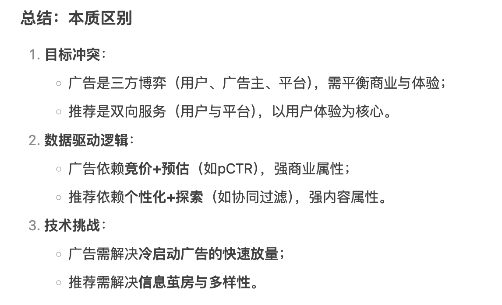
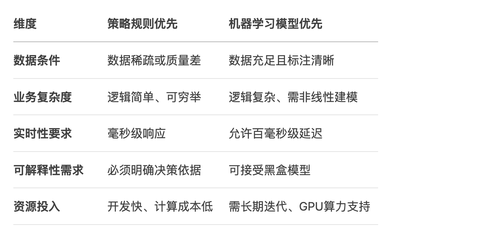

## 1. CVR相比CTR的区别、特点

**定义区别**

| 指标 | 定义                                      | 举例                                         |
| ---- | ----------------------------------------- | -------------------------------------------- |
| CTR  | 点击率（Click-Through Rate）= 点击 / 曝光 | 页面展示给用户 100 次，点击 10 次，CTR = 10% |
| CVR  | 转化率（Conversion Rate）= 转化 / 点击    | 10 次点击中，1 次下单，CVR = 10%             |

**核心区别**

| 维度     | CTR                            | CVR                                |
| -------- | ------------------------------ | ---------------------------------- |
| 关注阶段 | 曝光 ➝ 点击                    | 点击 ➝ 转化                        |
| 样本量   | 样本较丰富（每次曝光都可记录） | 样本稀疏（需点击且转化）           |
| 建模难度 | 相对容易                       | 更难，需建模深层行为意图           |
| 噪声     | 曝光未点可能受多种因素影响     | 转化数据更稀疏，噪声大、标签偏差大 |
| 决策影响 | 影响展示内容（广告/推荐位）    | 影响精准营销、转化漏斗优化         |

**CVR的核心特点**

**1. 数据稀疏性极强**

- **问题**：
  - CVR建模仅基于**点击后的用户行为**（如购买、注册），而点击行为本身仅占曝光量的1%~10%，转化行为更稀疏（可能仅占点击量的1%~5%）。
  - 例如：100万次曝光 → 1万次点击 → 100次转化，CVR训练样本量仅100条。
- **影响**：
  - 模型易过拟合，难以捕捉复杂特征模式。
  - 长尾商品或低频用户的预测准确性差。

**2. 样本选择偏差（Sample Selection Bias, SSB）**

- **问题**：
  - CVR模型仅使用点击样本（即用户已点击的曝光数据），而忽略未点击样本的潜在转化可能性。
  - 未点击的商品可能因曝光位置差或标题不吸引人未被点击，但若用户看到详情页后可能转化。
- **影响**：
  - 模型在**全量曝光空间**（Entire Space）的泛化能力差，预估偏差大。

**3. 延迟反馈（Delayed Feedback）**

- **问题**：
  - 用户点击后可能间隔较长时间才完成转化（如电商中用户比价数天后下单）。
  - 例如：点击数据中的“未转化”样本可能是“未转化”或“尚未转化”。
- **影响**：
  - 实时训练时，部分样本的标签不准确（假负样本），需设计延迟反馈处理机制。

**4. 特征依赖更复杂**

- **关键特征差异**：
  - **CTR**：侧重内容吸引力（标题、图片、曝光位置）、用户实时兴趣。
  - **CVR**：侧重用户购买意图（历史消费能力、价格敏感度）、商品详情质量（评价、详情页信息）、供应链因素（库存、物流）。
- **示例**：
  - 用户点击了一个高性价比商品（CTR高），但因详情页描述不清放弃购买（CVR低）。
  - 用户点击后因库存不足未转化，但CVR模型需感知库存状态。

**解决方案**

| 问题       | 常见解决方式                                               |
| ---------- | ---------------------------------------------------------- |
| 样本稀疏   | 使用 **ESMM**、**Entire space modeling** 方式建模全空间CVR |
| 曝光偏置   | 利用 **曝光建模+点击建模+转化建模** 分阶段联合训练         |
| 多任务学习 | 联合CTR、CVR（甚至GMV）进行多任务训练（如PLE）             |
| 延迟反馈   | 使用 **延迟建模** 或强化学习进行序列建模                   |

## 2. 搜索与推荐的区别，你认为哪个难度更大

**搜索与推荐的区别**

**1. 用户意图明确性**

- **搜索（Search）**：  
  - **主动意图**：用户通过输入查询（Query）明确表达需求（如“防水蓝牙耳机”）。  
  - **目标明确**：结果需精准匹配查询意图，侧重相关性、准确性和即时性。  
- **推荐（Recommendation）**：  
  - **被动意图**：用户无显式输入，系统需通过历史行为、上下文等隐式信号推测兴趣（如根据浏览记录推荐商品）。  
  - **目标泛化**：侧重多样性、新颖性和长期兴趣满足。

**2. 数据依赖与反馈机制**

- **搜索**：  
  - **强依赖查询**：需理解短文本（Query）的语义、实体、意图。  
  - **即时反馈**：用户通过点击、跳出率等快速验证结果质量。  
- **推荐**：  
  - **依赖用户画像**：需长期跟踪用户行为（点击、购买、停留时长等）。  
  - **延迟反馈**：用户兴趣变化缓慢，推荐效果需长期评估（如留存率、复购率）。

**3. 技术核心差异**

| **维度**       | **搜索**                     | **推荐**                     |
| -------------- | ---------------------------- | ---------------------------- |
| **核心任务**   | 查询理解 + 相关性排序        | 用户兴趣建模 + 个性化匹配    |
| **排序逻辑**   | 以Query-Item相关性为主导     | 以User-Item匹配度为主导      |
| **冷启动问题** | Item冷启动（新内容难被检索） | User冷启动（新用户兴趣未知） |
| **评估指标**   | 点击率（CTR）、转化率（CVR） | 多样性、惊喜度、用户留存率   |
| **典型模型**   | BM25、BERT、DPR              | FM、DeepFM、YouTube DNN      |

**搜索与推荐的难度对比**

**搜索的难点**

1. **查询理解（Query Understanding）**：  
   - 短文本歧义（如“苹果”指水果还是品牌）、多语言混合、拼写纠错。  
   - 需要NLP技术（实体识别、语义消歧、意图分类）。  
2. **长尾Query处理**：  
   - 用户搜索词分布遵循幂律定律，大量长尾查询缺乏足够训练数据。  
3. **实时性要求**：  
   - 需在毫秒级响应，对索引和召回效率要求极高。  
4. **结果可解释性**：  
   - 用户期望结果与查询直接相关，需避免“黑盒”排序引发信任问题。

**推荐的难点**

1. **用户兴趣动态性**：  
   - 兴趣随时间变化（如季节、热点事件），需实时更新模型。  
2. **探索与利用（Exploration & Exploitation）**：  
   - 平衡已知兴趣（点击率高）和新内容探索（避免信息茧房）。  
3. **多目标优化**：  
   - 同时优化CTR、CVR、多样性、公平性等多目标，可能相互冲突。  
4. **冷启动问题**：  
   - 新用户/新商品缺乏行为数据，推荐准确性低。  

**为什么推荐难度更大？**

尽管搜索和推荐各有挑战，**推荐系统的综合难度更高**，原因如下：

**1. 更复杂的目标冲突**

- 搜索的目标相对单一（相关性优先），而推荐需平衡：  
  - **用户满意**：CTR、CVR、留存率。  
  - **平台生态**：内容多样性、商家公平曝光。  
  - **长期价值**：用户生命周期价值（LTV）、品牌忠诚度。  
- 例如：过度推荐热门商品会挤压长尾内容，损害生态健康。

**2. 隐式反馈的不确定性**

- 搜索的反馈直接（用户主动输入查询），推荐依赖隐式信号（如点击、停留时长），噪声更大：  
  - 用户可能误点、冲动消费，或无意识忽略优质内容。  
  - 负样本不明确（未点击可能是未曝光，而非不喜欢）。

**3. 动态环境与实时性**

- 推荐系统需实时响应用户行为（如秒级更新兴趣模型），而搜索的Query-Item映射相对静态。  
- 例如：用户在电商App浏览手机后，推荐系统需立即调整策略，优先展示配件而非服装。

**4. 多模态与场景适配**

- 推荐需融合多模态数据（文本、图像、视频）、多场景（首页Feed、购物车页、支付完成页），而搜索更依赖文本匹配。  
- 例如：视频推荐需理解内容（画面、语音、字幕），并适配不同终端（手机、电视）。

**5. 伦理与隐私挑战**

- 推荐可能引发信息茧房、算法偏见（如性别歧视），需设计公平性约束和可解释机制。  
- 用户隐私保护（如GDPR）限制数据使用，增加模型训练难度。

**典型案例对比**

| **场景**       | **搜索的挑战**                             | **推荐的挑战**                                       |
| -------------- | ------------------------------------------ | ---------------------------------------------------- |
| **电商平台**   | 用户搜索“轻薄笔记本”，需区分游戏本与商务本 | 用户历史浏览多为手机，如何推荐跨品类商品（如耳机）？ |
| **短视频平台** | 搜索“健身教程”需识别优质内容               | 平衡用户偏好（搞笑视频）与平台健康内容推广           |
| **新闻App**    | 搜索“俄乌冲突”需实时索引最新报道           | 避免信息茧房，推荐多元观点                           |

**总结**

- **搜索**：强依赖于查询理解和高效检索，技术链路易模块化，目标相对单一。  
- **推荐**：需处理动态兴趣、多目标冲突、隐式反馈噪声，且与业务生态深度耦合，综合复杂度更高。  
- **难度判断**：推荐系统因场景复杂性、目标多元性和动态性要求，整体难度更大。但搜索在查询理解、实时性等单点技术上同样有极高挑战。  
- **选择建议**：  
  - 若擅长NLP、实时系统，搜索方向更合适；  
  - 若偏好用户行为分析、多目标优化，推荐方向更具吸引力。

## 3. 广告与推荐的区别

 

## 4. 什么时候用策略规则，什么时候用模型

 

- **策略规则**：简单透明、快速落地，适合冷启动、强实时、高解释性场景。
- **机器学习模型**：灵活强大、覆盖复杂模式，适合数据丰富、动态变化的长尾场景。
- **最佳实践**：多数业务需结合两者——规则解决“确定性”，模型解决“可能性”。

### 4.1 策略规则应用场景

**1. 数据不足或冷启动阶段**

- **场景特点**：
  - 新业务上线，缺乏用户行为数据。
  - 新产品/新用户无历史记录（冷启动）。
- **示例**：
  - 电商新用户首日推荐：根据商品热度（销量、评分）排序。
  - 新闻App冷启动：按频道分类推荐文章。

**2. 业务逻辑明确且简单**

- **场景特点**：
  - 规则可完全覆盖业务需求，无需复杂推理。
  - 因果关系清晰，无歧义。
- **示例**：
  - 风控系统：直接拦截高风险操作（如单日转账超限）。
  - 促销活动：满100减20的优惠券发放规则。

**3. 强实时性要求**

- **场景特点**：
  - 需毫秒级响应，模型推理延迟不可接受。
  - 数据更新频率极高（如秒级波动）。
- **示例**：
  - 股票交易系统：价格触发止损的自动化规则。
  - 广告竞价（RTB）：简单出价公式（bid = pCTR × budget）。

**4. 高可解释性需求**

- **场景特点**：
  - 需明确解释决策依据（如金融风控、医疗诊断）。
  - 法律法规要求透明性（如欧盟GDPR）。
- **示例**：
  - 贷款审批：拒绝理由需明确（如“信用分低于600”）。
  - 内容审核：根据关键词黑名单屏蔽违规内容。

### 4.2 **机器学习模型（Model-based）的适用场景**

**1. 复杂非线性关系建模**

- **场景特点**：
  - 输入特征与目标变量间存在复杂交互（如用户兴趣的多维度交叉）。
  - 规则难以穷举所有可能性。
- **示例**：
  - 推荐系统：用户隐式兴趣建模（如YouTube DNN）。
  - 图像分类：识别复杂视觉模式（如医学影像诊断）。

**2. 数据丰富且质量高**

- **场景特点**：
  - 海量历史数据（用户行为、交易记录等）。
  - 特征工程成熟，标签定义清晰。
- **示例**：
  - 搜索排序：基于用户点击日志训练BERT模型。
  - 用户流失预测：使用XGBoost融合多源行为数据。

**3. 动态环境自适应**

- **场景特点**：
  - 用户行为或环境频繁变化（如社交网络热点迁移）。
  - 需实时在线学习更新（如强化学习）。
- **示例**：
  - 动态定价：根据市场供需实时调整价格模型。
  - 游戏AI：通过强化学习适应玩家策略变化。

**4. 长尾场景覆盖**

- **场景特点**：
  - 长尾分布明显（如电商中99%的流量集中在1%的商品）。
  - 规则难以覆盖长尾多样性。
- **示例**：
  - 小众商品推荐：利用Embedding捕捉长尾相似性。
  - 客服机器人：处理非标用户query的语义理解。

## 5. 线上如何生成最终的排序得分

**整体流程概览（线上）**

1. **召回**：生成候选内容（通常上千或更多）
2. **粗排**（可选）：快速筛选出较优候选（减少样本量）
3. **精排**（主力）：
   - 利用多种特征，调用深度学习模型
   - 输出一个**排序得分（score）**
4. **融合/重排**（可选）：结合多种目标优化排序，如点击率、GMV等
5. **最终排序**：根据得分高低输出前N个推荐/广告内容

## 6. 正负样本介绍（规模和比例），如何构造负样本

**正负样本的定义**

| 类型   | 定义                                 | 举例                     |
| ------ | ------------------------------------ | ------------------------ |
| 正样本 | 用户**有交互行为**（如点击、购买）   | 用户点击了一个商品       |
| 负样本 | 用户**无交互行为**（未点击或未购买） | 用户刷过但没点击某个视频 |

**数据规模与比例**

| 场景              | 正:负 样本比例                     |
| ----------------- | ---------------------------------- |
| 推荐系统          | 1:4 到 1:10 常见                   |
| 广告系统（CTR）   | 1:20 到 1:100 更常见（因点击率低） |
| CVR（点击后转化） | 正样本更稀少，甚至 1:1000          |

> ⚠️ 负样本远多于正样本，因此必须做“**负采样（Negative Sampling）**”处理。

**如何构造负样本？**

方法 1：曝光但未点击（最常用）

- 从曝光日志中提取未被点击的内容
- 与正样本构成训练集

**优点**：真实、反映用户行为
**缺点**：可能存在“未点击≠不感兴趣”（曝光偏置）

方法 2：随机采样负样本（补充用）

- 随机从全量内容中选取用户未点击的内容

**适用**：冷启动阶段或无曝光日志场景（如初始训练）

方法 3：Hard Negative Mining（增强）

- 挑选模型认为“最像正样本”的负例进行训练
- 比如当前模型预测打分高但用户实际上没点击

**好处**：提升模型区分能力
**挑战**：采样过程复杂、可能过拟合

方法 4：使用时序/曝光顺序做对比学习负样本

- 对比学习中，可以把当前点击的 item 当作正样本，过去看但没点的当作负样本

## 7. 低活用户特征稀疏如何解决

**一、数据增强：利用辅助信息补全特征**

1. **显式画像补全**
   - **注册信息**：性别、年龄、地域、注册渠道等静态属性。
   - **社交关联**：通过社交网络关系（如关注列表、好友）推断兴趣。
   - **设备信息**：机型、操作系统、网络类型（WiFi/4G）辅助推测用户场景。
2. **隐式行为扩展**
   - **跨场景行为融合**：整合用户在站内不同模块的行为（如搜索、浏览、加购）。
   - **时间窗口扩展**：放宽时间窗口，聚合长期稀疏行为（如近180天而非7天）。
3. **外部数据引入**
   - **第三方数据**：联合登录信息（微信、微博）获取授权社交标签。
   - **行业通用画像**：使用公开数据集（如城市消费水平）补全地域相关特征。

**二、模型优化：改进算法适应稀疏数据**

1. **迁移学习（Transfer Learning）**
   - **跨用户迁移**：复用高活用户模型参数，微调低活用户数据。
   - **跨场景迁移**：利用其他场景（如搜索行为）预训练，迁移到推荐场景。
2. **元学习（Meta-Learning）**
   - **MAML（Model-Agnostic Meta-Learning）**：训练模型快速适应新用户（Few-Shot Learning）。
   - **应用场景**：新用户冷启动阶段快速建模。
3. **图神经网络（GNN）**
   - **构建用户-物品交互图**：通过邻居聚合传播兴趣（即使自身行为稀疏）。
   - **异构图建模**：连接用户-社交好友-物品，增强低活用户表示。

**三、策略设计：基于规则的冷启动机制**

1. **热度兜底策略**
   - 推荐热门内容（如近期销量Top 100商品），保证基础体验。
   - **动态热度**：按时间衰减加权（如指数衰减），避免长尾失效。
2. **探索与利用（E&E）平衡**
   - **Bandit算法**：LinUCB、Thompson Sampling动态探索低活用户兴趣。
   - **多臂老虎机**：在推荐中混入小众内容，收集反馈数据。
3. **标签传播策略**
   - **基于社交网络**：推荐好友喜欢的内容（如Facebook好友推荐）。
   - **基于地理位置**：推荐同城用户偏好内容（如美团本地服务）。

**四、系统优化：全链路增强**

1. **实时反馈闭环**
   - **短期兴趣捕捉**：实时记录低活用户的点击/跳过行为，秒级更新特征。
   - **动态特征库**：将实时行为写入Redis，供下次请求使用。
2. **跨场景数据融合**
   - **搜索行为利用**：将低活用户的搜索词作为强兴趣信号。
   - **跨平台数据整合**：同一集团下多个App行为数据联合建模（需用户授权）。
3. **产品端激励设计**
   - **任务系统**：引导低活用户完成指定行为（如完善资料奖励积分）。
   - **Push策略**：基于设备活跃时段发送个性化通知（如周末下午推送）。

**五、评估与迭代**

1. **离线评估**
   - **覆盖率（Coverage）**：低活用户被推荐物品的多样性。
   - **新颖性（Novelty）**：推荐结果中非热门内容占比。
2. **线上AB测试**
   - **核心指标**：低活用户的CTR、停留时长、转化率。
   - **分桶策略**：单独为低活用户开实验桶，避免高活用户干扰。
3. **Bad Case分析**
   - **人工审核**：抽样低活用户推荐结果，分析匹配合理性。
   - **归因分析**：定位特征缺失或模型偏差导致的问题。

> **解决方案优先级**
>
> 1. **短期见效**：热度兜底 + 实时特征。
> 2. **中期优化**：迁移学习 + Bandit探索。
> 3. **长期建设**：图神经网络 + 全链路数据融合。
>
> 通过组合策略，逐步将低活用户转化为中高活用户，形成数据积累与模型优化的正向循环。

