# 召回

## 双塔模型

### 1. 什么是双塔模型

**经典双塔模型**

最早的双塔模型DSSM(Deep Structured Semantic Model)主要用来解决NLP领域语义相似度任务。

DSSM 模型的原理主要是：通过用户搜索行为中query 和 doc 的日志数据，通过深度学习网络将query和doc映射到到**共同维度**的语义空间中，通过**最大化query和doc语义向量之间的余弦相似度**，从而训练得到隐含语义模型，即 query 侧特征的 embedding 和 doc 侧特征的 embedding，进而可以获取语句的低维语义向量表达 sentence embedding，可以预测两句话的语义相似度。模型结构如下所示：

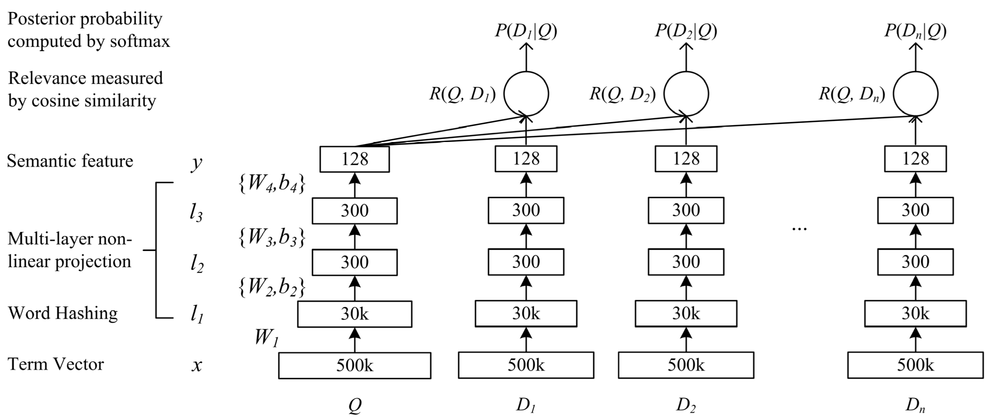

从上图可以看出，该网络结构比较简单，是一个由几层DNN组成网络，我们将要搜索文本(Query)和要匹配的文本(Document)的 embedding 输入到网络，网络输出为 128 维的向量，然后通过向量之间计算余弦相似度来计算向量之间距离，可以看作每一个 query 和 document 之间相似分数，然后在做 softmax。

**推荐系统中的双塔模型**

在推荐系统中，最为关键的问题是如何做好用户与item的匹配问题，因此对于推荐系统中DSSM模型的则是**为 user 和 item 分别构建独立的子网络塔式结构**，利用user和item的曝光或点击日期进行训练，**最终得到user侧的embedding和item侧的embedding**。

因此在推荐系统中，常见的模型结构如下所示：

从模型结构上来看，主要包括两个部分：user侧塔和item侧塔，对于每个塔分别是一个DNN结构。

通过两侧的特征输入，通过DNN模块到user和item的embedding，然后计算两者之间的相似度(常用內积或者余弦值，下面会说这两种方式的联系和区别)，因此**对于user和item两侧最终得到的embedding维度需要保持一致**，即最后一层全连接层隐藏单元个数相同。

在召回模型中，将这种检索行为视为多类分类问题，类似于YouTubeDNN模型。将物料库中所有的item视为一个类别，因此损失函数需要计算每个类的概率值：

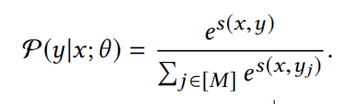

其中s(x,y)表示两个向量的相似度，P(y∣x;θ)表示预测类别的概率，M表示物料库所有的item。但是在实际场景中，由于物料库中的item数量巨大，在计算上式时会十分的耗时，因此会采样一定的数量的负样本来近似计算，后面针对负样本的采样做一些简单介绍。

以上就是推荐系统中经典的双塔模型，之所以在实际应用中非常常见，是因为**在海量的候选数据进行召回的场景下，速度很快，效果说不上极端好，但一般而言效果也够用了**。

之所以双塔模型在服务时速度很快，是因为模型结构简单(两侧没有特征交叉)，但这也带来了问题，双塔的结构无法考虑两侧特征之间的交互信息，**在一定程度上牺牲掉模型的部分精准性**。

例如在精排模型中，来自user侧和item侧的特征会在第一层NLP层就可以做细粒度的特征交互，而对于双塔模型，user侧和item侧的特征只会在最后的內积计算时发生，这就导致很多有用的信息在经过DNN结构时就已经被其他特征所模糊了，因此双塔结构由于其结构问题先天就会存在这样的问题。（下面针对这个问题来看看一下现有模型的解决思路。）

> 面试回答：
>
> 双塔模型（Two-Tower Model）是一种常用于推荐系统**召回阶段**的深度学习结构。它主要由两部分组成，一边是**用户塔**，另一边是**物品塔**，分别用于学习用户和物品的**低维向量表示**。
>
> 训练阶段，模型通过输入历史点击行为和候选物料，优化二者的向量相似度，比如通过点积计算或者计算余弦相似度匹配用户对物品的得分，并使用**正负样本对**进行训练，常见的损失包括**对比损失（如InfoNCE、Triplet）或Softmax损失**（一般是softmax得到点击概率？）。
>
> 推理时，用户向量是实时计算的，但是物品向量可以预先离线计算，把**低维表示**存储在索引库中，从而实现**向量检索召回（ANN）**，大幅提升在线服务效率。
>
> softmax损失函数如下：(每个用户要从所有候选物品中选择一个正样本物品)
> $$
> L = -\log \frac{e^{\text{sim}(u, v^+)} }{ e^{\text{sim}(u, v^+)} + \sum_{j=1}^K e^{\text{sim}(u, v_j^-)} }
> $$
> 这种训练目标可以理解为：让用户向量和真实点击的物品向量最接近。

### 2. 介绍双塔模型

- 双塔模型最大的特点就是**「user和item是独立的两个子网络」**，左侧是用户塔，右侧是item塔，这两个塔的参数不共享；
- 输入层：**「[User特征]」**主要包括和用户相关的特征：用户id、手机系统、地域、年龄、历史行为序列等，**「Item特征」**主要包括和Item相关的特征：ItemId、Item类别、Item来源等；
- 表示层：User特征和Item特征分别输入到特征提取网络（比如说DNN等）得到User Embedding和Item Embedding。之后我们可以计算这两个Embedding之间的余弦距离。**「用户点击过的Item其距离更近，用户没有点击过或者讨厌的Item其距离更远」**。之后利用算得的loss来更新模型的参数。
- 匹配层：拿用户向量去FAISS中和Item向量进行相似度计算，并返回距离最近的Top K个Item作为个性化的召回结果。（**FAISS（Facebook AI Similarity Search）** 是 **Facebook 开源的一款高效相似度搜索库**，主要用于**大规模向量检索**）

### 3. 双塔模型的输出，用“双塔embedding做内积+sigmoid”和“求余弦相似度+sigmoid”的区别

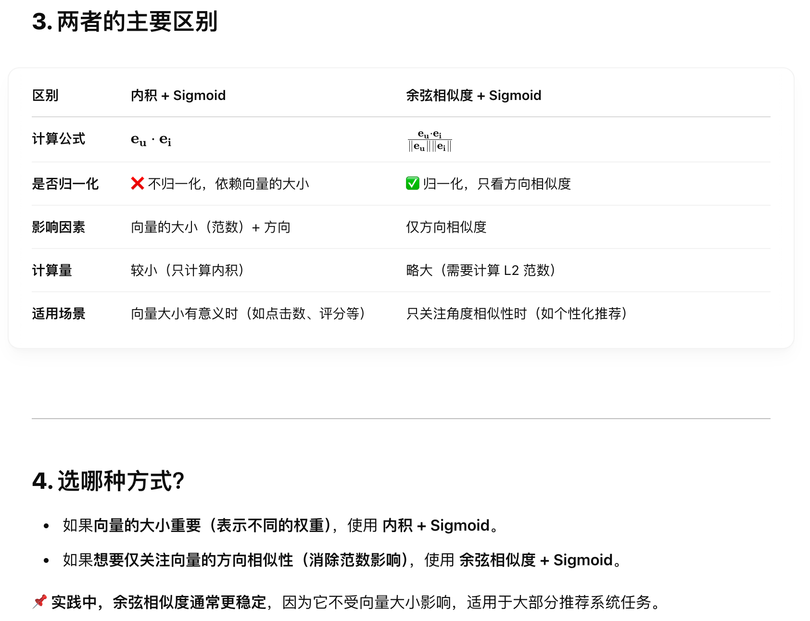

**什么叫“想要仅关注向量的方向相似性” ？**

- **用户兴趣建模**：假设一个用户喜欢“科幻电影”，那么无论电影评分是 7.5 还是 9.0，只要它们的内容类似，我们都可以推荐。
- **物品匹配任务**：假如一个人对“跑鞋”感兴趣，我们不关心某双鞋的流行度，而是只关心它是否和用户的兴趣方向一致。

**❌ 什么时候不适合？**

- **数值大小有实际意义时**：如果你想用用户对电影的评分来衡量兴趣，那么数值大小本身会影响结果（如 10 分比 5 分更重要），这时候内积可能更合理。

### 4. 双塔模型一般怎么做特征

- 每个塔各自构建user与item embedding，
- **[User特征]」**主要包括和用户相关的特征：用户id、手机系统、地域、年龄、历史行为序列等，上下文特征（Context feature）可以放入用户侧塔；
- **「Item特征」**主要包括和Item相关的特征：ItemId、Item类别、Item来源等；

### 5. 双塔模型为什么不直接把两个塔合起来输入一个DNN

- 性能：减少线上运算速度，item塔可以提前训练，线上只需要user的embedding和相似度计算；

# 排序

## Wide&Deep

### 1. 什么是Wide&Deep？

 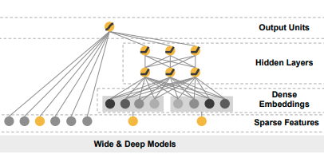

**左边是Wide部分**

直接输入用户特征（如sex、age等）和item特征（如cate、price等）到一个广义线性模型中去，来预测最终的CTR（学习低阶特征到交互关系，即下图中的W），如：

 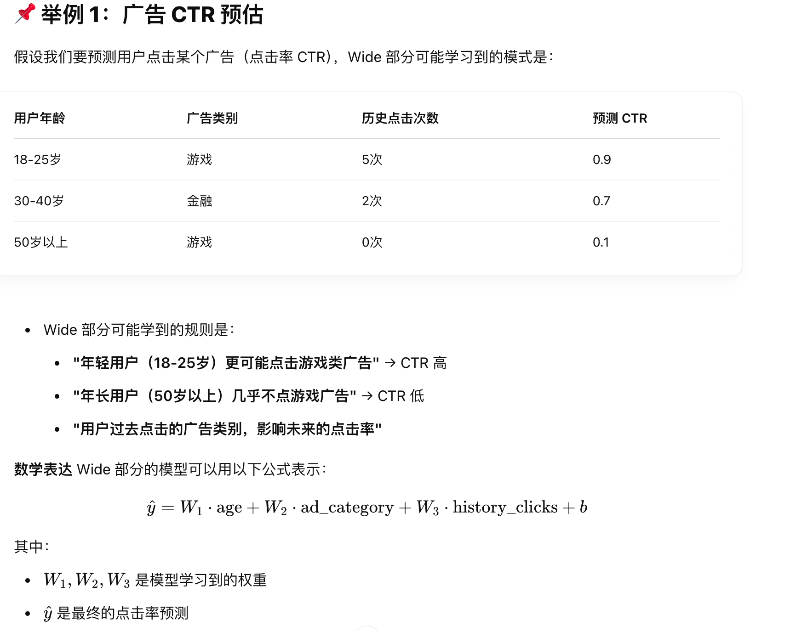

广义线性模型的输入由两部分组成，一部分是原始的部分特征，另一部分是原始特征的交叉特征(cross-product transformation)，对于交互特征可以定义为：

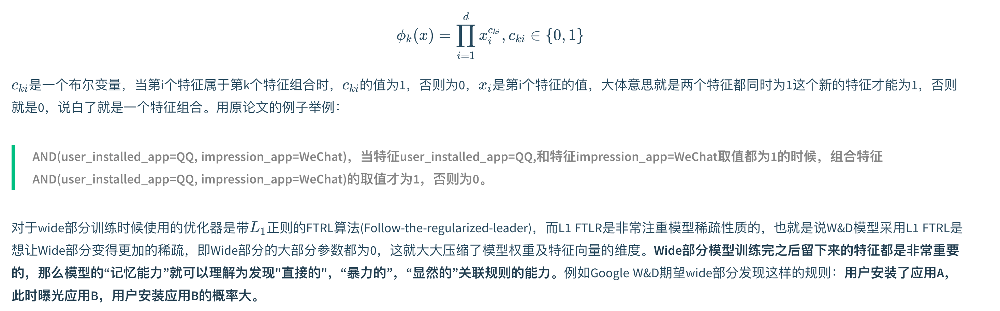

**右边是Deep部分**

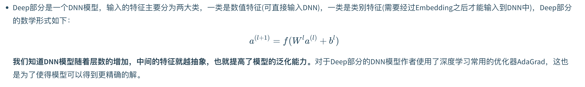

DNN模型输出的相当是一个经过融合、抽象化的特征，最终还需要经过一个线性层来预测最终的CTR；

**Wide部分与Deep部分的结合**

> 由于Wide是线性表达，Deep最后也要经过一个线性层，这样就可以把两部分的线性层融合，将Wide部分的【原始特征+交叉特征】和Deep部分输出的【融合/抽象特征】结合起来进行线性表达，就是下面的公式。

W&D模型是将两部分输出的结果结合起来联合训练，将deep和wide部分的输出重新使用一个逻辑回归模型做最终的预测，输出概率值。联合训练的数学形式如下：需要注意的是，因为Wide侧的数据是高维稀疏的，所以作者使用了FTRL算法优化，而Deep侧使用的是 Adagrad。

 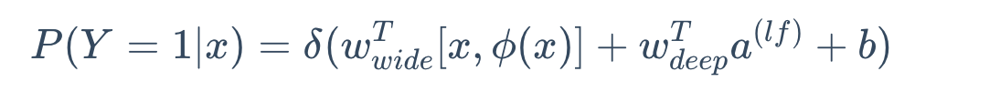

>  这样**最终得到**的是user对item预测的CTR，而**学习到的**是$w_{wide}$、$w_{deep}$和DNN中的线性层的权重。

### 2. **如何理解Wide部分有利于增强模型的“记忆能力”，Deep部分有利于增强模型的“泛化能力”？**

wide层结构简单，能够学习一些简单的规则（比如用户age=18～25和cate=漫画关联性很强），因此说是“记忆”。

而deep部分可以学习特征之间在高维空间中的联系，并不是严格遵守“规则”，因此说“泛化”能力强。

同上。

## DeepFM

### 1. 什么是DeepFM？

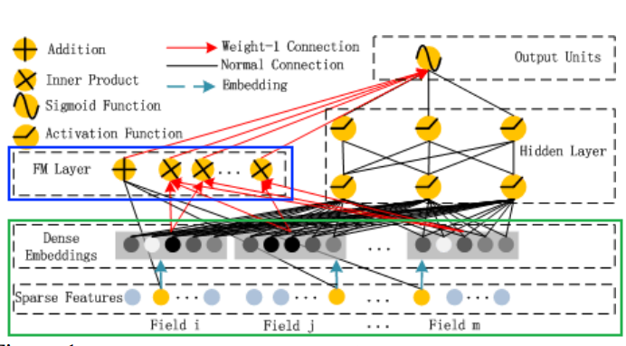

Field和Embedding处理是和前面Wide&Deep的方法是相同的，如上图中的绿色部分；DeepFM将Wide部分替换为了FM layer如上图中的蓝色部分。

这幅图其实有很多的点需要注意，很多人都一眼略过了，这里我个人认为在DeepFM模型中有三点需要注意：

- **Deep模型部分**

- **FM模型部分**

- **Sparse Feature中黄色和灰色节点代表什么意思**

  Sparse Feature中的每个Field代表一个特征的one-hot编码，其中黄色节点代表值为1，灰色节点代表值为0；

> 注意，Deep和FM的Embedding是公用的；

#### FM部分

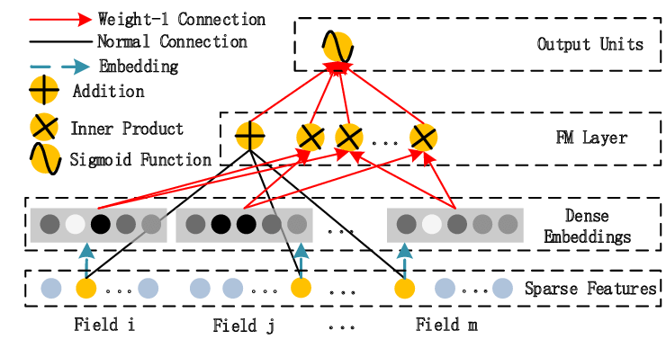

从图中大致可以看出FM Layer是由一阶特征和二阶特征Concatenate到一起在经过一个Sigmoid得到logits（结合FM的公式一起看），所以在实现的时候需要单独考虑linear部分和FM交叉特征部分。

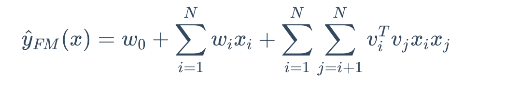

> 图片解析，直接看FM Layer这一行：
>
> - Addition表示对原始特征（Sparse Feature）的加权和，对应：$y=\sum_{i=1}^{N}w_ix_i$；
>
> - Inner Product表示FM部分，也就是将$v_ix_i$与$v_jx_j$做二阶交叉项乘积，对应：$y=\sum_{i=1}^{N}\sum_{j=i+1}^{N}v_{i}^Tv_jx_ix_j$；
>
>   FM就是将原本二阶交叉权重矩阵W（N*N），分解为$W(N\times k)\times W'(k\times N)$，其实就是将$x_i$和$x_j$映射为embedding，然后交叉相乘，与上面相对应。

#### Deep部分

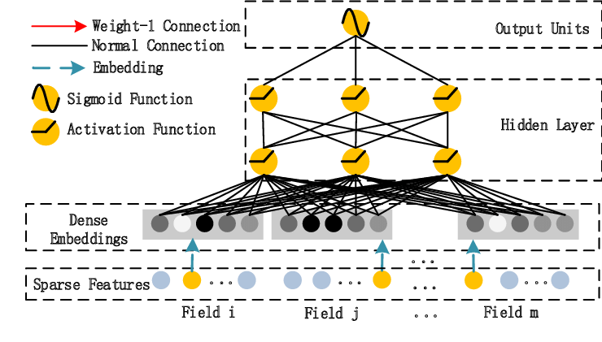

Deep Module是为了学习高阶的特征组合，在上图中使用用全连接的方式将Dense Embedding输入到Hidden Layer，这里面Dense Embeddings就是为了解决DNN中的参数爆炸问题，这也是推荐模型中常用的处理方法。

Embedding层的输出是将所有id类特征对应的embedding向量concat到到一起输入到DNN中。其中vi表示第i个field的embedding，m是field的数量。
$$
z_1=[v_1, v_2,...,v_m]
$$
上一层的输出作为下一层的输入，我们得到：
$$
z_L=\sigma (W_{L-1}z_{L-1}+b_{L-1})
$$
其中$\sigma$表示激活函数，$z,W,b$分别表示该层的输入、权重和偏置。

最后进入DNN部分输出使用sigmod激活函数进行激活：
$$
y_{DNN}=\sigma (W^La^L+b^L)
$$

### 2. DeepFM与wide&deep的介绍与对比

- Wide&Deep模型同时考虑了记忆能力和泛化能力，但Wide部分需要人工参与特征工程；DeepFM对Wide&Deep模型的改进之处在于**用FM替换了原来的Wide部分**，加强了浅层网络部分特征组合的能力。
- DeepFM的动机非常直观，既希望考虑高/低阶的feature interaction，**又想省去额外的特征工程**（省去了Wide中构造二阶交叉项的过程）。使用FM取代Wide的LR部分是一个可行的做法，当然这里LR可以基于先验构造更高阶的组合特征，而FM只考虑二阶，**DeepFM中的FM层和隐藏层共享输入**，这种共享输入使得DeepFM**可以同时从原始特征中学习低阶特征交互和高阶特征交互**，完全不需要执行特征工程。

### 3. 对DeepFM进行优化，有哪些思路

- 比较开放的题目，可以把一些其他模型的创新添加进去，比如DCN的更高阶交叉、DIN的序列融入DeepFM。

### 4. DeepFM如果过拟合和欠拟合分别如何处理

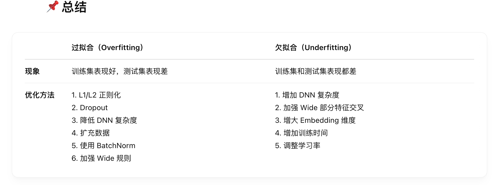

**核心思路：**

- 过拟合：减少复杂度、正则化、数据增强
- 欠拟合：增加复杂度、丰富特征、调整学习参数

**调参建议：**

- **先调整 Wide 部分**，确保基础特征交叉合理
- **再优化 Deep 部分**，根据效果调整 DNN 层数、Dropout 及正则化
- **结合 A/B 测试**，观察线上表现进行迭代

## DCN（Deep & Cross Network）

### 1. 什么是DCN？

Wide&Deep模型的提出不仅综合了“记忆能力”和“泛化能力”， 而且开启了不同网络结构融合的新思路。 所以后面就有各式各样的模型**改进Wide部分或者Deep部分**， 而Deep&Cross模型(DCN)就是其中比较典型的一个，该模型针对W&D的**wide部分**进行了改进。

因为Wide部分有一个不足就是需要**人工进行特征的组合筛选**， 过程繁琐且需要经验， 而2阶的FM模型在线性的时间复杂度中自动进行特征交互，但是这些特征交互的表现能力并不够，并且随着阶数的上升，模型复杂度会大幅度提高。于是乎，作者**用一个Cross Network替换掉了Wide部分**，来自动进行特征之间的交叉，并且网络的时间和空间复杂度都是线性的。（线性是核心所在，后面进行详细解释）

 通过与Deep部分相结合，构成了深度交叉网络（Deep & Cross Network），简称DCN。

#### 模型结构

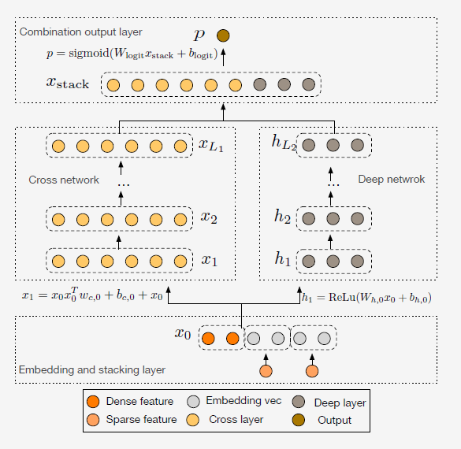

模型的结构比较简洁， 从下到上依次为：Embedding和Stacking层， Cross网络层与Deep网络层并列， 以及最后的输出层。下面一一进行剖析。

#### Embedding和Stacking层

Embedding层我们已经非常的熟悉了吧， 这里的作用依然是把稀疏离散的类别型特征变成低维密集型。
$$
X_{embed,i}=W_{embed,i}x_i
$$
公式实现的就是将某一类稀疏分类特征（如id）映射为embedding向量的过程。以稀疏分类特征id为例：

- $X_{embed,i}$是第i个分类值（id序号）的embedding向量；
- $W_{embed,i}$矩阵， $n_e\times n_v$维度， $n_e$是embedding维度， $n_v$是该类特征的唯一取值个数。
- $x_i$属于该特征的二元稀疏向量(one-hot)编码的。 

【实质上就是在训练得到的Embedding参数矩阵中找到属于当前样本对应的Embedding向量】。其实绝大多数基于深度学习的推荐模型都需要Embedding操作，参数学习是通过神经网络进行训练。

最后，该层需要将所有的密集型特征与通过embedding转换后的特征进行联合（Stacking）：
$$
x_0=[X_{embed,1}^T,...,X_{embed,k}^T,X_{dense}^T]
$$
一共k个类别特征，映射成了k个embed， dense是数值型特征（一个维度就是一个特征）， 这一步两者在特征维度拼在一块。  

#### Cross Network🌟

这个就是本模型最大的亮点了【Cross网络】， 这个思路感觉非常Nice。设计该网络的目的是增加特征之间的交互力度。交叉网络由多个交叉层组成， 假设第$l$层的输出向量$x_l$， 那么对于第$l+1$层的输出向量$x_{l+1}$表示为：
$$
x_{l+1}=x_0x_l^Tw_l+b_l+x_l=f(x_l,w_l,b_l)+x_l
$$
可以看到， 交叉层的二阶部分非常类似PNN提到的外积操作， 在此基础上增加了外积操作的权重向量$w_l$， 以及原输入向量$x_l$和偏置向量$b_l$。 交叉层的可视化如下：

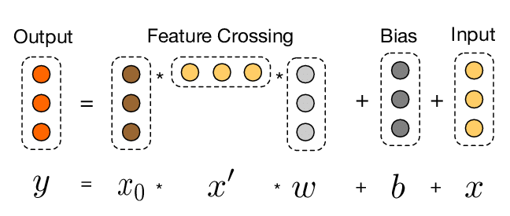

可以看到， 每一层增加了一个$n$维的权重向量$w_l$（n表示输入向量维度）， 并且在每一层均保留了输入向量（Input）， 因此输入和输出之间的变化不会特别明显（有点Res-Connection的感觉）。

关于这一层， 原论文里面有个具体的证明推导Cross Network为啥有效， 不过比较复杂，这里我拿一个式子简单的解释下上面这个公式的伟大之处：

> **我们根据上面这个公式， 尝试的写前面几层看看:**
>
> $l=0:x_1=x_0x_0^Tw_0+b_0+x_0$
>
> $l=1:x_2=x_0x_1^Tw_1+b_1+x_1=x_0[x_0x_0^Tw_0+b_0+x_0]^Tw_1+b_1+x_1$
>
> $l=2:x_3=x_0x_2^Tw_2+b_2+x_2=x_0[x_0[x_0x_0^Tw_0+b_0+x_0]^Tw_1+b_1+x_1]^Tw_2+b_2+x_2$

我们暂且写到第3层的计算， 我们会发现什么结论呢？ 总结一下：

1. x1中包含了所有的**x0的1,2阶特征的交互**（一阶为input$x_0$，二阶为$x_0x_0^T$）， x2包含了所有的x1,x0的1、2、3阶特征的交互（根据x1类推），x3中包含了所有的x2,x1与x0的交互，x0的1、2、3、4阶特征交互。

    因此， 交叉网络层的叉乘阶数是有限的。 **第l层特征对应的最高的叉乘阶数l+1**

2. ~~Cross网络的参数是共享的， 每一层的这个权重特征之间共享， 这个可以使得模型泛化到看不见的特征交互作用， 并且对噪声更具有鲁棒性。 例如两个稀疏的特征$x_i,x_j$， 它们在数据中几乎不发生交互， 那么学习$x_i,x_j$的权重对于预测没有任何的意义。~~

   > DCN的网络参数并不是共享的，每一层都有独立的参数（w和b）。

3. 计算交叉网络的参数数量。 假设交叉层的数量是$L_c$， 特征$x$的维度是$n$， 那么总共的参数是：$n\times L_c\times 2$

   这个就是每一层会有$w$和$b$。且$w$维度和$x$的维度是一致的。

4. 交叉网络的时间和空间复杂度是线性的。这是因为， 每一层都只有$w$和$b$， **没有激活函数的存在**，相对于深度学习网络， 交叉网络的复杂性可以忽略不计。

   > **为什么DCN可以没有激活函数？**
   >
   >   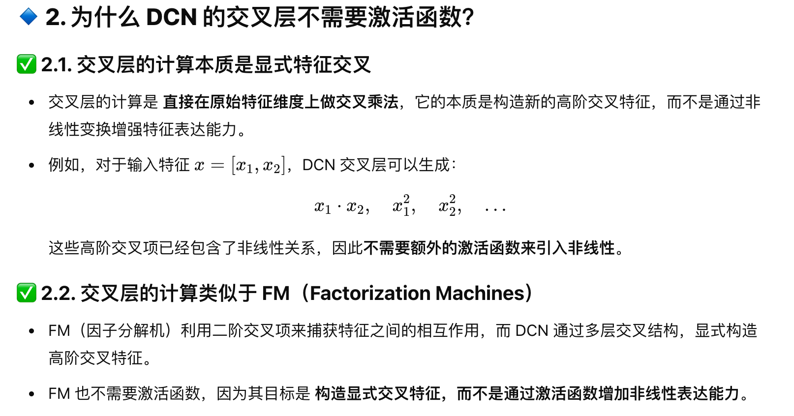

5. **Cross网络是FM的泛化形式：**

   在FM模型中， 特征$x_i$的权重$v_i$， 那么交叉项$x_i,x_j$的权重为$<xi,xj>$；

   在DCN中，$x_i$的权重为$W_{K_{k=1}}^{(i)^l}$, 交叉项$x_i,x_j$的权重是参数$W_{K_{k=1}}^{(i)^l}$和$W_{K_{k=1}}^{(j)^l}$的乘积，这个看上面那个例子展开感受下；

   因此两个模型都各自学习了独立于其他特征的一些参数，并且交叉项的权重是相应参数的某种组合。**FM只局限于2阶的特征交叉(一般)，而DCN可以构建更高阶的特征交互**， 阶数由网络深度决定，并且交叉网络的参数只依据输入的维度线性增长。

6. 还有一点我们也要了解，对于每一层的计算中， 都会跟着$x_0$, 这个是咱们的原始输入， 之所以会乘以一个这个，是为了保证后面不管怎么交叉，都不能偏离我们的原始输入太远，别最后交叉交叉都跑偏了。
7. $x_{l+1}=f(x_l,w_l,b_l)+x_l $ , 这个东西其实有点跳远连接的意思，也就是和ResNet也有点相似，无形之中还能有效的缓解梯度消失现象。

#### Deep Network

这个就和上面的D&W的全连接层原理一样。这里不再过多的赘述。
$$
h_{l+1}=f(W_lh_l+b_l)
$$
具体的可以参考W&D模型。

#### 组合输出层

这个层负责将两个网络的输出进行拼接， 并且通过简单的Logistics回归完成最后的预测：
$$
p=\sigma([x_{L_1}^T,h_{L_2}^T]w_{logits})
$$
其中$x_{L_1}^T$和$h_{L_2}^T$分别表示交叉网络(Cross Network)和深度网络(Deep Network)的输出。 

最后二分类的损失函数依然是交叉熵损失：
$$
loss=-\frac{1}{N}\sum_{i=1}^Ny_ilog(p_i)+(1-y_i)log(1-p_i)+\lambda\sum_l||w_i||^2
$$
Cross&Deep模型的原理就是这些了，其核心部分就是Cross Network， 这个可以进行特征的自动交叉， 避免了更多基于业务理解的人工特征组合。 

该模型相比于W&D，Cross部分表达能力更强， 使得模型具备了更强的非线性学习能力。

### 2. DCN对比DNN和FM的优势，为什么说随着阶数提升，网络的时间和空间复杂度都是线性的？

先说FM，它只能计算二阶交叉项。

而DNN，每加一个隐藏层，都会增加input_dim x output_dim(w) + output_dim(b)个参数（如果输入输出都是d维，则每层增加参数为d*d+d个）。

再来看DCN，其核心计算方式为$x_{l+1}=x_0x_l^Tw_l+b_l+x_l$，其中$w_l$和$b_l$的维度均与输入$x_l$一致（1xinput_dim），如果$x_l$是1xd维，则DCN每层增加参数为d + d个（随维度提升，DCN需要的参数量大大减少）。

#### 2.1 DCN对比DNN的优势

- **时空复杂度更低**

时间复杂度：因为DCN是向量-向量相乘，因此时间复杂度为O(dL)，而DNN是向量-矩阵相乘，因此时间复杂度为O(d^2L)；

空间复杂度：由于DCN每层需要的参数都是向量，而DNN每层的W是一个矩阵，因此DCN的空间复杂度也大大减少；

 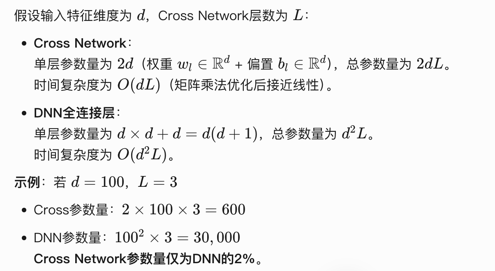

- **相比DNN的核心优势**

**（1）显式高阶特征交叉**

- **DNN的缺陷**：
  通过全连接层隐式组合特征，无法显式控制交互阶数，且需要深层网络逼近高阶交互。
  （例如，3层DNN可能仅学习到4阶交互，但无法保证或解释）
- **Cross Network的优势**：
  ​**第 l 层输出包含最高 l+1 阶交互**，显式且可控。
  （例如，3层Cross Network直接生成4阶特征交互）

**（2）计算效率高**

- **时间效率**：
  Cross Network的矩阵乘法可优化为向量内积 $(x_0 \cdot x_l^Tw_l \rightarrow x_0 \cdot (x_l^Tw_l))$，时间复杂度从 $O(d^2)$ 降为 $O(d)$。
- **空间效率**：
  参数量的线性增长避免DNN的显存爆炸问题，适合部署在资源受限场景（如移动端推荐系统）。

**（3）残差连接与梯度稳定**

- **残差设计**：
  每层输出为 $x_{l+1}=f(x_0,x_l)+x_l$​，保留原始特征和低阶交互信息，缓解梯度消失。
- **DNN的梯度问题**：
  深层DNN需依赖BatchNorm或残差连接解决梯度不稳定，而Cross Network天然支持稳定训练。

**（4）可解释性**

- **权重可视化**：
  Cross Network的权重 $w_l$ 可解释为不同阶交互的重要性（例如，*w*2​ 反映三阶交叉的贡献）。
- **DNN的黑盒性**：
  DNN的隐层神经元难以关联到具体特征组合。

## DIN（Deep Interest Network）

### 1. 什么是DIN？

#### 动机

该模型的应用场景是阿里巴巴的电商广告推荐业务， 这样的场景下一般**会有大量的用户历史行为信息**。

这个其实是很关键的，因为DIN模型的创新点或者解决的问题就是**使用了注意力机制来对用户的兴趣动态模拟**， 而这个模拟过程存在的**前提**就是用户之前有大量的历史行为了，这样我们在预测某个商品广告用户是否点击的时候，就可以参考他之前购买过或者查看过的商品，这样就能猜测出用户的大致兴趣来，这样我们的推荐才能做的更加到位，所以这个模型的使用场景是**非常注重用户的历史行为特征（历史购买过的商品或者类别信息）**，也希望通过这一点，能够和前面的一些深度学习模型对比一下。

**DIN与W&D这类模型的改进之处**

在个性化的电商广告推荐业务场景中，用户留下了大量的**历史交互行为**，才更加突出的深度学习模型(作者统称Embeding&MLP模型)的不足之处，Embeding&MLP模型对于这种推荐任务一般有着差不多的固定处理套路：就是大量稀疏特征先经过embedding层， 转成低维稠密的，然后进行拼接，最后喂入到多层神经网络中去。

这些模型在这种个性化广告点击预测任务中存在的**问题**就是**无法表达用户广泛的兴趣**，因为这些模型在得到各个特征的embedding之后，就蛮力拼接了，然后就各种交叉等。这时候根本没有考虑之前用户历史行为商品具体是什么，究竟用户历史行为中的哪个会对当前的点击预测带来积极的作用。 

而实际上，对于用户点不点击当前的商品广告，很大程度上是依赖于他的历史行为的，王喆老师举了个例子

> 假设广告中的商品是键盘， 如果用户历史点击的商品中有化妆品， 包包，衣服， 洗面奶等商品， 那么大概率上该用户可能是对键盘不感兴趣的， 而如果用户历史行为中的商品有鼠标， 电脑，iPad，手机等， 那么大概率该用户对键盘是感兴趣的， 而如果用户历史商品中有鼠标， 化妆品， T-shirt和洗面奶， 鼠标这个商品embedding对预测“键盘”广告的点击率的重要程度应该大于后面的那三个。

由上述描述可以看出，**传统深度学习模型出现的问题**：无法表达出用户这广泛多样的兴趣，解决方案为：增大隐向量维度，但是这样计算量会非常大。而且**并不是用户所有的历史行为特征都会对某个商品广告点击预测起到作用**。所以对于当前某个商品广告的点击预测任务，没必要考虑之前所有的用户历史行为。

**DIN的动机**

业务角度：自适应的去捕捉用户的兴趣变化；

模型角度：**考虑到用户的历史行为商品与当前商品广告的一个关联性**，如果用户历史商品中很多与当前商品关联，说明该商品可能符合用户的品味，应该推荐。

DIN的核心思想：上面提到的“关联性”很容易想到“注意力”思想，作者设计了一个"local activation unit"结构，**利用候选商品和历史问题商品之间的相关性计算出权重**，这个权重就代表了对于当前商品广告的预测，用户历史行为的各个商品的重要程度大小。

#### DIN模型的数据集和特征表示

工业上的CTR预测数据集一般都是`multi-group categorial form`的形式，就是类别型特征最为常见，这种数据集一般长这样：

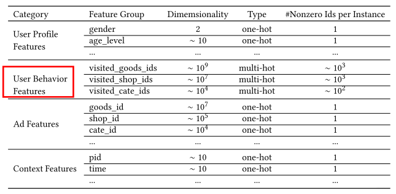

> 最左一列的每一行代表一个group，表示一类特征，比如：
>
> User Profile Features表示用户画像特征，涵盖了用户的很多小特征；（其他group类似）

对于特征编码，DIN与之前模型不同的是：将用户之前浏览过的物品id，使用multi-hot的形式也作为特征（用户行为特征）。

作者这里举了个例子：`[weekday=Friday, gender=Female, visited_cate_ids={Bag,Book}, ad_cate_id=Book]`，一般的离散特征如weekday和gender这些都使用one-hot编码，转为二值特征的形式。但是`visted_cate_ids`， 也就是用户的历史商品列表一般有多个商品，而且**特征长度不一样**因为用户购买的历史商品个数不一样多，所以**一般用multi-hot编码**，也就是可能不止1个1了，有哪个商品，对应位置就是1。经过编码后的数据长下面这个样子：

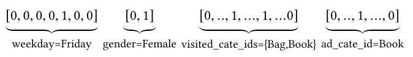

这个就是喂入模型的数据格式了，这里还要注意一点 就是上面的特征里面没有任何的交互组合，也就是没有做特征交叉。这个交互信息交给后面的神经网络去学习。

#### 基线模型（Baseline）

这里的 base 模型，就是上面提到过的Embedding&MLP的形式， DIN网络的基准也是他，只不过在这个的基础上添加了一个新结构(注意力网络)来学习当前候选广告与用户历史行为特征的相关性，从而动态捕捉用户的兴趣。

基准模型 分为三大模块：Embedding layer，Pooling & Concat layer和MLP， 结构如下：

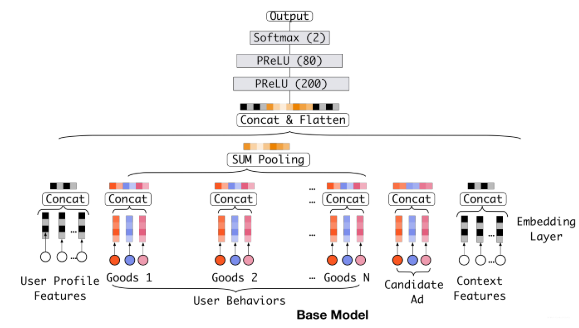

前面的大部分深度模型结构也是遵循着这个范式套路，下面介绍一下各个模块：

1. **Embedding layer：**作用是把高维稀疏的输入（one-hot）转成低维稠密向量（embedding），每个离散特征下面都会对应着一个embedding词典，embedding词典的维度是D×K， 这里的D表示的是隐向量的维度， 而K表示的是当前离散特征的唯一取值个数（one-hot的维度大小）。

2. **pooling layer and Concat layer：**pooling层的作用是将用户的历史行为embedding这个最终变成一个定长的向量，因为每个用户历史购买的商品数是不一样的，经过embedding层，得到的用户历史行为embedding的个数不一样多（表现在上图中就是不同user对应的Goods N中的N不同），那么不同用户的历史行为特征拼起来的长度就会不同。而后面的全连接网络要求需要有定长的特征输入。

   因此需要有一个pooling layer把用户历史行为embedding变成固定长度（统一长度）（而非简单的拼接）：
   $$
   e_i=sum-pooling(e_{i1},e_{i2},...,e_{ik})
   $$

   $$
   e_{sum-pooling}=\sum_{i=1}^ne_i
   $$

   这里的$e_{ij}$是用户历史行为的那些embedding。$e_i$就变成了定长的向量， 这里的i表示第i个历史特征组(即不同特征，是历史行为，比如历史的商品id，历史的商品类别id等)， 这里的k表示对应历史特种组里面用户购买过的商品数量，也就是历史embedding的数量，看上面图里面的user behaviors系列，就是那个过程了。

   > 就是不同类型的“用户历史行为”下有不同序列，在每个类别下对序列中的数据进行池化。

   Concat layer层的作用就是拼接了，就是把这所有的特征embedding向量，如果再有连续特征的话也算上，从特征维度拼接整合，作为MLP的输入。

3. **MLP**：这个就是普通的全连接，用了学习特征之间的各种交互。

4. **Loss**: 由于这里是点击率预测任务， 二分类的问题，所以这里的损失函数用的负的log对数似然：
   $$
   L=-\frac{1}{N}\sum_{(x,y) \in S}(ylog{p(x)}+(1-y)log{(1-p(x))})
   $$

5. 

**Baseline的问题：**

通过上面的图也能看出来， 用户的历史行为特征和当前的候选广告特征，在全都拼起来给神经网络之前，一点交互的过程都没有； 而拼起来之后给神经网络，虽然是有了交互了，但是原来的一些信息，比如，每个历史商品的信息会**丢失了一部分**；

这个通过我们前面的分析，对于预测当前广告点击率，并不是所有历史商品都有用，**综合所有的商品信息反而会增加一些噪声性的信息**。

> 可以联想上面举得那个键盘鼠标的例子，如果加上了各种洗面奶，衣服啥的反而会起到反作用。
>
> 其次就是这样综合起来，已经没法再看出到底用户历史行为中的哪个商品与当前商品比较相关，也就是丢失了历史行为中各个商品对当前预测的重要性程度。
>
> 最后一点就是如果所有用户浏览过的历史行为商品，最后都通过embedding和pooling转换成了固定长度的embedding，这样会限制模型学习用户的多样化兴趣。

**DIN的解决思路：**

**在当前候选广告和用户的历史行为之间引入注意力的机制**，这样在预测当前广告是否点击的时候，让模型更关注于与当前广告相关的那些用户历史产品，也就是说**与当前商品更加相关的历史行为更能促进用户的点击行为**。 

以下面例子做说明：

> 当一个年轻母亲访问电子商务网站时，她发现展示的新手袋很可爱，就点击它。
>
> 展示的广告通过软搜索这位年轻母亲的历史行为，发现她最近曾浏览过类似的商品，如大手提袋和皮包，而这两项与“新手提袋”的注意力评分都比较高，从而推荐“新手提袋”击中了她的相关兴趣。

DIN通过给定一个候选广告，然后去注意与该广告相关的局部兴趣的表示来模拟此过程。

DIN不会通过使用同一向量来表达所有用户的不同兴趣，而是通过考虑历史行为的相关性来自适应地计算用户兴趣的表示向量（对于给的广告）。 

#### DIN模型架构

上面分析完了base模型的不足和改进思路之后，DIN模型的结构就呼之欲出了。

首先，它依然是采用了Base模型的结构，只不过是在这个的基础上加了一个注意力机制来学习用户兴趣与当前候选广告间的关联程度， 用论文里面的话是，引入了一个新的`local activation unit`， 这个东西用在了用户历史行为特征上面， **能够根据用户历史行为特征和当前广告的相关性给用户历史行为特征embedding进行加权**。

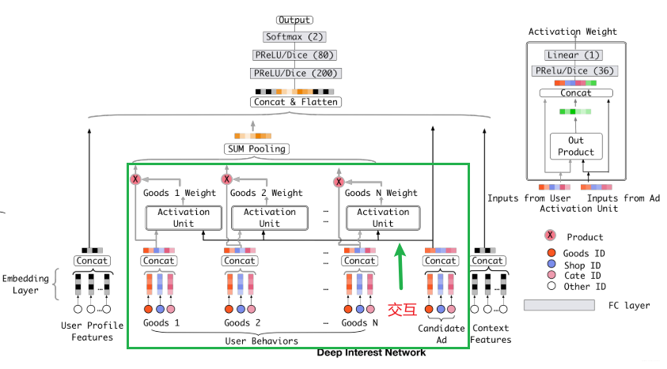

改进的地方已经框出来了，这里会发现相比于base model， 这里加了一个local activation unit， 这里面是一个前馈神经网络，**输入是用户历史行为商品和当前的候选商品， 输出是它俩之间的相关性**。

这个相关性相当于每个历史商品的权重，把这个权重与原来的历史行为embedding相乘求和就得到了用户的兴趣表示$v_U(A)$ 这个东西的计算公式如下：
$$
v_U(A)=f(v_A,e_1,e_2,...,e_H)=\sum_{j=1}^{H}a(e_j,v_A)e_j=\sum_{j=1}^{H}w_je_j
$$
这里的 $\{v_A,e_1,e_2,...,e_H\}$ 是用户 U 的历史行为特征embedding，$v_A$  表示的是候选广告 A 的embedding向量，$a(e_j,v_A)=w_j$表示的权重或者历史行为商品与当前广告 A 的相关性程度。$a(\cdot)$ 表示的上面那个前馈神经网络，也就是那个所谓的注意力机制。 当然，看图里的话，输入除了历史行为向量和候选广告向量外，还加了一个它俩的外积操作，作者说这里是有利于模型相关性建模的显性知识。

> 这里有一点需要特别注意，就是这里的权重加和不是1， 准确的说这里不是权重， 而是直接算的相关性的那种分数作为了权重，也就是平时的那种scores(softmax之前的那个值)，这个是为了保留用户的兴趣强度。

### 2. 介绍DIN模型，适合的场景

- 如何刻画用户兴趣的广泛性，是推荐系统比较大的一个难点，**用户历史行为序列建模**的研究经历了从Pooling、RNN到attention、capsule再到transformer的顺序
- 在DIN之前，业界处理序列特征，**普遍是在embedding之后进行pooling，这种做法将序列特征的每个item看作是相等的权重**，举个例子：用户历史购买过9件衣服和1个鼠标，本次候选商品是键盘，但是因为用户历史行为被衣服充斥着，历史行为pooling后的embedding非常偏向衣服这个子空间，而历史购买键盘后再买鼠标显然应该赋予更大的权重。通过pooling的做法就会导致历史行为的兴趣被平滑了，学成一个四不像的没法体现用户广泛兴趣的向量。
- DIN模型提出的动机是利用target attention的方法，**进行加权pooling**，它为历史行为的物品和当前推荐物品计算一个attention score，然后加权pooling，这样的方法更能体现用户兴趣多样性。
- DIN模型，增加了注意力机制，模型的创新点或者解决的问题就是使用了注意力机制来对用户的兴趣动态模拟， 而这个模拟过程存在的**前提**就是用户之前有大量的历史行为了，这样我们在预测某个商品广告用户是否点击的时候，就可以参考他之前购买过或者查看过的商品，这样就能猜测出用户的大致兴趣来，这样我们的推荐才能做的更加到位，所以这个模型的使用场景是**非常注重用户的历史行为特征（历史购买过的商品或者类别信息）**

### 3. transformer与DIN的区别和联系

**Transformer 与 DIN 的联系**

| **相似点**                  | **Transformer**                                     | **DIN**                                                  |
| --------------------------- | --------------------------------------------------- | -------------------------------------------------------- |
| **注意力机制（Attention）** | 使用 **Self-Attention** 计算所有 Token 之间的相关性 | 使用 **Target Attention** 计算用户行为和目标物品的相关性 |
| **处理序列数据**            | 适用于 NLP，能捕捉文本中的长依赖关系                | 适用于推荐系统，能建模用户兴趣演化                       |
| **深度神经网络（DNN）**     | 结合 DNN 提取更高维特征                             | 结合 DNN 进行 CTR 预估                                   |

 **Transformer 与 DIN 的区别**

| **区别点**             | **Transformer**                               | **DIN**                                                    |
| ---------------------- | --------------------------------------------- | ---------------------------------------------------------- |
| **目标**               | 处理 NLP 任务，如文本理解、翻译               | 处理推荐系统任务，主要用于 CTR 预估                        |
| **Attention 计算方式** | **Self-Attention**：所有 Token 之间计算注意力 | **Target Attention**：只计算与目标物品相关的注意力         |
| **是否考虑目标物品**🌟  | 不依赖目标物品，所有词之间都互相关联          | 目标物品驱动 Attention，计算用户历史行为与目标商品的相关性 |
| **序列长度影响**       | **适合长文本**，因为能捕捉远距离依赖          | **适合短序列推荐**，能快速建模用户兴趣                     |

## 1. 为什么CTR中目前普遍使用深度学习模型替换树模型

- 强大的表达能力，能够挖掘更深层次数据模式；
- 支持更丰富的特征形式；
- 模型结构非常灵活，能够根据实际应用场景进行调整;

## 2. 介绍除了FM之外的特征交叉的模型

- FNN：有高阶bit-wise特征交叉，每个特征都使用了与训练的FM模型，训练开销更低。
- DeepFM：是一种可以从原始特征中抽取到各种复杂度特征的端到端模型，没有人工[特征工程](https://www.zhihu.com/search?q=特征工程&search_source=Entity&hybrid_search_source=Entity&hybrid_search_extra={)的困扰，DeepFM模型包含FM和DNN两部分，FM模型可以抽取low-order特征，DNN可以抽取high-order特征。无需类似Wide&Deep模型人工特征工程。
- DCN：可以任意组合特征，而且不增加网络参数.Cross的目的是以一种显示、可控且高效的方式，自动构造有限高阶交叉特征。

## 3. 学习排序Learning to Rank（LTR）

L2R算法主要包括三种类别：单文档方法（PointWise Approach），文档对方法（PairWise Approach)和文档列表方法（ListWise Approach)。

以下面图片为例，真实相关性分数一般为人工标注，或用户对item的满意度做出的真实评分：

 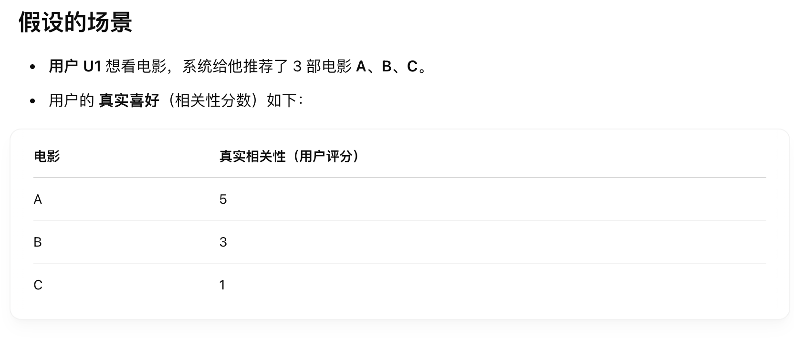

或者根据用户行为为数据评分，如：复购-5，购买-4，收藏-3，点击-1。

### 3.1 PointWise

PointWise只关注真实分数与预测分数之间的差异，并不关照推荐物料的顺序关系。

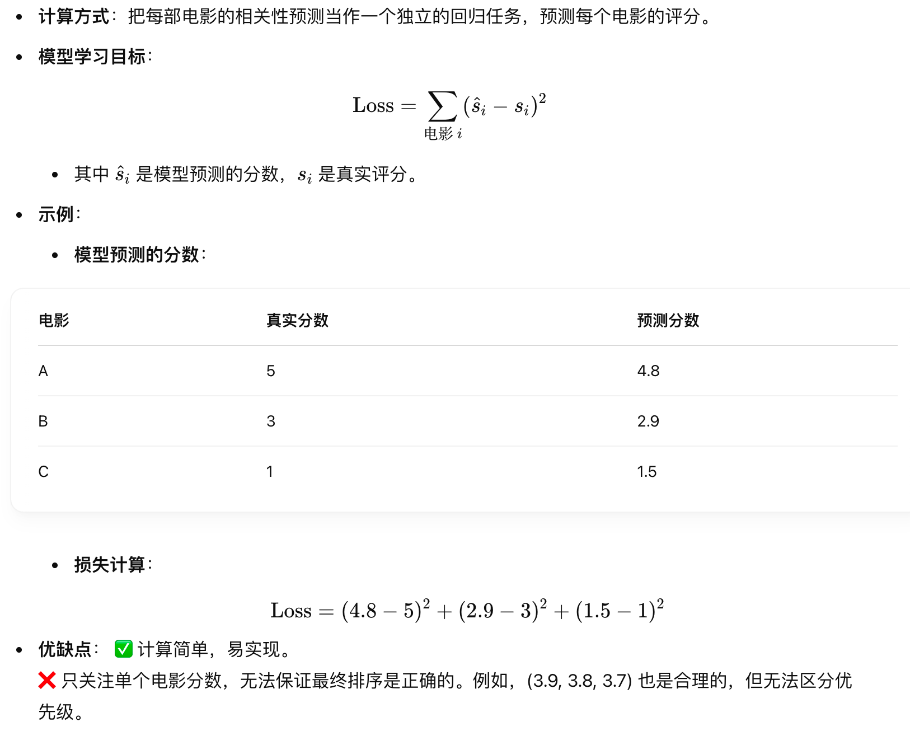

### 3.2 PairWise

Pairwise关注推荐物料的相对排序关系，它衡量的是两两之间的差值，比如：

如果实际$s_A > s_B$，则优化目标为 1️⃣ 模型预测的$\hat{s}_A$也应该大于$\hat{s}_B$；2️⃣ 希望$\hat{s}_A-\hat{s}_B$越大越好，也就是希望“在确定相对关系的情况下，排序越显著越好”；

 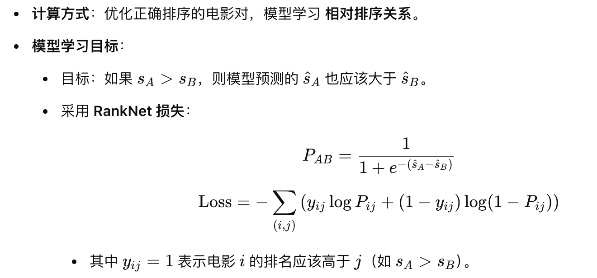

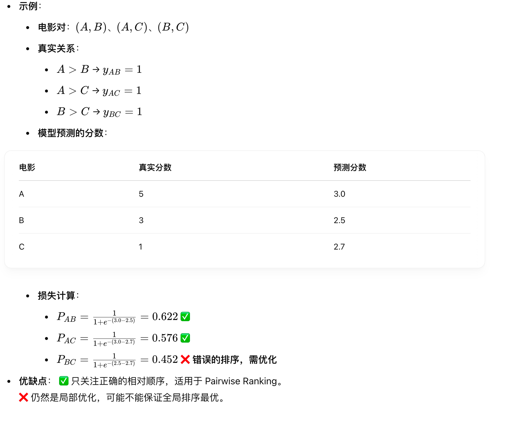

### 3.3 ListWise

Listwise关注的目标更上一层，Listwise的优化目标是推荐列表的排序，而不只是关注物料的两两关系。

 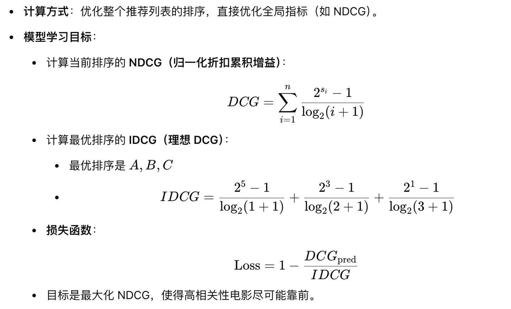

 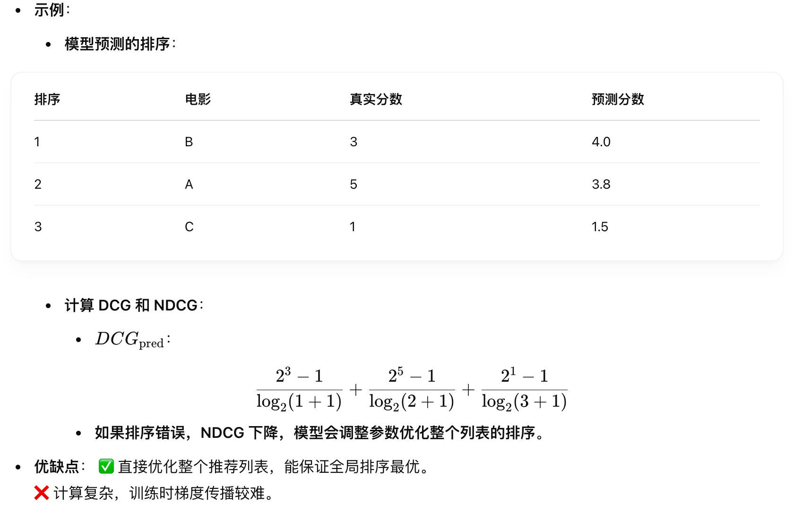

### 3.2 介绍下listwise排序模型LambdaRank

- Listwise方法是直接优化排序列表，输入为单条样本为一个**文档排列**。通过构造合适的度量函数衡量当前文档排序和最优排序差值，优化度量函数得到排序模型。

目前LTR三种主要方法的评价算法有：

- **Pointwise**：把排序问题转换为回归或分类（如 **回归评分**）。
- **Pairwise**：优化文档对之间的排序关系（如 **RankNet**）。
- **Listwise**：优化整个列表的排序（如 **LambdaRank、LambdaMART**）。

📌 **LambdaRank 是 Listwise 方法的一种，通过梯度调整优化全局排序指标。**

LambdaRank 是对 **RankNet** 的改进，它通过 **Lambda（梯度调整）** 来优化排序指标，如 **NDCG、MAP（Mean Average Precision）**，使得模型直接优化最终的排名质量。

 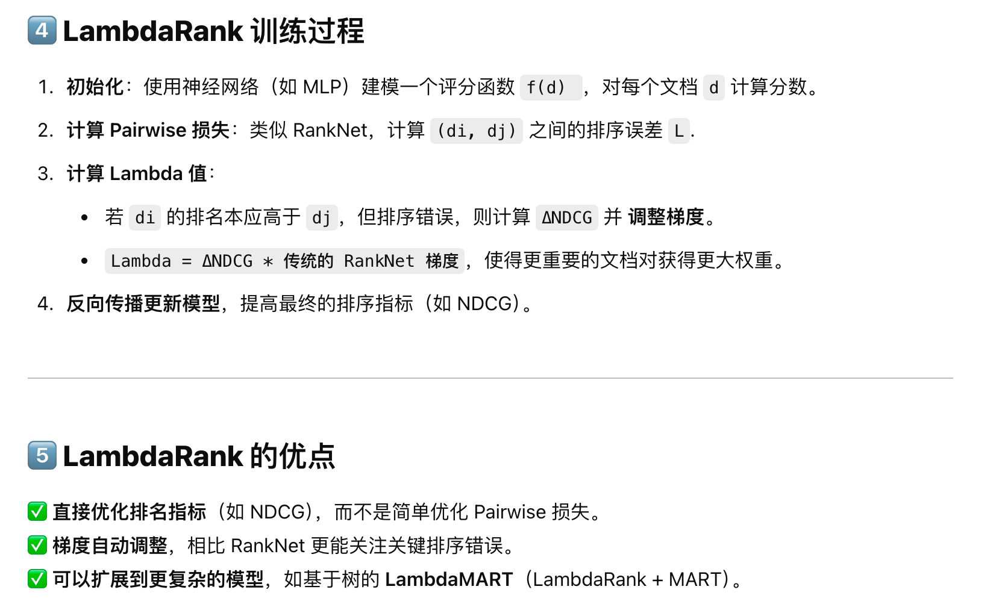

