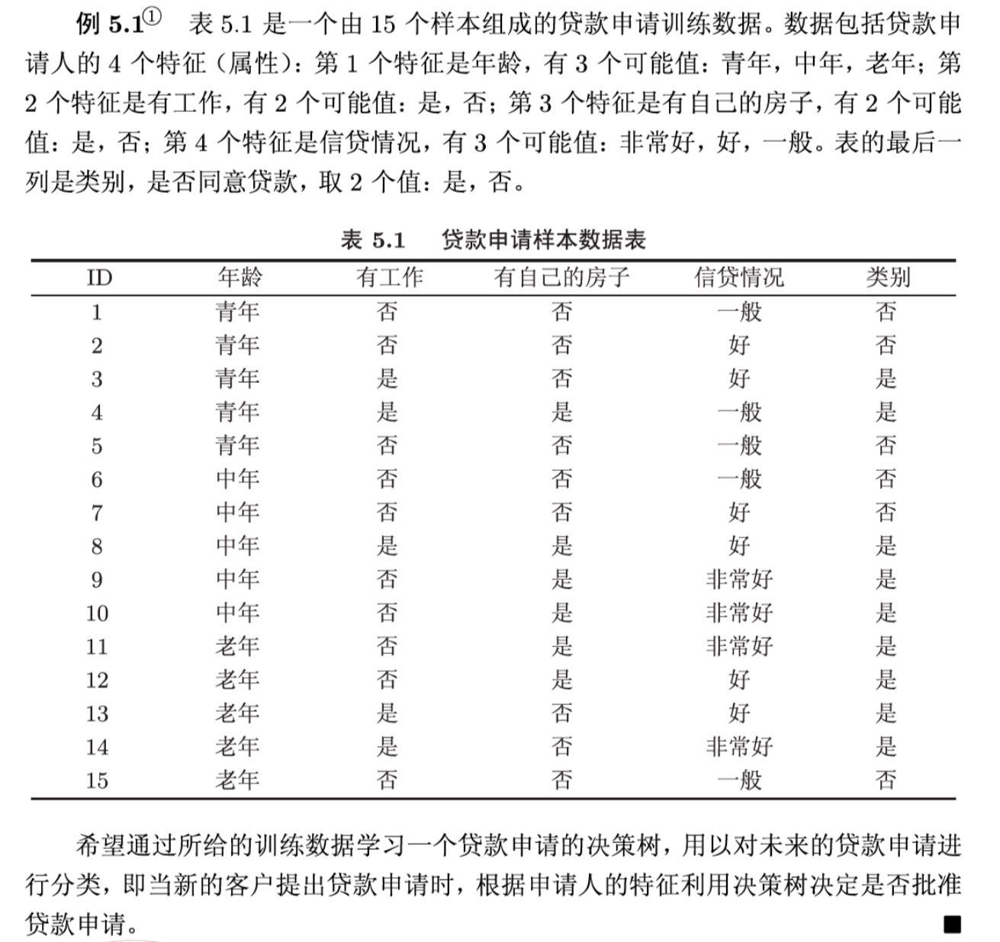

# 机器学习

## 1. 决策树怎么建树，基尼系数公式

### 1.1 决策树的建树过程

>  
>
> 以上述问题为例，不同算法都要参考以下步骤：
>
> 1. 选择一个 信息增益/信息增益率/基尼指数 最大的特征，作为分裂特征；
> 2. 看是否达到停止分裂要求，如果没有达到，然后选择第二个分裂特征；
> 3. 直到达到了停止分裂的要求；
> 4. 如何确定决策树建好后，每个叶节点的类别是什么？统计这个分支上的类别，看“是”多还是“否”多，以多数类别为该叶节点上的类别；

- 决策树建树算法有三种ID3、C4.5、CART，每个算法主要考虑的事情主要有三个问题：
  1. 选什么特征来当条件？
  2. 条件判断的属性值是什么？
  3. 什么时候停止分裂，达到我们需要的决策？

**ID3（Iterative Dichotomiser 3）**

**（1）选什么特征来当条件？**

- 选择**信息增益（Information Gain）最大**的特征来分裂节点。

- **信息增益计算**：衡量特征对数据集的不确定性减少程度，公式为：

   

- 其中，H(D) 是数据集的熵，H(D∣A) 是按特征 A 分割后的条件熵。

**（2）条件判断的属性值是什么？**

- 适用于**离散值特征**，每个特征的取值作为分裂条件。
- **无法直接处理连续值**，需要提前离散化。

**（3）什么时候停止分裂，达到我们需要的决策？**

- 所有样本属于同一类别（熵为 0）。
- 没有可用的特征进行分裂。
- 训练样本数量小于设定的阈值。

**C4.5**

**（1）选什么特征来当条件？**

- 选择**信息增益率（Gain Ratio）最大**的特征来分裂节点。

- **信息增益率计算**：

   

- 其中，IV(A)是特征 A 的固有值（Intrinsic Value），用于惩罚取值较多的特征。

**（2）条件判断的属性值是什么？**

- **支持连续值特征**，可以找到最优切分点，将数据划分为两部分。
- **离散值特征**的处理方式与 ID3 类似。

**（3）什么时候停止分裂，达到我们需要的决策？**

- 样本全部属于同一类别。
- 信息增益率低于设定阈值。
- 样本数低于设定阈值。

**CART（Classification and Regression Tree）**

**（1）选什么特征来当条件？**

- **分类任务**：选择**基尼指数（Gini Index）最小**的特征来分裂节点。 

   

- 其中，pi是类别 i 的概率。
- **回归任务**：使用**最小均方误差（MSE）**来选择分裂特征。

**（2）条件判断的属性值是什么？**

- **支持连续值特征**，可找到最优切分点。
- **二叉树结构**：每次分裂只分成两部分（左子树 & 右子树），而 ID3 和 C4.5 可以多路分裂。

**（3）什么时候停止分裂，达到我们需要的决策？**

- 样本属于同一类别（分类任务）。
- 节点样本数小于设定阈值。
- 进一步分裂无法显著降低基尼指数（或 MSE）。


**📌 总结对比**

| **算法** | **特征选择标准**             | **支持连续值？** | **树结构** | **停止条件**           |
| -------- | ---------------------------- | ---------------- | ---------- | ---------------------- |
| **ID3**  | 信息增益                     | ❌ 需要离散化     | 多叉树     | 样本纯度高或无特征可分 |
| **C4.5** | 信息增益率                   | ✅ 自动处理连续值 | 多叉树     | 增益率低或样本数不足   |
| **CART** | 基尼指数 (分类) / MSE (回归) | ✅ 自动处理连续值 | **二叉树** | 样本纯度高或增益不足   |

💡 **简而言之**：

- **ID3** 适用于**离散数据**，但容易偏向取值较多的特征。
- **C4.5** 在 ID3 的基础上**改进了特征选择标准**，支持连续值。
- **CART** 强制构造**二叉树**，可用于**分类和回归**，且支持剪枝。


## 2. Xgboost和LightGBM的区别？

[图解机器学习 | LightGBM模型详解](https://www.showmeai.tech/article-detail/195)

### Xgboost的问题

1. 精确贪心算法

每遍历一棵树，建树时每一层选择切分点，都需要遍历整个训练数据多次。如果把整个训练数据装进内存则会限制训练数据的大小；如果不装进内存，反复地读写训练数据又会消耗非常大的时间。

**优点：这样虽然可以较为精确地确定划分条件；**

**缺点：但是内存占用太大，且“太精确”容易过拟合。**

> 还有一个问题就是，数值型的特征切割时，需要每个特征值都要判断，浪费大量时间。

2. Level-wise生长方式

当前层的每个叶子节点都需要判断是否分裂，当前层判断完才会进入下一层。

**优点：由于当前层之间的不同节点之间已经分割了流量，因此可以并行；精确划分。**

**缺点：会产生一些不必要的划分，效率比较低。**

3. 对cache优化不友好

**举个例子说明**

假设有样本 5 个，样本梯度数组如下：

```
gradient = [0.2, 0.4, 0.6, 0.8, 1.0]  # 索引 0 ~ 4
```

特征 A 排序后的样本索引为：[1, 3, 0, 2, 4]
 特征 B 排序后的样本索引为：[4, 2, 1, 0, 3]

当我们在处理特征 A：

```
for i in [1, 3, 0, 2, 4]:
    g = gradient[i]  # 随机访问梯度数组
```

然后换成特征 B：

```
for i in [4, 2, 1, 0, 3]:
    g = gradient[i]
```

你会发现每次访问 `gradient[]` 的顺序都不同，即随机访问，这样内存跳跃非常严重 → 频繁 cache miss。

### LightGBM的改进

1. **基于 Histogram 的决策树算法（将数值型划分成离散值，消耗内存更低）；**

2. **带深度限制的 Leaf-wise 的叶子生长策略**
3. 直方图做差加速
4. **直接支持类别特征（Categorical Feature）**
5. **Cache命中率优化**

**LightGBM的直方图方式，可以直接顺序访问所有样本，然后把梯度累加对应的bin中就可以**

思路：

（1）将特征 A 值按范围分桶（假设 4 个 bin）：

- bin 0: [0.0–0.25)
- bin 1: [0.25–0.5)
- bin 2: [0.5–0.75)
- bin 3: [0.75–1.0)

得到每个样本的 bin 编号：

| 样本 ID | 特征 A 值 | Bin ID |
| ------- | --------- | ------ |
| 0       | 0.2       | 0      |
| 1       | 0.5       | 2      |
| 2       | 0.9       | 3      |
| 3       | 0.3       | 1      |

（2）初始化 histogram：每个 bin 一组统计量（g_sum, h_sum）

（3）顺序遍历样本并构建 histogram：

```
python


复制编辑
for sample_id in [0, 1, 2, 3]:  # 注意是顺序访问样本
    bin_id = bin_mapper[feature_value[sample_id]]
    histogram[bin_id].g_sum += gradient[sample_id]
    histogram[bin_id].h_sum += hessian[sample_id]
```

✅ 为什么 cache miss 少？

- `gradient[]`、`hessian[]` 是连续数组，访问顺序是 `[0, 1, 2, 3]` → **CPU 能提前预读**
- `histogram[]` 写入的是 4 个小结构（bin），很容易缓存在 CPU cache 中
- 所有操作都非常“线性、连续”，所以 **cache 命中率高、运行快**

6. 基于直方图的稀疏特征优化

7. 多线程优化