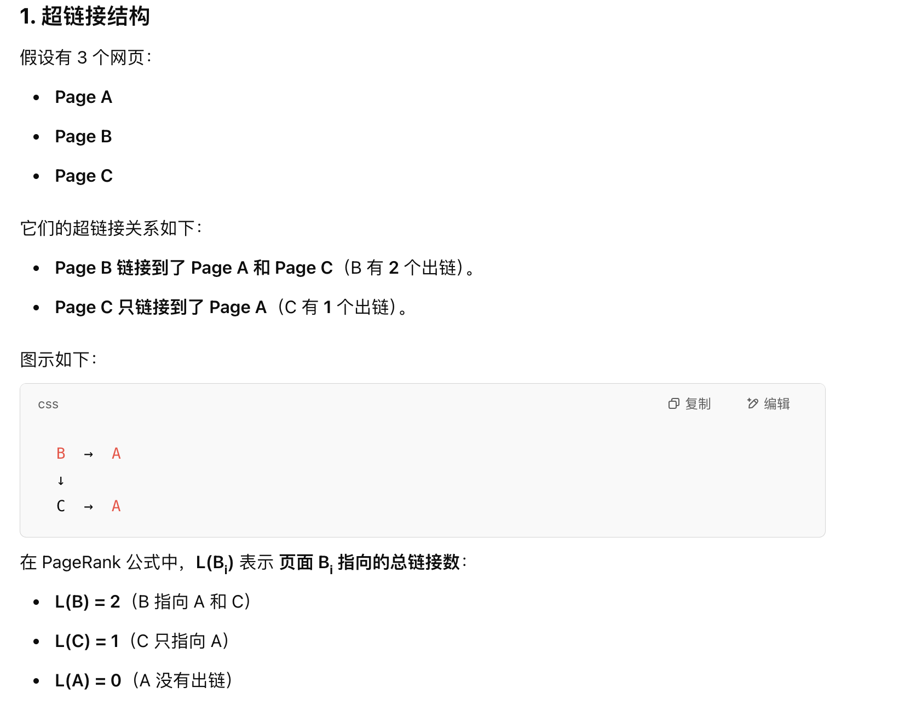
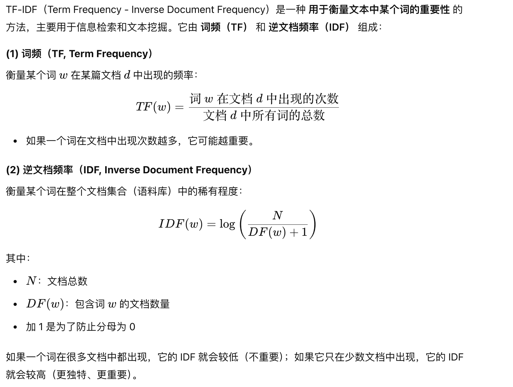
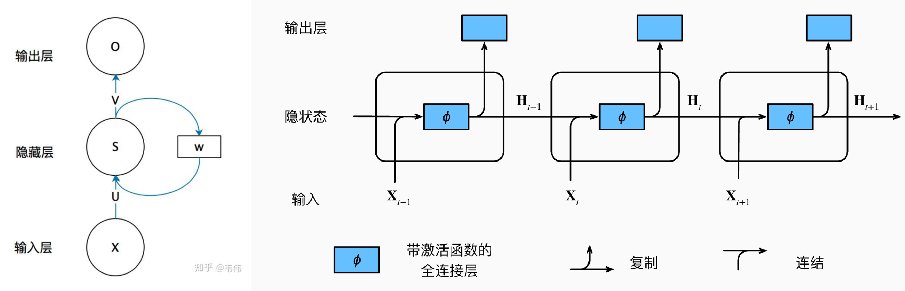
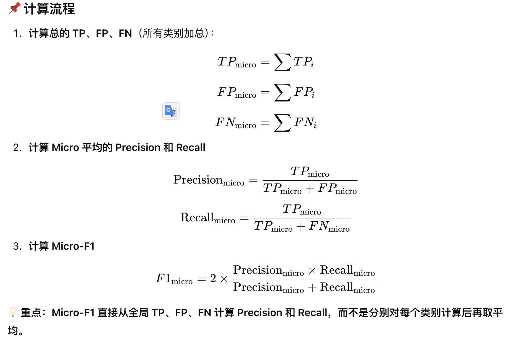

# Tips

## 1. dropout怎么防止过拟合, Dropout在训练和测试区别？

- 数据层面

  对于每一个dropout后的网络，进行训练时，相当于做了Data Augmentation。比如，对于某一层，dropout一些单元后，形成的结果是(1.5，0，2.5，0，1，2，0)，其中0是被drop的单元，那么总能找到一个样本，使得结果也是如此。这样每一次dropout其实都相当于增加了样本。

- 模型层面

  1. 在较大程度上减小了网络的大小：**在这个“残缺”的网络中，让神经网络学习数据中的局部特征（即部分分布式特征），但这些特征也足以进行输出正确的结果。**
  2. **Dropout思想类似于集成学习中的Bagging思想：**由学习阶段可知，每一次训练都会按keep_probability=p来保留每个神经元，这意味着每次迭代过程中，随机删除一些神经元，这就意味着在多个"残缺"的神经网络中，每次都进行随机的特征选择，这要比仅在单个健全网络上进行特征学习，其泛化能力来得更加健壮。

- **区别**：

- **【训练阶段】**以概率p主动临时性地忽略掉部分隐藏节点，算法步骤如下：

  1. 首先随机**（临时）**删掉网络中的一些隐藏神经元，一般情况下输入输出神经元保持不变
  2. 把输入x通过**修改后**的网络前向传播，删除的神经元不进行前向传播，传给下一层的值是0，然后把得到的损失结果通过**修改后**的网络反向传播。一小批训练样本执行完这个过程后就按照随机梯度下降法更新**没有被删除的神经元**对应的参数（w，b）
  3. 恢复被删掉的神经元，此时被删除的神经元保持原样，而没有被删除的神经元已经有所更新
  4. 不断重复上述过程1，2，3；

- **【测试阶段】**将参与学习的节点和那些被隐藏的节点以一定的概率p加权求和，综合计算得到网络的输出。预测的时候，每一个单元的参数要预乘以p。比如一个神经元的输出是x，在训练的时候它有p的概率参与训练，(1-p)的概率丢弃，那么它输出的期望是px+(1-p)0=px。因此测试的时候把这个神经元的权重乘以p可以得到同样的期望。

## 2. Batch Normalization(BN)

### 2.1 **BN 层对数据做了哪些处理？**

如果没有 BN 层，深度神经网络中的每一层的输入数据或大或小、分布情况等都是不可控的。

有了 BN 层之后，每层的数据分布都被转换在均值为零，方差为1 的状态，这样每层数据的分布大致是一样的，训练会比较容易收敛。

### 2.2 **BN 为什么能加快网络训练时的收敛速度？**

在深度神经网络中，每一层的输入分布会随着前一层参数的更新而不断变化（例如，前一层的激活值突然从 `[0,1]` 变为 `[100, 1000]`）。这种输入分布的剧烈变化会导致后续层需要不断调整参数以适应新的输入，从而减缓训练速度。

**BN 的作用**：
BN 通过对每一层的输入进行标准化（归一化到均值为 0、方差为 1 的分布），使得输入分布更加稳定。例如，无论前一层的参数如何变化，BN 层输出的特征值始终处于相似的范围内（如 `[0,1]` 或 `[-1,1]`）。

### 2.3 **BN 层为什么能防止梯度消失和梯度爆炸？**

- **梯度消失**

对于 Sigmoid 激活函数，其导数最大值为 0.25. 神经网络在反向传播更新参数时，执行链式求导。假如网络有 n 层，那么第一层的梯度将会小于 （0.25 * 权重）的 n 次方，学习速率相对较慢，而网络最后一层只需要对自身求导一次，梯度比较大，学习速率快。所以，后面的几层网络在学习，而前面的网络几乎停滞了，训练不动。

- **梯度爆炸**

第一层偏移量的梯度 = 激活层斜率1 * 权值1 * 激活层斜率2 * … 激活层斜率(n-1) * 权值(n-1) * 激活层斜率n，假如激活层斜率均为最大值 0.25，每层权重值大于 4，这样梯度就会呈指数增加。

- **梯度下降**

梯度下降的原理大致如下：
 

对于线性函数 $y = wx + b$ 来说，对w更新梯度就是 $w -= lr * x$ 可以看到梯度与数据有着直接关系。

而带有激活函数的梯度下降如下：
 

 

可以看到由于链式法则，当数据过大或过小时，1. 激活函数的梯度会过大（梯度爆炸）/ 过小（梯度消失）；2. 数据本身也会造成这些问题；尤其是在深度学习中，反向传播约传到底层可能梯度变动就越小。

因此BN将数据控制在了一个合理的范围，从而能够很好地控制权重值的更新幅度。

### 2.4 **BN 为什么能够防止过拟合？**

> **主要还是随机取batch到行为有效；**

BN 的使用使得一个 minibatch 中所有样本都被关联在了一起，因此网络不会从某一个具体的训练样本中生成确定的结果。也就是说，即使输入同一个训练样本，每次的输出都是不同的，而且每次网络都是随机取 batch，这样就会使得整个网络不会朝某一个方向使劲学习；

BN 层在线性层或卷积层之后，在非线性激活函数之前，这是为什么呢？首先，**全连接和卷积层的输出一般是一个对称，非稀疏的一个分布，更加类似高斯分布**，对它们进行归一化会产生更加稳定的分布。

> 这会产生几个影响：1. 影响梯度传播（梯度爆炸/消失）；2. 输出分布集中，影响泛化性和表达能力；3. 变化太大影响收敛；

其次，如果数据先经过 Relu 等激活函数，那么数据集的分布同样不可控，再对它进行 BN 处理，无法达到我们想要的稳定分布的效果。

### 2.5 **BN 层的数据集均值怎么计算？**

训练和推理时的计算方法是不一样的。

训练时的数据集是 minibatch，而推理时的数据集是所有的 minibatch，那是不是得记录训练过程中产生的所有 minibatch 的均值呢？答案是否定的，用滑动平均值就能解决该问题。

 

 

### 2.6 深度学习中BN的好处？最早提出BN是为了解决什么问题？BN具体怎么实现的

- **BN好处：**神经网络在训练时比较容易收敛，更容易避免梯度消失、梯度爆炸；

- **BN解决的问题：**随着训练进行，数据的分布会发生变化，会导致训练困难。如果没有 BN 层，深度神经网络中的每一层的输入数据或大或小、分布情况等都是不可控的。有了 BN 层之后，每层的数据分布都被转换在均值为零，方差为1 的状态，这样每层数据的分布大致是一样的，训练会比较容易收敛。

- **BN如何实现：**在Channel维度，将同一个batch下的数据转换成均值为零，方差为1 的状态；

   

## *2. Layer Normalization(LN)

### *2.1 什么是layer normalization

 

layer normalization 有很多种，上面图片中的意思是：**针对每个句子，统计其所有单词的所有特征维度的均值和方差，然后对每个单词进行归一化。**（这样每个句子就是一个分布，句子内的不同单词，不同单词的不同特征具有可比性）

下面计算公式的意思是：（也是Transformer中的做法）对于每个句子的每个token，分别统计每个token的特征维度的均值和方差，都单独归一化其特征维度。（这样每个单词都在自己的分布里，单词内的特征之间有可比性，但是不同单词之间没有可比性，即“每个单词都是独立的”）

> 至于为什么要统一每个单词内部的分布：
>
> 1. **消除特征间的尺度差异**
>
>    每个 token 的 C 个维度可能来源于不同的 embedding、位置编码、上下文融合等，它们数值范围可能差异很大。
>
> - 直接使用会导致某些维度主导信息；
> - LayerNorm 统一标准化每个 token 内的特征，**防止某些维度值过大或过小影响训练稳定性**。
>
> 2. **与 token 之间的无关性保持一致**。
>
>    我们希望 **对每个 token 做处理，而不是在不同 token 之间引入干扰**。
>
> - 如果你在 `L` 或 `N` 上做归一化，就会让多个 token 之间的分布互相影响；
> - Transformer 设计原则是：每个 token 独立输入，靠注意力机制交互，而不是归一化阶段打乱 token 表达。
>
> 3. **提升训练稳定性**。
>
>    LayerNorm 可以缓解：
>
> - 梯度爆炸/消失问题，
> - 不同 token/层之间的分布漂移（internal covariate shift），
>    从而加快收敛、提升泛化。
>
> 4. **避免 Padding 的干扰**
>
>    在 NLP 中，token 序列可能包含 padding，跨 token 的归一化会被 padding 值污染；
>    而在每个 token 内归一化，可以避免这种干扰。

- 计算公式

  > 假设数据shape为[N, L, C]，其中N为batchsize，L为句子长度，C为特征维度。

   

  GPT给出的答案是对句子中的每个token都单独归一化，pytorch中的实现也确实如此；

  但是像开头图片中那样对每个句子进行归一化也是可以的；（❌，好像不是，不同模型的处理方式可能不一样，涉及到padding等问题，感觉transfomer的处理方法比较靠谱）

- 与BatchNorm对比

  | 项目               | **BatchNorm**        | **LayerNorm**           |
  | ------------------ | -------------------- | ----------------------- |
  | 归一化维度         | 跨样本、同一特征维度 | 跨特征、同一个样本      |
  | 对 batch size 敏感 | 是                   | 否                      |
  | 应用场景           | CNN、MLP             | RNN、Transformer        |
  | 推理/训练一致性    | 不一致（BN 需切换）  | 一致（LN 不依赖 batch） |

### *2.2 transformer可以用BN吗？为什么

1. TF的输入是变长的序列，而且需要padding或者设置mask使某些token无效，如果使用BN计算会很不稳定；
2. TF中token加入了位置编码，以获得相对位置信息，如果使用BN会对所有句子进行计算均值和方差，导致位置信息混乱，导致模型可能无法捕捉到位置关系；
3. TF一般是用于捕捉一条样本上的序列关系，因此要保留token和channel放在同一个分布下，使之可比。如果用的是BN则token之间的分布不同，也就没有了可比性，这不是TF想要的；（参考BN和LN的区别）

### *2.3 BN和LN的区别

参考博客：[BatchNorm和LayerNorm——通俗易懂的理解](https://blog.csdn.net/Little_White_9/article/details/123345062?fromshare=blogdetail&sharetype=blogdetail&sharerId=123345062&sharerefer=PC&sharesource=qq_51600482&sharefrom=from_link)

## 3. 优化器 Optimizer

### 3.1 SGD与Adam的异同点

SGD有两大改进方向：动量上改进、自适应学习率改进

Adam同时结合了这两者的改进方法：在动量上用了Momentum，自适应学习率上用了RMSprop

### 3.2 介绍一下深度学习的优化器发展史, 及常见的优化算法

- SGD有两大改进方向：动量上改进、自适应学习率改进
- Momentum：每一步要结合上一步的方向，能够较大程度降低震荡，加速收敛；
- Adagrad(2011)：学习速率会参考历史梯度的大小进行放缩，加快收敛速度；（但长时间训练学习率会变得太小）
- RMSProp(2012)：解决了 AdaGrad 衰减过快的问题，引入指数滑动平均。
- Adadelta(2012)：RMSProp 的变体，避免了手动设置全局学习率。
- Adam：结合了momentum和RMSProm；

### 3.3  SGD缺点，已经有什么改进的优化器

- 每次只使用一批样本，导致迭代方向变化很大，容易剧烈震荡；
- 学习率固定，容易在局部下降速度过慢过过快，得到局部最优解或者学习过慢；
- 改进方法就是动量和自适应学习率：momentum、adagrad、Adam、等；

## 4. 激活函数

### 4.1 介绍一下你了解的激活函数以及优缺点

#### 4.1.1 Sigmoid

 

- 优点：
  - 能够限定输出值为0-1
  - 可微，而且梯度平滑，没有跳跃点
- 缺点：
  - 容易出现梯度消失：两端的梯度接近于0
  - 输出的中心是0.5：不是0，所以梯度下降会更慢
  - 有指数运算：计算机内部运行慢，求导慢

#### 4.1.2 Tanh（双曲正切）

 

**相比 Sigmoid 更好的地方**：

- 输出范围是 (−1,1)，均值更接近 0，梯度消失问题稍微缓解

**仍然可能梯度消失**

#### 4.1.3 ReLU（Rectified Linear Unit）

 

**优点**：

- 计算简单，高效
- 不会导致梯度消失（对于正数）

**缺点**：

- **"死亡 ReLU"**：当 z≤0 时，梯度变成 0，导致神经元无法更新
- 解决方案：Leaky ReLU 或 PReLU

#### 4.1.4 Leaky ReLU

 

**优点**：

- 避免 ReLU 神经元问题

**缺点**：

- 仍然可能梯度爆炸

### 4.2 激活函数中，sigmoid，tanh有什么不好的地方？relu有什么优势？

- sigmoid、tanh缺点
  - 两端有梯度消失；
  - 有指数等运算，求导更复杂；
- relu优点：
  - 求导快，梯度固定；
  - 避免了两端梯度消失现象；

## 5. Embedding

### 5.1 embedding如何设置维度？越大越好还是越小越好？

- 维度越低越粗糙，拟合能力就有限；
- 维度越高越细致，但是需要更多数据集才能训练，但是容易维度灾难，而且容易过拟合；
- 个人经验是需要结合特征的取值和分布、特征实际的业务意义、问题规模、经验参数，反复调参迭代、优化得到；

 

### 5.2 embedding如何训练

- 在推荐系统中embedding有两种：
  - 离散特征通过端到端训练（即从one-hot转为embedding层，然后输出embed直接加入训练可以得到），先通过embedding层再和其他特征合并训练；
  - 多模态特征或者其他预训练特征，通过NLP、CV等内容理解方法抽取出来后和推荐特征合并训练；（无法通过端到端方式获得，需要根据其他预训练模型提取特征）
- NLP中的词向量embedding：
  - CBOW: 先在句子中选定一个中心词，并把其它词作为这个中心词的上下文。在学习过程中，使用上下文的词向量推理中心词，这样中心词的语义就被传递到上下文的词向量中, 从而达到学习语义信息的目的。
  - Skip-gram: 同样先选定一个中心词，并把其他词作为这个中心词的上下文。不同的是，在学习过程中，使用中心词的词向量去推理上下文，这样上下文定义的语义被传入中心词的表示中， 从而达到学习语义信息的目的。
  - 一般来说，CBOW比Skip-gram训练速度快，训练过程更加稳定，原因是CBOW使用上下文average的方式进行训练，**每个训练step会见到更多样本**。而在生僻字（出现频率低的字）处理上，skip-gram比CBOW效果更好，原因是skip-gram不会刻意回避生僻字(CBOW结构中输入中存在生僻字时，生僻字会被其它非生僻字的权重冲淡)。

## 6. 梯度爆炸和梯度消失问题

- 本质原因：
  - 网络加深、参数共享
  - 如果参数的特征值不在1附近，反向传播就会发生连乘效应
- 表现：
  - 梯度消失导致无法收敛
  - 梯度爆炸导致效果不稳定
- 解决方法
  - 换激活函数，用relu族的，sigmoid、tanh两端平滑容易梯度消失；
  - 用BN和LN，本质上是让参数特征在1附近；
  - 换网络，用resnet、lstm能类型网络；
  - 用预训练网络：霍顿文章表明欲训练网络；
  - 进行梯度裁剪；
  - 用正则化的方法：$Loss=原始损失+\lambda\sum w_j^2$， 可以抑制权重绝对值，避免权重过大导致梯度爆炸；
  - 初始化权重时采用Xavier或者He等，控制梯度大小，使得梯度不会在层间迅速变大或变小；

## 7. 网络权重初始化为0有什么影响，初始化为一个非0的常数呢？

- 如果W、b初始化为0：每一层前向传播输出都是一致的，反向传播同样就一致，多个神经元（网络的宽度）作用等同于1个；
- 只有W初始化为0、b随机初始化：反向传播过程中，第一次的第一层的dw都是0，只有第二次才能恢复，导致收敛更慢，梯度消失问题严重；
- 只有b初始化为0：可以的

## 8. pagerank相比于tf-idf的优势

### 8.1 **什么是pagerank**

PageRank 是 **Google 创始人 Larry Page 和 Sergey Brin 提出的网页排名算法**，用于衡量网页的重要性。它基于 **图论** 和 **随机游走模型**，核心思想是：
 **“一个网页的重要性取决于有多少其他网页链接到它，以及这些链接网页本身的重要性。”**

 

> 举例说明：
>  
>
> 初始情况下，我们假设 **所有页面的 PR 值相等**，即：$PR(A)=PR(B)=PR(C)=\frac{1}{3} =0.333$
>
>   
>
> 因为计算公式中有**阻尼因子(1 - d)**存在，可以确保系统在即使链路中有环的情况下，也不会陷入无限循环中。
>
> PR会反复计算，直至各个页面（节点）的PR值收敛到一个稳定数值：
>  

### 8.2 什么是TF-IDF

 

 

### 8.3 pagerank相比于tf-idf的优势

PageRank 和 TF-IDF 是两种完全不同的算法，分别解决不同场景下的问题。**PageRank 的核心优势在于其基于网络结构的全局重要性评估，而 TF-IDF 的优势在于对文本内容的局部关键词提取**。以下是 PageRank 相比 TF-IDF 的主要优势和应用场景对比：

---

**1. 核心思想不同**

• **PageRank** 
  基于图结构（如网页之间的超链接关系），通过**链接分析**衡量节点（如网页）的重要性。 
  **核心假设**：被更多高质量节点链接的节点本身更重要。 
  **应用场景**：网页排序、社交网络分析、推荐系统（如评估用户/商品影响力）。

• **TF-IDF** 
  基于词频统计，衡量**单个词在文档中的重要性**。 
  **核心假设**：高频词在文档中重要，但若该词在多个文档中普遍出现（如停用词），则重要性降低。 
  **应用场景**：文本关键词提取、文档相似度计算、搜索引擎的初步内容匹配。

---

**PageRank 的独特优势**

**1. 全局重要性评估***

  • PageRank 能够从**全局网络结构**中挖掘重要性，而不仅仅是单个文档的内容。 
    **例如**： 
    ◦ 维基百科中，被许多权威页面引用的页面会被 PageRank 赋予更高的权重。 
    ◦ 在社交网络中，被大V关注的用户通常具有更高的影响力（类似 PageRank 的“投票”机制）。

**2. **抗噪声能力更强

  • TF-IDF 容易受到文本内容噪声的影响（如重复关键词、垃圾文本），而 PageRank 依赖链接关系，对文本内容本身的噪声不敏感。 
  **例如**： 
  • 一个网页即使堆砌大量关键词（SEO 作弊），若没有其他页面链接到它，PageRank 仍会认为它不重要。

**3. **动态更新与长期价值

  • PageRank 可以动态更新（如通过迭代计算），反映网络结构的实时变化（如新链接的加入）。 
  • TF-IDF 的结果严格依赖于当前文档集合的统计特性，若文档集变化（如新增文档），需要重新计算。

**4. **处理稀疏数据更有效

  • 当文本内容稀疏（如短文本、冷门领域文档）时，TF-IDF 可能无法准确提取关键词，而 PageRank 仍能通过链接结构挖掘重要性。 
  **例如**： 
  • 一篇学术论文如果被大量高引论文引用，即使内容中未重复关键词，PageRank 仍会认为它重要。

---

**TF-IDF 的局限性（对比 PageRank）**

1. **局部性限制** 
   TF-IDF 仅关注词在文档内的频率和文档间的分布，无法捕捉文档之间的关联性（如引用关系、主题关联）。

2. **无法评估全局权威性** 
   例如，一篇内容质量较低但包含大量关键词的文档，可能获得高 TF-IDF 得分，但 PageRank 可以通过链接结构过滤这类低质内容。

3. **依赖文本内容** 
   对非文本数据（如用户行为数据、社交网络）无效，而 PageRank 可泛化到任何图结构数据。

---

**结合使用场景**

在实际应用中，PageRank 和 TF-IDF 常**结合使用**以互补：  
1. **搜索引擎**： 
   • 先用 TF-IDF 匹配搜索关键词相关的文档，再用 PageRank 对结果排序（如 Google 的早期算法）。  
2. **推荐系统***： 
   • **用 TF-IDF 分析用户兴趣（如提取浏览内容的关键词），再用 PageRank 挖掘用户社交关系中的影响力节点。**  
3. **学术研究**： 
   • 用 TF-IDF 提取论文关键词，用 PageRank 评估论文的引用影响力。

---

**总结**

| **维度**       | **PageRank**                 | **TF-IDF**                       |
| -------------- | ---------------------------- | -------------------------------- |
| **核心目标**   | 评估节点全局重要性           | 提取文本关键词重要性             |
| **数据依赖**   | 图结构（链接、关系）         | 文本内容（词频、文档分布）       |
| **抗噪声能力** | 强（依赖链接质量）           | 弱（易受关键词堆砌影响）         |
| **动态更新**   | 支持迭代更新                 | 需重新计算                       |
| **适用场景**   | 网页排序、社交网络、推荐系统 | 文本检索、相似度计算、关键词提取 |

**最终结论**： 
PageRank 的优势在于利用网络结构评估全局重要性，适合处理关联性数据；而 TF-IDF 更适合文本内容的局部特征提取。两者并非替代关系，而是互补工具，实际应用中常结合使用以提升效果。

## 9. 深度模型和传统机器学习模型对数据量的要求，什么场景用什么模型

 

 

## 10. softmax

### 10.1 softmax原理

公式：
$$
\text{softmax}(x_i) = \frac{e^{x_i}}{\sum_{j=1}^{n} e^{x_j}}
$$
**softmax对每个输入值计算其指数，然后计算所有指数的和，最后将每个指数除以总和，得到概率分布，即所有输出值的和为1，且每个输出值在0到1之间。**Softmax函数通过指数运算将输入值进行非线性变换，使得较大的输入值在输出中占据更大的权重。

# 模型架构

## Word2Vec

### 1. word2vec如何进行负采样

改进负采样Negative Sampling（Skip-gram）的损失函数如下：

- 负采样的**核心思想**是：就是分别计算正负样本的loss，这样负样本就可以选择采样的那几条，而不是除开正样本以外的所有样本；负样本预测的概率越大损失越高，正样本预测的概率越大则损失越小。
- 一个单词被选作negative sample的概率跟它出现的频次有关，出现频次越高的单词越容易被选作negative words。

### 2. word2vec两种训练方法的区别，具体损失函数

- CBOW: 先在句子中选定一个中心词，并把其它词作为这个中心词的上下文。在学习过程中，**使用上下文的词向量推理中心词**，这样中心词的语义就被传递到上下文的词向量中, 从而达到学习语义信息的目的。

  >  
  >
  > 其中，P为softmax函数，wt表示中心词；直观理解为优化使得已知上下文词预测中心词的概率最大化。

- Skip-gram: 同样先选定一个中心词，并把其他词作为这个中心词的上下文。不同的是，在学习过程中，**使用中心词的词向量去推理上下文**，这样上下文定义的语义被传入中心词的表示中， 从而达到学习语义信息的目的。

  >  
  >
  > 其中，P为softmax函数，wo是上下文词，wI是输入的中心词；直观理解就是优化使得已知中心词，预测所有上下词的概率最大化。

**Skip-gram和CBOW都是对目标的直接优化；以Skip-gram为例，如果不看负采样，优化目标就是输入中心词，直接看对上下文词预测的概率，这个概率相当于就是损失，CBOW也类似。**

- 一般来说，CBOW比Skip-gram训练速度快，训练过程更加稳定，原因是CBOW使用上下文average的方式进行训练，每个训练step会见到更多样本。而在生僻字（出现频率低的字）处理上，skip-gram比CBOW效果更好，原因是skip-gram不会刻意回避生僻字(CBOW结构中输入中存在生僻字时，生僻字会被其它非生僻字的权重冲淡)

## LSTM

### 1. 介绍LSTM每一个门的具体操作，一个LSTM cell的时间复杂度是多少

#### 1.1 循环神经网络

循环神经网络在MLP的基础上，加入了隐状态来融合之前时间步的计算（也需要一个额外的矩阵$W_{hh}$来控制隐变量的融合程度）；

也就是说，常规循环神经网络一般只有三部分：1️⃣ 隐藏层权重$W_{xh}$；2️⃣ 隐变量权重$W_{hh}$；3️⃣ 输出层权重$W_{hq}$。

#### 1.2 GRU(gated recurrent unit，门控循环单元)

**step1 重置门和更新门**

注意$W_{hr}和W_{hz}$只是命名，其形状都是h x h，也就是说输出的$R_t和Z_t$都是n x h维的。

**step 2 候选隐状态**

**step3 隐状态**

重置门和更新门的区别在于：

- 重置门只作用于前一层隐状态，意为“控制保留多少之前的状态”；（因此叫Reset gate）
- 而更新门既控制当前输入（候选隐状态），也控制隐状态的输入，意为“控制如何更新当前的隐状态”；（因此叫Update gate）

#### 1.3 LSTM(long short-term memory，长短期存储器)

> 长短期记忆网络的设计灵感来自于计算机的逻辑门。 长短期记忆网络引入了*记忆元*（memory cell），或简称为*单元*（cell）。 有些文献认为记忆元是隐状态的一种特殊类型， 它们**与隐状态具有相同的形状**，**其设计目的是用于记录附加的信息**。 为了控制记忆元，我们需要许多门。
>
> - 其中一个门用来从单元中输出条目，我们将其称为*输出门*（output gate）。 
> - 另外一个门用来决定何时将数据读入单元，我们将其称为*输入门*（input gate）。 
> - 我们还需要一种机制来重置单元的内容，由*遗忘门*（forget gate）来管理， 这种设计的动机与门控循环单元相同， 能够通过专用机制决定什么时候记忆或忽略隐状态中的输入。

**step1 输入门、遗忘门和输出门**

与GRU类似：

- 遗忘门（forget gate） 它决定了上一时刻的单元状态 `c_t-1` 有多少保留到当前时刻 `c_t`
- 输入门（input gate） 它决定了当前时刻网络的输入 `x_t` 有多少保存到单元状态 `c_t`
- 输出门（output gate） 控制单元状态 `c_t` 有多少输出到 LSTM 的当前输出值

**step2 候选记忆单元**

**step3 记忆元**

**step4 隐状态**

**一个LSTM cell的时间复杂度**

**计算过程**

假设：

- **输入维度**：d（即输入 x_t 的大小）
- **隐藏状态维度**：h（即 LSTM 细胞状态 h_t 的大小）
- **批次大小**：B（即 batch size）

每个 LSTM Cell 需要进行以下计算：

 

 

### 2. GRU和LSTM对比

可以看出LSTM和GRU的理念非常相似，都是“遗忘 + 更新”的思路；

- 只不过GRU的结构更简洁，其计算效率更高，在数据集较小或需要快速计算的情况下，精度未必会低；

- LSTM独立的记忆单元（cell state），这使得它在**处理长时间依赖的任务中可能表现得更好**；由于有三个门控（输入门、遗忘门和输出门），LSTM能够**更精细地控制信息的流动**。

**适用场景不同：**

- LSTM更适合：当你面对的是需要捕捉长时间依赖关系的任务，比如机器翻译、语音识别等，LSTM可能会是更好的选择。
- GRU更适合：对于一些中短时间依赖的任务，或者是在资源受限的环境下（如移动设备），GRU可能是更优的选择。

### 3. 为什么GRU和LSTM能够缓解传统循环神经网络(RNN)在处理长序列时遇到的梯度消失问题？

**传统 RNN 的梯度消失问题**

 

**缓解核心设计：GRU和LSTM的门控机制设计**

以GRU为例，更新门 $z_t$ 控制历史状态 $h_{t-1}$ 的保留比例。若 $z_t=1$，则 $h_t=h_{t-1}$，梯度直接传递，避免衰减。

> **这个思想很类似于ResNet中残差连接的思想！！**
>
> 在门控单元梯度很难更新的情况下，有一条链路还能够传递梯度。

同理LSTM的记忆单元$C_t$也有类似的效果：

### 4. 画一下LSTM的结构图

> 参考前面的描述

### 5. RNN和LSTM的区别，解决了什么问题，为什么解决了梯度消失的问题

RNN 在训练时**通过反向传播算法（Backpropagation Through Time, BPTT）更新权重**，但由于**梯度在长序列中不断衰减或爆炸**，RNN 训练深层网络时存在 **梯度消失或梯度爆炸问题**。

> LSTM主要缓解了RNN在长序列中梯度消失 / 爆炸的问题。

LSTM相比于RNN添加了门控机制，能够存储更多长序列信息，也能够加速梯度传播，缓解梯度消失/爆炸。

 

## Transformer

### 0. transformer结构分析

> 见ipad无边记；

### 1. transformer中计算attention除于根号d的作用

Attention计算公式如下：

- 公式中计算矩阵**Q**和**K**每一行向量的内积，为了防止内积过大，因此除以 dk 的平方根。

- 而且因为使用了softmax，如果元素方差很大，会导致softmax把大部分权重分配给大元素，导致反向传播的时候梯度很小，梯度消失。

- 和xvier、he初始化、bn原理一样（前两者是初始化layer层时的一些方法），在输入输出空间映射的时候，均衡方差，防止梯度消失；

### 2. 介绍下attention，相比cnn、lstm的优势

优点：

1. 一步到位获取全局与局部的联系，不会像RNN网络那样对长期依赖的捕捉会收到序列长度的限制。
2. 每步的结果不依赖于上一步，可以做成并行的模式
3. 相比CNN与RNN，参数少，模型复杂度低。(根据attention实现方式不同，复杂度不一）

缺点：

1. 没法捕捉位置信息，即没法学习序列中的顺序关系。这点可以通过加入位置信息，如通过位置向量来改善，具体可以参考最近大火的BERT模型。

**一定注意：卷积神经网络和自注意力都拥有并行计算的优势， 而且自注意力的最大路径长度最短。 但是因为其计算复杂度是关于序列长度的二次方，所以在很长的序列中计算会非常慢。**

### 3. transformer中encoder和decoder的输入分别是什么

- encoder的输入：
  - 输入x，比如词向量的embediing + 位置序列；
  - Positional Encoding
- decoder的输入：
  - 初始输入：目标序列embedding + Positional Encoding / 前一时刻Decoder的预测结果；
  - 中间输入：Encoder Embedding（作为KV）
  - Shifted Right：在输出前添加起始符，方便预测第一个Token

### 4. transformer中encoder与decoder的QKV矩阵如何产生

- Encoder每层采用多头自注意力，QKV矩阵都是是输入X在不同空间下的投影，其形状与大小都一致；
- Decoder**每层是有两块Attention**的：
  - 一块是正常的Self-Attention，QKV的输入是来自目标序列或Decoder上一层的输出经过三个矩阵的映射得到的。
  - 另一块是问题中提到的Decoder Encoder Attention，其中的K，V输入来自encoder的输出。

### 5. transformer中QKV矩阵是否可以设置成同一个

- kq使用同一个，输入的结果类似于一个单位矩阵了，失去了attention的效果。

- 数学推理上同一个矩阵点乘就是一个单位矩阵：

  > 

- 增加了泛化能力：kq是不同初始化的，能够得到输入x在不同空间下的投影，增加表达能力。

### 6. attention怎么做的，为什么除以的是根号dk?

**Attention公式：**
$$
\text{attention}(Q, K, V) = \text{softmax}\left(\frac{QK^T}{\sqrt{d_k}}\right)V
$$
其中 Q 为查询，K 为键，V 为值；

**因为向量点积之后的数量级会很大，导致经过softmax函数后梯度变得很小，进行scale之后就可以缓解这种情况，防止梯度消失。**具体解释：假设q/k是互相独立的分布，均值为0，方差为1，那么点积后的结果均值为0，方差为 $d_k$；点积后除以 $\sqrt{d_k}$ 后可以使方差为1。（方差越大，点积的数量级也会越大，意味着softmax将以更大的概率取大值，会将几乎为1的概率分配给最大值，导致梯度消失，所以将方差稳定在1，可以使点积变小）。

### 7. Transformer的参数量？

1.  **Embedding 层**

   词嵌入 + 位置编码（位置编码通常是固定的，不参与训练）

   词嵌入参数量： $V \times d_{\text{model}}$

2. **Multi-Head Attention 层**
   每层包含：

   - 对每个输入进行线性变换：Query、Key、Value，共 3 个线性层（共享权重或分别计算）
   - 每个线性变换：$d_{\text{model}} \times d_{\text{model}}$，共：  $3 \times d_{\text{model}} \times d_{\text{model}}$ （多头应该再乘head_num？）
   - 多头拼接后再映射回 $d_{\text{model}}$：输出投影矩阵：  $d_{\text{model}} \times d_{\text{model}}$

   总 Attention 参数量：  $4 \times d_{\text{model}} \times d_{\text{model}}$

3. **Feed-Forward Network（FFN）层**
   标准 FFN 有两个全连接层：

   - 第1层：$d_{\text{model}} \to d_{\text{ff}}$
   - 第2层：$d_{\text{ff}} \to d_{\text{model}}$

   总参数量：$d_{\text{model}} \times d_{\text{ff}} + d_{\text{ff}} \times d_{\text{model}} = 2 \times d_{\text{model}} \times d_{\text{ff}}$

4. **LayerNorm**
   每层使用两次 LayerNorm（一次在 Attention 前，一次在 FFN 前），每次含有：

   - 2 个参数（scale 和 bias）

   总参数量：$2 \times d_{\text{model}} \times 2 = 4 \times d_{\text{model}}$

5. **整个 Transformer 编码器（或解码器）部分参数量**
   假设有 $L$ 层：$L \times (4d_{\text{model}}^2 + 2d_{\text{model}} d_{\text{ff}} + 4d_{\text{model}})$

## BERT

> 参考链接🔗：[读懂BERT，看这一篇就够了 - 大雄007的文章 - 知乎](https://zhuanlan.zhihu.com/p/403495863)

### 1. transformer与bert的位置编码有什么区别

- transformer采用正余弦的固定位置编码：（也能表示相对位置）

   

- BERT 采用的是 "可学习" 的位置编码：

  BERT 中处理的最长序列是 512 个 Token，长度超过 512 会被截取，BERT 在各个位置上学习一个向量来表示序列顺序的信息编码进来，这意味着 Position Embeddings 实际上是一个 (512, 768) 的 lookup 表，表第一行是代表第一个序列的每个位置，第二行代表序列第二个位置。

  最后，BERT 模型将 Token Embeddings (1, n, 768) + Segment Embeddings(1, n, 768) + Position Embeddings(1, n, 768) 求和的方式得到一个 Embedding(1, n, 768) 作为模型的输入。

#### 1.1 为什么 BERT 选择可训练的 Position Embedding？

> 感觉主要原因是 可训练的位置编码 能够针对不同类型的任务做出调整。

BERT 是 **预训练 + 微调** 框架，**不同任务可能对位置编码的要求不同**，例如：

- **文本分类任务**（如情感分析）可能对远处的依赖不强，位置信息作用较小。
- **阅读理解任务**（如 SQuAD）可能对相对位置高度敏感，位置信息作用大。

因此，BERT 采用 **可训练的位置编码**，这样：

- **预训练阶段**：模型学习到一般性的位置信息。
- **微调阶段**：模型可以针对特定任务调整位置编码，使其更有效。

 

**总的来说：**

- Transformer **使用固定的 sin/cos 位置编码**，适合**一次性训练好**的模型。

- BERT **使用可训练的位置编码**，适合 **预训练+微调** 任务，能够**适应不同的 NLP 应用场景**。

### 2. **[CLS]的作用**

BERT在第一句前会加一个[CLS]标志，最后一层该位对应向量可以作为整句话的语义表示，从而用于下游的分类任务等。因为与文本中已有的其它词相比，**这个无明显语义信息的符号会更“公平”地融合文本中各个词的语义信息**，从而更好的表示整句话的语义。 

具体来说，**self-attention是用文本中的其它词来增强目标词的语义表示，但是目标词本身的语义还是会占主要部分的**，因此，经过BERT的12层（BERT-base为例），每次词的embedding融合了所有词的信息，可以去更好的表示自己的语义。而[CLS]位本身没有语义，经过12层，句子级别的向量，相比其他正常词，可以更好的表征句子语义。

### 3. BERT中计算attention的公式（与transformer的attention有什么区别？）

> 如果硬要说不同点的话，那就是Transformer的Decoder的attention是掩码自注意力，而Bert不是；

  

 

>  BERT与Tranformer的Encoder的架构方面区别不大，只是一些数据处理和训练策略上不同。
>
> 

 ### 4. BERT中LayerNorm的作用，为什么不用BN？

两者代表的意义，可以参考CSDN博客：[BatchNorm和LayerNorm——通俗易懂的理解](https://blog.csdn.net/Little_White_9/article/details/123345062?fromshare=blogdetail&sharetype=blogdetail&sharerId=123345062&sharerefer=PC&sharesource=qq_51600482&sharefrom=from_link)

BatchNorm概念图：
 

LayerNorm概念图：
  

首先，BN和LN的作用都是防止梯度爆炸/消失，加快模型收敛；

对于**BatchNorm**而言，对不同图片进行标准化，使得不同图片之间有可比性，而不同channel（即使是同一张图片）之间不具备可比性；这符合图片处理方式，因为更关注不同图片之间的差异。

对于**LayerNorm**而言，对同一个句子的不同token进行标准化，使得不同token之间具有可比性，而不同句子之间不具备可比性；这也符合自然语言处理上的逻辑，因为不同语境下句子有不同含义，这使模型更关注同一句子的上下文之间的联系。

**在Transformer架构下**，LN显然更符合处理逻辑，因为是按句子进行输入，在Self-attention中也是获取不同token之间的联系，我们更加需要上下文的联系。

### 5. BERT中的两种预训练任务介绍

BERT是一个多任务模型，它的预训练（Pre-training）任务是由两个自监督任务组成，即**MLM**和**NSP**，如图所示。

 

#### 5.1 MLM（Masked Language Model）

- MLM是指在训练的时候随即从输入语料上mask掉一些单词，然后通过的上下文预测该单词，该任务非常像我们在中学时期经常做的完形填空。正如传统的语言模型算法和RNN匹配那样，MLM的这个性质和Transformer的结构是非常匹配的。在BERT的实验中，**15%的WordPiece Token会被随机Mask掉**。在训练模型时，一个句子会被多次喂到模型中用于参数学习，但是Google并没有在每次都mask掉这些单词，而是在确定要Mask掉的单词之后，做以下处理。
  - 80%的时候会直接替换为[Mask]，将句子 "my dog is cute" 转换为句子 "my dog is [Mask]"。
  - 10%的时候将其替换为其它任意单词，将单词 "cute" 替换成另一个随机词，例如 "apple"。将句子 "my dog is cute" 转换为句子 "my dog is apple"。
  - 10%的时候会保留原始Token，例如保持句子为 "my dog is cute" 不变。

这么做的原因是如果句子中的某个Token 100%都会被mask掉，那么在fine-tuning的时候模型就会有一些没有见过的单词。加入随机Token的原因是因为Transformer要保持对每个输入token的分布式表征，否则模型就会记住这个[mask]是token ’cute‘。至于单词带来的负面影响，因为一个单词被随机替换掉的概率只有15%*10% =1.5%，这个负面影响其实是可以忽略不计的。 另外文章指出每次只预测15%的单词，因此模型收敛的比较慢。

**优点**

- 1）被随机选择15%的词当中以10%的概率用任意词替换去预测正确的词，相当于文本纠错任务，为BERT模型赋予了一定的文本**纠错能力**；
- 2）被随机选择15%的词当中以10%的概率保持不变，缓解了finetune时候与预训练时候输入不匹配的问题（预训练时候输入句子当中有mask，而finetune时候输入是完整无缺的句子，即为输入不匹配问题）。

**缺点**

- 针对有两个及两个以上连续字组成的词，随机mask字割裂了连续字之间的相关性，使模型不太容易学习到词的语义信息。主要针对这一短板，因此google此后发表了BERT-WWM，国内的哈工大联合讯飞发表了中文版的BERT-WWM。

#### 5.2 NSP（Next Sentence Prediction）

Next Sentence Prediction（NSP）的任务是判断句子B是否是句子A的下文。如果是的话输出’IsNext‘，否则输出’NotNext‘。训练数据的生成方式是从平行语料中随机抽取的连续两句话，其中50%保留抽取的两句话，它们符合IsNext关系，另外50%的第二句话是随机从预料中提取的，它们的关系是NotNext的。这个关系保存在[CLS]符号中。

**输入 = [CLS] 我 喜欢 玩 [Mask] 联盟 [SEP] 我 最 擅长 的 [Mask] 是 亚索 [SEP]**

类别 = IsNext

**输入 = [CLS] 我 喜欢 玩 [Mask] 联盟 [SEP] 今天 天气 很 [Mask] [SEP]**

类别 = NotNext

# 特征工程

## 1. 特征工程一般怎么做

- 特征工程是从原始数据中提取特征以供算法和模型使用的工程。

  特征工程是一个反复迭代不断优化的过程，最重要的是提问题、做假设、去验证。

  做特征工程前思考所有和业务有关的变量数据，思考可行性：数据获取难度、数据规模、覆盖率等信息，获得数据后后进行一些特征处理如下。

- 数据探索（EDA）和预处理🌟：

  1. 量纲转换、离散特征编码、连续特征分桶
  2. 特征清洗
  3. 缺失值处理

- 特征选择🌟：

  1. 计算数据是否发散，信息熵为0的特征没有意义，对结果没有区分度；
  2. 计算特征重要性选择；
  3. 包装法；
  4. 计算相关系数或者假设检验等数学方法；

- 特征构造、交叉：

  1. 数据降维，PCA或者LDA；
  2. 特征交叉🌟。

## 2. 特征数值分布比较稀疏如何处理

- embedding
- 用对稀疏特征优化更好的算法，比如FM等；（因为有交叉特征，FM能够更好捕捉高阶信息，且因为有因子分解无需使用存储所有特征，减少了需要存储的参数数量）

 

## 3. 正负样本不均衡如何处理

- 采样（欠采样、过采样）

  过采样：对 **数量较少的类别（通常是正样本）** 进行扩充，常见的方法包括：

  - **随机过采样（Random Oversampling）**：简单复制正样本，增加其比例。
  - **SMOTE（Synthetic Minority Over-sampling Technique）**：通过插值合成新样本，而不是简单复制。

  **✅ 优势**：

  - 增加了数据量，减少模型对多数类的偏向。
  - SMOTE 方法不会完全复制样本，可以缓解过拟合。

  **❌ 局限**：

  - 可能会引入噪声数据（特别是 SMOTE）。
  - 仅在样本数量较少但仍有代表性时有效。

  欠采样：减少多数类样本，使其与少数类样本数量接近，常见方法：

  - **随机欠采样（Random Undersampling）**：随机去除部分负样本。
  - **Tomek Links & Edited Nearest Neighbors（ENN）**：移除与少数类混合度较高的多数类样本。

  **✅ 优势**：

  - 计算效率更高，减少训练时间。

  **❌ 局限**：

  - 可能丢失有价值的多数类样本，导致模型泛化能力下降。

- 集成学习

  集成方法主要有三种：Bagging、Boosting 和 Stacking。

  - Bagging（Bootstrap Aggregating）：通过有放回地抽样创建多个数据集，然后在每个数据集上训练一个模型，并将所有模型的结果平均化（分类任务时通常采用投票机制）。随机森林就是一种典型的 Bagging 方法。

  - Boosting：通过一系列模型依次训练，每个新模型都试图纠正前一个模型的错误。AdaBoost 和 Gradient Boosting 是 Boosting 的两个著名例子。

  - Stacking：使用一个元模型来组合不同基础模型的预测结果。基础模型可以是异构的，即来自不同的算法家族。

  **解决正负样本不均衡问题：**
  正负样本不均衡是指在一个分类问题中，不同类别的样本数量存在显著差异。这种不平衡可能导致模型偏向于多数类，从而影响少数类的识别效果。虽然集成学习的主要目标不是直接解决类别不平衡问题，但它可以通过以下方式间接改善这一情况：

  1. 重采样技术：
     在 Bagging 中，通过对原始数据集进行重采样（比如过采样少数类或欠采样多数类），可以生成更加平衡的子集用于训练各个基学习器。
  2. 代价敏感学习：
     Boosting 方法允许为不同的样本分配不同的权重或代价，使得在训练过程中对少数类给予更多关注。例如，在 AdaBoost 中，错误分类的样本会被赋予更高的权重，从而在后续迭代中得到更多的重视。
  3. 多样化的基学习器：
     使用多样化的基学习器可以帮助捕捉到数据中的各种模式，包括那些少数类特有的模式。这有助于提高对少数类的识别能力。
  4. 调整阈值：
     对于集成模型的输出概率，可以根据实际需求调整决策阈值，以优化对不平衡类别的分类效果。

- Loss：对较少样本分类错误增加更高惩罚

## 4. 连续特征离散化的作用

- 增强模型鲁棒性，减少噪声的影响，减少过拟合
- 增强表达能力，引入了非线性表达，减少偏差
- 模型运算速度更快，储存所用空间更少

## 5. 对id类特征onehot导致维度过高，如何处理？

- embedding、FM

## 6. 如何进行特征筛选

- 过滤法：按照相关性等指标对特征评分，进行特征选择
- 包装法：每次选择部分特征进行训练
- 嵌入法：使用能够计算特征重要性的模型（比如树、线性模型），找到最重要的特征

## 7. DNN能做特征交叉嘛

- 可以，很多推荐广告中的模型都有聚焦在这方面，比如PNN、DeepFM、DCN

- 特征交叉有两种，一种是显式交叉，一种是隐式交叉：

  直接两个特征embedding向量乘积的显式方式，另外一种是embedding喂给mlp，通过DNN的深度来交叉的隐式交叉，两种都有特征cross的作用。

  DNN结构是种低效率地捕获特征组合的结构，DNN进行**特征交叉是隐式的**，虽然是每个特征（位）在每一层乘以不同权重，但是彼此之间是有关联的，DNN 应该能捕捉到特征的共现。（DNN能够通过一定深度捕捉到隐式特征共现）所以即使是深度模型，**目前一样还离不开类似FM这个能够直白地直接去组合特征的部分**。

- 特征交叉如何被学习到：

  无论显隐，特征corss都是构建在特征共现的基础上，学习方式分为两类，**一类类似于LR模型交叉特征，两特征必须共现才能学习**（比如“男性”和“怀孕”就无法共现，LR无法学习到它们的交叉效应；而DNN等可以学习到其中的隐性交叉特征，比如”男性的伴侣有怀孕的可能“所以两者还是有关联的）；另外一类，类似于FM、DNN，不必须严格共现就可以学习，门槛大大降低，这也是FM或者MLP好于LR的一个很重要的点（但是FM只能二阶交叉，DNN可以深度交叉）。

## 8. 海量类别特征该如何处理，有什么方法

场景1：用户ID/商品ID等超大规模类别

- 方案：Embedding（如Graph Embedding）+ 哈希分桶。

- 工具：TensorFlow Transform、PyTorch EmbeddingBag。

场景2：实时流数据中的动态类别

- 方案：哈希编码 + 在线学习模型（如FTRL优化器）。

- 工具：Vowpal Wabbit、Flink ML。

场景3：类别间存在层级关系（如商品类目）

- 方案：层级编码（Hierarchical Encoding），将父类目特征与子类目组合。

> 总体上可以采用哈希编码+embedding的方式。

## 9. pearson系数

> 皮尔逊相关系数（Pearson Correlation Coefficient） 是衡量两个变量之间**线性相关程度**的指标，记作 r，取值范围为 [-1, 1]。

 

协方差公式：

> 协方差（Covariance）是衡量两个随机变量之间**总体趋势是否一致**的一种统计量。它表示当一个变量变化时，另一个变量是**趋于同时增加/减少**，还是呈现相反方向的变化。

 

- 两个连续变量(X,Y)的pearson相关性系数(Px,y)等于它们之间的协方差cov(X,Y)除以它们各自标准差的乘积(σX,σY)。
- 系数的取值总是在-1.0到1.0之间，接近0的变量被成为无相关性，接近1或者-1被称为具有强相关性。

## 10. 归一化和标准化有什么区别

## 11. 如果不使用最近邻检索的库，你会怎么做最近邻检索

如果不依赖现成的最近邻检索库（如FAISS、Annoy、Scikit-learn的`NearestNeighbors`），可以手动实现以下方法，根据数据规模和精度需求选择合适方案：

**1. 暴力搜索（Brute-Force）**

**适用场景**：数据量小（如千级以下），追求精确结果。
**实现步骤**：

1. 计算查询点与所有数据点的距离（欧氏距离、余弦距离等）。
2. 排序后返回Top-K最近邻。

**缺点**：时间复杂度高（O(Nd)，N为数据量，d为维度）。

**2. 空间分割树（Space-Partitioning Trees）**

**(1) KD-Tree**

**适用场景**：中低维数据（d < 20），静态数据集。
**原理**：递归地将空间划分为超矩形，加速搜索。
**实现步骤**：

1. 构建KD-Tree：交替按维度分割数据。
2. 搜索时通过剪枝减少计算量。

**缺点**：高维时效率下降（“维度灾难”）。

**(2) Ball Tree**

**适用场景**：高维数据或非欧氏距离（如余弦距离）。
**原理**：将数据组织为嵌套超球体，适合任意度量空间。

**3. 哈希方法（Locality-Sensitive Hashing, LSH）**

**适用场景**：海量高维数据，允许近似结果。
**原理**：通过哈希函数将相似点映射到同一桶中，缩小搜索范围。

**实现步骤**：

1. **设计哈希函数族**：如随机超平面哈希（余弦距离）或随机投影（欧氏距离）。
2. **构建哈希表**：对每个数据点应用哈希函数，存入对应桶。
3. **查询**：计算查询点的哈希值，仅搜索相同或邻近桶中的点。

**优点**：近似搜索，时间复杂度可降至O(1)（桶内搜索）。
**缺点**：需调参（哈希表数量、桶大小），精度与速度权衡。

**4. 量化方法（Product Quantization, PQ）**

**适用场景**：超大规模高维数据（如十亿级）。
**原理**：将向量分割为子空间，分别聚类量化，用码书近似表示。
**实现步骤**：

1. 分割向量为m个子向量。
2. 对每个子空间独立聚类（如k-means），生成码书。
3. 查询时计算子空间距离并组合。

**优点**：大幅减少内存占用和计算量。
**缺点**：实现复杂，需预训练码书。

**5. 图索引（HNSW）**

**适用场景**：高精度、高效率的近似搜索。
**原理**：构建层次化导航图，通过贪婪搜索快速定位最近邻。
**手动实现难点**：需维护动态图结构并优化搜索路径。 

# 评估指标

## ROC曲线

### 1. ROC介绍

很多学习器是为了对测试样本分类产生一个概率预测，然后把概率值与一个分类阈值进行比较的。

ROC的全名叫做**Receiver Operating Characteristic**（受试者工作曲线） ，ROC 曲线平面的横坐标是假阳性率false positive rate(FPR)，纵坐标是真阳性率true positive rate(TPR)。FPR和TPR的计算方法分别为：
$$
FPR = \frac{FP}{N}
$$

$$
TPR=\frac{TP}{P}
$$

- P是 真实的正样本 的数量；
- N是 真实的负样本 的数量；
- TP是 P个正样本中被分类器预测为正样本 的个数（预测为正，实际也为正）；
- FP是 N个负样本中被分类器预测为正样本 的个数（预测为正，实际为负）；

> FPR表示“预测错误的负样本”占“所有实际负样本”的比率；
>
> TPR表示“预测正确的正样本”占“所有实际正样本”的比率；

对某个分类器而言，我们可以根据其在测试样本上的表现得到一个TPR和FPR点对。这样，此分类器就可以映射成ROC平面上的一个点。

### 2. ROC绘制

以二值分类问题为例，模型的输出一般都是预测样本为正例的概率。样本按照预测概率从高到低排序。在 输出最终的正例、负例之前，我们需要指定一个阈值，预测概率大于该阈值的样 本会被判为正例，小于该阈值的样本则会被判为负例。

1. 将样本值按照概率排序，依次选择每个概率作为正负样本分类的阈值；
2. 对于每个阈值，统计FPR和TPR（假阳率和真阳率），标注在图上，得到ROC，阈值越多越平滑；

ROC曲线图中：

- 一条曲线表示一个模型；
- 曲线都从（0，0）～（1，1），因为阈值设置从1～0；（一条曲线上的每一个点，表示在当前样本下，某个阈值下对应的FPR和TPR）

### 3. auc的含义和计算方法, 有没有更快的计算方法
#### AUC介绍

AUC的值就是**处于ROC 曲线下方**的那部分面积的大小。通常，AUC的值介于0.5到1.0之间，**较大的AUC代表了较好的性能**。AUC（Area Under ROC Curve）是一种用来度量分类模型好坏的一个标准。

> **AUC统计学意义为：预测正样本>负样本，的概率**

#### AUC计算

- 方法一，面积法：分段计算roc每一个矩形的面积（几乎不用这种方法）；
- 方法二，根据**AUC统计学意义（预测正样本>负样本的概率）**，复杂度为O(n^2)：在m正样本，n个负样本的数据集中，对m*n个样本里，统计正样本预测概率大于负样本的数目，然后除以总条目；

- 方法三（通常的做法🌟），O(logn)复杂度就是排序复杂度，本质是对上面一种对优化，减少了重复计算，不理解就选两三个概率模拟下：

  1. 对概率从小到大排序（概率最小的rank为1，最大的rank为n）

  2. 把所有（真实）正样本的排名相加，

  3. 减去（真实）正样本组合对（$\frac{M(1+M)}{2}$），M为正样本个数，得到有多少正样本大于负样本的数目，

  4. 最后除以 正样本数 x 负样本数。

     这里的逻辑是，排名大小代表了当前样本能够和前面样本形成的样本对，比如排名第五的正样本和1-5（包括自身，后面减去）形成了5对，正样本排名之和就是正样本形成的全部样本对，m（m+1）是1+2+3+……+M的结果，因为排名最小的正样本多统计了自身-自身，排名倒数第二多统计了自身-自身+（自身-前一个正，也就是正-正样本对）两对，以此类推。

> 以下列样本为例：
> 
>
> 排序结果为：
>
> | 样本 ID | 真实类别 | 预测得分 | Rank |
> | ------- | -------- | -------- | ---- |
> | A       | 1 (正)   | 0.9      | 6    |
> | B       | 0 (负)   | 0.8      | 5    |
> | C       | 1 (正)   | 0.7      | 4    |
> | D       | 0 (负)   | 0.6      | 3    |
> | E       | 1 (正)   | 0.5      | 2    |
> | F       | 0 (负)   | 0.3      | 1    |
>
> 因此计算过程为：$AUC=\frac{(2+4+6)-\frac{3*4}{2}}{3*3}=\frac{2}{3}$。

- 方法四（另一种简单做法）：

### 4. AUC曲线和P-R曲线对比

1. PR曲线和ROC都采用了TPR（召回率）为纵坐标，但是ROC横坐标用的是FPR，PR横坐标为$Precision=\frac{TP}{TP+FP}$；

2. 因为PR曲线两个指标都关注正样本，所以在**类别不均衡下**，PR曲线更有说服力，ROC会有偏向乐观的估计；类别不平衡问题中，ROC曲线通常会给出一个乐观的效果估计；

3. ROC兼顾正负样本，更适合整体性能评估；

4. ROC曲线对类别分布不敏感，PR曲线对分布敏感：

   如果有多份数据且存在**不同**的类别分布，比如信用卡欺诈问题中每个月正例和负例的比例可能都不相同，这时候如果只想单纯地比较分类器的性能且剔除类别分布改变的影响，则ROC曲线比较适合，因为**类别分布改变可能使得PR曲线发生变化时好时坏**，这种时候难以进行模型比较；反之，如果想测试不同类别分布下对分类器的性能的影响，则PR曲线比较适合。

   > 对于第4条，总之就是不同分布对于PR曲线影响比较大，因此不同分布下对比不同分类器的意义不大，所以：
   >
   > - 不同分布下，对比不同分类器，用ROC曲线；
   > - 不同分布下，对比同一个分类器，用P-R曲线；
   >
   > 思考：为什么分布对P-R曲线影响比较大，但是对ROC影响比较小呢？
   >
   > 因为ROC的两个坐标分别看：“预测正实际负“占”真负“的比率和”预测正实际正“占”真正“的比率，分母分子都是分别从正/负两边取的，因此跟分布关系不大；
   >
   > 而P-R中的Precision的分母是”所有预测为正的样本“，与Recall的分母的不在一个尺度下，因此收分布影响比较大。
   >
   > 

### 5. AUC会不会出现小于0.5的情况，出现了怎么调bug

- 不会，如果出现了说明分类器有问题，反转一下输出就好。

### 6. AUC为1可能是由什么导致的？

> AUC为1说明左上角已经被填满了，所没分类器预测的结果是不论阈值设置为多少，“在没有错误预测负样本的情况下，分类器都能对所有的正样本预测正确”；
>
> 分析几种可能的情况：
>
> 1. 模型对所有正负样本的预测都绝对正确，即预测结果为：负样本概率直接为0，正样本概率为1，也就是下面说的泄漏了lable；
> 2. 样本极其不均衡，举个极端的例子，没有负样本时，模型只需要预测所有的正样本为正，不论阈值设置为多少都能达到AUC为1的条件，也就是下面说的第二条；

- 特征穿越了，比如泄漏了lable给模型看到了；
- 样本极端不均衡，虽然auc能够相对处理样本不均衡，但是设想正负样本1:100，模型只需要把唯一的正样本概率判断到最大，就可以达到AUC为1；
- batch内分布不均衡；

### 7. 分类评估指标中，F1和AUC有什么区别

- 优化目标不同：
  - AUC的优化目标：TPR和(1-FPR) 
  - F1的优化目标：Recall和Precision
- 区别就在于AUC除了希望提高recall之外，另一个优化目标specificity=1-FPR，希望提高非真样本在检验中呈阴性的比例，也就是**降低非真样本呈阳性的比例(假阳性)**，也就是**降低检验犯错误的概率**。
- 而F1score的另一个优化目标是精确率Precision，希望提高检验呈阳性的样本中实际为真的比例，也就是提高检验的准确率/命中率；

那么说到这里，大家应该可以理解这里两个指标在recall之外，其实是存在内在矛盾的。如果说**召回率衡量我们训练的模型(制造的一个检验)对既有知识的记忆能力(召回率)**，那么两个指标都是希望训练一个能够很好拟合样本数据的模型，这一点上两者目标相同。**但是auc在此之外，希望训练一个尽量不误报的模型，也就是知识外推的时候倾向保守估计，而f1希望训练一个不放过任何可能的模型，即知识外推的时候倾向激进，这就是这两个指标的核心区别。**

> 通过以上两点，可以看到两者的目的有所不同：
>
> 首先，两者都希望提高Recall值，也就是“希望尽可能预测出所有正样本”；
>
> （召回率和精确度是不一样的，召回率是在所有真正样本中找尽可能多的正例，精确度是预测的所有样本中有尽可能多的正例）
>
> AUC在此基础上，还额外想要“降低犯错误的概率”；
>
> F1score在此基础上，额外想要”提高模型预测的精确度“；

### 8. 分类指标用的什么，哪个分类指标对正负样本分布不敏感

- AUC对分布不敏感

### 9. 如果对负样本进行采样，auc的计算结果会发生变化吗

> **对负样本进行采样（Negative Sampling）** 就是从所有负样本中**选择一部分**来进行训练或评估，而不是使用全部负样本。
>
> **为什么要对负样本进行采样？**
>
> 在现实场景中，负样本通常**远远多于**正样本。例如：
>
> - 在**广告推荐**中，点击广告的用户（正样本）可能只有 1%，而 99% 的用户（负样本）都没有点击广告。
> - 在**搜索排序**中，用户真正感兴趣的搜索结果（正样本）可能很少，而大量无关的结果（负样本）占据大多数。

- AUC对正负样本分布不敏感：针对负样本做随机采样，或者针对正样本做随机采样，或者全局做随机采样，保证随机采样后正负样本分布不变，这个时候auc对采样不敏感。

### 10. 为什么线下 AUC 提升，但线上 AUC 没有提升？

📌 **最佳实践：**

- **数据集一致性**：确保线下训练数据与线上环境尽量一致，使用最新数据。
- **负采样策略对齐**：线下和线上采用相同的负样本采样方式。
- **减少过拟合**：增加正则化（L2、Dropout）、数据增强等手段，避免模型在训练数据上过拟合。
- **使用在线学习**：让模型可以不断更新，适应最新的用户行为模式。
- **分析 AUC 变化趋势**：观察不同时间窗口（1 天、7 天、30 天）的 AUC 变化，找出问题点。

**总结一句话**

📌 **线下 AUC 提升但线上 AUC 没有提升，通常是因为数据分布不同、负样本采样方式不匹配、过拟合、线上用户行为变化（可能线上不止是依靠推荐点击，还可能自主搜索）等原因导致的。解决方案包括数据对齐、负样本策略优化、降低过拟合、引入在线学习等方法。**

### 11. AUC和precision,recall，F1的区别，不同情况怎么选择指标

具体上面7.已经有分析。

 

### 12. Group auc了解嘛

- 在推荐广告领域，我们实际要衡量的是不同用户对不同item之间的排序能力，

  **因此实际应该更关注的是同一个用户对不同广告间的排序能力。**

  GAUC（group auc）实际是计算每个用户的auc，然后加权平均，最后得到**group auc**，这样就能**减少不同用户间的排序结果不太好比较**这一影响。

**什么是Group AUC？**

Group AUC（分组 AUC）是一种 **针对分组数据计算 AUC** 的方法，广泛用于 **推荐系统、CTR 预估、搜索排序等场景**。它的主要目标是 **在不同用户或不同查询的层面上评估模型的排序能力**，避免某些用户占据过多权重，导致指标失真。

 

 

## P-R曲线

### 1. 精确率和召回率

精确率（Precision）是指分类正确的正样本个数占分类器判定为正样本的样本个数的比例。
$$
Precision=\frac{TP}{TP+FP}
$$

- **TP（True Positive）**：真正例（预测为正，实际也为正）

- **FP（False Positive）**：假正例（预测为正，实际为负）

> 分子表示“预测为正，实际也为正“，分母表示”所有预测为正的样本“。

🔹 **精确率表示：在所有被预测为正的样本中，真正是正样本的比例**
🔹 **适用于希望减少误报的场景**，如垃圾邮件检测、医疗检测（减少误诊）

召回率（Recall）是指分类正确的正样本个数占真正的正样本个数的比例。
$$
Recall=\frac{TP}{TP+FN}
$$

- **TP（True Positive）**：真正例（预测为正，实际也为正）

- **FN（False Negative）**：假负例（预测为负，实际为正）

> Recall的概念其实与TPR一样。
>
> 分子表示“预测为正，实际也为正“，分母表示”所有真正为正的证样本“。

🔹 **召回率表示：在所有真正的正样本中，被正确预测出来的比例**
🔹 **适用于希望尽可能捕捉到所有正样本的场景**，如癌症检测（避免漏诊）

#### Pricision@N 和 Recall@N

在排序问题中，通常没有一个确定的阈值把得到的结果直接判定为正样本或负样本，而是采用Top N返回结果的Precision值和Recall值来衡量排序模型的性能，**即认为模型返回的Top N的结果就是模型判定的正样本**，然后计算**前N个位置上的准确率Precision@N和前N个位置上的召回率Recall@N**。

### 2. P-R曲线绘制

> P-R曲线，顾名思义是由Precision和Recall构成的曲线。

P-R曲线的横轴是召回率（Recall），纵轴是精确率（Precision）。

对于一个排序模型来说，其P-R曲线上的一个点代表着，在某一阈值下，模型将大于该阈值的结果判定为正样本， 小于该阈值的结果判定为负样本，此时返回结果对应的召回率和精确率。

整条P-R 曲线是**通过将阈值从高到低移动而生成的**。

下面是P-R曲线样例图，其中实线代表模型A的P-R曲线，虚线代表模型B的P-R曲线。**原点附近代表当阈值最大**时模型的精确率和召回率。

由图可见，当召回率接近于0时，模型A的精确率为0.9，模型B的精确率是1， 这说明模型B得分前几位的样本全部是真正的正样本，而模型A即使得分最高的几个样本也存在预测错误的情况。并且，随着召回率的增加，精确率整体呈下降趋势。但是，当召回率为1时，模型A的精确率反而超过了模型B。

这充分说明，**只用某个点对应的精确率和召回率是不能全面地衡量模型的性能**，**只有通过P-R曲线的 整体表现，才能够对模型进行更为全面的评估**。

#### **PR 曲线的解读**

- **PR 曲线越靠近右上角，说明模型越好**（高精确率和高召回率）。
- **AUC-PR（PR 曲线下的面积）越大，模型性能越好**。
- **当类别极度不平衡时（正样本远少于负样本），AUC-PR 更有代表性！**

### 3. F1 score

除此之外，F1 score和ROC曲线也能综合地反映一个排序模型的性能。F1 score是精准率和召回率的调和平均值，它定义为：
$$
F1=\frac{2 \times precision \times recall}{precision+recall}
$$

## 1. 交叉熵跟MSE有什么区别？

- 一个用于分类任务，一个用于回归任务；

- MSE是假设数据符合高斯分布时,模型概率分布的负条件对数似然;

- 交叉熵是假设模型分布为多项式分布时,模型分布的负条件对数似然；

- MSE无差别得**关注**全部类别上预测概率和真实概率的差；

  - MSE 计算的是 **预测值和真实值之间的均方误差**，并且**无论哪个类别都一样看待**。

  - 如果用 MSE 处理**分类问题**，可能会导致**错误类别的影响过大**，使得优化效果不佳。

- 交叉熵**关注**的是正确类别的预测概率；

  - 交叉熵 **只关注正确类别的预测概率**，即：$-log(\hat{y}_{正确类别})$
  - 如果模型把正确类别的概率提高，交叉熵就会减少。
  - 这使得交叉熵对分类任务更有效，因为它**不会让错误类别的概率影响损失过多**。

### 1.1 什么是交叉熵？

**交叉熵（Cross Entropy，简称 CE）** 是用于衡量两个概率分布之间差异的指标，广泛应用于分类任务，特别是**二分类和多分类问题**。它本质上衡量的是**真实分布（真实标签）与预测分布（模型输出的概率分布）之间的信息损失**。

 

**📍 直观理解**

- **如果真实标签 y=1**，损失变成 −log⁡p，希望模型的预测 p 越接近 1，损失越小。
- **如果真实标签 y=0**，损失变成 −log⁡(1−p)，希望模型的预测 p 越接近 0，损失越小。

👉 **交叉熵的目标是让预测概率 p 尽可能接近真实标签 y，从而最小化损失。**

### 1.2 什么是MSE？

**均方误差（MSE, Mean Squared Error）** 是一种常见的**回归任务损失函数**，用于衡量**模型预测值与真实值之间的平均平方差**。它本质上反映了预测值和真实值之间的偏离程度，数值越小，模型的预测就越准确。

 

**📍 直观理解**

- **MSE 计算的是所有预测值与真实值之间的平方误差的平均值**。
- 由于误差被平方，因此：
  - **较大的误差会被放大**，对极端错误（离群点）比较敏感。
  - **正负误差不会相互抵消**，保证了误差的绝对性。

## 2. micro-f1解释

- micro f1不需要区分类别，直接使用总体样本的准召计算f1 score；
- 在推荐系统中，种类中数量较多的商品会对f1造成更大的影响力；
- Macro F1分类别计算精确率和召回率，求均值后计算f1；

### 2.1 什么是micro-F1？

在 **Micro 平均** 下，**所有类别的 TP（真正例）、FP（假正例）、FN（假负例）都会被合并计算**，然后再计算 Precision、Recall 和 F1-score。

 

重点：Micro-F1 直接从全局 TP、FP、FN 计算 Precision 和 Recall，而不是分别对每个类别计算后再取平均。

**举例说明**

 

 

**总结**

- **Micro-F1 计算方式**：先统计全局 TP、FP、FN，再计算 Precision、Recall 和 F1-score。
- **优点**：适用于 **类别不均衡问题**，能准确衡量整体模型表现。
- **区别**：不同于 **Macro-F1**，它不受小类别数据量的影响，更关注整体分类性能。

📌 **如果类别不均衡，建议用 Micro-F1 评价模型！** 

### 2.2 **Micro-F1 vs Macro-F1**

 

## 3. 介绍下排序指标ndcg

- 归一化折损累计增益，NDCG用作排序结果的评价指标，这个指标通常是用来衡量和评价**搜索结果**算法；
- ndcg@n 只关心前n个排序是否正确，后面的排序正不正确不予考虑。ndcg@n 的计算方式比较特别，要进行两次排序，一次是对预测的结果排序，另一次是对实际的分布排序；

### 3.1 什么是ndcg

**NDCG的核心概念**

（1）Gain（增益）

- 定义：每个项目的相关性得分（Relevance Score），例如：

  - 搜索结果的相关性：0（不相关）到5（最相关）；
  - 推荐商品的点击率：0（未点击）到1（点击）。

- **示例**：某排序结果为 `[5, 3, 2, 1, 0]`（前3位相关性分别为5、3、2）。

  > 真实数据集中，一般将用户对物品的显式评分（打分1～5），或者隐式（购买5，收藏3，点击1）作为相关性评分；

（2）Cumulative Gain (CG，累计增益)

- **定义**：前k个结果的增益直接相加。
- **公式**：$CG@k=\sum_{i=1}^k rel_i$
- **缺点**：未考虑排序位置的影响。
- **示例**：`CG@3 = 5 + 3 + 2 = 10`

（3）Discounted Cumulative Gain (DCG，折损累计增益)

- **改进**：引入位置折扣因子（位置越靠后，增益衰减越多）。
- **公式**：$DCG@k=\sum_{i=1}^k \frac{rel_i}{\log_2{(i+1)}}$
- **逻辑**：用户更关注靠前的结果，第2位的增益打8折（除以log2(3)≈1.58），第3位打7折（log2(4)=2）等。
- **示例**：`DCG@3 = 5/1 + 3/1.58 + 2/2 ≈ 5 + 1.89 + 1 = 7.89`

（4）Ideal Discounted Cumulative Gain（IDCG，理想折损累计增益）

- **定义**：**最优排序下的 DCG**，将相关性从高到低排序后的DCG（即理论最大DCG🌟，因为从高到低排序rel大的item的$log_{2}{(i+1)}$更小，所以最优）)。
- **公式：**$IDCG_k=\sum_{i=1}^{k}\frac{rel_i^*}{\log_{2}{(i+1)}}$，其中，$rel_i^*$ 是 **理想排序下**（即相关性得分从高到低排列）的相关性得分。
- **计算**：先对相关性降序排列，再计算DCG。
- **示例**：若理想排序为 `[5, 3, 2, 1, 0]`，则：**IDCG**@3=5/1+3/1.58+2/2≈5+1.89+1=7.89

（5）NDCG（归一化折损累计增益）

- **公式**：$NDCG@k=\frac{DCG@k}{IDCG@k}$
- **意义**：将DCG归一化到[0,1]，1表示完美排序，0表示最差排序。
- 示例：
  - 当前排序的`DCG@3=7.89`，理想排序的`IDCG@3=7.89`；
  - 则`NDCG@3 = 7.89 / 7.89 = 1`（完美排序）。

## 4. 回归指标应该用什么

- 除了MSE(mean squared error，均方误差)，还可以尝试使用诸如Pearson's linear coefficient，Earth Mover's Distance (Wasserstein distance)，KL-divergence，histogram intersection，cosine distance等等多种标准。

- 注意这些标准有的是距离（数值越大越不相似），有的是相似度（相反）。当两个数据分布真正相似或不相似时，其在不同的距离度量下应该有一致的表现。

  从另一个看，这个问题其实也是度量学习(metrics learning)的研究方向之一。定义一个针对特定高维数据的有效度量总是困难的。对于非专门研究者，同时使用多种简单的度量来说明问题应该是一个成本最低、相对可靠性高的选择。
