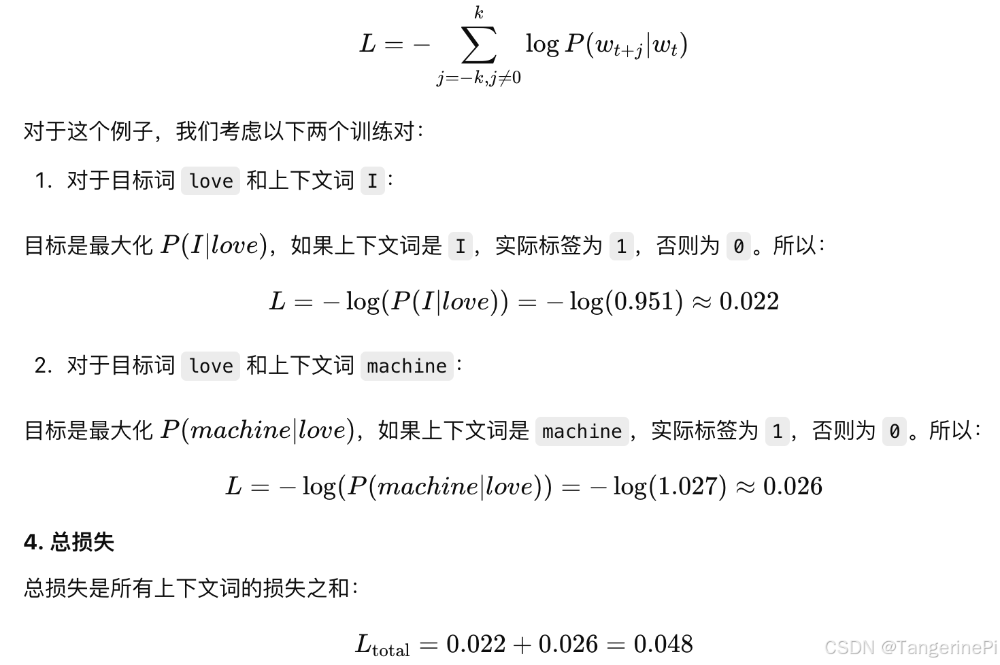
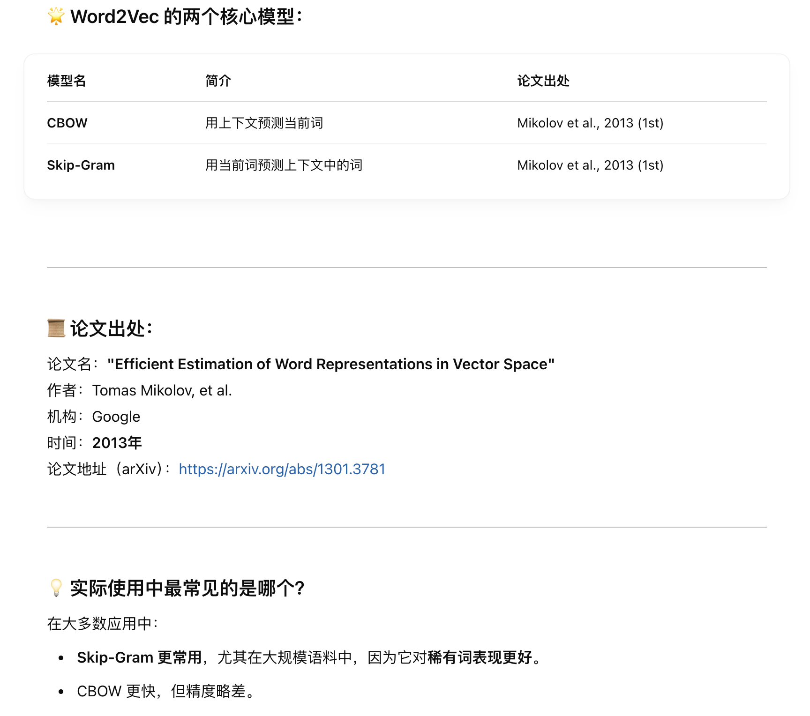
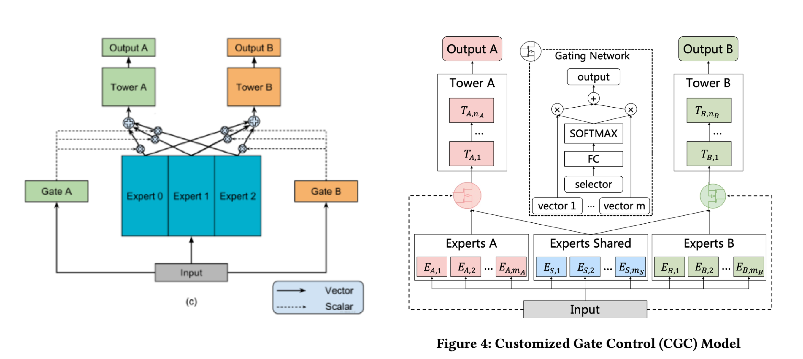
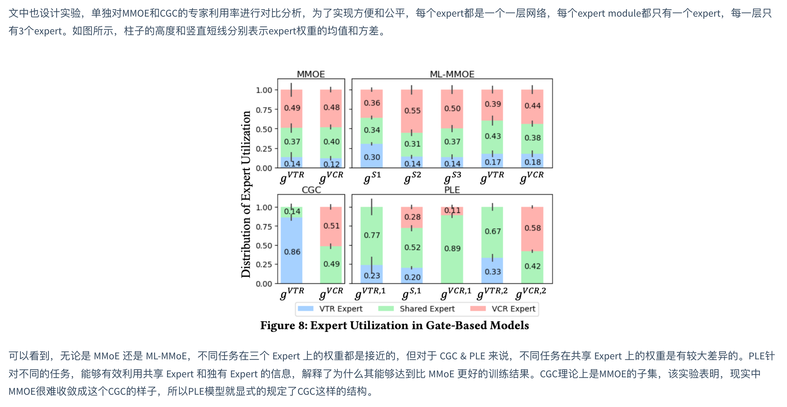

# Embedding

## Word2Vec

### 1. 介绍下item2vec模型

Item2Vec 的原理十分十分简单，它是基于 Skip-Gram 模型的物品向量训练方法。但又存在一些区别，如下：

- 词向量的训练是基于句子序列（sequence），但是物品向量的训练是基于**物品集合（set）**。
- 因此，物品向量的训练丢弃了空间、时间信息。

Item2Vec 论文假设对于一个集合的物品，它们之间是相似的，与用户购买它们的顺序、时间无关。当然，该假设在其他场景下不一定适用，但是原论文只讨论了该场景下它们实验的有效性。

由于忽略了空间信息，原文将共享同一集合的每对物品视为正样本。目标函数如下：
$$
\frac{1}{K}\sum_{i=1}^{K}\sum_{j \neq i}^{K}log{p(w_j|w_i)}
$$

- 对于窗口大小 K，由设置的决定。
- 在 Skip-Gram 模型中，提到过每个单词 $w_i$ 有2个特征表示。在 Item2Vec 中同样如此，论文中是将物品的中心词向量 $u_i$ 作为物品的特征向量。作者还提到了其他两种方式来表示物品向量：

- **Add:** $u_i + v_i$
- **Concat:** $[u_i^Tv_i^T]^T$

原文还补充到，这两种方式有时候会有很好的表现。

**Item2Vec有以下特点：**

1. Item2Vec 的原理很简单，就是基于 Word2Vec 的 Skip-Gram 模型，并且还丢弃了时间、空间信息。

2. 基于 Item2Vec 得到物品的向量表示后，物品之间的相似度可由二者之间的余弦相似度计算得到。
3. 可以看出，Item2Vec 在计算物品之间相似度时，仍然依赖于不同物品之间的共现，因此其无法解决物品的冷启动问题。
   - 一种解决方法：取出与冷启物品**类别相同**的非冷启物品，将它们**向量的均值**作为冷启动物品的向量表示。


### 2. w2v的原理了解嘛，详细讲


两种方法的优化目标都是：使用交叉熵损失函数，目标是最小化`目标词`与`真实上下文词`之间的预测误差（注意是真实上下文）。

以skip-gram为例：

 

而CBOW则只优化“需要预测的真实单词“的概率。


### 3. word2vec的loss怎么设计的

**Skip-gram + Negative Sampling**

 

**CBOW + Negative Sampling**

 

### 4. word2vec的工具

 


### 5. word2vec对顺序敏感的原因，窗口大小选用多少

无论是 **CBOW** 还是 **Skip-gram**，Word2Vec 本质上是：

> 在窗口内，用一个词的上下文词来预测中心词，或者用中心词来预测上下文词。

因此训练出的每个词的embedding是带有上下文信息的，以下面句子为例：

```
I love deep learning very much
```

设窗口大小 `window = 2`，对目标词 `"deep"`，Word2Vec 建立的词对是：

- ("deep", "I")
- ("deep", "love")
- ("deep", "learning")
- ("deep", "very")

这里的含义是：`deep` 的语义是跟 "I"、"love"、"learning"、"very" 强相关的。

而如果打乱顺序：

```
Very much learning deep love I
```

可以看到`"deep"`和`"very"`就不在共现，这样deep的embed语义也会完全改变。

 

### 6. w2v用的哪一个，是google13年的那篇嘛

 


## 1. embedding冷启动怎么做

参考：[如何解决深度推荐系统中的Embedding冷启动问题？——王喆](https://zhuanlan.zhihu.com/p/351390011)

主要依赖四个方面：1. 信息和模型；2. 补充机制；3. 工程框架；4. 跳出固有思维；

1、**补充Side Information**

- 利用EGES的类似方案，在Embedding模型中加入更多非行为历史类特征，让Embedding能够覆盖更多物品和用户
- 利用Amazon Video方案，直接在主模型中加入更多物品、用户特征，即使没有Embedding也可以做出靠谱的预测

> **王喆老师这里留下一个问题，你觉得EGES生成Embedding的方式和Word2vec一样吗？我们应该从哪里拿到每个Item的Embedding？**
>
> 1. 有些不一样，与Item2Vec相比，从Hidden Representation之后的过程很类似；不同是EGES不只是用物品关系来训练，还融入了side information，理论上Embed表达应该会更丰富、精准。
>
> 2. Hidden Representation？或者Dense Embeddings可以做不同的融合，sum/concat等等。

2、**灵活的冷启动机制**

- 不要陷入“完美主义”的怪圈（只采用简单的特征“先启动”才是关键）

- 采用Airbnb方案，利用物品之间的相似性，对冷启动物品根据相似物品，快速生成初始化Embedding
- 聚类，决策树等经典模型

3、**工程框架的改进**

- 批处理->流处理->实时推断->边缘计算，让新信号的消费变得越来越实时

4、**跳出固有思维**

- 使用探索与利用、主动学习等思路解决问题
- 寻求更广阔的合作，与产品、运营、数据团队做团队间的合作


## 2. Deepwalk的思想

**DeepWalk** 是一种将图结构中的节点（比如社交网络中的用户、物品图中的商品等）**嵌入到低维向量空间**的方法，灵感来自自然语言处理中的 **Word2Vec**。它的核心思想是：

> **DeepWalk = 随机游走 + Word2Vec（Skip-Gram）**
>
> 把图当作句子生成器，通过**随机游走（Random Walk）**模拟“句子”，再用 **Skip-Gram** 学习每个“单词”（节点）的向量表示。

### 2.1 主要步骤

**Step 1：图上进行随机游走（Random Walk）**

- 对每个节点 `v`，从它开始，走 `γ` 条路径（walks），每条路径长度为 `t`。
- 就像在社交图上模拟“一个用户的访问轨迹”。

✅ 结果：生成了很多路径序列，例如：

```
节点路径：A → B → D → E → F  
类似于一句“话”：["A", "B", "D", "E", "F"]
```

**Step 2：使用 Word2Vec 中的 Skip-Gram 模型**

- 把每条路径当成一个句子，把节点当成词。
- 学习：给定中心节点，预测其上下文节点。

✅ 输出：每个节点一个向量，比如：

```
embedding["A"] = [0.25, -0.18, ..., 0.04]  # 维度为 d，一般是128或256
```

**示例图：**

假设有如下图结构：

```
   A
  / \
 B   C
  \ / \
   D   E
```

- 对节点 A 做随机游走可能产生路径：
  - A → B → D → C → E
  - A → C → D → B → A

这些路径当成“句子”，送入 Word2Vec 来训练。

 

### 2.2 DeepWalk相比序列embedding优缺点，对哪一部分item影响最大

 

**🎯哪部分 item 表示受影响最大？**

✔️ **长尾 item（冷门 item）**

DeepWalk 对长尾 item（冷门、交互数据稀疏的 item）尤其有优势：

- 在序列 embedding 中，长尾 item 出现次数少，无法学到稳定的向量。
- 而 DeepWalk 在图中可以借助其邻居节点（与其他 item 的共现关系），**通过游走带来额外上下文**，从而获得更鲁棒的 embedding。


## 3. Node2vec随机游走策略

`Node2Vec` 是对 `DeepWalk` 的改进，它最重要的贡献就是引入了一个更加**灵活的随机游走策略**，让游走过程可以在 **BFS（宽度优先）** 和 **DFS（深度优先）** 之间自由切换，从而在学习节点表示时兼顾“**结构相似性**”和“**社区相似性**”。

> **结构相似性：**即使两个节点远在图的不同部分，但它们在各自局部结构中的角色是相似的。（即节点在“图结构中扮演的角色”相似。）
>
> **社区相似性：**节点之间通过路径或边紧密连接，属于同一个局部簇或社区。（即节点“在一起”，在图中是邻居、朋友、同圈子。）

### 3.1 游走策略

**核心目标**

在图中采样更“有目的”的路径，而不是像 DeepWalk 那样纯随机走。

**两个控制参数：**

| 参数            | 作用                                 | 类比行为                             |
| --------------- | ------------------------------------ | ------------------------------------ |
| `p`（返回参数） | 控制回到上一个节点的概率（是否回头） | 控制游走是否**倾向留在当前位置附近** |
| `q`（探索参数） | 控制往远处走的概率                   | 控制游走是否**探索新区域或节点**     |

**转移概率定义**

假设当前从节点 `t` 走到了节点 `v`，下一步要从 `v` 选择一个邻居 `x`，那么选择 `x` 的**权重 w**如下：
$$
\pi(t, x) \propto w_{vx} \times \alpha(t, x)
$$
其中，$w_{vx}$ 是边 (v,x) 的权重（默认 1），$\alpha(t, x)$ 是基于上一步 `t` 到 `x` 的“距离”决定的因子：

| 距离 d = dist(t, x) | 含义         | α(t,x) |
| ------------------- | ------------ | ------ |
| d = 0               | 回头走       | 1/p    |
| d = 1               | 邻居节点     | 1      |
| d = 2               | 向更远的节点 | 1/q    |

> 注意：
>
> - d=0 表示回到上一步走过的节点
> - d=1 是正常往邻居走
> - d=2 是跳到不邻接上一步的节点

**不同参数的行为**

| `p`   | `q`                      | 游走风格             | 类似方式         |
| ----- | ------------------------ | -------------------- | ---------------- |
| 小    | 大                       | 类似 BFS（探索邻居） | 适合找“同类节点” |
| 大    | 小                       | 类似 DFS（走远路径） | 适合保留图结构   |
| p=q=1 | 标准随机游走（DeepWalk） | baseline             |                  |

### 3.2 对比 DeepWalk 和 Node2Vec 游走差异

| 特点     | DeepWalk | Node2Vec                 |
| -------- | -------- | ------------------------ |
| 游走方式 | 均匀随机 | 有偏随机（根据 p/q）     |
| 控制参数 | 无       | p 和 q                   |
| 可调性   | 不可调   | 灵活调整探索/返回        |
| 嵌入质量 | 好       | 更好（尤其结构复杂的图） |


# 多任务学习

## ESMM

> **Entire Space Multi-Task Model** 全空间多任务模型

### 1. ESSM算法原理和解决的两个问题（算法简介）

**ESSM解决的两个问题**

 


即**样本选择偏差**和**稀疏数据**：

- 样本选择偏差（sample selection bias，SSB）：

  如图所示，CVR模型的正负样本集合={点击后未转化的负样本+点击后转化的正样本}，但是线上预测的时候是样本一旦曝光，就需要预测出CVR和CTR以排序，样本集合={曝光的样本}。

  构建的训练样本集相当于是从一个与真实分布不一致的分布中采样得到的，这一定程度上违背了机器学习中训练数据和测试数据独立同分布的假设。

- 训练数据稀疏（data sparsity，DS）：点击样本只占整个曝光样本的很小一部分，而转化样本又只占点击样本的很小一部分。如果只用点击后的数据训练CVR模型，可用的样本将极其稀疏。


**算法原理**


> 可以看到CVR的条件是知道“曝光”（x）+“点击”（y），而CTR和CTCVR条件只需要知道“曝光”（x）即可；


> 损失只用pCTCVR和pCTR进行计算，因此在样本集合={曝光的样本}中，模型对pCTCVR和pCTR进行预测是合理的；至于最终预测pCVR时，用pCTCVR和pCTR计算得出。


### 2. ESMM中如何解决CVR样本过于稀疏的问题，实际上解决了吗

**ESMM中如何解决CVR样本过于稀疏的问题**

不直接预测 pCVR（点击后转化概率），而是：

- 训练 pCTR（曝光到点击的概率）
- 训练 pCTCVR（曝光到点击且转化的概率）

两者都可以用 **曝光样本** 来训练！

**监督信号变成：**

- 曝光但没点击的样本：pCTR 应该小，pCTCVR 应该小
- 曝光且点击但未转化的样本：pCTR 大，pCTCVR 小
- 曝光且点击且转化的样本：pCTR 大，pCTCVR 大

最后，通过公式：
$$
pCVR = \frac{pCTCVR}{pCTR}
$$
推导出想要的 pCVR。


**实际上解决了吗？**

极大程度上缓解了CVR样本过于稀疏的问题，但不是彻底解决：

1. **曝光样本虽然多，但正样本（转化）仍然少**

- 曝光 ➔ 点击 ➔ 转化，本身就是逐步流失的过程，最终正例极少。
- pCTCVR的正例（曝光点击且转化）还是很稀少！

2. **分式推导存在数值不稳定问题**

- 特别是 pCTR 很小时，pCTCVR/pCTR 可能会爆大，训练要小心。

3. **样本标签噪声问题**

- 曝光没点击不一定是负例，可能是因为位置曝光不好等外部因素。

> 如何改进上述问题？
>
> 1. 重采样等；
>
> 2. ESMM2：构建三个塔，一个塔预测 **pCTR**（曝光 ➔ 点击），一个塔预测 **pCVR**（点击 ➔ 转化），新加一个塔，直接预测 **pCTCVR**（曝光 ➔ 点击且转化），再用 soft constraints 保持：$pCTCVR \approx pCTR \times pCVR$；
>
>    通过监督CTCVR和CTR，通过约等号间接监督pCVR，因此pCVR可以单独训练，不再除法推导！
>
> 3. 用**偏置修正（importance weight）**来训练，对消除因为曝光位置造成模型训练效果不好：
>
>    - 直接把位置放入特征，让模型学习；
>    - 给每条曝光样本加上一个**位置校正权重**：$w_i=\frac{1}{p(click|exposure \ position)}$
>    - 只在**曝光位置靠前**的样本上训练（比如Top N条），减少低质量曝光样本。

### 3. ESMM训练是否使用全量样本

是的，因为 CTR、CTCVR 都是定义在**曝光样本集合上的**，所以 **ESMM的训练用的是所有曝光的样本**，不再只靠点击样本了。


## MMOE

> Multi-gate Mixture-of-Experts 多门控混合专家

### 1. 介绍MMOE模型

**背景与动机**

- hard parameter sharing 方法：共享底层隐藏层，即每个tower的输入都相同；

  问题：任务之间存在冲突时，底层强制的shared layers难以学习到适用于所有任务的有效表达。

- 任务序列依赖关系建模：适合于不同任务之间有一定的序列依赖关系（这里的序列是指交互顺序的先后）。比如电商场景里面的ctr和cvr，其中cvr这个行为只有在点击之后才会发生。所以这种依赖关系如果能加以利用，可以解决任务预估中的样本选择偏差(SSB)和数据稀疏性(DS)问题。

  > 样本选择偏差: 后一阶段的模型基于上一阶段采样后的样本子集训练，但最终在全样本空间进行推理，带来严重泛化性问题
  >
  > 样本稀疏： 后一阶段的模型训练样本远小于前一阶段任务

  代表模型：ESSM，DBMTL，ESSM2等。

- soft parameter sharing 方法：这个范式对应的结果从`MOE->MMOE->PLE`等。即底层不是使用共享的一个shared bottom，而是有多个tower， 称为多个专家，然后往往再有一个gating networks在多任务学习时，给不同的tower分配不同的权重。

  好处：那么这样对于不同的任务，可以允许使用底层不同的专家组合去进行预测，相较于上面所有任务共享底层，这个方式显得更加灵活。

**模型介绍**


MMOE主要解决hard parameter sharing（a）存在的问题。

**多门控多专家模型的优点：**

1. 模型集成思想： 这个东西很像bagging的思路，即训练多个模型进行决策，这个决策的有效性显然要比单独一个模型来的靠谱一点，不管是从泛化能力，表达能力，学习能力上，应该都强于一个模型。
2. 注意力思想：为了增加灵活性， 为不同的模型还学习了重要性权重，这可能考虑到了在学习任务的共性模式上， 不同的模型学习的模式不同，那么聚合的时候，显然不能按照相同的重要度聚合，所以为各个专家学习权重，默认了不同专家的决策地位不一样。这个思想目前不过也非常普遍了。
3. multi-head机制：从另一个角度看， 多个专家其实代表了多个不同head, 而不同的head代表了不同的非线性空间，之所以说表达能力增强了，是因为**把输入特征映射到了不同的空间中去学习任务之间的共性模式**。可以理解成从多个角度去捕捉任务之间的共性特征模式。

**MMOE（Multi-gate）相较于OMOE（One-gate）的好处**

- 首先，就刚才分析的OMOE的问题，在专家组合选取上单门控会产生限制，此时如果多个任务产生了冲突，这种结构就无法进行很好的权衡。 而MMOE就不一样了。MMOE是针对每个任务都单独有个门控选择专家组合，那么即使任务冲突了，也能根据不同的门控进行调整，选择出对当前任务有帮助的专家组合。所以，我觉得单门控做到了**针对所有任务在专家选择上的解耦**，而多门控做到了**针对各个任务在专家组合选择上的解耦**。
- 多门控机制能够建模任务之间的关系了。如果各个任务都冲突， 那么此时有多门控的帮助， 此时让每个任务独享一个专家，如果任务之间能聚成几个相似的类，那么这几类之间应该对应的不同的专家组合，那么门控机制也可以选择出来。如果所有任务都相似，那这几个门控网络学习到的权重也会相似，所以这种机制把任务的无关，部分相关和全相关进行了一种统一。
- 灵活的参数共享， 这个我们可以和hard模式或者是针对每个任务单独建模的模型对比，对于hard模式，所有任务共享底层参数，而每个任务单独建模，是所有任务单独有一套参数，算是共享和不共享的两个极端，对于都共享的极端，害怕任务冲突，而对于一点都不共享的极端，无法利用迁移学习的优势，模型之间没法互享信息，互为补充，容易遭受过拟合的困境，另外还会增加计算量和参数量。 而MMOE处于两者的中间，既兼顾了如果有相似任务，那就参数共享，模式共享，互为补充，如果没有相似任务，那就独立学习，互不影响。 又把这两种极端给进行了统一。
- 训练时能快速收敛，这是因为相似的任务对于特定的专家组合训练都会产生贡献，这样进行一轮epoch，相当于单独任务训练时的多轮epoch。


### 2. mmoe和esmm底层是软共享还是硬共享？

MMoE属于软共享模型，ESMM属于硬共享模型。

两者底层都基于Shared-Bottom结构，但MMoE引入了多个专家和门控网络，可以实现更灵活的参数共享；

而ESMM则是通过建模任务之间的序列依赖关系，解决了样本选择偏差和数据稀疏性问题，实现了任务之间的硬共享。


### 3. 如何区分软共享和硬共享？

**硬共享和软共享的主要区别在于任务之间共享参数的方式和程度。**

- 硬共享是指所有任务共享底层的特征提取层，这些共享层的参数对所有任务都是相同的。
- 常见的模型有：Shared-Bottom、ESMM，硬共享模型计算效率高、共享程度高；
- 软共享是指任务之间共享部分参数，但每个任务可以有自己的任务特定参数。这种共享方式通常通过某种机制（如门控网络）来动态调整共享参数的使用。常见的模型有：MMOE、PLE、CGC、PEPNet等，软共享模型更为灵活，能够平衡任务之间的共享和独立性。


### 4. 分别说一下mmoe和esmm?

- **MMOE**对Shared-Bottom进行了改进，**将原来单一的共享网络，改为了多个共享专家网络，并通过门控网络来控制不同的共享网络对于不同任务的贡献度**，多门控做到了**针对各个任务在专家组合选择上的解耦**，能够建模任务之间的关系；
- **ESMM**借鉴**多任务学习的思路，引入两个辅助任务CTR、CTCVR（已点击然后转化），辅助CVR学习**，在训练过程中，模型只需要预测pCTCVR和pCTR，利用两种相加组成的联合loss更新参数。由于pCTCVR和pCTR的数据是在完整样本空间中提取的，从而相当于pCVR也是在整个曝光样本空间中建模，解决了样本选择偏差和数据稀疏性问题。


## PLE

> Progressive Layered Extraction 逐级分层提取

### 1. 介绍PLE模型

**背景与动机**

多任务学习中不可避免的两个缺点：

- 负迁移（Negative Transfer）：针对相关性较差的任务，使用shared-bottom这种硬参数共享的机制会出现负迁移现象，不同任务之间存在冲突时，会导致模型无法有效进行参数的学习，不如对多个任务单独训练。
- 跷跷板现象（Seesaw Phenomenon）：针对相关性较为复杂的场景，通常不可避免出现跷跷板现象。即使通过MMOE这种方式减轻负迁移现象，跷跷板问题仍然广泛存在。（2. 详细说明了MMOE为什么只能减轻）

MMOE网络存在如下几个缺点：

- MMOE中所有的Expert是被所有任务所共享，这可能无法捕捉到任务之间更复杂的关系，从而给部分任务带来一定的噪声。
- 在复杂任务机制下，MMOE不同专家在不同任务的权重学的差不多
- 不同的Expert之间没有交互，联合优化的效果有所折扣

**模型介绍**

**CGC(Customized Gate Control) 定制门控**

将共享的部分和每个任务特定的部分**显式的分开**，强化任务自身独立特性。

 

解决了MMOE中：1️⃣ 所有的Expert是被所有任务所共享，无法捕捉到任务之间更复杂的关系；2️⃣ MMOE不同专家在不同任务的权重学的差不多；这两个问题。

**PLE (progressive layered extraction) 分层萃取**

PLE就是上述CGC网络的多层纵向叠加，以获得更加丰富的表征能力。在分层的机制下，Gate设计成两种类型，**使得不同类型Expert信息融合交互**。task-share gate（蓝色门）融合所有Expert信息，task-specific gate（红绿门）只融合specific expert和share expert。模型结构如图：

 

解决了MMOE中：3️⃣ 不同的Expert之间没有交互；的问题。

### 2. PLE相对于MMOE的改进

**（1）CGC(Customized Gate Control) 定制门控（模型）**

 对比MMOE（左）与PLE（右）可以看到，PLE的CGC模型最大的不同就是：

将不同的任务对应的专家进行了**显示的分开**，针对Output A专门有一组专家$E_{A,1} \sim E_{A,m_A}$专门做判断，而不同任务之间的联系由专门的一组专家做判断。



**CGC这样做有必要吗？MMOE也可以由gate控制不同任务之间的共性和区别？**

有必要的，专家的显示分离，**确保了**Expert“各有所得”，更好的降低了弱相关性任务之间参数共享带来的问题，因为各个专家专门判断，因此能够进一步缓解“跷跷板效应”。

在模型角度看，在梯度传播过程中：

- MMOE的每个专家**“均会受到不同任务梯度的影响“**，虽然使门口机制（gate）理论上可以捕捉到任务之间的关系，比如任务A可能与任务B确实无关，则MMOE中gate可以学到，让个别专家对于任务A的权重趋近于0，近似得到PLE中提出的task-specific expert，但是这只是一种“希望”具体是否能学到Expert之间的关系就完全交给了模型。

- PLE的CGC模型对Expert做一个显式的分割，可以让task-specific expert（Experts A/B）只受自己任务梯度的影响，不会受到其他任务的干扰（每个任务保底有一个独立的网络模型)，而只有task-shared expert才受多个任务的混合梯度影响。

  > 因为Expert A中的模型只参与到Output A到计算之中，因此Expert A部分的训练只受A指标的影响；
  >
  > 只有Experts Shared中的参数才会受到所有任务/指标的影响，因为它参与到了所有指标的计算之中；

一句话来概括，如果说MMOE是**希望**让expert网络可以对不同的任务各有所得，则PLE是**保证**让expert网络各有所得。（一个是“希望”但具体怎样完全交给gate去学习，一个是CGC能够“确保”各专家学习到针对各自任务的判断）

从PLE论文的实验部分也可以看到，MMOE的权重都比较平均，而PLE真正做到了不同专家各有所得：



**（2）PLE (progressive layered extraction) 分层萃取**

使不同的Expert之间进行信息交换，论文实验中证明这种不同类型expert信息的交叉，可以带来更好的效果。

### 3. PLE里面loss如何平衡

PLE的损失总体上还是采用了加权平均的方法，在此基础上加入了：1️⃣ 只用任务对应的样本空间内，计算对应任务的损失；2️⃣ 任务权重随迭代次数不断衰减；

其实 **每个任务通过门控学到的共享/私有特征比例也起到了一部分任务平衡的作用**。但总体上，最后的 loss 加权还是需要调好，尤其是涉及主任务/辅任务的权重。


> 参考


### 4. PLE模型中，是否有尝试对不同的gate用不同的特征，是否有尝试不同业务用不同的特征组合

- 在PLE原本设定中，不同任务的 gate，默认是用同一套特征输入的。

- 在工业实践中（比如大厂推荐系统），可以使用不同的特征组合：
   

- 也可以做特征自适应选择，在输入层加一层 **特征选择 gate（attention）**，让模型根据任务自动挑特征，不人工硬选。


## 1. 多任务学习模型的发展历史详细介绍


##  2. 为什么要用多任务学习


> 多任务学习有效的原因是引入了归纳偏置，两个效果：
>
> - 互相促进： 可以把多任务模型之间的关系看作是互相先验知识，也称为归纳迁移，有了对模型的先验假设，可以更好提升模型的效果。解决数据稀疏性其实本身也是迁移学习的一个特性，多任务学习中也同样会体现
> - 泛化作用：不同模型学到的表征不同，可能A模型学到的是B模型所没有学好的，B模型也有其自身的特点，而这一点很可能A学不好，这样一来模型健壮性更强

## 3. 多任务loss更高效的融合机制

> 推荐首先尝试两种简单实用的方法，GrandNorm和UWL，具体实现细节查看下文所附的参考资料。

### 3.1 UWL（Uncertainty Weight）

> 通过自动学习任务的uncertainty，给uncertainty大的任务小权重，uncertainty小的任务大权重；

 

设置一个参数$\sigma_i$，训练过程中，$\sigma_i$会被不断更新，以最小化总loss；

**直觉理解：**

- 如果当前 Li 很大 → σi 更新时倾向于变大 → **降低这个任务loss的权重**
- 如果当前 Li 很小 → σi 更新时倾向于变小 → **提高这个任务loss的权重**


### 3.2 GradNorm

> 结合任务梯度的二范数和loss下降梯度，引入带权重的损失函数Gradient Loss，并通过梯度下降更新该权重。
>
> GradNorm通过**调整各任务loss的权重**，使**各任务在训练过程中的梯度规模（L2范数）保持一致**。

 

**$g_i = \|\nabla_\theta (w_i L_i)\|_2$ 的含义**

计算过程：

1. 先把任务 $i$ 的$loss \  L_i$  乘上它当前的权重 $w_i$；
2. 然后对共享网络参数 $\theta$ 求梯度；
3. 再计算这个梯度的L2范数；

L2范数衡量的是这个梯度「整体有多大」；

L2范数越大，说明该梯度越大，说明这个任务相关的参数更新得越猛。

**GradNorm要做什么？**

GradNorm 希望：

- **让所有任务的训练速度保持一致**。
- 速度快的任务，降低它的权重（w小一些）
- 速度慢的任务，提高它的权重（w大一些）

所以它设计了一个新的损失叫 **Gradient Loss**：$L_{\text{grad}} = \sum_i |g_i - \tilde{g}_i|$

其中：

- $g_i$ 是任务 $i$ 当前的真实梯度大小
- $\tilde{g_i}$ 是目标梯度大小（设定为训练速度的一个基准）

通过最小化这个 Gradient Loss，来动态更新每个任务的 $w_i$。

> **为什么Gradient Loss可以使所有任务的训练速度保持一致？**
>
> 损失一般是衡量 $\hat{y}$ 和 $y_{true}$ 之间的差距，从而使预测值向真实值逼近，而这里的g建模的是任务i的梯度大小，Gradient Loss的目标则是让 $g_i$ 逼近 $\tilde{g}_i$；
>
> **为什么要让“速度快的任务的权重小”，“速度慢的任务权重大”？**
>
> 如果单纯的把所有任务的损失直接加载一起：$L_{\text{total}} = \sum_i w_i L_i$
>
> - 一般简单的任务（规则比较简单）的loss下降很快，对总体损失的$L_{\text{total}}$贡献很大；
> - 而困难的任务（比较难学习）的loss下降比较慢，对总体损失$L_{\text{total}}$的贡献很小；
>
> 这样就会导致**训练过程被简单任务主导**，从而使模型的大部分更新方向，会去**优化那些已经很简单、很容易训练好的任务**。
>
> 平均训练速度就可以：
>
> **把训练资源（梯度）重新分配**，把更多学习能力，倾斜到困难任务上，把简单任务的干扰减弱掉。
>
> 这样做的好处是：
>
> - 模型不会被简单任务牵着走
> - 难的、慢的任务也能跟上节奏
> - **所有任务同步收敛，整体效果最好**


### 3.3 项目中Loss是怎么设计的，知不知道一些自适应的调loss权重的方法？

- **推荐项目中常见的Loss函数：**KL散度、二元交叉熵、多元交叉熵、focal loss等；
- **自适应调权重方法：**UncertaintyWeight、GradNorm、PCGrad、DWA等。

#### 3.3.1 KL散度

作用：衡量两个概率分布之间的差异，常用于**知识蒸馏、概率分布对齐**等；

定义：
$$
\text{KL}(P || Q) = \sum_{i} P(i) \log \left(\frac{P(i)}{Q(i)}\right)
$$
其中 P 是真实分布，Q 是预测分布。

**推荐系统中常在多目标模型中使用**

以ESMM为例，我们希望建模出：$P_{CTCVR} = P_{CTR} \times P_{CVR}$，但是模型输入通常是全量数据，这样会导致对CVR预测不准：

- 没点击的样本其实不该参与 CVR 的训练；

- 模型可能学出不合理的 CVR 值；

- 导致 CTR × CVR ≠ CTCVR。

**这时就可以使用KL散度作为输出分布约束：**$L_{\text{KL}} = D_{\text{KL}} \left( P_{\text{CTR}}(x) \cdot P_{\text{CVR}}(x) \parallel P_{\text{CTCVR}}(x) \right)$

具体损失结构如下：$L_{\text{total}} = \lambda_1 L_{\text{CTR}} + \lambda_2 L_{\text{CVR}} + \lambda_3 L_{\text{CTCVR}} + \lambda_4 L_{\text{KL}}$

其中：

$L_{\text{CTR}}$：标准的二分类交叉熵；

$L_{\text{CVR}}$：仅在点击样本中计算的交叉熵；

$L_{\text{CTCVR}}$：对全样本计算的交叉熵；

$L_{\text{KL}}$：输出之间的一致性正则，鼓励模型学到满足 $\text{CTR} \cdot \text{CVR} = \text{CTCVR}$ 的分布。

#### 3.3.2 二元交叉熵（Binary Cross-Entropy, BCE）

**作用：**

用于二分类任务或**点击率预测（CTR）、是否喜欢/点击等二值任务**。

**定义：** 

对每个样本的标签 $ y \in \{0, 1\} $，预测概率为 $ \hat{y} \in [0, 1] $：
$$
\text{BCE} = - \left[ y \log(\hat{y}) + (1 - y) \log(1 - \hat{y}) \right]
$$
**特点：**

- 通常用于 `sigmoid` 输出后接 `BCEWithLogitsLoss`（数值更稳定）
- 在推荐系统中很常见（是否点击、是否喜欢）

#### 3.3.3 多元交叉熵（Categorical Cross-Entropy）

**作用：**

用于多分类任务，例如在推荐系统中给定用户预测其喜欢的类别（商品类、标签类等）。

**定义：**

对于真实标签 one-hot 向量 $ \mathbf{y} $，预测概率向量 $ \hat{\mathbf{y}} $：

$$
\text{CrossEntropy} = - \sum_{i} y_i \log(\hat{y}_i)
$$
**特点：**

- 对于非one-hot标签（如类索引），使用 CrossEntropyLoss，它内部带 softmax

- 对类别不平衡敏感，可使用加权

#### 3.3.4 Focal Loss（焦点损失）

**作用：**

解决类别不平衡问题，在CTR任务或少数类非常重要的推荐中很有效。

**定义（针对BCE）：**
$$
\text{FL}(p_t) = - \alpha_t (1 - p_t)^\gamma \log(p_t)
$$
其中：

- $\alpha_t = 
  \begin{cases}
  \alpha, & \text{if } y = 1 \\
  1 - \alpha, & \text{otherwise}
  \end{cases}$
- $p_t = 
  \begin{cases}
  \hat{y}, & \text{if } y = 1 \\
  1 - \hat{y}, & \text{otherwise}
  \end{cases}$
- $\alpha$：平衡正负样本权重（YOLOv8 的代码中，$\alpha_t$在正样本取 0.25，负样本取 0.75）；
- $\gamma$：调整难易样本的关注度（通常为 2）；

**特点：**

- $\gamma$ 越大，对 hard 样本（预测置信度低）越关注；
- 广泛用于目标检测（如 RetinaNet）和推荐系统中的长尾样本建模。

> 为什么Focal loss可以关注**“预测置信度低”**的样本？
>
> ✅ 当模型对样本很自信（即 $p_t$ 很大）时，$(1 - p_t)^\gamma \approx 0$，这类“容易分类”的样本被忽略；
>
> ✅ 当模型不自信（$p_t$ 小），这个因子接近 1，保留原始损失。

#### 3.3.5 PCGrad（Projected Conflicting Gradient）

📌 **PCGrad** 是为了解决多任务学习中**任务梯度冲突（Gradient Conflict）**而提出的一种优化技术。

设有两个任务的梯度 $g_1, g_2$。若它们冲突（即内积为负）：
$$
\langle g_1, g_2 \rangle < 0
$$
则将 $g_1$ 投影到 $g_2$ 的正交方向：
$$
g_1' = g_1 - \frac{\langle g_1, g_2 \rangle}{\|g_2\|^2} g_2
$$
这样就移除了与 $g_2$ 冲突的方向，保留其“非冲突”部分。

最终所有任务的梯度融合后更新共享参数。

#### 3.3.6 DWA（Dynamic Weight Averaging）

📌 **DWA** 是一种根据**任务训练动态（loss 下降速度）自动调整损失权重**的策略，用于多任务学习中的任务平衡。

在多任务学习中，常见的损失组合形式为：

$$
L_{\text{total}} = \sum_{i=1}^{T} w_i \cdot L_i
$$

传统方法中，$w_i$ 是静态设置的。但不同任务训练速度不同，静态权重不适应训练动态。

**DWA 的思想**

DWA（Dynamic Weight Averaging）使用如下方式动态调整每个任务的权重：

$$
\lambda_i(t) = \frac{T \cdot \exp(r_i^{(t - 1)}/T)}{\sum_{j=1}^{T} \exp(r_j^{(t - 1)}/T)}
$$

其中：

- $r_i^{(t - 1)} = \frac{L_i^{(t - 1)}}{L_i^{(t - 2)} + \epsilon}$ 是任务 $i$ 最近两轮的 loss 变化率。

- $T$：温度系数（控制平滑度），通常设为 2；

> 核心思想：损失下降慢的任务（说明学得困难）会被赋予更高权重，从而被更多关注。


## 4. 如果一个特征对任务a是正相关，对任务b是负相关，如何处理这个特征

使用类似PLE的机制，为每个任务分配单独的专家，这样梯度传播时，task-specific expert只会受到对应任务损失计算的影响，不同特征会被专属专家学习到。


## 5. CTR和CVR任务放在ESMM（都是曝光空间）里和放在PLE（CTR点击空间，CVR曝光空间）里哪种效果好

关键还是要看给出的特征对于CTR和CVR冲不冲突，总的来说可以遵循以下规律：

- 如果**CTR和CVR特征冲突严重、业务复杂**，推荐使用**PLE**。
- 如果**任务简单，没太大冲突**，用**ESMM**足够。

举例来说，比如你在做一个电商推荐系统，特征有：

- 价格（price）
- 商品曝光位置信息（exposure position）
- 商品折扣力度（discount）
- 用户最近点击记录

任务是：A：CTR（用户点不点）；B：CVR（用户买不买）；

**ESMM**

**价格**、**曝光位置**这类**对CTR和CVR有冲突作用**的特征，学不好。（例如便宜的商品容易点，但买的不一定多）

> 价格对于两者有冲突作用，是因为：价格低的商品容易吸引人点击(CTR)，但是可能只是因为好奇或商品质量差导致购买（转化）的比率(CVR)其实并不高；
>
> 曝光位置对于两者有冲突作用，是因为：曝光位置靠前的商品更容易被看到，自然点击量高(CTR)，但是用户是否购买取决于用户需求，跟转化率(CVR)有关系但影响不大。

这样，对于**价格**、**曝光位置**这两个特征来说，通常会有跷跷板效应，比如学得令CTR高的表达，但是CVR又会降低；

➡️ 这使得模型难以在CTR和CVR之间精细平衡，会导致**最后CTR、CVR都做到70分，分数还不错，但很难再提高**。

**PLE**

价格、曝光位置这些冲突特征可以：

- 在CTR分支学「便宜好点」
- 在CVR分支学「贵的转化好」

同时还能共享一部分，比如「用户最近点击记录」这种普适特征。

➡️ **最后CTR做到72分，CVR做到75分，整体上限提高。**


# 图神经网络

## 1. GNN在推荐系统中有哪些用法

**Enhanced Graph Embedding with Side Information（EGES）：**

通过用户的行为历史中构造一个item-item 图，

然后应用随机游走方法在item-item 图为每个item获取到一个序列，

然后通过Skip-Gram的方式为每个item学习embedding(这里的item序列类似于语句，其中每个item类比于句子中每个word)，

这种方式被称为图嵌入方法(Graph Embedding)；

EGES在此基础上，对物品向量和side information对embedding做加权平均，得到最终的物品表示向量：

 

这样做的好处有：1️⃣ 引入side information解决冷启动问题；2️⃣ 解决不同类型的 side information 对商品的表示贡献值不同的问题；

**GraphSAGE**

> Graph Sample and Aggregation 图采样+聚合

在item2item 图中，**通过聚合邻居信息的方式为给定的节点学习embedding**：

 

相比传统的方法(MLP，CNN，DeepWalk 或 EGES)，GCN或GraphSAGE存在一些优势：

1. 相比于传统的深度学习方法(MLP,CNN)，GCN在对自身节点进行非线性变换时，同时考虑了图中的邻接关系。从CNN的角度理解，GCN通过堆叠多层结构在图结构数据上拥有更大的**感受野**，利用更加广域内的信息。

2. 相比于图嵌入学习方法(DeepWalk，EGES)，GCN在学习节点表示的过程中，在利用节点自身的属性信息之外，更好的利用图结构上的边信息。相比于借助随机采样的方式来使用边信息，GCN的方式能从全局的角度利用的邻居信息。此外，类似于GraphSAGE这种归纳(inductive)学习的GCN方法，通过学习聚合节点邻居生成节点Embedding的函数的方式，更适用于图结构和节点会不断变化的工业场景。

   > 对比EGES和GraphSAGE，EGES只是随机游走获得邻居信息，但是GCN是从外圈向中心节点一层一层做聚合，比EGES这种“链形”更能获得全局信息；

## 2. GCN、GraphSAGE、GAT的区别与联系


## 3. GraphSAGE对比GCN的优势

1. **支持 Inductive 学习（泛化到新节点）**

- **GCN：** 只能做 transductive 学习，必须在**整个图已知**的前提下才能训练和预测。
- **GraphSAGE：** 可以在**新图或新节点**上进行预测，因为它学习的是**聚合函数**而不是依赖固定邻接矩阵。

📌 例如：在推荐系统中，新用户/商品出现后，GraphSAGE 可立即通过邻居信息推理其嵌入，而 GCN 需要重新训练整个图。

2. **聚合方式更灵活（Mean / LSTM / Pooling）**

- **GCN：** 聚合方式固定为邻居特征的归一化平均。
- **GraphSAGE：** 支持多种聚合函数：
  - `mean`：简单平均
  - `LSTM`：可学习顺序特征
  - `pooling`：高维信息抽取

📌 举例：LSTM 聚合器能处理顺序性，比如用户历史行为序列（购买时间顺序）。

3. **支持邻居采样，计算效率高**

- **GCN：** 每一层都需要全图的邻接信息，扩展困难。
- **GraphSAGE：** 支持**邻居采样**（例如每层采样固定数量的邻居），可以在大规模图上高效训练。

📌 推荐系统中，用户-物品图通常非常大，GraphSAGE 的局部采样机制大幅减少计算与内存消耗。

4. **节点特征独立更新，不依赖全图结构**

- GCN 更新节点嵌入时依赖邻接矩阵的归一化，不能直接应用于动态图。
- GraphSAGE 用的是**邻居特征直接聚合和拼接**，结构更灵活，适应图结构变动快的场景。

## 4. transductive与inductive的区别

**Transductive（传导学习）** 和 **Inductive（归纳学习）** 是图神经网络（GNN）中常见的两种学习范式，它们的区别在于 **模型对“新节点/新图”的泛化能力**。


举例说明（推荐系统）

假设你有一个用户-商品的图，训练完模型后来了一个新用户或新商品：

- **Transductive（GCN）**：
  - 新用户没在图里，模型无法直接预测他对商品的点击。
  - 只能重新加入图后、**再训练一遍模型**。
- **Inductive（GraphSAGE）**：
  - 即便新用户没出现在训练图中，只要能拿到他的邻居（比如浏览过的商品），就可以用训练好的聚合器，**直接生成这个用户的嵌入**并预测点击。

## 5. 训练图模型的loss有哪些

交叉熵损失，比如EGES：$L(v, u, y) = - \left[ y \log\left(\sigma(H_v^T Z_u)\right) + (1 - y) \log\left(1 - \sigma(H_v^T Z_u)\right) \right]$

表示根据$(H_v^T Z_u)$预测两个节点之间“是否建立链接”；


## 6. graph embedding的作用

在推荐系统中，**graph embedding（图嵌入）的主要作用是：
 将用户-物品之间的复杂关系**建模为图结构，并将图中节点（用户、物品）映射为**低维向量表示**，从而捕捉更丰富的**协同过滤、语义信息与高阶关系**，以提升推荐效果。

核心作用如下：

1. **捕捉高阶协同关系**

- 在用户-物品二分图中，用户之间没有直接连接，但可以通过**共同交互的物品**连接起来。
- Graph Embedding 能通过图神经网络（如 GCN、GraphSAGE）聚合多阶邻居信息，学习“潜在相似性”。

📌 示例：
 用户 A 没有买过商品 X，但他和买过 X 的用户 B 在图中有共同邻居，可以学习到 A 可能喜欢 X。

2. **统一表示学习**

- 把用户、物品等所有节点嵌入到同一个空间里，方便进行点积、相似度计算、排序等操作。
- 这些向量既可以作为最终推荐的输入，也可以作为其他模型的特征输入。

3. **增强冷启动用户/物品的表示能力**

- 对于没有交互的新用户，只要知道其关联节点（浏览历史、特征等），就能 inductively 学习嵌入（如 GraphSAGE）。

4. **融合异构信息**

- 可以构建异构图（Heterogeneous Graph），融合用户、物品、标签、类别、上下文等多种类型节点和关系，提升表示能力。

5. **辅助监督学习**

- 图嵌入可以作为特征输入到 DNN、DIN、ESMM 等模型中，提升主任务性能（如 CTR/CVR 预测）。

## 7. GCN图卷积

在推荐系统中，**图卷积网络（Graph Convolutional Network, GCN）** 是一种利用图结构数据建模用户和物品之间复杂关系的深度学习方法。它通过聚合邻居节点的信息来更新节点的嵌入表示，从而捕捉高阶交互关系，提升推荐效果。

**核心概念**

**(1) 图结构建模**

- **节点（Node）**：代表实体，例如用户（User）、物品（Item）、类别（Category）等。
- **边（Edge）**：表示实体之间的关系，例如用户点击/购买物品、物品间的相似性、用户间的社交关系等。
- **邻接矩阵（Adjacency Matrix）**：描述节点间的连接关系（如用户-物品二部图）。
- **特征矩阵（Feature Matrix）**：每个节点的初始特征向量（如用户画像、物品属性等）。

**(2) 嵌入表示（Embedding）**

- GCN 的目标是通过图卷积操作，为每个节点生成低维稠密的嵌入向量（Embedding），用于后续任务（如预测用户对物品的兴趣）。


## 8. 怎么减少感受野

1. **减少卷积层数：**图卷积的每一层会聚合一跳邻居的信息。层数越多，感受野越大（即能捕获更多跳数的邻居）。减少层数可以直接缩小感受野。
2. **限制每层的邻居采样个数：**在每一层图卷积中，显式限制聚合的邻居数量（如只取前 K 个最相关的邻居），而非全量聚合所有邻居。（比如在 Pinterest 的 PinSAGE 中，默认设置每层采样 5 个邻居，以平衡感受野和效率。）
3. **使用浅层注意力机制（如 LightGCN）：**通过注意力机制动态调整邻居的权重，隐式过滤掉不重要的邻居，从而有效缩小感受野。
4. 使用局部图采样：对每个节点仅在其局部子图上进行卷积操作，而非全局图。这种方式可以显式控制感受野的大小。（比如减少**Random Walk**的窗口大小）

## 9. 讲一下GCN，为什么用拉普拉斯矩阵，优缺点

### 9.1 什么是GCN


普通GNN就是将邻居节点聚合到当前节点，上图中AX表示邻居节点对累加表示中心节点，AX+X额外加上了自身的信息，而DAX则表示邻居+自身的“平均特征”表示为中心节点：
$$
\text{aggregate}(X) = \hat{D}^{-1} \hat{A} X = \sum_{j=1}^{N} \frac{\hat{A}_{ij}}{\sum_{k=1}^{N} \hat{A}_{ik}} X_j
$$


其中，D为度矩阵（对角矩阵，用于保留自身信息），A为邻接矩阵（表示节点之间的连接），表示用周围节点embed来表示中心节点；

但是这样有一个问题，就是度不同的节点对于中心节点的重要性都相同⚠️。以下图为例，如果A只有B一个邻居，那么就直接把B的特征全部聚合过来了：

 

GCN就是解决这个问题，也就是让不同节点在聚合操作时的贡献不同，下面是GCN的公式：


上图中，DAD就是拉普拉斯矩阵用于表示“如何聚合邻居信息”，H为节点特征，W为权重矩阵；将DAD展开就可以得到下图（右边）：


可以看到DAD的作用其实就是“控制邻居节点的权重”，如果中心节点（i）和邻居节点（j）的度越大，则该邻居节点的“贡献值”就越小，可以理解为：中心和邻居的朋友很多，那么这两者之间的联系不会绑定的很死，反之如果彼此只有这一个朋友，那么就是其全部（即权重为1）；

**W和拉普拉斯矩阵的作用**

 

### 9.2 优缺点

**优点**

1. **高效聚合邻居信息**
   直接通过邻接矩阵聚合一阶邻居特征，无需复杂采样，适合小规模图（如引文网络 Cora、PubMed）。
2. **理论基础扎实**
   基于谱图理论，频域视角为图信号处理提供数学保障，可解释性强。
3. **可扩展性强**
   堆叠多层可捕获多跳邻居信息（如 2 层 GCN 聚合 2 阶邻居）。
4. **同质图表现优异**
   假设相邻节点特征相似，在社交网络、分子结构等同质图任务中效果显著。

**缺点**

1. **计算效率低**
   邻接矩阵的稠密性导致内存占用高，难以处理大规模图（需采样或分块技术）。
2. **过平滑（Over-Smoothing）**
   多层堆叠后，节点特征趋向于相似，失去区分性（深层 GCN 性能下降）。
3. **同质性假设限制**
   对异质图（如用户-商品二部图）效果差，因假设“邻居相似”不成立。
4. **静态图依赖**
   需要全局图结构信息，无法直接处理动态图或新增节点（需重新训练）。
5. **对噪声敏感**
   错误的边（噪声）会直接影响特征传播，鲁棒性较差。

## 10. GCN图谱了解嘛

 

 

**优点**

1. **理论严谨性**：
   基于谱图理论，频域操作有严格的数学解释（如低通滤波对应特征平滑性）。
2. **全局结构建模**：
   通过特征值分布（频谱）捕捉图的全局拓扑性质（如连通性、社区结构）。
3. **灵活的信号处理**：
   可设计不同滤波器（如带通、高通）提取特定频段信号，适应不同任务需求。

**缺点**

1. **计算复杂度高**：
   特征分解的 O(n3) 复杂度无法扩展到大图，需依赖多项式近似（牺牲精度）。
2. **静态图限制**：
   假设图结构固定，无法直接处理动态图或新增节点（需重新分解矩阵）。
3. **过平滑问题**：
   低通滤波过度平滑节点特征，导致深层网络性能下降。
4. **同质性假设**：
   假设相邻节点特征相似，对异质图（如用户-商品交互）效果差。


## 11. 同质图？异质图？

 

**边类型不一样是异质图么?**

边类型不一样通常意味着这是一个异质图，异质图的定义是指：

- **节点类型不同**（例如用户、商品、标签等）
- **边类型也不同**（例如“购买”、“点击”、“属于” 等）

只要**节点或边类型至少有一个不止一种**，就属于异质图。


## 12. 什么是local structure 和global structure


