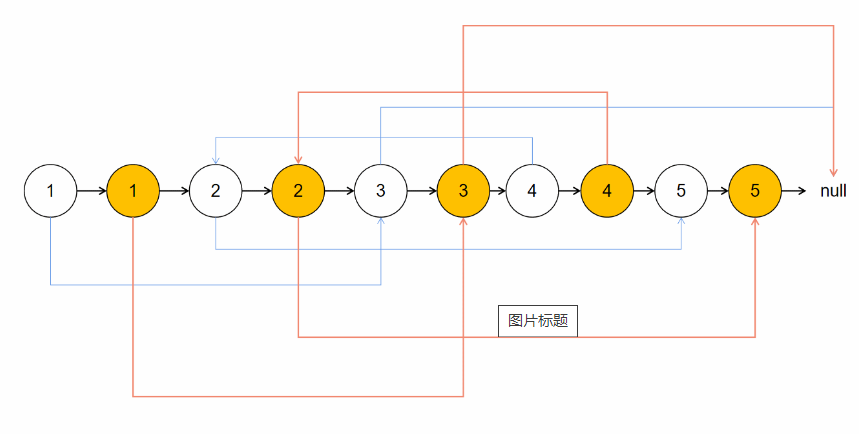
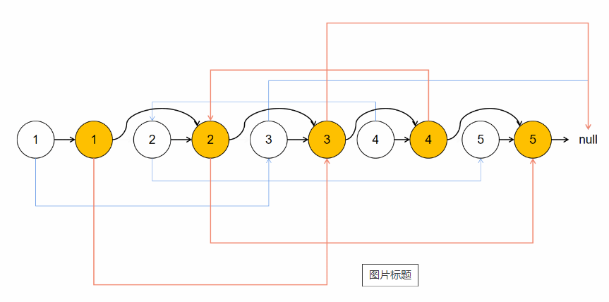

# 数组

## 剑指Offer

### 数组中重复的数字

1. **（思路1）开辟数组（哈希表）**

> 开辟一个等长数组List，取一个数n，List[n] +=1，并判断是否>2。
>
> **时间复杂度：O(n)**， 只遍历一遍数组就可以。
>
> **空间复杂度：O(n)**，要开辟等长数组。

2. **（思路2）交换数字**

> 从头开始扫描数组L，找到第一个位置index = 0上的数n1，
>
> 1. if n1 == n1这个数所在的index：遍历下一个位置的数。
>
> 2. if n1 != n1这个数所在的index：就把它放到L[n1]上面，
>
>    + 如果n1和L[n1]相同，就找到了重复值
>
>    + 如果不同，就把n1与L[n1]交换，然后继续看index = 0上的这个数（也就是刚换过来的），继续重复之前的比较、交换的步骤。
>
> **时间复杂度：O(n)**， 每个数交换两次一定能够找到对应位置，总的交换最多2n次，因此为O(n)。
>
> **空间复杂度：O(1)**，不用开数组。

3. **（思路3）二分+统计**

> **不改变数组**找到重复数字。
>
> 将长度为n的数组，从中间m处分开，前半部分为1 ~ m，后半部分为m + 1 ~ n。
>
> 统计前半部分中的数字在整个数组中出现的次数，如果次数 > m，则重复数出现在前半部分中，否则后半部分。
>
> > 如前半部分为（1，2，3），统计1在数组中出现次数 + 2次数 + 3次数是否 > m。
>
> 依次二分。
>
> **时间复杂度：O(nlogn)**， 每次查找是O(n)，二分时需要查找O(logn)次。
>
> **空间复杂度：O(1)**，不用开数组。


# 链表

## 剑指Offer

### 从尾到头打印链表

遍历链表，将遍历节点的值保存到栈内（然后依次从栈顶取元素输出）。


### 反转链表

定义三个指针，分别指向当前、下一个、下下个节点，依次修改指针的朝向。

> tips：可以在循环中定义temp指针，简化代码。
>
> **注意：记得头节点（第一个节点）的next指针也要修改。**


### 合并两个排序的链表

定义两个指针，分别指向两个列表。

首先比较两个指针所在节点大小，小的一方往后移，直至比另一个大（可用while循环），用temp留在这个节点的上一个。

然后将temp指针指向另一个链表（即将temp之前这一段链表移动到对面）。

> return时，对比头节点，将小的一个头节点作为输出。


### 两个链表的第一个公共结点

**重点：**让两个列表长度一致，这样会很好找第一个公共点。

首先，分别遍历一次两个链表，记录两个链表的长度。

然后，将长的一条链表的”头“指针往后移，直到两个链表长度一致。

最后，同时从新“头节点”开始遍历，返回第一个`pHead1 == pHead2`的节点。


### 链表中环的入口结点

分三步：

1. 检测链表中是否有环

> 双指针，point1一次走一步，point2一次走两步，看是否重逢

2. 检测环中有几个结点

> 1.中return重逢结点，然后从这个结点开始看走几步回到原地

3. 双指针，point2先走n步（n为环中节点数量），然后双指针一起走，相逢的第一个节点为入口结点

> 注意，要先判断是否重逢，再让指针步进。
>
> 因为当所有节点都在一个大环（首尾相连）时，需要返回第一个结点。


### 链表中倒数最后k个结点

**思路1**

遍历两遍，第一遍找总长度length，第二遍直接步进length - k即可。

**※思路2(只遍历一遍)**

双指针，point2先走k-1个结点（这时point1到point2等于最后k个结点长度）。

然后两个point同时步进，当point2.next == None，即point2到最后一个结点时，point1的位置就是导数k个结点。

> **注意：该题目的思路不难，主要考察代码鲁棒性**
>
> 问题1：当头指针为空时，需要判断。
>
> 问题2：当k为0时，需要判断，返回None。
>
> 问题3：当k > length时，需要判断，返回None。

 

### 复杂链表的复制

遍历三次：

**第一次遍历：**深拷贝self.next链，将新建结点放在原结点后面：



**第二次遍历：**给新建结点（拷贝结点）的self.random指针赋值。

**第三次遍历：**拆分两个链表（注意这里一定要两个链路同时拆，否则只拆拷贝链，但是原链的next还指向拷贝结点，系统可能会判错）：



### 删除链表中重复的结点

- step 1：给链表前加上表头，方便可能的话删除第一个节点。
- step 2：遍历链表，每次比较相邻两个节点，如果遇到了两个相邻节点相同，则新开内循环将这一段所有的相同都遍历过去。
- step 3：在step 2中这一连串相同的节点前的节点直接连上后续第一个不相同值的节点。
- step 4：返回时去掉添加的表头。

主要是内层循环，cur.next = cur.next.next的思路，节省了很多代码：

```python
while cur.next and cur.next.next:
    #遇到相邻两个节点值相同
    if cur.next.val == cur.next.next.val:
        temp = cur.next.val
        #将所有相同的都跳过
        while cur.next != None and cur.next.val == temp:
            cur.next = cur.next.next  # 注意看这步操作
    else:
        cur = cur.next
```

### 删除链表的节点

双指针

注意：头指针.val == val时，要让head后退一个结点，此时需要判断head是否为空（即整个链表是否只有一个结点）。
