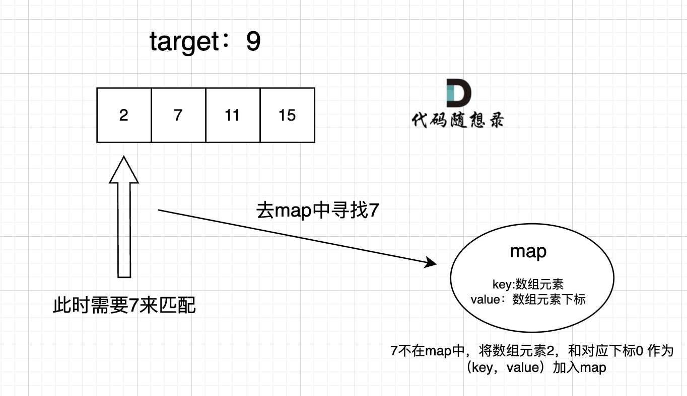
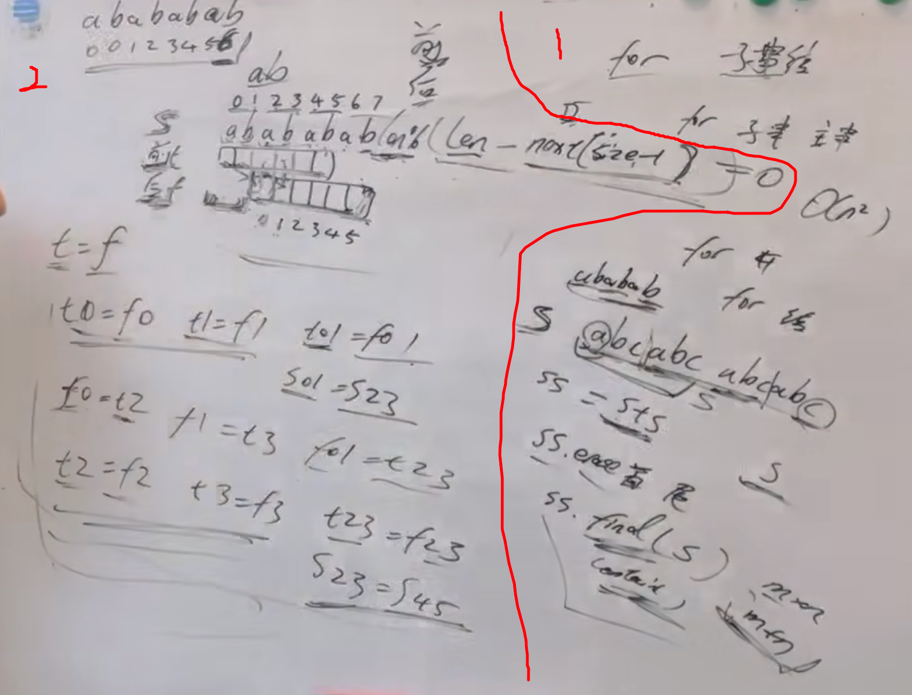

# 数组

## LeetCode

### [704. 二分查找](https://leetcode.cn/problems/binary-search/)

> **前提是数组为有序数组**，同时题目还强调**数组中无重复元素**

只用第一种写法就可以：我们定义 target 是在一个在**左闭右闭的区间里**，**也就是[left, right] （这个很重要非常重要）**。

区间的定义这就决定了二分法的代码应该如何写，**因为定义target在[left, right]区间，所以有如下两点：**

- while (left <= right) 要使用 <= ，因为left == right是有意义的，所以使用 <=
- if (nums[middle] > target) right 要赋值为 middle - 1，因为当前这个nums[middle]一定不是target，那么接下来要查找的左区间结束下标位置就是 middle - 1

> Tips:
>
> 1. int middle = left + (right - left >> 1);  // 防止溢出
>
> 等同于middle = (left + right) / 2，因为left+right如果都很大可能会溢出，而上面采用right-left后再加left就不会出现这种情况。

### [35. 搜索插入位置](https://leetcode.cn/problems/search-insert-position/)

在二分查找的基础上，return right + 1。

为什么return right + 1而不是left：如果返回left则需要分多种情况（在数组左侧/中间/右侧），但是right + 1所有情况都适配。

### [34. 在排序数组中查找元素的第一个和最后一个位置*](https://leetcode.cn/problems/find-first-and-last-position-of-element-in-sorted-array/)

> 该题的难点一共有三点：
>
> 1. 一共有哪几种情况会出现？
> 2. 连续元素左右边界要如何判断？
> 3. 1.中的几种情况出现时，边界判断是什么样的？

- 情况一：target 在数组范围的右边或者左边，例如数组{3, 4, 5}，target为2或者数组{3, 4, 5},target为6，此时应该返回{-1, -1}
- 情况二：target 在数组范围中，且数组中不存在target，例如数组{3,6,7},target为5，此时应该返回{-1, -1}
- 情况三：target 在数组范围中，且数组中存在target，例如数组{3,6,7},target为6，此时应该返回{1, 1}

### [69. x 的平方根 ](https://leetcode.cn/problems/sqrtx/)

二分法，找到一个mid * mid 来逼近 x。

> 因为最终输出是int，因此还是整数二分，因为整数直接截掉小数部分并不能用实数二分来写？

### [27. 移除元素](https://leetcode.cn/problems/remove-element/)

双指针：1. 如果碰到val，则fastpointer后移；2. 不是val，则将fast位置上的值赋给slow，然后双指针都后移。

### [26. 删除有序数组中的重复项](https://leetcode.cn/problems/remove-duplicates-from-sorted-array/)

双指针：1. 如果num[fastpointer] == nums[slowpointer]，则fastpointer后移；2. 如果不相等，则现将slowpointer后移，然后赋值并将fasterpointer后移。

### [977. 有序数组的平方](https://leetcode.cn/problems/squares-of-a-sorted-array/)

双指针，因为原序列也是有序的，只是可能左侧为负数（中间一定是平方后的最小值），因此双指针对比左右侧直至左右指针相逢即可。

### [209. 长度最小的子数组](https://leetcode.cn/problems/minimum-size-subarray-sum/)

双指针，如果目前窗口内总和<target则fast前移，否则slow前移并记录最小length，实现O(n)复杂度。

### [59. 螺旋矩阵 II](https://leetcode.cn/problems/spiral-matrix-ii/)

单纯模拟螺旋填充过程，但是注意填充时的循环不变性（坚持左闭右开or左开右闭）：

 


## 剑指Offer

### 数组中重复的数字

1. **（思路1）开辟数组（哈希表）**

> 开辟一个等长数组List，取一个数n，List[n] +=1，并判断是否>2。
>
> **时间复杂度：O(n)**， 只遍历一遍数组就可以。
>
> **空间复杂度：O(n)**，要开辟等长数组。

2. **（思路2）交换数字**

> 从头开始扫描数组L，找到第一个位置index = 0上的数n1，
>
> 1. if n1 == n1这个数所在的index：遍历下一个位置的数。
>
> 2. if n1 != n1这个数所在的index：就把它放到L[n1]上面，
>
>    + 如果n1和L[n1]相同，就找到了重复值
>
>    + 如果不同，就把n1与L[n1]交换，然后继续看index = 0上的这个数（也就是刚换过来的），继续重复之前的比较、交换的步骤。
>
> **时间复杂度：O(n)**， 每个数交换两次一定能够找到对应位置，总的交换最多2n次，因此为O(n)。
>
> **空间复杂度：O(1)**，不用开数组。

3. **（思路3）二分+统计**

> **不改变数组**找到重复数字。
>
> 将长度为n的数组，从中间m处分开，前半部分为1 ~ m，后半部分为m + 1 ~ n。
>
> 统计前半部分中的数字在整个数组中出现的次数，如果次数 > m，则重复数出现在前半部分中，否则后半部分。
>
> > 如前半部分为（1，2，3），统计1在数组中出现次数 + 2次数 + 3次数是否 > m。
>
> 依次二分。
>
> **时间复杂度：O(nlogn)**， 每次查找是O(n)，二分时需要查找O(logn)次。
>
> **空间复杂度：O(1)**，不用开数组。

## 卡码网KamaCoder

### [58. 区间和](https://kamacoder.com/problempage.php?pid=1070)

前缀和，注意是ACM格式的题目，ACM和LeetCode的格式都要熟悉...

### [44. 开发商购买土地](https://kamacoder.com/problempage.php?pid=1044)

二维前缀和

注意技巧：1. 前缀和可以在开头填充0，这样就可以省去读取时的额外条件判断；

2. 二维前缀和要比一维麻烦一点，不是单纯的“当前项+前缀”：

```c++
city[i][j] = tmp + city[i][j - 1] + city[i - 1][j] - city[i - 1][j - 1];
```


# 链表

## 知识整理

### 1. *Node，Node，&Node的区别与联系

在 C++ 中，`*A`、`A` 和 `&A` 表示不同的概念，尤其当 `A` 是一个结构体（`struct`）时。下面详细解释这三者的含义及其关系。

 **`A` - 结构体的实例**

`A` 表示结构体的一个实例（对象）。例如，假设我们有一个结构体 `Point`：

```cpp
struct Point {
    int x;
    int y;
};
```

如果我们创建一个 `Point` 类型的对象：

```cpp
Point p; // A 是一个 Point 的实例
p.x = 10;
p.y = 20;
```

在这个例子中，`A` 代表 `p`，即一个 `Point` 类型的对象。

**`&A` - 结构体的引用（地址）**

`&A` 表示获取结构体实例的地址，即指向该实例的指针。继续使用上面的例子：

```cpp
Point p;
Point* ptr = &p; // &A 获取 p 的地址
```

在这个例子中，`ptr` 是一个指针，指向结构体 `p` 的地址。通过 `ptr`，你可以访问 `p` 的成员：

```cpp
ptr->x = 30; // 通过指针访问成员
```

**`*A` - 指针解引用**

`*A` 表示**解引用一个指针，获取指针所指向的结构体实例**。继续上面的例子：

```cpp
Point p;
Point* ptr = &p; // ptr 是指向 p 的指针
(*ptr).x = 40;   // 解引用 ptr，访问 p 的成员
```

在这里，`(*ptr).x` 访问的是指针 `ptr` 指向的对象 `p` 的 `x` 成员。

### 总结关系

- `A` 是结构体的实例。
- `&A` 是获取该实例的地址，返回一个指向结构体的指针。
- `*A` 是解引用一个指针，获取指针所指向的结构体实例。

### 2. 指针的定义

**指针** 是一种变量，**用于存储另一个变量的地址**。在 C++ 中，使用 `*` 符号来声明指针类型。

在 `Point* ptr` 中，`Point` 是数据类型，`*` 表示 `ptr` 是一个指向 `Point` 类型的指针。

### 3. 什么时候使用Dummyhead？

一般增加删除时？因为可能需要增删头节点，因此有dummyhead的情况下，代码可以比较统一。


## LeetCode

### [203. 移除链表元素](https://leetcode.cn/problems/remove-linked-list-elements/)

使用辅助头节点，省去了对第一个节点的判断，使代码更统一。
注意：使用了辅助头节点，在最后return时需要用head代替dummy然后删除，最终返回的仍然是head。

### [707. 设计链表*](https://leetcode.cn/problems/design-linked-list/)

> 不错的题，涵盖了链表的基本用法，可反复刷。

注意：1. 特殊情况判断； 2. 新建立节点用ListNode* newnode = new ListNode(val)格式，方便next = newnode；

### [206. 反转链表](https://leetcode.cn/problems/reverse-linked-list/)

方法同剑指offer——[反转链表](#反转链表)

注意特殊情况判断：head == nullptr，直接返回head即可。

> 细节：
>
> 1. 不要使用dummyhead，会使情况变复杂，只需要判断cur是否==head即可。

### [24. 两两交换链表中的节点](https://leetcode.cn/problems/swap-nodes-in-pairs/)

单纯模拟交换步骤即可，注意要清楚指针变换逻辑：直接利用tmp指针修改成cur->next2->next1(tmp)->next3的形式。

 

变换后链表的直观表示：

 

### [19. 删除链表的倒数第 N 个结点](https://leetcode.cn/problems/remove-nth-node-from-end-of-list/)

方法类似剑指Offer——[链表中倒数最后k个结点](#链表中倒数最后k个结点)

利用双指针，fast先走n步，然后同时步进。
注意：1. 很多题目使用dummyhead可以统一代码，省去很多额外的判断，大多题目优先考虑dummyhead； 2. 考虑到head指向的节点可能也会被删除，最后记得重新给head赋下值：head = dummyhead->next;

### [面试题 02.07. 链表相交](https://leetcode.cn/problems/intersection-of-two-linked-lists-lcci/)

方法同剑指Offer——[两个链表的第一个公共结点](#两个链表的第一个公共结点)

### [142. 环形链表 II](https://leetcode.cn/problems/linked-list-cycle-ii/)

方法同剑指Offer——[链表中环的入口结点](#链表中环的入口结点)

分三步：

1. 先找环内任意节点（追逐法）；
2. 查看环内节点个数count；
3. 将fast和slow重新指向dummyhead，fast先走count（环内节点个数）步，然后fast和slow同时步进，相遇之处即环的入口。

### [2. 两数相加](https://leetcode.cn/problems/add-two-numbers/)

进位求和（carry表示进位），想清楚每一步的做法即可。

> 注意：不能先转为整数，相加，再转为List，如果有很大的数会溢出。


## 剑指Offer

### 从尾到头打印链表

遍历链表，将遍历节点的值保存到栈内（然后依次从栈顶取元素输出）。

### <a id="反转链表">反转链表</a>

定义三个指针，分别指向当前、下一个、下下个节点，依次修改指针的朝向。

> tips：可以在循环中定义temp指针，简化代码。
>
> **注意：记得头节点（第一个节点）的next指针也要修改。**

### 合并两个排序的链表

定义两个指针，分别指向两个列表。

首先比较两个指针所在节点大小，小的一方往后移，直至比另一个大（可用while循环），用temp留在这个节点的上一个。

然后将temp指针指向另一个链表（即将temp之前这一段链表移动到对面）。

> return时，对比头节点，将小的一个头节点作为输出。

### <a id="两个链表的第一个公共结点">两个链表的第一个公共结点</a>

**重点：**让两个列表长度一致，这样会很好找第一个公共点。

首先，分别遍历一次两个链表，记录两个链表的长度。

然后，将长的一条链表的”头“指针往后移，直到两个链表长度一致。

最后，同时从新“头节点”开始遍历，返回第一个`pHead1 == pHead2`的节点。

### <a id="链表中环的入口结点">链表中环的入口结点</a>

分三步：

1. 检测链表中是否有环

> 双指针，point1一次走一步，point2一次走两步，看是否重逢

2. 检测环中有几个结点

> 1.中return重逢结点，然后从这个结点开始看走几步回到原地

3. 双指针，point2先走n步（n为环中节点数量），然后双指针一起走，相逢的第一个节点为入口结点

> 注意，要先判断是否重逢，再让指针步进。
>
> 因为当所有节点都在一个大环（首尾相连）时，需要返回第一个结点。

### <a id="链表中倒数最后k个结点">链表中倒数最后k个结点</a>

**思路1**

遍历两遍，第一遍找总长度length，第二遍直接步进length - k即可。

**※思路2(只遍历一遍)**

双指针，point2先走k-1个结点（这时point1到point2等于最后k个结点长度）。

然后两个point同时步进，当point2.next == None，即point2到最后一个结点时，point1的位置就是导数k个结点。

> **注意：该题目的思路不难，主要考察代码鲁棒性**
>
> 问题1：当头指针为空时，需要判断。
>
> 问题2：当k为0时，需要判断，返回None。
>
> 问题3：当k > length时，需要判断，返回None。

### 复杂链表的复制

遍历三次：

**第一次遍历：**深拷贝self.next链，将新建结点放在原结点后面：


**第二次遍历：**给新建结点（拷贝结点）的self.random指针赋值。

**第三次遍历：**拆分两个链表（注意这里一定要两个链路同时拆，否则只拆拷贝链，但是原链的next还指向拷贝结点，系统可能会判错）：


### 删除链表中重复的结点

- step 1：给链表前加上表头，方便可能的话删除第一个节点。
- step 2：遍历链表，每次比较相邻两个节点，如果遇到了两个相邻节点相同，则新开内循环将这一段所有的相同都遍历过去。
- step 3：在step 2中这一连串相同的节点前的节点直接连上后续第一个不相同值的节点。
- step 4：返回时去掉添加的表头。

主要是内层循环，cur.next = cur.next.next的思路，节省了很多代码：

```python
while cur.next and cur.next.next:
    #遇到相邻两个节点值相同
    if cur.next.val == cur.next.next.val:
        temp = cur.next.val
        #将所有相同的都跳过
        while cur.next != None and cur.next.val == temp:
            cur.next = cur.next.next  # 注意看这步操作
    else:
        cur = cur.next
```

### 删除链表的节点

双指针

注意：头指针.val == val时，要让head后退一个结点，此时需要判断head是否为空（即整个链表是否只有一个结点）。


# 哈希表

## 知识整理

### 1. set和map(字典)的底层实现

 

 

> 红黑树是一种自平衡的二叉搜索树（Binary Search Tree，BST），它能够在最坏情况下保持对数时间复杂度的查找、插入和删除操作。红黑树通过维护额外的属性来确保树的平衡，从而避免了退化成链表的情况。

使用红黑树作为set和map的底层实现，是因为：

1. **高效的查找、插入和删除**

红黑树是一种自平衡的二叉搜索树，具有以下优点：

- **时间复杂度**：红黑树的查找、插入和删除操作的时间复杂度都是 O(log n)。这对于 `std::set` 来说是非常重要的，因为它需要频繁地进行这些操作。
- **平衡特性**：红黑树通过维护特定的性质（如红黑性质）来保持树的平衡，确保在最坏情况下树的高度是对数级别，避免了退化为链表的情况。

2. **自动排序**

红黑树的结构可以确保元素按照特定顺序排列。`std::set` 中的元素根据其键值自动排序，这使得使用红黑树非常合适，因为树的中序遍历将产生升序的元素序列。

3. **唯一性**

`std::set` 只允许存储唯一的元素。红黑树的性质可以有效地避免重复元素的插入，因为在插入新元素时，可以快速判断该元素是否已经存在。

## LeetCode

### <a id="242. 有效的字母异位词">[242. 有效的字母异位词](https://leetcode.cn/problems/valid-anagram/)</a>

使用额外数组record记录单词出现数量，先遍历s将对应单词+1，再遍历t将对应单词-1，最终看record中是否全0即可。

> 注意：**使用数组来做哈希的题目，是因为题目都限制了数值的大小（26个英文字母）。**
>
> 如果没有限制数值的大小，就无法使用数组来做哈希表了。**而且如果哈希值比较少、特别分散、跨度非常大，使用数组就造成空间的极大浪费。**

### [349. 两个数组的交集](https://leetcode.cn/problems/intersection-of-two-arrays/)

使用unordered_set。

注意用法：

1. nums_set.find(num) != nums_set.end()；

> 检查 `num` 是否存在于 `nums_set` 中。`find` 方法返回一个迭代器，如果找到该元素，返回值不等于 `end()`。
>
> `end()` 返回一个迭代器，指向集合的尾部（即超出最后一个元素的位置）。这个迭代器并不指向集合中的任何有效元素。

2. vector<int>(result.begin(), result.end());

> **拓展**
>
> 那有同学可能问了，遇到哈希问题我直接都用set 不就得了，用什么数组啊。
>
> 直接使用set 不仅占用空间比数组大，而且速度要比数组慢，set把数值映射到key上都要做hash计算的。
>
> 不要小瞧 这个耗时，在数据量大的情况，差距是很明显的。

### [202. 快乐数](https://leetcode.cn/problems/happy-number/)

关键在于：可能要重复计算很多次，因此要用unordered_set来记录出现过的数，来判断当前数在之前是否出现过，方便退出循环。

正如：[关于哈希表，你该了解这些！](https://programmercarl.com/哈希表理论基础.html)中所说，**当我们遇到了要快速判断一个元素是否出现集合里的时候，就要考虑哈希法了。**

> 发现一个规律：当需要频繁记录/查询数值时，可以考虑用哈希表。
>
> 其实哈希表也只是一种数据结构，灵活使用。

### [1. 两数之和](https://leetcode.cn/problems/two-sum/)

使用unordered_map来存放已经遍历过的元素，注意：
1. 注意auto iter的用法。
2. 注意map的find和insert的方式。

 

 

### [454. 四数相加 II](https://leetcode.cn/problems/4sum-ii/)

本题解题步骤：

1. 首先定义 一个unordered_map，key放a和b两数之和，value 放a和b两数之和出现的次数。
2. 遍历大A和大B数组，统计两个数组元素之和，和出现的次数，放到map中。
3. 定义int变量count，用来统计 a+b+c+d = 0 出现的次数。
4. 再遍历大C和大D数组，找到如果 0-(c+d) 在map中出现过的话，就用count把map中key对应的value也就是出现次数统计出来。
5. 最后返回统计值 count 就可以了

### [383. 赎金信](https://leetcode.cn/problems/ransom-note/)

类似[242. 有效的字母异位词](#242. 有效的字母异位词)，涉及到count数量且key数量固定（比如英文字母）时，就考虑用数组做哈希表。

> 因为字母天然带有“key数量固定”的特性，因此涉及到字母/字符串的题目，可以首先考虑数组。

### [15. 三数之和](https://leetcode.cn/problems/3sum/)

使用双指针，先对数组排序，i遍历数组，left=i+i，right=nums.size()-1，如果当前数相加>0则right--，如果<0则left++。注意：
1. 由于不可以包含重复的三元组，因此要对i、left、right去重（如果当前数==之前的数就直接跳过）
2. 在等于0时，随想录的代码逻辑好像有问题？应该将right--left++放在while去重前面？

###  [18. 四数之和](https://leetcode.cn/problems/4sum/)

类似三数之和，也是双指针，只是将开始的一重循环遍历i，改成了两重循环遍历k和i。注意：
1. k和i去重时有所不同：
  `if (k > 0 && nums[k] == nums[k - 1]) continue;  // 去重`
  以及` if (i > k + 1 && nums[i] == nums[i - 1]) continue;  // 去重`
  因为数组是`[-4, -3, -2, -1]`，`target`是`-10`，不能因为`-4 > -10`而跳过。

2. 四数相加可能会溢出，需要转换为long类型：

  > 注意long不能加给计算后的结果，因为计算后已经溢出：
  >
  > `if ((long)(nums[i] + nums[j] + nums[left] + nums[right]) > target)` ❌
  >
  > 应该先将其中一哥操作数转为long，这样运算结果自然也为long：
  >
  > `if ((long)nums[i] + nums[j] + nums[left] + nums[right] > target)` ✅


# 字符串

## 知识整理

### 1. <a id="KMP算法">KMP算法</a>

**KMP算法解决什么问题：**给定一个字符串，判断另一个字符串是否在该字符串中出现过。

> 该方法比较难理解，结合视频：
>
> [【帮你把KMP算法学个通透！（理论篇）】](https://www.bilibili.com/video/BV1PD4y1o7nd/?share_source=copy_web&vd_source=01d44ca12928de4e09572201ce260e54)
>
> [【帮你把KMP算法学个通透！（求next数组代码篇）】](https://www.bilibili.com/video/BV1M5411j7Xx/?share_source=copy_web&vd_source=01d44ca12928de4e09572201ce260e54)

KMP的核心算法在于使用了“最长相同前后缀表”，它通常使用一个next数组来实现。

next数组的构建过程如下：

> 该实现方法采用“如果当前s[i]处不匹配，就回到next[i-1]处的元素继续匹配”这个逻辑，也就是下列第一行：
>
>  

```C++
void getNext(int* next, const string& s){
    int j = 0;
    next[0] = j;
    for(int i = 1; i < s.size(); i++) { // 注意i从1开始
        while (j > 0 && s[i] != s[j]) { // 前后缀不相同了
            j = next[j - 1]; // 向前回退
        }
        if (s[i] == s[j]) { // 找到相同的前后缀
            j++;
        }
        next[i] = j; // 将j（前缀的长度）赋给next[i]
    }
}
```

该构建过程比较复杂，下面分析一下为什么next数组能够统计“最长相同前后缀”：

1. 首先将j初始化为0：因为只有一个元素时，该元素没有前缀/后缀，直接赋0；将next[0]初始化为j，因为j既表示前缀末尾指针，又表示了相同前后缀的长度，相当于next[0]长度设置为j = 0。

2. 此时从第二个元素开始遍历后缀：

   a. 如果s[i] != s[j]说明前后缀不相同，此时需要回退到next[j-1]，表示从前一串最长前后缀处重新开始匹配（跟文本串和模式串的匹配不一致时的处理过程一致）。

   b. 如果s[i] == s[j]就使j++，表示`当前的后缀元素匹配上了前缀`，因为j表示相同前后缀长度所以j++。

   > 这里比较有意思，如果不匹配则一直回退到之前能匹配上的最长前后缀，但是如果匹配了则只j++一次。
   >
   > 如此一来，当前的j只会在之前“次最长“前后缀长度上+1，也就匹配上了之前手推前后缀匹配的过程。

   c. 将最长前后缀长度j赋给next[i]。

## LeetCode

### [344. 反转字符串](https://leetcode.cn/problems/reverse-string/)

双指针，互换。

### [541. 反转字符串 II](https://leetcode.cn/problems/reverse-string-ii/)

每次将i += (k * 2)，然后判断i + k <= s.size()。
这里题目主要考察对判断语句的把控，因此可以适当使用库函数reverse。

### [151. 反转字符串中的单词*](https://leetcode.cn/problems/reverse-words-in-a-string/)

> 比较复杂，捋清思路后不算难，关键在于**判断什么时候需要翻转字符串？**

分为三步：1. 去掉多余空格；2. 反转字符串；3. 翻转每串字符。

> 注意：
>
> 去掉空格中可参考 27.移除元素；
> 另外，三个步骤中都大量使用了双指针方法。

### [28. 找出字符串中第一个匹配项的下标](https://leetcode.cn/problems/find-the-index-of-the-first-occurrence-in-a-string/)

> 比较复杂，注意理解KMP的内核，视频可以反复看。

使用[KMP算法](#KMP算法)，具体见代码随想录，及视频讲解。

### [459. 重复的子字符串](https://leetcode.cn/problems/repeated-substring-pattern/)

 

**方法一：将字符串s重复两次，看中间是否又出现了s（13ms）**

比如字符串s为“abcabc”，将字符串重复两次s+s：“abc｜abc + abc｜abc”，可以看到中间又出现了字符串s，说明该字符串为重复子字符串。

> 注意，在实际比较时需要将s+s的首尾字符去掉，不然s+s的前半段/后半段肯定是s，查询时会永远返回true。

**方法二：KMP算法（1273ms）**（复杂度较高，优先使用方法一）

字符串 减去 最长相等前后缀，剩下的几个字符，重复的子字符串。

然后看 字符串长度 % 剩下字符长度 是否为0

> 至于为什么“字符串 减去 最长相等前后缀，剩下的几个字符，就是重复子字符串”可以看图片，或回看视频讲解。


## KamaCoder

### [54. 替换数字（第八期模拟笔试）](https://kamacoder.com/problempage.php?pid=1064)

核心：双指针，一个newpointer指向新string末尾，一个oldpointer指向原本string末尾位置。

当new != ‘数字’时，直接将old赋给new然后都前移；当old == ‘数字’时，依次填充number，然后都前移。

> 注意：
>
> 1. new和old都是从末尾开始，这样可以避免数组添加字符时需要频繁后移元素的不便。
> 2. 对于字符串类操作，最好使用string + cin/cout，因为c不支持读取到string，只有c++可以：
>
> ```c
> // C只支持读取到char[]
> char temp[1000]; // 临时字符数组
> scanf("%s", temp); // 使用 scanf 读取到临时数组
> ```

### [55. 右旋字符串（第八期模拟笔试）](https://kamacoder.com/problempage.php?pid=1065)

1. 先翻转0～end - n；
2. 再翻转end - n～end；
3. 翻转整个字符串。

> 还是那句话，关键在于判断什么时候用**翻转字符串**这个技巧。


# 二叉树

## 知识整理

### 1. 递归三部曲

[101. 对称二叉树(代码随想录)](https://www.programmercarl.com/0101.%E5%AF%B9%E7%A7%B0%E4%BA%8C%E5%8F%89%E6%A0%91.html#%E6%80%9D%E8%B7%AF)

1. 确定参数和返回值
2. 确定终止条件
3. 确定单层递归的逻辑

### 2. 二叉树前中后序遍历（栈）

递归、迭代：栈（非递归）、利用None指示的非递归（改善中序遍历需要额外用指针的情况）

> **递归要注意何时用后序/前序：**比如在[104.二叉树的最大深度](https://leetcode.cn/problems/maximum-depth-of-binary-tree/)利用前序遍历，因为需要先计算当前的深度再向下计算；但是在[110. 平衡二叉树](https://leetcode.cn/problems/balanced-binary-tree/)中需要利用后序遍历，因为要从叶子结点开始计算（左右中，计算当前结点前会先计算child）

### 3. 二叉树层序遍历（队列）

队列法、递归法

### 4. 递归函数什么时候需要返回值？什么时候不需要返回值？

这里总结如下三点：

- 如果需要搜索整棵二叉树且不用处理递归返回值，递归函数就不要返回值。（这种情况就是本文下半部分介绍的113.路径总和ii）
- 如果需要搜索整棵二叉树且需要处理递归返回值，递归函数就需要返回值。 （这种情况我们在[236. 二叉树的最近公共祖先 (opens new window)](https://programmercarl.com/0236.二叉树的最近公共祖先.html)中介绍）
- 如果要搜索其中一条符合条件的路径，那么递归一定需要返回值，因为遇到符合条件的路径了就要及时返回。


> 我们在[二叉树：递归函数究竟什么时候需要返回值，什么时候不要返回值？ (opens new window)](https://programmercarl.com/0112.路径总和.html)中说了 递归函数有返回值就是要遍历某一条边，但有返回值也要看如何处理返回值！
>
> 如果递归函数有返回值，如何区分要搜索一条边，还是搜索整个树呢？
>
> 搜索一条边的写法：（比如“输出所有路径”这样的题）
>
> ```cpp
> if (递归函数(root->left)) return ;
> 
> if (递归函数(root->right)) return ;
> ```
>
> 搜索整个树写法：
>
> ```cpp
> left = 递归函数(root->left);  // 左
> right = 递归函数(root->right); // 右
> left与right的逻辑处理;         // 中 
> ```
>
> 看出区别了没？
>
> **在递归函数有返回值的情况下：如果要搜索一条边，递归函数返回值不为空的时候，立刻返回，如果搜索整个树，直接用一个变量left、right接住返回值，这个left、right后序还有逻辑处理的需要，也就是后序遍历中处理中间节点的逻辑（也是回溯）**。


## LeetCode

### [226. 翻转二叉树](https://leetcode.cn/problems/invert-binary-tree/)

遍历二叉树（前中后层都可以），每遍历一个结点，**翻转**该结点的左右子结点。

> 注意中序遍历的递归/递推操作要将一边传入栈两次，因为如果交换的话可能会重复翻转，详情见“代码随想录”讲解。

### [101. 对称二叉树](https://leetcode.cn/problems/symmetric-tree/)

从root结点开始，每次找左侧的结点和右侧的结点，

依次对比：1. 左侧结点的左结点｜右侧结点的右结点（外侧）2. 左侧结点的右结点｜右侧结点的左结点（内侧）

若结点的val，以及内侧和外侧都相同，则对称

> 注意判断左右结点是否为None的几种情况。
>
> 该题目可以通过 递归/递推（队列/栈）/层序遍历 等多种方法实现。

### [110. 平衡二叉树*](https://leetcode.cn/problems/balanced-binary-tree/)

> 思路比较特别，值得重复做。

利用后序遍历，每次递归判断左右子树的高度之差是否>1：如果大于1直接返回-1表示不是平衡二叉树，如果小于等于则继续计算。

> 使用后序遍历是因为，**要从叶子节点开始**，计算每个节点左右子树的高度之差。
>
> 因此需要先递归子结点，再计算上面节点，看左右子树高度差是否大于1。
>
> > 反之，如果需要从根节点开始计算，比如计算树的深度，就需要前序遍历（中左右，先访问当前节点）

### [257. 二叉树的所有路径](https://leetcode.cn/problems/binary-tree-paths/)

需要用到回溯法（有点类似Acwing中讲的“恢复现场”）

首先，需要确定遍历顺序：**前序遍历**，因为要记录从根节点到叶节点的path，要一个节点一个节点地遍历下去。

**递归三部曲：**

1. 参数：root、path、result（记录当前路径到path，记录路径结果到result）；返回值：无返回值，变为终止时记录路径。
2. 终止条件：当遍历到叶子节点，说明记录完了一条path，需要将这个path整合到result中。
3. 递归逻辑：在常规前序遍历的基础上，需要在递归前将当前节点加入到path，在递归后再将节点pop出来回溯（“恢复现场”）

### [404. 左叶子之和](https://leetcode.cn/problems/sum-of-left-leaves/)

**后序遍历**，遍历时判断当前节点是否有**左叶子孩子**。

### [513. 找树左下角的值](https://leetcode.cn/problems/find-bottom-left-tree-value/)

递归方法：递归时附加参数depth，if判断是否为第一个到达最深层的节点（depth > max_depth）。

> 因为前/中/后序遍历是按先左后右顺序，因此第一个到达最深层的节点一定是左下角的节点。

层序遍历：每一行的第一个就是最左侧节点，层序遍历到最后一层自然就输出左下节点。

### [112. 路径总和](https://leetcode.cn/problems/path-sum/)

回溯法，访问到叶子节点就存储下路径path的sum值。

### [106. 从中序与后序遍历序列构造二叉树](https://leetcode.cn/problems/construct-binary-tree-from-inorder-and-postorder-traversal/)

递归实现，主要分为以下几步：

- 第一步：如果数组大小为零的话，说明是空节点了。
- 第二步：如果不为空，那么取后序数组最后一个元素作为节点元素。
- 第三步：找到后序数组最后一个元素在中序数组的位置，作为切割点
- 第四步：切割中序数组，切成中序左数组和中序右数组 （顺序别搞反了，一定是先切中序数组）
- 第五步：切割后序数组，切成后序左数组和后序右数组
- 第六步：递归处理左区间和右区间

> 类似题目：[105. 从前序与中序遍历序列构造二叉树](https://leetcode.cn/problems/construct-binary-tree-from-preorder-and-inorder-traversal/)

### [617. 合并二叉树](https://leetcode.cn/problems/merge-two-binary-trees/)

递归法，参数传递的是两颗树的root结点，直观来看相当于“两颗树在路径上重合，然后从重合树的根节点开始遍历，然后在每个遍历到的重合树节点处计算两个树的val之和”。

### [700. 二叉搜索树中的搜索](https://leetcode.cn/problems/search-in-a-binary-search-tree/)

后序遍历递归，因为二叉搜索树的特性，只需要一路往下搜即可，因此使用后序遍历，去找目标节点。

### [501. 二叉搜索树中的众数*](https://leetcode.cn/problems/find-mode-in-binary-search-tree/)

> 递归中有很多细节需要注意，值得重复做。
>
> 中序递归，中序遍历得list后查找list，都可以。

如何一遍递归，就能找出所有众数：仍然是中序遍历递归，但是当self.max_count < self.cur_count既要更新self.max_count，又要清空self.result = []，这样就能保证self.result中一直是频率最高的元素。

注意：

1. 注意第一个节点也要判断是否为众数。
2. 不论当前节点值是否与上一节点一致，都要判断if self.max_count == self.cur_count，防止出现最高频率为1的情况。

### [236. 二叉树的最近公共祖先*](https://leetcode.cn/problems/lowest-common-ancestor-of-a-binary-tree/)

后序遍历递归，遇到符合的就返回这个节点，有两个值得注意的点：
1. 利用left和right能够使下层的共同祖先一直return出去
2. 直接返回符合条件的节点，因为是从下往上遍历，因此return的一定是最上层的，也就是共同祖先。

### [235. 二叉搜索树的最近公共祖先](https://leetcode.cn/problems/lowest-common-ancestor-of-a-binary-search-tree/)

与236解题思路不同，可以充分利用二叉搜索树的特性来寻找公共祖先。

因为是有序树，所以如果中间节点是 q 和 p 的公共祖先，那么**中节点的数组一定是在 [p, q]区间的（注意两端都是闭区间）**。即 中节点 > p && 中节点 < q 或者 中节点 > q && 中节点 < p。

**如何确保一定是最近公共祖先：**当我们从上向下去递归遍历，第一次遇到 cur节点是数值在[q, p]区间中，那么cur就是 q和p的最近公共祖先。

### [701. 二叉搜索树中的插入操作](https://leetcode.cn/problems/insert-into-a-binary-search-tree/)

无需重构二叉搜索树，直接遍历到叶子节点插入即可。

> 注意区分有返回值和无返回值的写法，无返回值可以用cur和pre指针代替return的操作。

### [669. 修剪二叉搜索树](https://leetcode.cn/problems/trim-a-binary-search-tree/)

递归法，先进行剪枝（剪掉离区间范围更远的节点），并返回另一侧子树（距离区间更近的一侧）。

然后构造当前节点并返回。

> 思路还是不太一样的，详情见代码。

### [108. 将有序数组转换为二叉搜索树](https://leetcode.cn/problems/convert-sorted-array-to-binary-search-tree/)

递归，每次取数组中间值构建当前节点，然后左子树使用midindex左边的区间，右子树使用右边区间。
这样构建出的树一定是平衡且是搜索树。

### [538. 把二叉搜索树转换为累加树](https://leetcode.cn/problems/convert-bst-to-greater-tree/)

按右-中-左递归遍历即可（反向中序遍历），另外需要使用self.pre保存上一节点信息。
