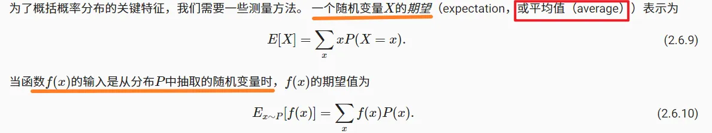

# 概率论
> 关键词：条件概率，期望等等。

## 基本概率论
在统计学中，我们把从概率分布中抽取样本的过程称为抽样（sampling）。
笼统来说，可以把**分布（distribution）看作对事件的概率分配**， 稍后我们将给出的更正式定义。
 将**概率分配给一些离散选择的分布称为多项分布**（multinomial distribution）。
### 概率论公理
在处理骰子掷出时，我们将**集合S = {1，2，3，4，5，6}称为样本空间**（sample space）或结果空间（outcome space）， 其中**每个元素都是结果**（outcome）。
**事件（event）是一组给定样本空间的随机结果**。
> 例如，“看到5”（{5}）和“看到奇数”（{1，3，5}）都是掷出骰子的有效事件。 
> 注意，如果一个随机实验的结果在A中，则事件A已经发生。 也就是说，如果投掷出3点，因为3∈{1，3，5}，我们可以说，“看到奇数”的事件发生了。

### 随机变量

## 处理多个随机变量

### 联合概率

### 条件概率

### 贝叶斯定理

### 边际化

### 独立性

## 期望和方差
### 期望

### 方差
方差的定义是在一组数据中，每个**数据点与均值之差的平方的平均值**。
