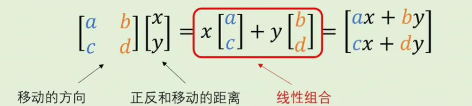

# 线性代数
> 关键词：向量、矩阵、运算、范数、特征向量和特征值

## 向量与线性组合
### 向量定义
什么是向量：向量只由它的长度和方向决定，并不由它的位置决定。

### 向量的运算

1. 向量的加法
> 加法运算的向量，维度必须一致

几何意义：向量的平移运算。
相加：首尾相接； 相减：尾尾相接。

2. 向量的点乘（内积）
> 向量中的对应元素，两两相乘。

几何意义：表达两向量之间**夹角**的大小，以及是否在同一方向。

3. 叉乘（外积）

几何意义：得到垂直于运算向量的向量（若量向量顺序颠倒，得到的向量方向相反）。

### 线性组合

1. 什么是线性组合

通俗来讲：线性组合就是将n个向量进行拉伸后，根据平行四边形法则，将向量相加。

2. 线性相关与线性无关

线性无关的两个向量的线性组合可以得到该张成空间中的任意向量。

**如何区分线性相关与无关？**

> 判别标准：是否提供了一个新的维度

- 线性相关的两个向量可以通过拉伸得到
- 线性无关的两个向量无法通过拉伸得到（分别代表了另一个向量到达不了的不同方向，提供了一个新的维度）

**总结与延申：**

## 矩阵与线性变换
### 标准正交基
标准：长度为1；
正交：两两垂直；
“基”不是唯一的：有标准正交基，也有不标准（长度不为1）不正交（不两两垂直）基。

两个基可以通过线性变换，互相转换：

形象化表示：

二维可以形象化表示，但是高维不可以。因此提出用矩阵表示线性变换。

> **什么是线性变换？**
> **线性变换可以理解成将空间中的点或者向量进行拉伸、压缩、旋转或平移等操作的方式，而这些操作同时保持了向量之间的线性关系。**
> 线性变换具有以下两种属性：
>
> 1. 直线变换后仍是直线；
> 2. 原点位置固定不变；
>
> 这是五种常见的线性变换，变换过程显然具备上述两种属性（请自行脑补变换过程）：
> 
> 再来看看非线性变换，无疑不具备上述两种属性：
> 

### 矩阵

**矩阵的意义：**
~~下面的A其实是一个线性变换矩阵，只不过恰好长得像变换后的基。。~~
**上面描述有误，A就是变换后的基，同时也是线性变换矩阵，将初始坐标系中的一个向量乘以A（一个新的基），那么得到的就是在这个新的基下，该向量的表示。（也有待存疑，经确认无误）（但是向量的方向以及长度通常都会变化，一般只有标准正交基中的向量长度才不会变化）**

> **chatgpt解释：**
> 1. **几何上的解释是，矩阵可以被视为一组基向量，它们描述了一个坐标系中的变换规则。**
> 2. **将原始向量与矩阵叉乘运算，相当于将原始向量表示在这个新的坐标系中，并得到一个新的向量作为结果。**
> 3. **这个新向量的坐标值是原始向量在新坐标系中的投影或变换结果。**
>
> **这个线性变换可以描述为将原始向量沿着矩阵的列向量方向进行平移、旋转和缩放等操作。**

【1 0】 x 【1 -1】 = 【1 -1】
【0 1】    【1  0】     【1  0】

> **如何理解从高维压缩到低维的线性变换？**
> 【1 0】 x 【1  2】 = 【1 2】
> 【0 1】    【0  0】    【0 0】
> 如果线性变换矩阵的列线性相关，相当于把两个基变换到了一个方向（即消去了一个基），因此是一个从高维压缩到低维的线性变换。

### 矩阵向量乘法
意义：用一个工具来描述不同坐标系下的向量，即矩阵向量乘法
> 矩阵向量乘法，指的是矩阵与向量相乘。

**矩阵向量乘法，其实就是一种线性组合：**

- 对于线性变换矩阵：【ac】和【bd】代表两个基向量？
- 而x表示第一个向量【ac】的长度要拉伸多少（【ac】的方向由它自己决定），y表示【bd】要被拉伸多少，这个线性组合表示了向量【xy】在新坐标系下的向量表示。

### 逆矩阵与单位矩阵
矩阵可以理解为“变换”，而逆矩阵可以理解成“还原”。

### 矩阵矩阵乘法
> ~~矩阵乘法为叉乘，还有矩阵的点积（也成为Hadamard积）~~
> **点乘和叉乘是用于向量之间的运算，而不是矩阵!!!**
>
> 1. 可以说点乘是内积的一种特殊情况：
> - **点乘**（dot product）是**向量运算**中的术语，表示对应位置相乘。
> - **内积**的定义可能会扩展到更一般的对象，如矩阵或张量。在这种情况下，内积可能涉及到更复杂的运算，例如矩阵乘法。
> 2. 而外积和叉乘完全是两个东西：
> - **外积**（outer product）是**向量运算**中的术语，它计算两个向量之间的乘积，生成一个矩阵。外积的结果矩阵的维度大小由两个向量的维度决定。
> - **叉乘**（cross product）是三维向量运算中的特殊操作，只适用于三维空间中的向量。叉乘计算的是两个三维向量之间的向量积，结果是一个新的向量，垂直于原始两个向量所在的平面。

> 矩阵对应位置的相乘通常只被称为元素级乘法或Hadamard乘积，它不是点乘（内积）也不是叉乘和外积。
> 我们通常说的矩阵乘法（线性变换）可以叫做内积。
> 外积在矩阵运算中不太常用。

矩阵乘法是一个线性变换。那么矩阵矩阵相乘，可以理解为两个复合在一起的线性变换。
在进行时，从右往左读，先进行右边的线性变换，再进行左边的。

在运算时，右边的矩阵可以看作是基向量的组合，可以拆分开来跟左边矩阵分别运算再组合。

> 两个矩阵可以看作对平面直角坐标系的两次变换，而这两次变换有顺序之分，一般情况下不能相互交换。

### 矩阵运算

二阶矩阵的逆矩阵有公式可以使用，但是高阶矩阵的逆矩阵需要借助行列式。

## 行列式
只有n x n的矩阵有行列式，n x m的矩阵没有。
二阶行列式 = 矩阵主对角线元素的积 - 副对角线元素的积
更高维度需要用**拉普拉斯展开**或**萨鲁斯法则**（对角线法则）。

### 行列式的几何意义

矩阵是一种线性变换，因此矩阵的行列式也可以理解成，线性变换前后**单位**正方形面积或者**单位**正方体体积的变换比例。

行列式为0，只能认为线性变换把空间压缩到了更小的维度上，但是具体压缩到一条线还是一个点，不能确定。

### 矩阵的秩

### 行列式的性质
**重点在于第2，3，6条。**

### 行列式的运算法则

### 余子式和代数余子式

**代数余子式定理：**

注意，伴随矩阵的行列相反。
**高维矩阵的逆矩阵求法：**

因为逆矩阵可以理解为“还原”，而还原包括了转换和拉伸两个动作，因此行列式就表示了拉伸，伴随矩阵表示转换。
**伴随矩阵常用公式：**

## 范数

### 范数和目标

## 线性方程组

解线性方程组的过程，与“求某组基所构成的坐标系来表达平面直角坐标系中的向量”有异曲同工之妙，那就是用系数矩阵的逆矩阵乘等号右边的向量。

因此，解方程组可以看作是“找向量在不同坐标系下表达”的过程。
**线性方程组部分太复杂也用不到，因此跳过视频讲解。**

## 特征值与特征向量
### 什么是特征值

有的向量经过线性变换，其方向并不会发生变化，只有长度变化。此时线性变换（矩阵）与一个常数的作用是相同的，因此可以做以下表示：

因为等式右边是一个标量向量乘法，只有也转换成矩阵向量乘法才能计算，两边同时左乘单位矩阵可以得到：

移项、提取后可以得到“向量相乘等于0”（说明是降维），因此（A-lamda * I)这个矩阵是线性相关的，行列式 = 0；
用这个方法可以计算出特征值。

### 特征值和特征向量计算
矩阵行列式 = 0，可以计算出特征值：

分别带入矩阵，经过初等变换后：

x = x可以取任意值，如果都取1可以得到特征向量（1，0）和（1，1）。（如果解区别的值，也会落在这两个向量所在的直线上)

### 特征值和特征向量的含义
如果特征向量对应的特征值是负数，那么特征向量在变化后会被反方向拉伸：

向量在特征变换后离开了原来的直线，但是仍有特征值，只不过可能是虚数：

### 特性
