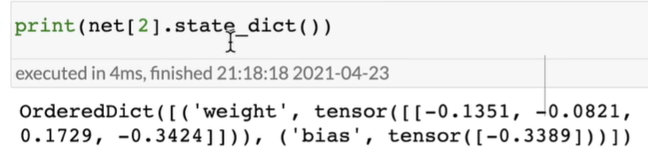
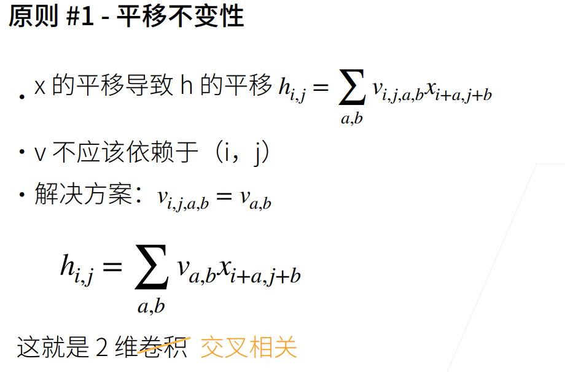
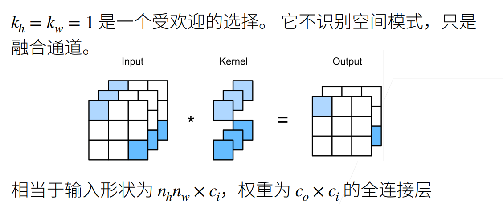
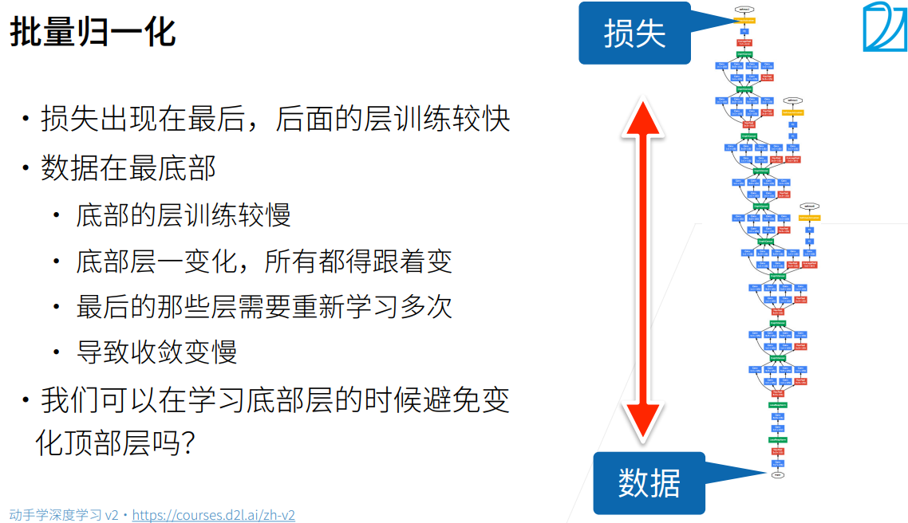
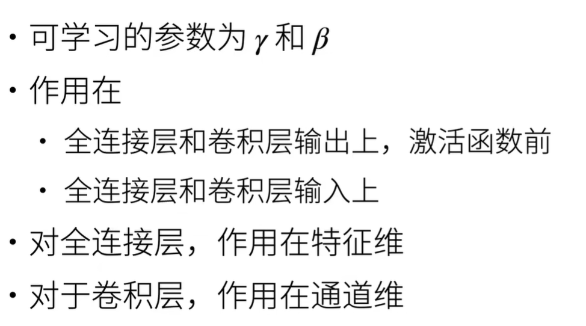

# 课程笔记

## 12 权重衰减（weight decay）

噪声越大，w学到的值越大？（需要验证）


## 13 丢弃法（Dropout）

实现代码中，一般用mask * x / （1- dropout_rate），而非x[mask] = 0，原因在于gpu对乘法相率远高于选择置0.

trick：假设隐藏层大小为64效果还不错，可以尝试翻倍为128然后dropout = 0.5，因为直觉上是等效的，但实际效果可能比64要好。


## 16 PyTorch 神经网络基础

### 1. self._modules相当于一个有序的字典，可以用于存每一层。


### 2. nn.Sqquential相当于list，

可以使用类似list的用法：

 

也可以直接访问weight或者bias：

 

> 直接访问net[2].bias得到的是tensor，他其中包含了data和grad


### 3. nn.init.normal_() 

这个下划线表示这是一个替换函数，函数没有返回值，而是直接修改m.weight的值：

 


### 4. 参数绑定

先定义层，然后将其放在模型中：

 

可以看到weight是相等的，他们指向同一个实例：

 


### 5. MLP每一层单元数如何设置

“随机抓药“：假设需要的input：128，output：2

① 如果直接映射：128—2

② 如果单隐藏层：128—(16/32/64/128依次试一下)—2

③ 如果单隐藏层的16和128效果一般（一个太简单一个太复杂），双隐藏层

128—(32/64)—(8/16)—2，多试几次

一般都是由宽到窄的规律，也可以随机搜参看结果。。


### 6. 如何找到真正合适的参数

开始搜参时可以使用随机搜参，**一旦找到一个还不错的超参值，可以观察一下这个点附近一定区间内效果如何：**

- 如果效果还不错，说明这个点是一个不错的参数；
- 相反如果都不太好，说明这个参数点周围不那么平滑，可能碰到一个噪音点，那这个超参的泛化性可能就不那么好。

> 在竞赛中可能调参效果比较明显，因为数据集固定。
>
> 在实际应用中，因为数据在不断变化，可能之前调的参数，在数据更新后的效果反而没那么好了。


## 19 卷积层

### 1. 从全连接到卷积——解释“为什么说卷积是特殊的全连接”

首先提出在图片上做深度学习至关重要的两点：① 平移不变性、② 局部性。

① 平移不变性：拿分割举例，如在饮料柜上准确识别出“雪碧”，那么我们希望不论“雪碧”出现在哪个位置，都能根据它的特征识别出来。

② 局部性：因为我们识别一个物体，只需要知道它的一些特征，而非整张图片的信息，因此识别具有局部性。

 

对于可以理解为，通过一个4-D矩阵，将一个宽高为(k, l)的图片，映射到大小为(i, j)的图片上。

此时我们用V做W的重新索引，此时可以看作是在X(i, j)的一个范围内区域即(a, b)，映射到一个点h(i, j)上，**但是这样不符合“平移不变性”：因为对于X不同的位置，v中会对应不同部分的权重。**

> 比如，对于X(i + a, j + b)的区域，对应v(i, j, a, b)区域，对于X(i' + a, j' + b)对应v(i', j', a, b)区域，在不同区域可能会得到不同结果。
>
> 而我们希望的是如果X(i + a, j + b)和X(i' + a, j' + b)出现了相同物体，我们可以映射到v的同一片区域从而可以准确识别出来。

于是提出了下面的改动，使得v不依赖于(i, j)：

 

对于局部性，我们也有如下操作：

 

如此看，v是不是就与卷积中的卷积核很相似了呢。

> 严格来讲，我们做的操作叫做交叉相关，而非卷积。
>
> 


## 21 卷积层里的多输入多输出通道

### 1. 多输出通道/核到底在做什么

  

假设一个卷积核大小为$(c_{out}, c_{in}, k_w, k_h)$，则$c_{out}$就是输出通道，$c_{in}$就是输入通道。

输出通道：每个通道识别一种特定的模式，如图第一个通道的输出就是识别绿色通道的某钟点形的模式。

输入通道：当前卷积层的输出通道到了下一层就是作为输入通道，那就相当于将这些模式识别出来后，进行一次（加权）组合（因为多输入通道是元素乘之后sum），就得到了一个组合的模式识别。

> 对于一张猫图片放进网络，可能下层识别的是一些胡须等纹理，到上层理想的情况可能是识别猫的一个局部特征，比如爪子、头、身子之类，然后在最上层可以识别出是一只猫。。


### 2. 1 x 1卷积层在做什么

**用于融合不同通道信息**，因为视域只有1，因此它识别不到任何空间信息。

可以理解一下，就相当于把3个通道flatten之后输入到(3, 2)的全连接中。

 


### 3. 卷积操作可以获取到位置信息？

可以，卷积输出的位置对应了上一层在该位置周围的信息融合。

另，pooling操作可以让模型不过多关注于位置信息。


### 4. 为什么现在池化层pooling越来越少了?

pooling的目的：① 让模型对位置不那么敏感。② stride = polling size压缩图片。

然而有一些方法可以代替pooling操作，比如

① 卷积操作中加入stride，效果跟pooling是很相似的。

② 现在会在训练前做大量的数据增强，比如对图片进行移动、放缩、旋转等等，通过对数据本身做扰动操作使得卷积层不会过拟合到识别某个位置。

but，最后通常还是会用一个大池化层处理。


## 23 经典卷积神经网络 LeNet

### 1. 通常图片卷积中高宽减半时，通道数翻倍

因为卷积操作会使像素信息有所丢失（因为像素变少了），可以通过增加通道数来弥补这一点。

通道数相当于识别的模式数量，虽然像素信息少了，但是可以通过识别不同模式来补齐。


### 2. view和reshape的区别

view相当于对数据创建了一个视图，假设数据在内存中占了一片区域，view不会对这片区域做任何改动。

> 内存中的离散数据不可以使用view，比如将数据的第1、3、5列拿出来，可能view就做不了了。

reshape可以对存储空间中的数据进行改动，比如之前数据在内存中是横着存储，转置后可能会变成竖着存储。

> reshape理论上比view的功能更高，但view可能会更快一点。


## 24 深度卷积神经网络 AlexNet

### 1. SVM核方法（2000年初期的主流方法）

核心：怎么判断空间中的两个点是如何相关的，线性模型：内积；核方法：通过变换空间，把空间变成我们想要的样子。

通过核函数计算后，就会得到一个凸优化问题。

> 核方法最大的特色在于，它有一套从泛函过来的完整的数学定理，能够计算模型复杂度，以及在什么样的情况下会发生什么样的事情。


### 2. AlexNet的主要改进

+ 丢弃法(Dropout)：模型控制，正则。
+ ReLu：与sigmoid相比梯度更大，且在0点处的一阶导更好一点，能够支撑更深的模型。
+ MaxPooling：与MeanPooling相比输出比较大，梯度相对比较大，使得训练更加容易。

> AlexNet的主要贡献不止在于深度的增加，量变引起质变，一定程度上改变了人们当时的观念，LeNet大家还是认为是一个机器学习的模型，而AlexNet之后在训练方法上有了本质改变（即不再人工提取特征，而是端到端地直接从pixel到softmax分类得到结果）：
>
> 


## 26 网络中的网络 NiN

### 1. C++中如何部署

方案在P3 QA的6:43前后，需要时回看。


## 27 含并行连结的网络 GoogLeNet / Inception V3

### 1. Inception块总体设计理念

 

宏观上是将192 * 28 * 28变成256 * 28 * 28，然后将256个通道分配给不同路径：

如，3 x 3 conv可能效果会比较好，就将一半通道数分给这条路径；另外的一半，再分一半给1 x 1conv来获取通道信息；最后的部分平均分给MaxPooling和5 x 5 conv。

**因为有1 x 1 conv在，将输入到3 x 3 conv和5 x 5 conv的通道数大大减少，使得参数量下降非常多：**

 


## 28 批量归一化

### 1. BatchNormlization解决的问题

 

模型在训练时forward是从下往上传播，而backward求梯度时是从上往下传播。

但是梯度计算一般都是小数相乘，这就导致越靠近底层，收敛越慢。

而底层又是识别图片中一些基础的模式，

当上层完整的模式很快就收敛，但是下层的基础模式出现变化，这时上层又需要根据基础模式重新学习，

就会导致模型整体的收敛速度变慢，

Batch Normalization就是来解决这个问题。


### 2. BatchNorm使用场景

 

在全连接层，比较好理解。

对于卷积层，作用在通道维的广义理解为：对于每个像素，图片的不同通道相当于该像素的特征，因此还是对特征做归一化。


### 3. 参数调整的重要性

① 根据内存调batchsize：调整过程中看每秒处理的样本数，如果不怎么增加了说明不需要再增大了。

② learning rate ③ num_epoch可以调大一点，收敛之后手动停掉也可以 ④ 框架看个人习惯（pytorch、tensorflow本质都差不多）


## 29 残差网络 ResNet

### 1. 为什么ResNet能保证不会比之前差，y = x + g(x)如果g(x)变差呢？

因为有梯度下降在，如果模型训练发现g(x)模块不好，梯度会变得很小甚至不更新。

因为梯度下降的原因，g(x)模块最差作用就是0，因此保证了添加新模块只会让模型精度更高。


### 2. 为什么叫残差网络，Residual体现在什么地方？

ResNet的训练过程有点像泰勒展开中，先训练低阶展开然后慢慢过渡到高阶：

先训练好之前的block，剩下没有fit好的东西再由上层的模块fit。


### 3. ResNet对于梯度计算的作用

 

由于右边的残差连接存在，整个网络的梯度并不会消失，如果主干道的梯度很小也会有右边一路连到底层的模块。


## 31 深度学习硬件：CPU 和 GPU

### 1. w-=lr\*w.grad和w = w - lr\*w.grad的区别 

 

第二种写法，w的地址变了，因为新的w不是param没有梯度，所以也就没法计算。

第一种写法是在原地修改w。


## 35 分布式训练

### 1. 为什么batch_size越大，训练的有效性会下降，需要更多的epoch和更大lr？

直观上理解，举一个极端的例子，如果数据集中的图片都是同一张图片，那根据梯度的计算方法，不管batch_size取多大，grad / batch_size得到的梯度都是一样的：

 

这样达到相同的acc，当batch_size大小为1时需要100个epoch，当batch_size为100时也需要100个epoch，但是收敛所需要的时间就会多了很多。

> 举一反三：在正常数据集中，增大batch_size会加快数据处理速度，但是batch_size越大其中重复数据越多，对梯度的贡献会逐渐饱和，这时再增加batch_size就会出现上述情况。
>
> **为什么batch_size增大，会加快数据处理速度：**① 较大的batch_size并行高，充分利用gpu计算核心。② 较大batch_size矩阵会比较大，计算效率比较高。③ 每一个epoch的迭代速度也比较快，forward和backward的次数会减少。

所以比较理想的训练数据是，数据非常diverse，这样的信息增益是最大的，就不会浪费计算资源（使用大数据集，大数据集中数据的多样性高）。


### 2. batch_size通常如何设置？

直观上，batch_size通常不会超过最终分类的10倍，在mnist数据集中最终被分为10类，取128大概是一个合适的值。


## 44 物体检测算法：R-CNN，SSD，YOLO

### 1. 兴趣区域(RoI-Region of Interest) 池化层

会根据给定的n和m决定如何切锚框，最后会构成一个n x m大小的锚框：

 

> RoI Pooling解决的问题：图片中锚框anchor的大小不同，想要在卷积时归并到同一个batch，需要统一大小。

### 2. Fast RCNN

RCNN的规则是，对于每一个Selective search选出的锚框都做cnn-分类和预测偏移，如果一张图片中有1000张图片，也要做一千次，太耗时。

 

而Fast-RCNN的思路是，在整个图片上（而非anchor）做CNN抽取特征，

然后将Selective Search到的锚框等比例框在CNN抽取出的Feature map上，

然后通过RoI Pooling将这些Feature map上的锚框映射成相同大小，Flaten之后，也就组成了一个batch_size x Feature_size的array：

 

这样就省区了重复做RCNN的工作。。

### 2.1. Selective Search

[选择性搜索算法(Selective Search)超详解（通俗易懂版）](https://yolov5.blog.csdn.net/article/details/121610856?fromshare=blogdetail&sharetype=blogdetail&sharerId=121610856&sharerefer=PC&sharesource=qq_51600482&sharefrom=from_link)

总体上，Selective Search的过程可以总结为：

1. 初始化选择一些区域。
2. 计算相邻区域的相似度，将相似的区域进行合并。
3. 将最后合并的一些框作为最终search到的锚框。

 


### 3. Faster RCNN

之前的Selective Search主要还是**使用传统的根据图像特征**来生成锚框，其中涉及大量的数值计算，而Faster RCNN使用一个神经网络来代替这个工作。

 

### 4. Mask RCNN

Mask RCNN与之前的网络最大的不同是引入了像素级分类的数据集，因此通过额外生成一个掩码预测，通过back propagation来增强网络性能。

 

其中，Mask对比Faster和Fast将RoI Pooling替换成了RoI align，

原因在于之前的预测都是一个anchor，对像素的缩放没有那么敏感，

但是对于像素级别的分类，经过几层pooling后可能曾经像素对应的类别完全被打乱了，偏移会很大，

而RoI align会在计算层面上将像素”分割“，将”区域面积百分比 * 原像素的值“赋给一个小像素，然后Pooling：

 

这样使得在像素级计算时，不会出现太大的错位。


### 5. SSD-Single Shot MultiBox Detector（单发多框检测）

SSD的主要思想：在多个分辨率下预测锚框，就省去了需要一个额外的Two-Stage步骤来预测anchor。

通常卷积会使得图片缩小，因此在顶层的feature map上预测的anchor通常会框住一个”宏观的物体“，而底层由于分辨率很大，通常框住的是一个局部的小物体。

由于在每个像素上都生成n+m-1个锚框，一张高分辨率的图片可能会生成几百万个anchor，然后每一个anchor都会预测分类和偏移。

 

**为什么SSD的精度不高，但是速度很快：（个人猜测）**

精度不高：

1. 没有使用two-stage的方式，尤其在捕捉小物体时的精度可能不足。
2. 由于锚框的大小和比例都是预定义的，可能未能有效覆盖目标物体的形状和大小。
3. 小物体在底层占像素较少，在顶层又会被‘pooling’，因此SSD想要捕获小物体的信息难度较大。

速度快：

1. 没有two-stage步骤，设计使得 SSD 在推理时可以快速处理图像。
2. 可以直接获得所有锚框，无需首先生成候选区域，减少计算量。
3. 网络结构较为简单

 

## 45 SSD实现

**总体思路：**

 

### 1. cls_predictor()

num_inputs表示输入通道数，num_anchors表示每个像素生成多少个锚框（即r + s - 1），num_classes表示标签有多少类。

```python
def cls_predictor(num_inputs, num_anchors, num_classes):
    return nn.Conv2d(num_inputs, num_anchors * (num_classes + 1),
                     kernel_size=3, padding=1)
```

卷积层为什么将输入设为num_inputs，而输出为num_anchors * (num_classes + 1)：（num_classes+1是添加背景类）

输出维数表示以每一个像素为中心的每一个anchor对label的预测值。


### 2. bbox_predictor()

对每一个像素的每一个anchor，预测四个角的偏移量

```python
def bbox_predictor(num_inputs, num_anchors):
    return nn.Conv2d(num_inputs, num_anchors * 4, kernel_size=3, padding=1)
```

### 3. flatten_pred()

将通道数放到最后一维，方便在flatten时保持cls是连续的

```python
def flatten_pred(pred):
    return torch.flatten(pred.permute(0, 2, 3, 1), start_dim=1)
```

 推导如下：


### 4. 如何识别细长物体，如道路识别中电线杆之类

可以统计一下bbox的框的形状，然后根据样本做先验，来设置预测的size和ratio。

### 5. 为什么用L1距离

L2距离会做平方，导致差别很大的锚框的L2距离会很大。

如果使用L2，梯度下降会优先去缩减差的特别远的锚框，但这些我们往往都不关心。

我们真正在意的是那些距离比较近，效果还不错的锚框。

### 6. 模型保存再加载后acc会不一样，原因？

1. 可能train时会调整为eval模式，另外dropout等函数可能带有随机性
2. dataloader时数据也带有一定的随机性

检查方式：1. 固定模型传入相同数据看输出是否一致；2. 检查代码。


## 46 语义分割和数据集

### 1. voc_rand_crop()

使用图像增广中的随机裁剪，裁剪输入图像和标签的相同区域。

与图像分类和检测的图像增广不同，它们都可以resize图片，原理为像素插值处理。但是语义分割数据集的label图片无法做差值，因此只能做crop。

 


## 47 转置卷积

### 1. 转置卷积的意义

转置卷积并不是要完全还原卷积前的map，只是形状可以变化成之前的形状。

直觉上，转置卷积在做的事情，类似根据一个局部的模式，还原它所识别的图片的原本样貌。（把通道信息又返回到空间信息上？）

**但是，**转置卷积的目的不是为了还原图片。


## 48 全连接卷积神经网络 FCN

### 1. bilinear_kernel()

将核初始化成双线性插值核，这样对图片做转置卷积，相当于对图片进行双线性插值。


## 49 样式迁移

样式迁移比较不一样的点在于，需要迭代的是输入的图片，而非网络参数。

### 1. style_layers, content_layers

对于style_layers，我们希望在局部和宏观层面上都能检测到不错的匹配，因此取值会比较均匀，且底层和顶层都有取到。

而对于content_layers，因为要做样式迁移，我们允许图片会有一些变化，因此只在靠顶层的位置做检测。

```python
style_layers, content_layers = [0, 5, 10, 19, 28], [25]
```

### 2. 各种loss的权重是怎么选出来的

在初始权重都为1的情况下训练至收敛，观察loss的规模，将各个loss权重调整到最后都在同一规模下即可。

> 相差几十上百倍肯定需要调整。

### 3. 训练过程中尽量使用大图片

因为纹理style在越大的图片上，apply后会越精细，小图片会比较模糊。

但是初始还是用小图片，开始训练大图片比较难，先用小的如300x450，然后将图片放大一下比如到1000再训练


## 51 序列模型

### 1. 什么是自回归

给定一组数据，用数据前面的样本来预测该批数据的后面某个样本，而非用一组数据来预测另一组数据。

> 针对回归任务称为自回归，分类任务则为自分类（自分类比较少见）。

 

### 2. 时序模型的难点

时序模型主要解决：预测较远时间的未来。

简单的MLP在预测近4个单位时，表现还不错，但是更大效果很差。而其它模型主要解决这一问题。

 

### 3. tau的取值

> tau一般取值比需要预测的天数多一点，需要足够预测想要的未来，但是不能过大或过小。
>
> 在RNN和Transformer等架构中，会用到一些soft模式，如给不同距离的数据设置不同的权重（远小近大），或者让模型自己学习。

一定程度上，tau取值越大，预测结果应该更好：因为模型可以观测到更长的序列。

但是，tau取值变大会导致① 模型可能学习不到这么长的序列，需要提升模型学习能力，② tau变大意味着训练样本会减少。

模型学习能力不够，样本又减少，可能会导致无法学习，**并不是越大越好**。

### 4. 潜变量与隐马尔可夫假设的区别

隐马尔可夫假设主要是提出了一个观点。

潜变量则是针对问题提出的一个具体的建模方式，两者是不同的东西。

### 5. 潜变量（Latent Variable）和隐变量（Hidden Variable）的区别

**Latent Variable（潜变量）**
定义: 潜变量是指在模型中未被直接观测到的变量，但它们可以通过观测到的变量进行推断。潜变量通常用于解释观测数据中的结构或模式。
示例: 在心理学中，智商（IQ）可以被视为潜变量，因为它无法直接测量，但可以通过标准化测试的结果进行推断。

**Hidden Variable（隐变量）**
定义: 隐变量通常指在某些模型中不可观测的变量，尤其是在生成模型中。它们可能在模型的生成过程中起到重要作用，但并不直接反映在观测数据中。
示例: 在隐马尔可夫模型（HMM）中，状态（hidden states）是隐变量，它们影响生成的观测序列，但无法被直接观察。

> 简单来说，Hidden Variable是现实中存在的东西，只是无法直接被观察到。而Latent Variable可以指代现实中不存在的而人为加上去的东西，比如”类别“、”标号“等等。
>
> 但是在神经网络中可以混杂使用，几乎不做区分。


## 52 文本预处理

### 1. vocabulary中对unique token按frequency排序是否有必要？

**“局部性原理”**

一般vocabulary的作用只是做token的映射，但是按frequency排序有助于减少复杂度。

> 可以优先处理更常见的词，从而减少模型的稀疏性。且越频繁的词用的越多，这样有助于减少模型的内存消耗和计算资源的需求。

注意：vocab和模型是对应的，比如在一批数据上拿到vocab并训练出了模型，那么在使用这个模型时也要使用对应的vocab，不然标号会乱。


## 54 循环神经网络 RNN

### 1. 梯度剪裁

因为RNN有隐层的传播，当num_steps到128甚至更大时，很容易出现梯度爆炸或者梯度消失，因此需要梯度剪裁来稳定梯度：

 

## 55 循环神经网络 RNN 的实现

### 1. X在传入RNN做计算时，必须要转置吗？

 

因为在计算时是每一个时间步做计算，因此在一个时间步中，需要取出[batch_size x vocab_size]的一个数组做计算。

如果不取出的话，时间维度会在中间维，对中间维遍历需要分别在前面维度和后面维度做计算，性能会有很大问题。

因为这样是取一些**不连续的数值**，前面转置之后会变成连续的。

### 2. 读取序列数据用random还是sequential

取连续的序列容易overfitting，RNN拟合不了很长的序列（100以内可以）。

正常应该用random。

### 3. RNN拟合不了长序列的原因？

因为隐变量正常是一个长度为256的向量，短序列想拟合很长的文本（如1000维）几乎很难实现。

缓解：增加隐变量的复杂度？改用网络？


## 62 序列到序列学习（seq2seq）

### 1. 结构图作图软件Omni graffle（画图）


## 67 自注意力

### 1. 为什么位置信息要用sin、cos来编码？

**sin、cos编码能够同时保存绝对位置信息和相对位置信息。**

**绝对位置信息**

在二进制表示中，较高比特位的交替频率低于较低比特位， 与下面的热图所示相似，只是位置编码通过使用三角函数在编码维度上降低频率。 由于输出是浮点数，因此此类连续表示比二进制表示法更节省空间。

 

**相对位置信息**

 

即，可以通过一个与$i$无关的矩阵进行投影： 

投影矩阵与在序列中的位置（i）无关，只与feature维度（j）相关，

这样意味着，在一个序列中一个词出现在另一个词后2/3个位置，不论这一对出现在序列的哪个地方，

对于位置信息来讲，都可以通过同样一个线性变换$w$来找出来，

因为模型学习的是线性变换即$w$，这样就用$w$来线性建模时，比较好地鼓励模型来学习相对位置信息，而不要看一个词出现在句子的绝对位置。

> 只用绝对位置肯定不行：一个句子可以随便切分，因此更关心词的相对位置。


## 68 Transformer

> Transformer详解：[Transformer模型详解（图解最完整版）](https://zhuanlan.zhihu.com/p/338817680)

### 1. batch_norm和layer_norm

两者代表的意义，可以参考CSDN博客：[BatchNorm和LayerNorm——通俗易懂的理解](https://blog.csdn.net/Little_White_9/article/details/123345062?fromshare=blogdetail&sharetype=blogdetail&sharerId=123345062&sharerefer=PC&sharesource=qq_51600482&sharefrom=from_link)


### 2. 多头注意力，concat和相加取平均，怎么选择？

能concat就concat，相较来说concat保留信息的效果更好。


## 69 BERT预训练

因为BERT是一个预训练模型，它面向的是一个”通用“的任务。

因此BERT的**目标**是它训练出来的模型足够好，使得模型输出的embedding可以适配所有的任务。

### 1. 如何让BERT适配到语言模型(预训练任务1：带掩码的语言模型)

 

由于BERT的编码器使用的仍然是Tranformer Encoder架构，因此在训练时q是跟所有的kv进行计算，视野是整个句子，相当于双向模型可以看到句子上下文。

但是语言模型通常是单向的（不能看到当前单词后面的词），因此在微调任务中不再直接对\<mask\>做预测，而是设置成80%概率下变为见到mask做预测，10%为错误词（添加噪音），10%无需预测。（不确定，参考代码详细分析）

> 也可以理解成，在训练时模拟fine-tunning的情况，因为微调时不再设置mask？

### 2. 预训练任务2：下一句子预测

 

训练样本中50%概率取相邻句子（正确句子），作为正样本；50%概率取随机句子（负样本）。

因为\<cls\>经过attention block已经获取了句子的所有信息，因此理论上\<cls\>包含足够的句子寓意信息。

所以在encoder输出后，直接将\<cls\>输入MLP做预测即可。

> 可以看到不论是任务1还是任务2，都不需要人工标注数据，节约了大量的人工成本，因此数据量可以做到很大。


## 70 BERT微调

### 1. 微调中的vocab必须是BERT预训练中使用的vocab

vocab中包含token从词到idx的映射，如果微调中的vocab与预训练的vocab是不同的，BERT预训练模型会将'词a'理解成'词b'（因为idx映射不同）。

> 因此在下载BERT模型时，一定会有一个vocab在里面，在微调时也需要传入这个vocab做映射。

### 2. BERT微调中的多进程

NLP中对数据处理，因为涉及到很多dict映射或者mask操作等，会有很多for loop（python实现循环操作速度很慢），会极大影响性能。

一般的操作是使用Mapreduce、spark等分布式运算，提前将数据处理成已经mask好的格式，方便直接调用。

> 图片一般都是在线处理，因为operate都是C++写的（C++上写多线程比python要快很多），因此效率会很高。

### 3. 课程中并没有真正实现BERT的tokenization

BERT的tokenization实现的是用词根作为token，因为英语中有很多过去式、现在时、过去进行时等等，如果用词来表示可能会表示不一样，而用词根表示不论是哪种变种都会尽量map到一个词上面。

> 课程中没有实现是因为，如果要实现则会是一个很长的for loop，速度会很慢。

### 4. BERT微调时一般不固定预训练参数

一般训练时所有权重都会跟着训练，或者可以固定住底部的一些层来加速训练，但通常不固定的效果更好。

> 固定哪几层可以尝试。

### 5. BERT实际应用中如何部署？

BERT不会用C++写，但是BERT模型可以compel到C++，框架可以支持。

Tensorflow可以部署到C++，Pytorch可以**通过ONNX或者torchscript进行部署到C++后端**。

并且BERT抽tokenization也是通过C++实现的，所以BERT是能够全部搬到C++的，但是搬到C++并不能解决BERT的问题：BERT很慢...真正需要考虑的是如何将做文本的速度提高。

### 6. 设备性能不高如何使用BERT？

设备性能不高可以使用简化的BERT，比如BERT-distilation，在训练好模型后通过distilation将模型大小变为原来的十分之一甚至更小，而精度不会损失很多。


## 72 优化算法

### 1. sgd与Adam

Adam最终的acc可能不如sgd高，但是Adam由于对梯度和梯度的各个维度都做了平滑，因此对超参数的敏感程度比较低。

在微调时，Adam的效果会很不错。

### 2. 对于一些算法模型，是自己实现比较好还是直接用开源的比较好？

如果能自己实现一遍，实现一遍当然最好，但是想将模型实现的效果很好，可能比较难，因为可能别人的library中使用了大量的tirck（有很多实验的细节）。

**建议自己实现一个简单版本作为学习目的，然后去看开源的实现细节。**一个库比另一个库实现的好很多情况不是模型比较好，而是对细节的把控比较好，比如对哪些anchor box做normalization，或者nms怎么调等等，这些细节需要通过读别人的代码才能知道。


# 竞赛随记

## Classify-Leaves

### 超参调整

#### ResNet

用ResNet很容易过拟合，虽然train_acc一直在提升，但是val_acc始终在跳。

**batch_size**

| Batch_size          | example/sec |
| ------------------- | ----------- |
| 32                  | 1033.4      |
| 64✅                 | 1174.2      |
| 96                  | 1123.7      |
| 128(可能较难收敛？) | 1199.8      |
| 256                 | 1165.1      |

**learning-rate**

在凸优化问题中，**随着批量的增加，收敛速度会降低**，神经网络也有类似的实证结果。随着batch size的增大，处理相同数据量的速度会越来越快，但是达到相同精度所需要的epoch数量越来越多。也就是说，**使用相同的epoch时，大batch size训练的模型与小batch size训练的模型相比，验证准确率会减小**。

ResNet原论文[1]中，batch size为256时选择的学习率是0.1，**当我们把batch size变为一个较大的数b时，学习率应该变为 0.1 × b/256**。

> 目前用0.1效果还可以。

[深度学习图像分类任务中那些不得不看的11个tricks总结！](https://zhuanlan.zhihu.com/p/563524955)


#### AlexNet

**batch_size**

| Batch_size | example/sec |
| ---------- | ----------- |
| 32         | 1031        |
| 64✅        | 1381        |
| 128        | 1338        |
| 256        | 1355        |


目前的超参数设置：
 

 

 

到32epoch左右会过拟合。。

 

虽然有在过拟合，但是test_acc还在上升，加epoch看看？

 


### 代码整改

#### 1. resnet18-pre上，数据处理对输出影响分析


这是根据kaggle修改的第一版数据加载函数，此时将数据拿去训练，开始的acc比较正常，后续逐渐过拟合。

 


**下面这一段是无问题的代码，与原本kaggle代码结果几乎无异：**

```python
# My (SUCCESS)
def load_train_data_my():
    # 获取train的image和label信息
    train_csv = pd.read_csv('../data/classify-leaves/train.csv')

    x = ['../data/classify-leaves/' + path for path in train_csv['image']]
    y = list(train_csv['label'])

    # y = train_csv['label']
    # le = LabelEncoder()
    # y = le.fit_transform(y)

    # print('len(le.classes_): ', len(le.classes_))
    # print(len(list(set(train_csv['label']))))

    
    
    # train_x, valid_x, train_y, valid_y = train_test_split(
    #     x, y, test_size=TEST_SIZE, random_state=66, shuffle=True, stratify=y)
    train_x, valid_x, train_y, valid_y = train_test_split(
        x, y, test_size=TEST_SIZE, random_state=66, shuffle=False)
    print(f'train={len(train_x)}, valid={len(valid_x)}')
    
    train_ds, valid_ds = LeavesDataset(train_x, train_y, transforms_v2(train=True)), LeavesDataset(valid_x, valid_y, transforms_v2(train=False))
    print(f'train={len(train_ds)}, valid={len(valid_ds)}')

    print(len(train_ds[0]))
    print(train_ds[17][0].shape, train_ds[17][1])
    print(list(sorted(set(train_csv['label']))).index(train_csv['label'][17]))  # 如果不shuffle, le的效果与sorted-set一致
    
    train_dl, valid_dl = DataLoader(train_ds, BATCH_SIZE, shuffle=False, num_workers=3, persistent_workers=True), DataLoader(valid_ds, BATCH_SIZE, shuffle=False, num_workers=3, persistent_workers=True)
    print(f'train={len(train_dl)}, valid={len(valid_dl)}')
    
    return train_dl, valid_dl
```

#### 2. 使用pretrained模型，但是初始acc总是很低

optimizer的问题，将之前的sgd换为kaggle中的Adamw后，初始acc正常

 

Adamw的参数内容：

 

#### 3. 之前的代码问题

3.1. k折交叉验证中train_loader跟之前变量名重复

3.2. opt用的sgd，导致acc很低

3.3. 划分训练集和验证集的代码有问题，也会导致开始的acc很低然后过拟合，改为直接调用train_test_split函数后正常：

 
