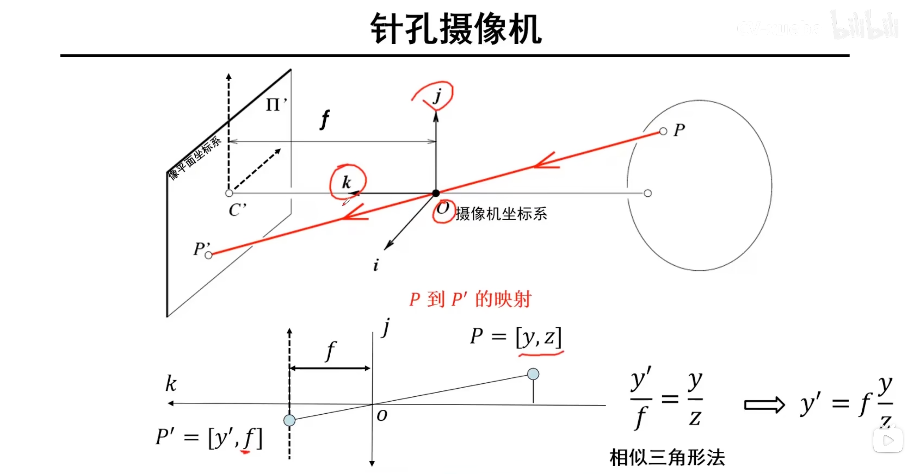
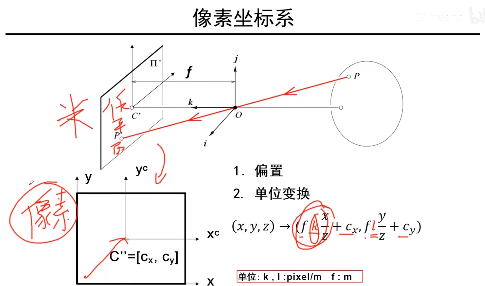
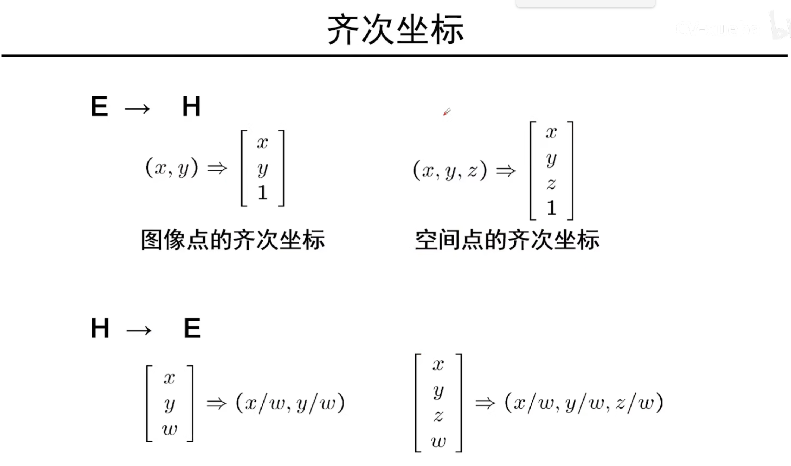
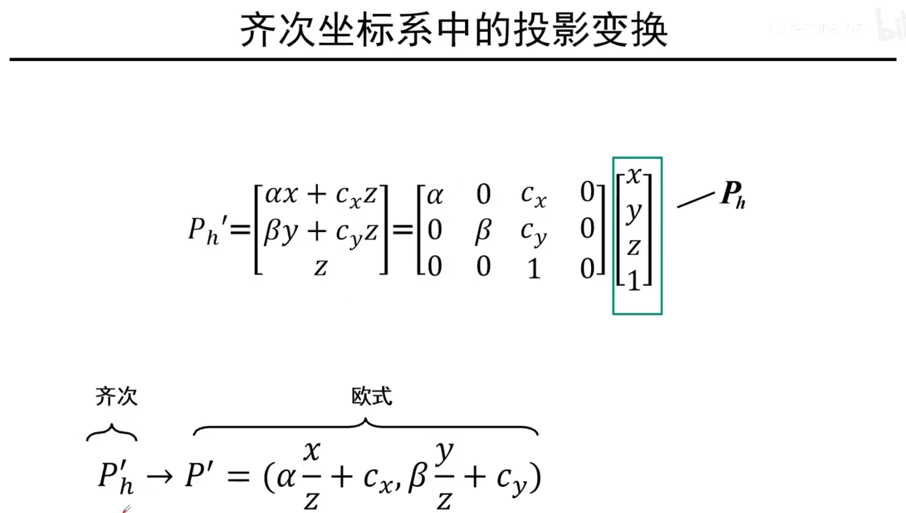
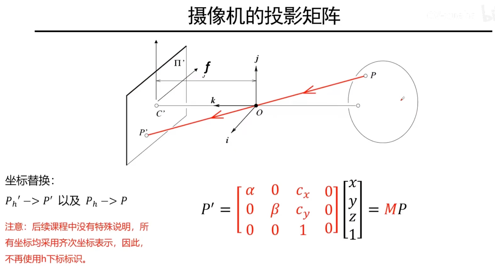
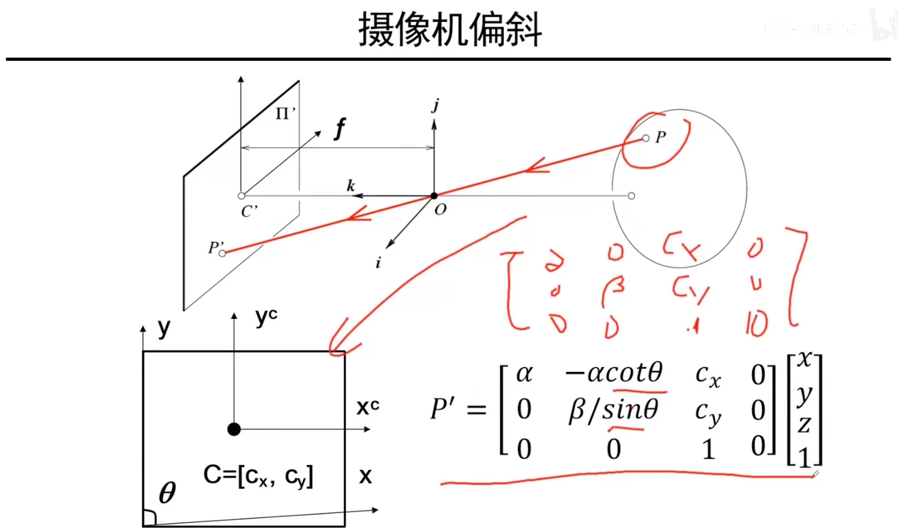
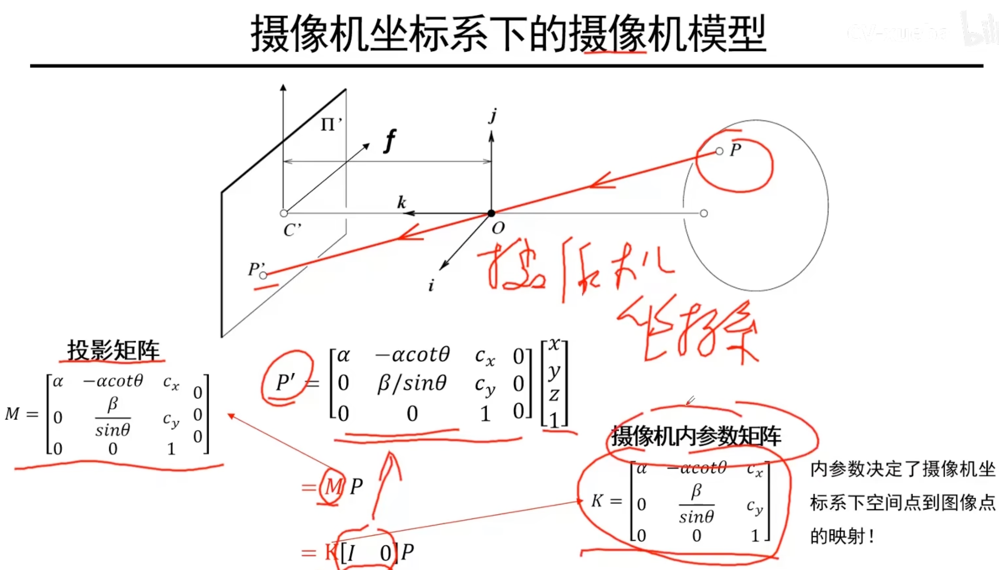

# 三维重建（深入浅出SfM与SLAM核心算法）

## 1 摄像机几何

### 1. 几种坐标系关系及其转换

#### 1.1 摄像机坐标系与像平面坐标系

#### 1.2 像平面与像素（图像）平面

其中像平面到图像平面转换时区分了k和l，原因在于相机可能因为工艺问题引起X和Y方向上的清晰程度不同，为了映射时画面一致而区分转换系数。

### 2. 齐次坐标

>  欧式空间：二维空间，齐次空间：三维空间

从欧式空间升到齐次空间是一一对应的，因为只是在扩1在第3维度上。

但是从齐次空间转到欧式空间不是一一对应， 比如$[1, 1, 1]$和$[2, 2, 2]$转到欧式空间都是$[1, 1]$，两者是同一个欧式坐标相差一个系数。

#### 2.1 齐次坐标系中的投影变换

$P'_{h}$中的h表示齐次坐标，将它转换为欧式坐标即像素空间中的坐标。

二维世界点的齐次坐标$P'_{h}$到三维世界点的齐次坐标$P_{h}$的映射是一个不变的矩阵（线性映射关系）。

#### 2.2 摄像机的投影矩阵

因此只需要一个映射矩阵M，就可以将三维点映射为二维像素。

#### 2.3 摄像机偏斜

由于相机制作工艺问题，像素可能不是正方形而是平行四边形，这时做映射时需要引入一个参数 $\theta$ 来表示夹角。

#### 2.4 摄像机坐标系下的摄像机模型 

摄像机内参数矩阵：顾名思义，只跟摄像机内部参数相关的矩阵。