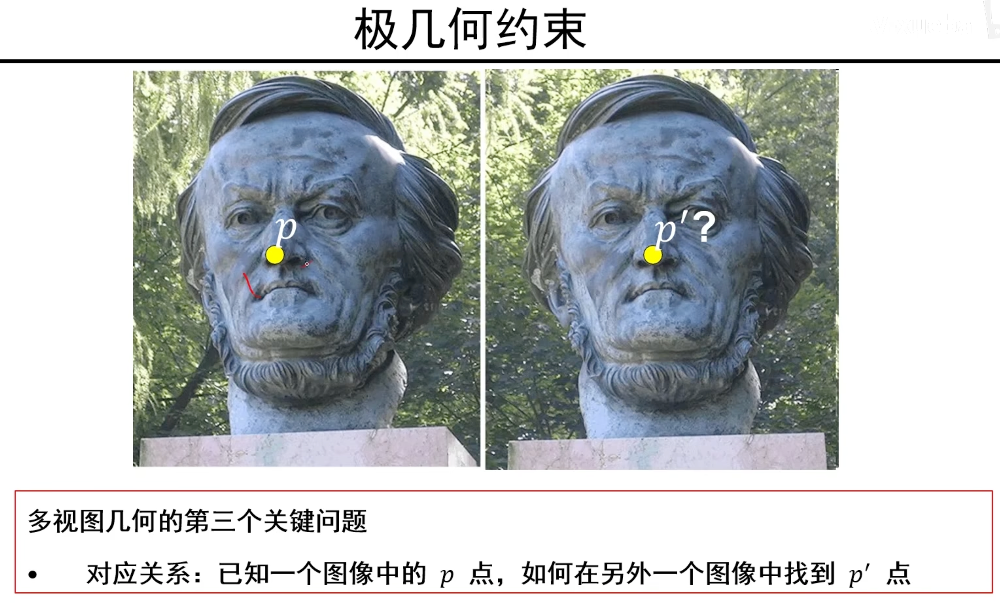

# P1 摄像机几何
## 1. 针孔模型 & 透镜
### 1.1 几种坐标系关系及其转换

#### 1.1 摄像机坐标系与像平面坐标系

**针孔摄像机**

下面是取 j-O-k 平面上的映射关系：

在 i-O-k 平面也类似：

**带有透镜的摄像机**

相机的焦距z‘ = 透镜的焦距f + z0。

由蓝色线可以看到过光心的直线仍符合小孔成像的映射关系，只是焦距不再是 f 而是 z‘ 。

因此，用不用镜头对小孔成像模型来说影响不大，仍然可以用小孔成像模型来分析三维世界到二维平面的映射。

> 但是使用镜头可能有别的问题：虚焦、径向畸变（枕形、桶形）等。

#### 1.2 像平面与像素（图像）平面

> k、l是像平面到像素平面的转换关系，其大小与相机成像元器件的性质有关。
>
> 如果成像元器件质量越高：比如真实世界1mm就转换为1pixel；质量比较低：真实世界1cm转换为1pixel；

其中像平面到图像平面转换时区分了k和l，原因在于相机可能因为工艺问题引起X和Y方向上的清晰程度不同（比如，X方向是1mm对应1pixel，Y方向0.5mm对应1pixel），为了映射时画面一致而区分转换系数。

因为 fk 和 fl 都是相机内部的参数，因此通常直接将其记为 $\alpha$ 和  $\beta$ ：

## 2. 摄像机几何
### 2.2. 齐次坐标

#### 2.2.1 为什么要用齐次坐标

通常真实平面到像素平面的映射并**不是线性的**，因为通常 x 一变 z 也会跟着变（因为真实世界物体是在空间中移动，而不是只沿着一个坐标轴移动）：

而**齐次坐标**就是**将非线性映射转换为线性映射（也就是x能线性映射到x’）**，这对之后的很多操作提供了便利。

#### 2.2.2 齐次坐标定义

>  欧式空间：二维空间；齐次空间：三维空间

二维空间升到三维：在最后一维加1；三维降到二维：将前面维度除掉最后一维。

注意，

从欧式空间升到齐次空间是一一对应的，因为只是在扩1在第3维度上。  

但是从齐次空间转到欧式空间不是一一对应， 比如$[1, 1, 1]$和$[2, 2, 2]$转到欧式空间都是$[1, 1]$，两者是同一个欧式坐标相差一个系数。

#### 2.2.3 齐次坐标系中的投影变换

这个投影变换就是解决如何将三维空间中的点 线性映射 到二维平面。

$P'_{h}$中的h 表示齐次坐标，将它转换为欧式坐标即像素空间中的坐标。

二维世界点的齐次坐标$P'_{h}$到三维世界点的齐次坐标$P_{h}$的映射是一个不变的矩阵（线性映射关系）。

> 对比一下齐次和欧式两种形式，发现欧式对于每个一维坐标都由两个值决定（x/z或y/z），但是在齐次空间却变为了线性映射（左边带有 $\alpha$ 和 $\beta$ 的矩阵只跟相机参数有关）。

> 在看课程时有一个疑问，**为什么$P_{h}$要加一维？**
>
> 猜测应该是为了保持都是在齐次空间下的变换？因为$P'_{h}$运算结果本来就是齐次坐标，因此对应运算也应该在齐次空间下。

#### 2.2.4 摄像机的投影矩阵

因为在齐次空间中三维点到二维是线性映射，因此我们不再使用欧式坐标，转而只使用齐次坐标。

为了方便表示，也就不再加齐次坐标的表示符h，**除非特殊强调否则都表示是齐次空间中的点**。

因此只需要一个映射矩阵M，就可以将三维点映射为二维像素。

#### 2.2.5 摄像机偏斜

由于相机制作工艺问题，像素可能不是正方形而是平行四边形，这时做映射时需要引入一个参数 $\theta$ 来表示夹角。

有了参数 $\theta$ 就可以建模从真实平面到不太好的像素平面到映射。

> 当像素平面XY轴垂直时，cot为0，sin为1，会退化成之前的参数矩阵。 

#### 2.2.6 摄像机坐标系下的摄像机模型 

摄像机内参数矩阵：顾名思义，只跟摄像机内部参数相关的矩阵。

> 内参数矩阵K有五个自由度： $\alpha$ 、 $\beta$ 、cx、cy、 $\theta$ 。
>
> 只有估计出这五个参数才能知道摄像机的信息。

**规范化摄像机**

这是理想状态下的摄像机，不是真实存在的摄像机，这只是中间的一种状态，我们**需要利用这个状态去推导一些性质**。

该状态下 $\alpha$ 和 $\beta$ 都是1， $\theta$ 为90度（像素是方的），cx、cy = 0（像平面与像素平面的中心一致）。

规范化相机的一些性质：世界坐标系下的点的三维坐标就是图像点的齐次坐标，反过来**如果知道了二维点的齐次坐标就能知道三维点的坐标**。

接下来推极几何的时候会用到这个性质，极几何知道二维点的齐次坐标，很容易就能推出这个点在三维世界中的齐次坐标。

### 2.3 世界坐标系

假设有同一个物体在房间里，而房间中各个位置摆有摄像机，物体在不同摄像机下的坐标是不同的，想要定位这个物体，沟通交流起来很不方便。

但是如果以房间的东南角为原点建立一个坐标系，定位这个物体就很清晰了，这就是**世界坐标系**。

> 我们不太适应在摄像机坐标系下描述物体，因此引入更常规的坐标系——世界坐标系。

这样分析问题很简单，但是模型却不太适用，模型只能描述摄像机坐标系下三维世界的点到像素平面到映射，不能描述世界坐标系中的点到像素的映射。

因此需要对模型进行进一步扩展。

#### 2.3.1 世界坐标系到摄像机坐标系的转换

通过旋转和平移可以将世界坐标系下的点转换到摄像机坐标系下：

> 旋转矩阵大小3 x 3，平移矩阵大小3 x 1（XYZ三个方向），因此整个转换矩阵大小为4 x 4。

**旋转矩阵R和平移矩阵T由摄像机摆放位置决定。**

将P带到之前的公式，就得到了世界坐标系下的点到像素平面的映射函数。

> M为投影矩阵，它由两方面决定，一是相机的内参数矩阵K（只由相机内部参数决定），还有就是新加的“外参数”矩阵（由相机摆放位置决定，所以叫外参数）。

**各个符号的含义和维度**

**投影矩阵的自由度**

外参数分别是XYZ三个坐标系的平移3自由度 + 旋转3自由度。

**像素平面上的欧式坐标表示**

### 2.4 定理

> A中给a加转置是为了将a写做列向量（A本身是3 x 3，a为1 x 3，aT为3 x 1），**表达成列向量是为了计算方便，几乎或有运算都在列向量上进行**。

真正决定一个矩阵是否为投影矩阵由A决定：

- 如果A是满秩矩阵则一定有一个摄像机与之对应，如果A不满秩这一定不是一个投影矩阵。

- 如果 $(a_1 \times a_3)\cdot(a_2 \times a_3) = 0$ 则说明 $\theta=90^{\circ}$ 。

  > 向量叉乘的结果是一个垂直两个向量平面的新向量。
  >
  > 两个向量点乘 = 0，表示两条向量垂直。

- 如果前两者都能满足的情况下，还能满足第三个公式，则说明$\alpha$ 和 $\beta$ 是等比例的。

通过分析M矩阵，可以得到相机的一些参数性质；反之，如果知道参数也可以反推M。

### 2.5 投影变换的性质

1. 现实中的点投影在二维还是点。
2. 线投影也是线。
3. 但是2. 投影到像平面遵从“近大远小”（like 远处枕木在二维上比近处短）。
4. 三维中的夹角并不会保持在二维平面（铁轨不会平行）。
5. 平行线相交于“影消点”。

## 3. 其他摄像机模型

### 3.1 弱透视投影摄像机

当被摄物体距离相机足够远时，有一些轻微的远近差距（比如人五官的凹凸不平）可以近似在一个平面上。

好处：这样不会有一些因为远近差距产生的非线性关系。

将投影矩阵M分解开来，原本的3x3矩阵A分解成矩阵$A_{2\times3}$和向量$v_{1\times2}$，而之前的b分解成了b2x1和1。

在弱透视投影摄像机下，投影矩阵中的v的值是0。

**弱透视与透视投影摄像机**

可以看到，与透视相比，世界坐标系下坐标到弱透视投影摄像机的映射只由放大率决定，比透视投影摄像机少了很多计算。

而且与之前3x4个参数相比少了4个参数（m3），参数更好估算。

### 3.2 正交投影摄像机

当摄像机小孔/透镜到像平面无限远时，会出现该情况。

这种情况出现不多，在AutoCAD软件中，构建三视图时，可能会用到。

## 4. 补充知识

**最小二乘法会经常用到，**因为遇到的情况大多数都是p > q，因为如果p = q只要表达式中有一行是噪声，导致那一行结果是错误的，这样算出的结果就不对。（最小二乘法可以引入更多数据，能够容忍更多噪声？）

### 4.1 线性方程组的最小二乘解

最小二乘解就是在最后一种情况下又需要一个近似解，就会用到最小二乘。

> 直观上理解，我们需要得到的参数数量应该是q个，然后p代表数据量，每一行方程代表一条数据的计算过程与结果。
>
> 如果方程个数=参数数量，且矩阵满秩时，就会有唯一解（如果数据有噪声就会得到错误解，不鲁棒）；如果方程个数>参数数量，也就是有大量数据时，这种情况是我们经常遇到的，因此我们就可以使用大量数据来估计参数值，也就是最小二乘法。

其核心思想在于：我们的目标是获得Ax=y的解，即Ax-y=0的解；当无法得到真实解时，就得到最逼近Ax-y=0的解，即Min Ax-y（也可理解为估计值Ax与真实值y的总误差最小）。

$arg$表示取最小的那个$x$赋给$x^*$，$\mathop{\arg\min}\limits_{x}$中min下x表示需要变化x使之达到最小。

几种求解方式：

方法一：直接求解，最大问题在于需要求$(A^TA)^{-1}$，矩阵逆运算计算度可能比较复杂。

**方法二：奇异值分解，不需要求矩阵逆运算，计算度不高。（通常使用方法二）**

方法三：优点在于不需要求大矩阵、内存消耗不高，也不需要求奇异值分解。缺点是需要迭代求解。

### 4.2 齐次线性方程组的最小二乘解

齐次线性方程组的最小二乘解如果不做约束，则永远得不到最小值，因为就算解出了x，因为$\lambda x$也是方程的解，则x可以无限小。因此我们对x做约束：$s.t. ||x||=1$，这样解出的x只会与真实值差一个常数。

> 直接根据求解方法做就可以得到解，推导过程不再讲解。
>
> （使用拉格朗日将有约束变为无约束，再用迭代法，也可以求解）

### 4.3 非线性方程组的最小二乘解

f(·)可以指代线性函数（比如之前4.1式子右边y移到左边，也可以表达成一个f(·)），也可以指代任意非线性函数。

之前的几种求解方法只适用线性方程组，对于非线性方程组只能用牛顿法或L-M方法（牛顿法的改进，不用计算二阶导）。（这些方法包括SVD都有现成的包可以调用，只知道如何求解即可，具体计算直接调包）

# P2 摄像机标定

## 0. 回顾 & 补充

### 0.1 摄像机加透镜的作用

 

如果光圈很大，则透过的光线比较多，成像会很模糊。

增加透镜，可以将同一个点的多条光线映射到一个点上，因此P‘点的亮度就足够了。

 

## 1. 针孔模型 & 透镜摄像机标定问题

### 1.1 什么是摄像机标定？

拿到相机时，可能获取不到相机内参数的具体数值，也不可能真的放在一个空间来精确度量相机世界坐标系下的位置。

因此我们更希望从一些对应关系中自动求解出相机的内外参数，通过拍照，和照片中三个物体之间的关系自动求解。（标定，即求解相机内、外参数矩阵）

**为什么知道相机内外参数矩阵重要？**

只有知道了相机内外参数矩阵，才能知道二维空间和三维空间的映射关系，也才能够有可能将二维点映射到三维（该三维重建的目的就是从二维获取三维场景的结构信息）。

### 1.2 标定目标

 

标定时默认的坐标系就是世界坐标系 $P$，小写 $p$ 就是像素平面。

而目标就是得出 K、R、T 三个矩阵。

### 1.3 标定问题

 

标定时需要使用一个标定装置，原点在一个角上，装置壁上画有等分的格子，其边长可以量出来，对于每个位置就能够得到准确的世界坐标。

使用相机对这个装置拍照，得到的图像上对应装置上的每个位置，也可以得到其对应的像素坐标。

这样就得到了像素平面坐标 $p$，和世界坐标 $P$。

 

进而就可以得到世界坐标系下的点 $P$ 和 $[u_i, v_i]$ 之间的关系。

**整理过后可以看到，一个点可以得到两个方程，11个未知量至少需要6对点对应：**

 

 取的点越多，噪声的影响越小，因此大多数面临的都是超定问题（指的是方程的数量多于未知数的数量，即大量标定数据）。

**整理成齐次线性方程组的形式：**

 

**按齐次线性方程组最小二乘解的方法计算：**

 

注意，这里得到m时 人为限制了 ||m||=1，因此**计算得到的m与真实的m还差一个常数比例关系** 。

### 1.4 提取摄像机参数

由齐次线性方程组求解，我们只是得出了投影矩阵M，而我们想要知道的是内外参数矩阵K和R、T。

为了严格规范化，$r_1$ 等都需要表示成列向量，因此需要加一个转置T。

> 旋转矩阵的三个向量 $r_1,r_2,r_3$ 之间关系：1. 不相关，即任意两个向量点乘为0；2. 每个向量模长为1；3. 叉乘为垂直向量，如 $r_1 \cdot r_2=r_3$ 。

右边M是计算机求解出来的，右边是由真实参数得出，因此M与真实值之间相差一个常数 $\rho$ 。

#### 1.4.1 提取摄像机内参数 $u_0$ 与 $v_0$

 

将M矩阵分解为 $[A, b]$，则 $\rho A = KR$ ，$\rho b = KT$ 。

 

首先，看第三行 $\rho a_3^{T} = r_3^{T}$，能够解出 $\rho$ 。

然后计算第三行（点）乘第一行 $\rho^{2}(a_1^{T} \cdot a_3^{T}) = u_0$，注意这里由于R矩阵三个向量相互垂直，因此 $\alpha r_1^{T} \cdot r_3^{T} = 0$、$\alpha cot \theta r_2^T \cdot r_3^T = 0$ 。同理，也可以计算第三行点乘第二行。

如此一来，就可以用 a 表示出 u0 和 v0 。

#### 1.4.2 提取摄像机内参数 $\theta$

> 注意，1.4中的公式中有的转置操作可能有些出入，主要理解求解的方式，字符上不做过多解释。

 

将第三行分别与一二行做叉乘，然后取模。

注意cot = cos / sin，且向量取模可以转换：$|a| = \sqrt{a^T \cdot a}$ ，根据这个性质可以将“一三行相乘取模”进行化简（如方框内所示）。

 

将上图两个式子的等号左右两边，上下点乘，
$$
(a_1 \times a_3) \cdot (a_2 \times a_3) = -\alpha\beta\frac{cos\theta}{sin^2\theta}
$$

$$
|a_1 \times a_3| \cdot |a_2 \times a_3| = \frac{|\alpha| \cdot |\beta|}{sin^2\theta}
$$

然后将两个等式相比，就可以得到下列方框中的内容：（ $\alpha$ 和 $\beta$ 都是常数，所以绝对值没什么影响）

 

注意如果像素平面坐标轴垂直时，$cos\theta = 0$ 也就是 $(a_1 \times a_3) \cdot (a_2 \times a_3) = 0$，这与第一节课讲的定理推导一致：
 

#### 1.4.3 提取摄像机内参数 $\alpha$ 和 $\beta$

其它所有参数都已经得到了，只需带入就能得到 $\alpha$ 和 $\beta$ 。

 

由方框内方程可知，如果$|a_1 \times a_3| = |a_2 \times a_3|$则 $\alpha = \beta$ ，这也对应着之前的定理内容：

 

#### 1.4.4 提取摄像机外参数$r_1$、$r_2$ 与 $r_3$

将第三行等式两端叉乘第二行得到：
$$
\rho^2(a_2^T \times a_3^T) = \frac{\beta}{sin\theta}r_1
$$
由于 $\rho^2$ 和 $\frac{\beta}{sin\theta}$ 都是常数，因此 $r_1$ 与 $(a_2^T \times a_3^T)$ 的方向是一致的，而 $r_1$ 是单位向量，因此只需要将 $(a_2^T \times a_3^T)$ 除以它的模即可得到 $r_1$ 。

因为 $r_3$ 和 $r_1$ 都已经得到，因此 $r_2$ 只需要将 $r_3 \times r_1$ 即可得到。

#### 1.4.5 提取摄像机外参数 $T$

 

将等式两边同时乘 $K^{-1}$ 可以得到 $T = \rho K^{-1}b$ ，而K中参数都已经得出，就可以将T中的三个参数 $t_x, t_y, t_z$ 与 $\rho K^{-1}b$ 的三个元素一一对应即可。

#### 1.4.6 所有参数计算汇总

 

### 1.5 退化示例

在对标定模型中取点时，不能都在同一平面，都在一个平面就会有相关性：三个点就可以决定一个平面，第四个点就可以用这三个点表示。

  

## 2. 径向畸变的摄像机标定

 

### 2.1 径向畸变相机建模

现在世界坐标系下的点，需要经过一个有畸变的相机（畸变可看作一个独立的过程），才能得到像素平面上的 $[u_i, v_i]$ 。

 

这里 $S_\lambda$ 矩阵中的 $\frac{1}{\lambda}$ 表示对理想情况下的 $[u_i^{'}, v_i^{'}]$ 进行等比例缩放。

d为理想像素点距离摄像机（原点）的距离，当理想像素点距离相机越远，形变越严重。

当 $\lambda$ 公式中 $\pm$ 符号为 + 时，理想点会被拉近，即桶形畸变；符号为 - 时，理想点被拉远，即枕形畸变。

> 至于 $\lambda$ 多项式为什么要用一个三次项，是因为在建模时模拟一个非线性过程，这只是一种摄像机模型。
>
> （为什么用这个多项式进行建模不需要搞明白，但是要知道是用该形式建模的畸变相机）

在畸变相机模型下，我们不但要求出投影矩阵M，还要求出畸变系数 $K_p, \space p = 1,2,3$ （畸变系数有 3 个）。

**因此，在畸变相机模型中，需要求出的未知量有 11 + 3 = 14 个。**

### 2.2 径向畸变的标定

 

与理想情况下的相机标定不同（下图），理想情况下相机投影矩阵只有相机内外参数组成（与P没有关系），因此可以构成齐次线性方程组；但是畸变相机模型中，$Q$ 矩阵中的变量 $d$ 与像素坐标 $[u_i, v_i]$ 有关，因此构成的方程并不是线性方程组。

 

#### 2.2.1 标定的一般问题

 

非线性方程组只能通过（类梯度下降）牛顿法或L-M方法来求解，但是该类方法很依赖初始点的位置，如果初始点与真实位置相差很远，可能很难收敛。

因此可以通过先求解线性部分得到近似解的方式，来优化非线性方程组的求解，线性的都求完了再用牛顿法计算非线性的部分。

#### 2.2.2 求解线性部分

 

用 $u_i$ 除以 $v_i$ 可以将 $\lambda$ 消去，然后就可以转成一个齐次线性方程组的形式：

> 这个方法利用了径向畸变的性质：一个理想点畸变时不会乱缩，而是沿着该点与原点的连线等比例的缩。
>
>  

 

然后又可以通过SVD求解超定齐次线性方程组（该方程组可以解出m1和m2，即解出8个参数）。

 

这样只剩下了m3（3个参数）+ k1、k2、k3 这6个参数，可以大大缩短收敛所需要的时间。

求出了这些参数，就可以做畸变相机的校正（将上图的 $\frac{1}{\lambda}$ 乘到左边去即可）。

## 3. 补充知识

### 3.1 2D平面上的变换

#### 3.1.1 2D平面上的欧式变换

 

二维点（x，y）经过变换，再加一个平移量（x0，y0），就得到了新的点（x‘，y’）。

当 $\sigma$ 取1时，xyz之间的相对方向不变（保向变换：即旋转变换），即旋转平移变换。

当 $\sigma$ 取-1时，xyz之间的相对方向发生变换，可以理解成发生一次镜像变换：

 

> 一个点进行旋转平移变换（ $\sigma=1$） ，称为欧式变换。

#### 3.1.2 2D平面上的相似变换

 

均匀伸缩变换就类似于径向畸变的畸变矩阵，$s$ 跟 $\lambda$ 的作用是一样的。

缩放变换与欧式变换组合成相似变换：
$$
\begin{pmatrix} x' \\ y' \\ 1 \end{pmatrix} = 
\begin{pmatrix} scos\theta & -ssin\theta & x_0 \\ ssin\theta & scos\theta & y_0 \\ 0 & 0 & 1 \end{pmatrix} 
\begin{pmatrix} s & 0 & 0 \\ 0 & s & 0 \\ 0 & 0 & 1\end{pmatrix}
\begin{pmatrix} x \\ y \\ 1 \end{pmatrix}
$$

#### 3.1.3 2D平面上的仿射变换

在相似变换中，旋转-平移-放缩 并不会改变图形的相对关系，比如正方形的边相互垂直，经过变换后依然是垂直的。

旋转矩阵如果放宽格式，将其定义为A：

> 仿射变换不会改变平行关系，但是会改变角度。

 

其自由度增加到6个（A中包含abcd四个自由度），而之前的sR矩阵只有两个自由度 $s$ 和 $\theta$ 。

#### 3.1.4 2D平面上的透视变换

 

在透视变换中，平行关系也不再保留。

三维到二维中的映射也是一种变换，通过理解这几种变换，能够更好理解映射关系。

### 3.2 3D空间中的变换

#### 3.2.1 3D空间中的欧式变换

 

与2D平面上的变换不同，3D平面上的旋转矩阵有三个轴，对应三个矩阵。s还是缩放因子，t还是表示平移量。

其不变量也与2D平面上的变换一致。

#### 3.2.2 3D空间中的仿射变换

与2D基本一致，把sR矩阵的限制拓宽一下：

 

与此同时，变换时夹角垂直的性质不再保持。还多了一个性质：无穷远点保持不变，即无穷远的地方经过变换还是无穷远。

#### 3.2.3 3D空间中的透视变换

 

在透视变换中，平行线保持不变的性质也不再保持。

三维空间到二维的映射与透视变换有着相同的性质。但不完全相同。

# P3 单视图几何（单视测量）

 

以下面标定模型为例，只要保持 $p_i$ 在图像上的位置不变，映射得到的M矩阵就相同：

 

## 1. 无穷远点、无穷远线与无穷远平面

> 无穷远点、无穷远线和无穷远平面都是三维空间中的概念。

### 1.1 无穷远概念

 

$l$ 为这条直线的参数，之后的内容里直接叫这条直线为 $l$ ，因为 $l$  决定了这条直线。

>  注意这里的 $l$ 和 $l'$ 都是齐次表示，x的坐标也是，因此采用三个参数决定这条直线。

 

$l \times l'$  得到的是一个 $[1 \times 3]$ 的向量，这个向量是交点x的其次表示，想要得到二维坐标需要转为欧式。

 

无穷远点在齐次坐标下很好表示，但是在欧式空间中找不到对应点（∞是无法表示的）。

> 如果 $-a/b = -a'/b'$，则两直线平行（斜率相等）。

齐次空间中，求两条平行线的交点（叉乘）就可以得到无穷远点的“交点”坐标。

简单来说，一条直线的法向量的齐次表示，就是在**直线方向**后面（注意是“方向”，不包括平移量）加0即可，如 $l = ax + by + c$ 的法向量为 $[a, b, 0]$。（注意，法向量是由原点指向点 $[a, b, 0]$ 的向量）

 

### 1.2 3D空间中的无穷远

 

 3D空间中的直线比较难表示，一般如果要用这条直线，一般定义为两个平面的交线。

用之前的方式，写不出很好的数学方程，因此我们一般不写方程，只记录直线的方向。

> 因此，如果3D空间中有两条平行线（方向都是 $[a,b,c]^T$），则3D空间中的无穷远点为 $[a,b,c,0]^T$。

 

#### 1.2.1 3D空间中的无穷远点

无穷远点只有在齐次坐标系下才能表示，有一个特点即第四维为0.

 

#### 1.2.2 3D空间中的无穷远线

在3D空间的一个平面上任意取两组（n组也可）平行线，这两组平行线各自有汇聚的无穷远点，那么这两个无穷远点的连线即无穷远线。

 

#### 1.2.3 3D空间中的无穷远平面

每一个平面都有一条对应的无穷远线，那么由两个/多个平面的两条/多条无穷远线就可以确定一个无穷远平面。

> 注意，无穷远线也可以定义为两个平面的交线。
>
> 即两个平行平面的无穷远线是同一条线，这条线也可以看作是这两个平行平面在无穷远处的交线。

 

## 2. 影消点和影消线

> 影消点和影消线是三维空间中的点投影到二维像素平面中，所对应的东西。（是二维空间中的概念）
>
> 由这个关系可以进行三维重构。

### 2.1 2D平面上无穷远点的变换

 

> 无穷远点对不同变换有不同性质。

在透视变换中，无穷远点的透视变换不再是无穷远点，与摄像机成像一致，平行线会相交。

对于仿射变换，无穷远点还是无穷远点。

### 2.2 2D平面上无穷远线的变换

 

 

无穷远线的变换与无穷远点一致，因为仿射变换并不改变平行性。

### 2.3 影消点

 

注意，影消点是像素平面上的点p，表示为像素坐标；而无穷远点表示为世界坐标系下的齐次坐标。

无穷远点到像平面到映射关系可以表示为 $p_\infty = Mx_\infty$，但注意 $p_\infty$ 并不是无穷远点，∞ 符号只是表示是无穷远点的对应点。

### 2.4 影消点与直线方向

 

上图中表示在**摄像机坐标系下**，三维空间中的直线方向d与影消点v的关系。

> 如何理解图中所示，像平面在c（摄像机坐标系原点）和三维无穷远之间呢？（正常不应该在镜头/小孔后面）

由于无穷远点与影消点都是在摄像机坐标系下，因此外参数矩阵中“没有进行旋转”，“平移为0”，如下图所示：

 

如此一来，知道了相机内参数，只要知道影消点就可以得到三维空间中一组平行线的方向，据此可以进行单视图重建。

### 2.5 影消线（视平线）

 

将三维空间中的无穷远线经过**透视变换**，可以得到像平面的影消线。

无穷远线的单位是米，但是影消线上的单位为像素。

> 影消线一定经过影消点。
>
> 并且是一个平面对应一条影消线，平行平面对应相同影消线。

 

知道摄像机内参数和像平面中的影消线，就能推出对应平面的法向量。

> 推导：三维平面上的点P经过投影变换，可以得到像平面影消线上的点，自然 $l^T(K[I\space 0]P)=0$ 。
>
> 再由法向量垂直平面得到 $\prod^TP=0$ ，化简得到结论。

### 2.6 总结

 

## 3. 单视重构

 

 

 

得到摄像机内参数矩阵，就可以重构出三维空间中的平面：

 

据此可以重构出下列场景：
 

但是场景的比例无法确定，而且由于是根据摄像机坐标系来重构，因此三维空间物体的绝对位置无法得出：

 

由于重构与真实之间比例，位置，朝向都不可知，两者之间相差一个相似性变换。

 

## 4. 补充知识

 

多视图重建和SLAM系统有些图像匹配技术会用到上述知识（尤其是sift特征与词袋模型）。

# P4 三维重建与极几何

## 1. 三维重建基础

 

单目无法确定物体到相机的距离，对陌生场景的深度估计不准确。

### 1.1 三角化

三角化指的是从多视图下重构三维点的位置：

 

注意，两条直线要统一在同一坐标系下，可以把 l2 转换到 O1坐标系下。

但是如果有噪声存在，p 和 p‘ 延伸的直线可能不会相交：

 

#### 1.1.1 三角化（线性解法）

以第一个相机的坐标系为世界坐标系：

 

则第一个相机坐标系（也是世界坐标系）映射到像素平面的方向不变（单位矩阵）、位移为0；而第二个相机需要先由第二个摄像机的摄像机坐标系转为世界坐标系，需要有旋转平移矩阵。

此时构建方程组可以得到4个方程式，来求解3个未知量（P的三维坐标）。

#### 1.1.2 三角化（非线性解法）

 

因为已知 p 和 p‘，三维空间中任意一点 P\* 在 image1 和 image2 上必定有投影点 MP\* 和 M’P\* ，此时只要优化 MP\* 和 M’P\* 距离 p 和 p‘ 越近，则 P\* 距离真实点 P 越近。

#### 1.1.3 实际应用

上面是理想情况下，但是很多时候摄像机之间的关系（即外参数矩阵）甚至相机的参数（内参数矩阵）都不可知，因此实际情况会更加复杂：

 

### 1.2 多视图几何的关键问题

 

摄像机几何之前已讲，场景几何即三角化，对应关系需要用极几何来解决。

## 2. 极几何及基础矩阵

> 本质矩阵和基础矩阵是描述极几何的数学表达。

### 2.1 极几何的定义

 

 

> 极平面：灰色平面；
>
> 基线：直线O1— O2；
>
> 极线：l 和 l‘ ；
>
> 极点：e 和 e’ ；

极几何：给定 $p$ 虽然不确定 $p'$ 的具体位置，但是能确定 $p'$ 在极线 $l'$ 上。

#### 2.1.1 极几何特例：平行视图

 

在该系统下，无需知道相机内外参数以及R、T矩阵，就可以进行三维重建；双目立体视觉系统基本基于平行视图来构建。

#### 2.1.2 极几何特例2：前向平移（无旋转）

比如向一面墙前向移动（只向一个方向移动，没有旋转）：

 

由于两坐标系在同一方向，因此极线都汇聚于极点处，成展开状，因此极点也称为展开焦点。

这种情况可以直接估计深度信息，但是目前不做讨论，目前只关注标准极几何和平行视图。

### 2.2 极几何约束

极几何约束指的就是 p 点与 p' 点之间的约束关系。

 

 

#### 2.2.1 本质矩阵

 

规范化摄像机：内参数矩阵为单位矩阵。

 

规范化相机的优点，给出像素平面的坐标，很容易能够反推出世界坐标系下的三维点。

根据这一点，能够轻易得到p和p‘在世界坐标系下的坐标（同一世界坐标系方便研究相对关系）：

 

 

$p' = R p^{'*} + T$ ，其中 $p^{'*}$ 是世界坐标系下的 $p'$ 坐标，则可以推出 $p^{'*} = R^T (p' - T)$ ，即 $p^{'*} = R^T p' - R^T T$ ；$O_2$ 的坐标为 $[0,0,0]$ ，则转换到世界坐标系时相当于 p' = 全0矩阵。

>  旋转矩阵的“逆”与旋转矩阵的转置是同一个东西。。

注意：叉乘矩阵化表示中，a方阵一定不是满秩的；平移量T矩阵化表示的转置矩阵和本身是相等的（对称矩阵）。

 

本质矩阵描述了规范化摄像机坐标系下（像素坐标），两个像点之间的关系。

 

推导：

1. 由于 $p^{'T}l' = 0（因为p^{'T}在极线l'上），\space p^{'T}Ep=0（刚刚的推导）$ 则可以推出 $l' = Ep$ （也就是说已知p和旋转平移矩阵，就能够推出 l' ）。
2. 由于空间中任意一点的投影点与极点的连线一定在极线上，则 $l'e' = (Ep)^Te' = 0$ 这个 p 可以是任意值，而任意值又不影响等式恒成立，则 $E^Te'=0$ 即 $e^{'T}E=0$ 。

#### 2.2.2 基础矩阵

> 本质矩阵要求是规范化摄像机，而基础矩阵更具有普适性。

 

 

经过转换，$p_c$ 和 $p'_c$ 是满足规范化相机要求的。

 

 

F尺度无法确定，因为目前只是知道等式 $p^{'T}Fp=0$ ，如果将F等比放大或缩小，对于等式没有任何影响。

 

虽然F矩阵包含了摄像机内外参数信息，但是我们真正关心的只有F矩阵，如果知道F但不知道具体的内外参数也无所谓。

 

## 3. 基础矩阵估计

我们真正需要的，不是根据基础矩阵求出另一个相机下对应点的相对位置，而是想要求得基础矩阵中的内外参数，根据内外参数可以进行三维重建。

> 基础矩阵估计，就是根据两幅图中的对应点求解出基础矩阵，对应点是好标注的。

 

 

在基础矩阵估计中， 一对点只能建立一个方程。

 

 

 

需要让法比亚范数越小越好。

 

 

针对上述问题，对u、v点的取值做优化：

 

 

 

通常使用归一化八点法可以将误差下降到一个像素以内，很有效，实际应用中的标准方法。

## 4. 补充知识

### 4.1 单应矩阵

之前的基础矩阵估计不考虑三维空间中点的位置，如果这些三维点来自同一个**平面**时，任务会更加简单：

> 正常情况下，如果三维点来自同一个平面，用基础矩阵估计反而计算不出，属于退化问题。

 

 

在基础矩阵中，p对应的是一条线（极线），但是在单应矩阵中，p与p'一一对应（加入更多信息：同一平面 后，估计会更精确）。

 

由于 w' 与 w 之间总是相差一个系数，因此让 w = 1 对这个系数而言并无区别。

 

因此，如果给出的点都位于一个平面，只能使用单应矩阵来估计相机的内外参数（基础矩阵由于退化就不适用了）。

